# Draw Steel Warmind Roadmap: Stage 0 to v1.0

Written 2026-07-10.

Revised 2026-07-11: the user's manual verification burden is removed, and a live session that
same day proved the autonomous dev loop (bridge control + mod-store hot reload + logic
harness). Stage DONE gates are now static checks + logic harness + agent-driven deploy-and-
probe + adversarial review; the user never verifies manually and no longer deploys by hand.
See the Verification model section.

This is the master development plan for the Draw Steel Warmind
monster-AI module -- one section per stage from Stage 0 through the v1.0 community
release, each with status, scope, key design decisions and risks, a definition of done,
an expected-runtime-behavior block (agent-verified at the stage closure per the Verification
model), and copy-pasteable kickoff prompts a fresh chat can run self-contained.

This document is the SOLE prompt authority. Its predecessors -- `PROMPTS.md` (the original
session-prompt list) and `ORIGINAL_PLAN.md` (the 2026-06 vision plan) -- were DELETED on
2026-07-11 as superseded: keeping stale planning docs in the module directory wastes tokens
and risks an agent acting on old data. Their surviving record is in this file: the "Prompt
provenance" note under each kickoff prompt describes how it differs from the deleted
PROMPTS.md original, and the "Conflict resolutions" section records every point where
ORIGINAL_PLAN.md diverged from current truth.

Reading order for any fresh session:

1. `Draw Steel Warmind/CLAUDE.md` FIRST -- it is the live cross-session memory (verified
   engine surface, contracts, lessons, stage-status table) and it WINS every conflict on
   engine facts, contracts, and lessons. (Its stage table and process notes were synced to
   this roadmap's verification model on 2026-07-11; if they ever lag again, the Verification
   model section governs the stage-DONE convention.)
2. This roadmap -- TARGETED reads only, never end to end (it is ~4.7k lines). Read the
   one stage section your kickoff prompt names, plus the Verification model and Prompt
   conventions sections when they apply. Locate sections with rg -n "^## " on this file.
3. The active `STAGEN_PLAN.md` if one exists for the stage in flight (e.g. `STAGE2_PLAN.md`
   for Stage 2; `STAGE3_PLAN.md`/`STAGE4_PLAN.md` once authored).

Stage statuses in this document are a SNAPSHOT as of 2026-07-11. The CLAUDE.md stage table
is the live status authority; if the two ever disagree, CLAUDE.md wins and this snapshot is
stale.

What v1.0 means: v1.0 is the terminal release milestone. It is reached when the Stage 7
cutover is complete (the two legacy AIs removed -- or the documented never-start-both
fallback shipped -- and the community architecture doc landed with the full regression
reviewed clean) AND every community release criterion is met. Under the 2026-07-11
verification model there is NO scripted-soak bar and no SOAK_LOG.md obligation: the release
evidence is (a) all stages DONE under this model (which embeds agent-driven runtime evidence
via L3 deploy-and-probe and L4 live turn exercise, per stage), (b) PV1's source-only readiness
audit, and (c) an honest one-line real-table-exposure statement the user supplies for the
release notes -- how much natural play at a real table the module has actually seen. If that
exposure is little or none, the release notes say so plainly and the release is labeled beta. The full, fixed release bar is in the "v1.0 -- Release definition and
criteria" section at the end of this document.

---

## Operator instructions (how you run this project)

You drive the project by pasting kickoff prompts into fresh chats. Every prompt lives in
this file. You never run test checklists and you never copy files into DMHub -- the session
deploys its own changes through the on-disk mod store and DMHub hot-reloads them
automatically. Your recurring jobs are only: (1) keep DMHub running with a dev game open when
a session wants to deploy-and-probe (L3) or exercise live turns (L4) -- or let it mark that
step DEFERRED; (2) make git checkpoints (sessions never commit); (3) give the few design
approvals a session pauses for; (4) play the game. One-time bridge setup is ALREADY DONE on
this machine (see the Verification model section) and is never asked for again.

The loop, one session at a time:

1. Start a FRESH chat in this repo. One session = one kickoff prompt; never merge two.
2. Find the next prompt: the session table below gives the order and dependencies; list the
   prompt headings with rg -n "^#### P" "Draw Steel Warmind/ROADMAP.md". Copy the entire
   fenced block and paste it as the first message of the chat.
3. Let the session run. A few sessions pause for your input mid-run: P5 shows you the panel
   layout plan for approval (and asks whether Takeover should differ from Stop), P6.1 shows
   you the override-pack design for approval, P7 confirms with you before every destructive
   step, PV1 asks you for the one-line real-table-exposure statement. Everything else runs
   without input. If DMHub is not running when a session reaches its deploy-and-verify closing,
   it marks L3/L4 DEFERRED in one honest line and the next review-closure session re-runs them
   (it may ask you to launch DMHub -- that is your only involvement in verification).
4. Keep DMHub running when you can so the session can deploy and probe itself; you copy
   nothing. Deployment is a Write into the mod store plus the automatic hot reload, done by
   the session, not a gate you owe.
5. Review-closure sessions (P2.5; the final Stage 3/4 implementation session per their plans;
   P5, P6.2, and P7 themselves) end with a SHIP / SHIP AFTER FIXES / BLOCK verdict, flip the
   stage row to DONE in CLAUDE.md themselves, and OFFER to push the accumulated local changes
   to the DMHub cloud via CommitChanges (done only on your in-chat yes). If one ends BLOCK,
   start a fresh chat, paste its findings, ask for the fixes, then re-run the closure.
6. Move to the next row of the session table.

Session order from here: PR (commit or stash the working tree first -- a rebase needs it
clean) -> P2.1 -> P2.2 -> P2.3 -> P2.4 -> P2.5 (Stage 2 DONE; deletes STAGE2_PLAN.md) ->
P3.1 -> Stage 3 implementation -> P4.1 -> Stage 4 implementation -> P5 -> P6.1 -> P6.2 ->
P7 -> PV0 -> PV1 -> you publish the module via the DMHub UI and open the upstream PR using
the description text PV1 produced.

Planning-stage nuance: P3.1 writes STAGE3_PLAN.md, and that plan ENDS with the actual
kickoff prompts for the Stage 3 implementation sessions -- use those, not the P3.2 template
in this file (the template exists only as the shape the plan's prompts must follow). Stage 4
works the same way via P4.1/STAGE4_PLAN.md.

Any time, unscheduled:

- Something misbehaved while you were playing: fresh chat, paste the PD prompt from the
  Verification model section. The session gathers its own evidence via the bridge (health
  check, Warmind.trace.entries, recent console errors, Player.log tail) and only asks you to
  paste if the bridge is down.

The logic harness (`warmind_logic_tests.lua`) is standing dev infrastructure, not a session
you launch: see the "Logic harness" subsection in the Verification model section. It lives in
the repo, is run as an L1 gate whenever pure decision logic is touched, and is extended by
implementation sessions -- you never run it by hand.

Git: sessions never commit. Commit yourself whenever you want a checkpoint -- at minimum
before PR (clean tree) and after each stage flips DONE. If a session dies or stalls
mid-work, ask it (or a fresh chat) to write HANDOFF.md; the next chat starts with "Read
HANDOFF.md and continue."

---

## Session map

All sessions from the current moment to v1.0. Dotted edges show a recommended (not
hard) ordering (PR) and true minimum dependencies (Stage 5 and Stage 6 each need only
Stage 2 DONE even though the roadmap orders them later). There are no manual-verification
sessions: every stage's DONE gate is its review-closure session (the L0 static checks --
luac -p + ASCII grep -- plus the L1 logic harness when pure logic was touched, L2 source
folding, L3 agent-driven deploy-and-probe or an honest DEFERRED, an adversarial review of the
stage diff against CLAUDE.md and the stage plan with findings fixed, and L4 live turn exercise
for Stages 2/4/5/6). For Stage 2 that gate is P2.5; Stages 3 and 4 flip DONE at the review
closure ending their per-plan implementation split; Stages 5, 6, and 7 flip DONE at the clean
review closure embedded in their build session. PD (on-demand play debrief) sits off the
critical path and is never a gate. `P3.2`/`P4.2` are single nodes standing for "implementation
sessions per the STAGE3_PLAN / STAGE4_PLAN session split."

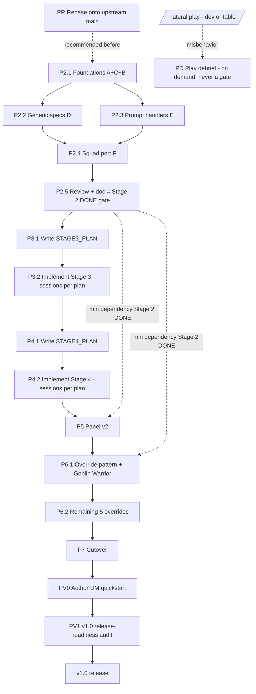

### One-line-per-session table

Updated from PROMPTS.md and revised 2026-07-11: the manual P*.V DONE-gate debriefs are
removed (stages flip DONE at their review-closure session, which now runs the agent-driven L3
deploy-and-probe and L4 live turn exercise); adds PD (on-demand play debrief) off the critical
path, plus PV0 and PV1; reflects the tightened P4.1; and records the Stage-2-min-dependency
for Stage 6.

| Prompt | Scope | Files touched | Depends on | Delegation |
|---|---|---|---|---|
| PR | Rebase tiny-monster-ai onto upstream main | .gitignore (root CLAUDE.md auto-merges) | none; recommended before P2.1 | on-session |
| P2.1 | Stage 2 Workstreams A+C+B (Traits, Snapshot aidAttacked, Scoring concealment+tactics) | WarmindTraits, WarmindSnapshot, WarmindScoring | PR recommended | Opus subagents |
| P2.2 | Stage 2 Workstream D (7 generic specs); extends the L1 logic harness with spec fixtures | WarmindSpecs | P2.1 | on-session |
| P2.3 | Stage 2 Workstream E (3 prompt handlers) | WarmindPrompts | P2.1 (independent of P2.2) | on-session |
| P2.4 | Stage 2 Workstream F (squad port) | WarmindSquads (+ WarmindTurn glue) | P2.1 + P2.2 + P2.3 | on-session |
| P2.5 | Stage 2 full-diff adversarial review + L3 deploy-and-probe + L4 live squad turn (or DEFERRED) + CLAUDE.md update = Stage 2 DONE gate | CLAUDE.md + fixes anywhere | P2.1-P2.4 | review agent |
| P3.1 | Write STAGE3_PLAN.md (role profiles + deferred gaps) | STAGE3_PLAN.md (doc) | P2.5 (Stage 2 DONE) | on-session |
| P3.2 | Implement Stage 3 per plan split; extends the L1 harness with role-profile fixtures; final session is the review closure that runs L3 deploy-and-probe and flips Stage 3 DONE (L4 recommended) | WarmindScoring, WarmindTurn, WarmindSpecs, WarmindPrompts, WarmindTraits (per plan) | P3.1 | per plan (mechanical ports -> opus) |
| P4.1 | Write STAGE4_PLAN.md (Director layer); tightened vs PROMPTS.md | STAGE4_PLAN.md (doc) | P3.2 review closure (Stage 3 DONE) | on-session |
| P4.2 | Implement Stage 4 per plan split; extends the L1 harness with malice/villain-scheduler fixtures; final session is the review closure that runs L3 deploy-and-probe and L4 live villain-action turn (or DEFERRED) and flips Stage 4 DONE | WarmindDirector, WarmindTurn, WarmindSpecs, WarmindCore (per plan) | P4.1 | per plan |
| P5 | Panel v2 (step, takeover, per-spec toggles, trace viewer, follow-camera); embedded review closure runs L3 deploy-and-probe and L4 live step-mode exercise (or DEFERRED) = Stage 5 DONE gate | WarmindPanel, WarmindCore | Stage 4 DONE (P4.2 review closure); usable after Stage 2 | on-session |
| P6.1 | Override pattern + Goblin Warrior + MayCommitMalice stub (only if Stage 6 precedes Stage 4; in the default order Stage 4 already created the gate) | WarmindOverrides, WarmindDirector | Stage 2 DONE (roadmap-ordered after P5) | on-session |
| P6.2 | Remaining 5 monster overrides (Ryll excluded); embedded review closure runs L3 deploy-and-probe and L4 live override-monster turn (or DEFERRED) = Stage 6 DONE gate | WarmindOverrides | P6.1 | Opus subagents (one per monster) |
| P7 | Cutover: delete legacy AIs + architecture doc; embedded review-agent audit of the deletion + main.lua diff, plus L3 deploy-and-probe of the post-cutover load (or DEFERRED) = Stage 7 DONE gate (DONE flips at this session's clean review closure) | main.lua, deletions, WarmindSquads/Overrides comments, AGENTS.md, ARCHITECTURE.md | all stages DONE | on-session (+ review-agent audit of the deletion + main.lua diff) |
| PV0 | Author the DM-facing quickstart | QUICKSTART.md (doc only) | P7 (Stage 7 DONE); before PV1 | on-session |
| PV1 | v1.0 release-readiness audit (source-only; no Lua, no commit); reads the docs and asks the user for the one-line runtime-exposure statement (no soak log) | none (reads ARCHITECTURE.md, QUICKSTART.md, override how-to; PR-description text + runtime-exposure statement in-message) | PV0 + Stage 7 DONE | on-session (audit) |
| PD | On-demand play debrief: gathers its own evidence via the bridge (Warmind.trace.entries, console errors, Player.log), diagnoses real-play misbehavior against CLAUDE.md contracts + lessons, fixes minimally, deploys and re-probes | any Warmind file (+ CLAUDE.md when an engine assumption is disproven) | none; run only when something misbehaves in natural play; never a gate | on-session |

---

## Verification model (autonomous; the user never verifies manually)

Decision history, 2026-07-11 (both decisions landed the same day, and BOTH stand):

1. User: "no manual in-app verification, please." The user never runs a checklist; the burden
   of confirming runtime behavior is off the user for good.
2. Same-day extension: a live session PROVED the autonomous dev loop -- a DMHub MCP bridge
   (http://localhost:19876), the on-disk mod store with an automatic file-watcher hot reload,
   and a CLI logic harness. Agent-driven deployment AND agent-driven runtime verification are
   now cheap, so they JOIN the gates. This EXTENDS decision 1 (the user still never verifies by
   hand); it does not reverse it.

This section is the single authority for how Warmind work is verified from here to v1.0. It
replaces every removed in-app step and every removed verification-debrief gate; other sections
point here rather than restating the doctrine. The MECHANICS of the loop (bridge endpoints,
mod-store path, deploy recipe, probe recipes, CommitChanges) live in CLAUDE.md "Autonomous dev
loop"; this section governs WHEN each level runs and what it gates.

### What is removed, and why it is safe to remove

Removed: all MANUAL verification burden on the user, and all manual deployment. No user-run
checklists, no verification-debrief sessions (the former P0, P2.V, P3.V, P4.V, P5.V, P6.V, P7.V
are gone as sessions and as gates), and no copy-into-DMHub step anywhere in the plan. Runtime
verification itself is NOT removed -- it moved from the user to the agent: the session deploys
through the mod store, confirms the automatic hot reload, and probes the changed subsystems
itself.

Why this is viable: the architecture is fail-closed BY DESIGN, and that safety net is the floor
under every level. Every decision emits a DecisionResult carrying a stable UPPER_SNAKE reason
code; unsupported complexity holds or hands to the DM cleanly (UNSUPPORTED_*); driver errors
auto-stop the AI (Warmind.Guard + g_terminate); manual outcomes pause without advancing
initiative; the Stop button is always a clean takeover that leaves initiative untouched. A wrong
assumption therefore degrades to a clean, reason-coded hold or a manual prompt at the table --
never a hang, never corrupted state, never a silently-wrong turn the DM cannot see. That is the
whole point of Lessons 1-11 in CLAUDE.md, and it is what makes a DEFERRED L3/L4 acceptable
rather than reckless.

### One-time setup (already done on this machine; recorded, never re-run)

The bridge and mod-store loop are set up: /mcpauto ran in DMHub chat 2026-07-11 (the bridge
persists across app sessions); the Warmind mod is monitored (code.monitorid set to the Warmind
modid) and checked out; the Claude Code permission allowlist rules (curl to the bridge; Write/
Edit into the mod store) are in .claude/settings.local.json; the user gave standing
authorization to overwrite anything under the mods store. No session asks for any of this again.

### The verification levels (L0-L4)

- L0 static gate. Every touched Lua file parses under `luac -p` and is pure ASCII under
  `LC_ALL=C grep -nP '[^\x00-\x7F]'`. Non-negotiable, every session.
- L1 logic harness. Run `lua "Draw Steel Warmind/warmind_logic_tests.lua"` from the repo root;
  all tests green. Required whenever pure decision logic is touched (Traits classification,
  Scoring math, Squad targetPairs assembly, Turn budget/category selection, Core reason codes).
  Implementation sessions EXTEND the harness with fixtures for the new pure logic they add. The
  harness is dev-only: never registered in DMHub, never in main.lua, never required by a module
  file (see the Logic harness subsection below).
- L2 source-verified engine claims. Any newly-used engine API is confirmed against repo SOURCE
  in the implementing session and folded into the CLAUDE.md verified-surface table. Source
  inspection is the engine-truth mechanism for APIs; APIs already in the table are trusted; do
  not re-derive them.
- L3 live deploy-and-probe. The session deploys every changed WarmindXxx.lua by writing it into
  the mod store, confirms the AUTOMATIC hot reload (Player.log "Local file changed ->
  RefreshLocalFiles -> reload success" chain + /status + zero new console errors), and probes
  the changed subsystems READ-ONLY via the bridge against real game objects (examples:
  Warmind.Traits.Get over a real monster's GetActivatedAbilities clones; Snapshot.Build(token)
  on a live token; reading Warmind.trace.entries; debug.getinfo linedefined fingerprints to
  prove which source is loaded). Read-only: L3 never casts, never moves tokens, never advances
  initiative. If the bridge/app is down, L3 is marked DEFERRED in one honest line and re-run at
  the review closure.
- L4 live turn exercise (stage-scoped). Actual activations driven in a dev/scratch encounter --
  the AI plays turns, the panel trace is read back via the bridge, screenshots where visuals
  matter. Required at the review closure of stages whose deliverable is turn behavior (Stages 2,
  4, 5, 6); recommended elsewhere. L4 needs a live game with a suitable encounter; the session
  checks preconditions (dmhub.initiativeQueue present, monsters on board) and if absent marks L4
  DEFERRED with one honest line -- never silently skipped. A DEFERRED L4 is completed in a later
  session (or absorbed by natural play + PD) and the stage's DONE note says which.

The fail-closed runtime safety net remains the doctrine's floor: it is the property that makes a
DEFERRED L3/L4 acceptable rather than reckless, and it bounds anything the levels did not
actively exercise.

### Coverage-tag legend

Former in-app checklist items are RETAINED (retitled "Expected runtime behavior (agent-verified
at the stage closure; see Verification model)" in each stage section, checkboxes flattened to
bullets) and each item carries one trailing tag naming how the model covers it:

- [static] -- caught by L0/L2 (a regression would fail luac/ASCII or contradict a verified-
  surface row).
- [harness] -- asserted by an L1 warmind_logic_tests.lua fixture.
- [probe] -- verified read-only via the L3 bridge probe (Traits.Get / Snapshot.Build /
  trace.entries / debug.getinfo against real game objects).
- [live] -- requires an actual activation in a live encounter (L4).
- [fail-closed] -- a wrong outcome degrades to a clean reason-coded hold or a manual prompt;
  the blast radius is bounded to "the AI stops or hands off," which the DM sees at once in the
  panel trace. Reserved for what genuinely cannot be agent-verified.
- [accepted-risk] -- quality-only degradation (e.g. suboptimal positioning, squad clumping):
  observable in the panel trace during natural play, never a correctness or safety failure,
  tuned later via PD or Stage-3+ scoring work.

An item an agent can now actively verify carries [harness]/[probe]/[live]; [fail-closed] and
[accepted-risk] remain only for what genuinely cannot be agent-verified (UX feel, pacing
quality, table-play judgment).

### What this model can NOT catch (stated honestly)

Agent-driven L3/L4 exercise the running engine, so the un-catchable set is now small. This
model does not, by itself, prove:

- UX feel and pacing quality -- whether a cast "feels" right, panel ergonomics, trace
  readability, step-mode flow, camera follow. Bounded by [accepted-risk]: quality-only, tuned
  via the pacing setting and PD, surfaced the moment the DM uses the panel.
- Table-play judgment -- whether the AI's choices make for a good encounter across a whole
  session of real play. Bounded by [accepted-risk], refined via PD and Stage-3+ scoring.
- Anything behind a DEFERRED L4 -- if a live encounter was not available, the turn behavior for
  that stage is proven only to the [fail-closed]/[probe] level until the deferred exercise runs.
  The stage's DONE note states this plainly.

Honest consequence: a stage flips DONE only after L3 has run clean (or is explicitly DEFERRED
with the re-run owed at the review closure); where an L4 is DEFERRED it is named in the DONE
note, and first full turn exposure then happens in the deferred session or during natural play,
with PD as the recourse.

### Stage DONE gate and status snapshot

Stage DONE = code complete + L0 clean + L1 green (when pure logic touched) + L2 folded into
CLAUDE.md + L3 clean (deploy + hot reload + probes) + adversarial review of the stage diff with
findings fixed (+ L4 for Stages 2/4/5/6, or an explicit DEFERRED line). If the bridge/app is
down during a working session, that session completes L0-L2 and marks L3/L4 DEFERRED in its
closing; the review-closure session re-runs them before flipping DONE (the closure may ask the
user to launch DMHub -- that is the user's ONLY involvement in verification). The review-closure
session IS the gate: Stage 2 flips DONE at P2.5; Stages 3 and 4 at the review closure ending
their per-plan implementation split; Stages 5, 6, and 7 at the clean review closure embedded in
their build session.

Status under this model (the CLAUDE.md stage table is the live authority; correct it there
when it lags):

- Stage 0: DONE.
- Stage 1: DONE -- code complete, statically verified, multi-pass reviewed. Module hot-reload
  and load-clean were verified LIVE 2026-07-11 via the bridge; turn behavior has not yet been
  exercised (L4 pending -- absorbed by the first stage that runs a live encounter, or by natural
  play + PD). (CLAUDE.md's stage table was synced to this status on 2026-07-11.)
- Stage 2: plan complete (STAGE2_PLAN.md); implementation not started.
- Stages 3-7: planned.

### Correcting CLAUDE.md when an engine assumption is disproven

Where a stage section previously said "fold correction X into CLAUDE.md at P4.V / P6.V," that
fold is reassigned to the stage's review-closure session (P4.2's review closure, P6.2's review
closure, and so on). Outside a stage, PD corrects CLAUDE.md on the spot when play -- or an L3
probe -- disproves an engine assumption.

### PD -- on-demand play debrief (the only runtime-feedback loop off the gates)

ONE reusable prompt replaces every removed P*.V debrief. Run it ONLY when something misbehaves
during natural play -- never scheduled, never a gate. The session gathers its OWN evidence via
the bridge first (health check; Warmind.trace.entries and recent console errors via execute_lua;
Player.log tail) and falls back to asking the user to paste only when the bridge is down; then it
diagnoses against the CLAUDE.md contracts and Lessons, fixes minimally in scope, corrects
CLAUDE.md when an engine assumption was wrong, and deploys-and-reprobes.

```
You are diagnosing a Draw Steel Warmind runtime misbehavior observed during natural play.
This is an ON-DEMAND play debrief (PD). It is NOT a gate and was NOT scheduled -- run it only
because something actually misbehaved at the table or during dev play.

READ FIRST, fully: "Draw Steel Warmind/CLAUDE.md" (the live cross-session memory: verified
engine surface, core contracts, Lessons learned, stage-status table, and the "Autonomous dev
loop" section for the bridge/deploy mechanics). It WINS every conflict on engine facts. Then
read the WarmindXxx.lua file(s) implicated before proposing any fix.

GATHER EVIDENCE YOURSELF FIRST (do not ask the user to paste unless the bridge is down):
- curl http://localhost:19876/health -s -m 5. If the bridge is up, pull evidence via POST
  /execute: read Warmind.trace.entries (the recent DecisionResult rows + reason codes) and any
  recent console errors; tail Player.log at
  /Users/droideck/Library/Logs/MCDM/Codex/Player.log for stack traces.
- ONLY if the bridge is DOWN, ask the user to paste: the panel decision trace, any console
  errors, and one or two lines of expected-vs-actual.

DO:
1. Diagnose against the contracts and Lessons in CLAUDE.md. Name the reason code and the
   decision path that produced it. Separate three cases: (a) correct fail-closed behavior the
   user misread -- explain, no code change; (b) a Warmind logic bug -- fix it; (c) an engine
   assumption in CLAUDE.md disproven by the evidence -- fix the code AND correct CLAUDE.md.
2. Verify any engine API you rely on against repo SOURCE (cite path). Do not re-derive APIs
   already in the CLAUDE.md verified-surface table; trust that table unless the evidence
   contradicts it, in which case correct the row.
3. Make the SMALLEST in-scope fix. Touch only the file(s) implicated. No refactors, no new
   features, no speculative hardening. If pure decision logic changed, extend
   warmind_logic_tests.lua with a fixture that would have caught it and run it (L1).
4. If an engine assumption was wrong, update "Draw Steel Warmind/CLAUDE.md": fix the
   verified-surface row and/or add a numbered Lesson so the next session does not repeat it.

OUT OF SCOPE: new features; unrelated cleanups; creating any new Lua MODULE file (repo rule --
new module files are the user's to register in DMHub; the dev-only harness is the sole
exception and already exists); committing.

DONE CRITERIA (per touched file):
- "luac -p <file>" parses clean.
- "LC_ALL=C grep -nP '[^\x00-\x7F]' <file>" returns nothing (ASCII only).
- L1 harness green if pure decision logic was touched.
- CLAUDE.md updated if and only if an engine assumption was disproven.
- No commit.
- No review-agent audit line here -- intentionally omitted. Unlike a stage kickoff prompt, PD
  is a minimal, on-demand single-file fix and is NEVER a stage DONE gate, so the constant
  diff-review audit (see the Prompt conventions section) does not apply; the static checks,
  this diagnosis, and the deploy-and-reprobe are the whole bar.

CLOSING - deploy and verify (autonomous loop; mechanics in CLAUDE.md "Autonomous dev loop"):
1. curl http://localhost:19876/health -s -m 5 - if the bridge is down, list the changed
   WarmindXxx.lua files and mark L3 DEFERRED in one honest line; stop here.
2. Deploy each changed WarmindXxx.lua by writing it into
   /Users/droideck/Library/Application Support/MCDM/Codex/mods/Warmind_be67/ (Write/Edit tool).
3. Confirm the automatic hot reload: tail Player.log for the "Local file changed ->
   RefreshLocalFiles -> reload success" chain and check no new errors; POST /reload only if
   the watcher did not fire.
4. Probe the fix read-only via POST /execute (L3) and report whether the misbehavior is gone.
5. CLAUDE.md is documentation - never deployed.
```

### Logic harness (standing infrastructure)

The logic harness EXISTS in the repo as "Draw Steel Warmind/warmind_logic_tests.lua" (created
2026-07-11 with user approval during this rework). It is not a session you launch; it is
standing dev infrastructure and the L1 gate:

- What it covers: pure decision logic with no engine dependency -- Traits classification;
  Scoring math and constants (the documented bands: 0.2 fallback, 0.5-0.8 maneuvers, 1.0
  signature, 1.5-2.5 high-impact/malice, plus tie-break/margin math); Squad targetPairs assembly
  (main-attacker-first ordering per Lesson 13, the 3-attackers-per-target cap, member filters
  IsActiveInSquad and not IsTurnSkipped); Turn budget/category gating (usedCategories repeat
  suppression, the dazed one-category-per-turn rule per Lesson 8); and reason-code terminal-path
  coverage (every terminal decision path yields an explicit reason code).
- Run command: `lua "Draw Steel Warmind/warmind_logic_tests.lua"` from the repo root (brew lua
  5.5). It self-locates the repo root from arg[0], loads DMHub Utils/Utils.lua and the 12
  Warmind files by path (never copying them), prints PASS/FAIL per test, and exits 0/1 with a
  summary line.
- The rule: implementation sessions that add pure logic EXTEND the harness with fixtures for it.
  The TESTS table is flat so appending is trivial. This is required (L1) whenever pure decision
  logic is touched.
- Dev-only status: NEVER registered in DMHub, NEVER added to main.lua, NEVER required by a
  module file. It is the sanctioned exception to the repo's no-new-Lua-files rule (created with
  user approval 2026-07-11). Engine seams (ExecuteInvoke/casting, prompt interception via
  _tmp_aicontrol, pathfinding, initiative advancement, LiveEncounter, anything touching a real
  token) are OUT of harness scope -- they are covered by L2 source verification and L3/L4 live
  exercise, never by a faked engine. If a pure function is entangled with an engine call, record
  it as a FLAG and skip it; do not restructure module code to make it testable.

### Release evidence (v1.0)

Under this model there are NO scripted soak encounters and NO SOAK_LOG.md obligation. v1.0
release evidence = all stages DONE under this model (which embeds agent-driven runtime evidence
via L3 deploy-and-probe and L4 live turn exercise, per stage) + PV1's source-only readiness
audit + an honest one-line real-table-exposure statement from the user, embedded in the release
notes (how much natural play at a real table the module has actually seen). Agent-driven L3/L4
evidence is listed separately by PV1 from the stage DONE notes; the user's line covers real-table
play only. If real-table exposure is little or none, the release notes say so and the release is
labeled beta. PV1 asks for that statement and verifies no log file. The full, fixed bar is in the
"v1.0 -- Release definition and criteria" section.

---

## Stage 0 -- Module scaffolding (DONE)

### Status

DONE (retrospective record). Stage 0 established the module skeleton that every
later stage builds on. It is a standalone DMHub module: DMHub loads it from the
on-disk mod store at `mods/Warmind_be67`, NOT from the repo `Draw Steel Warmind/`
directory and NOT through the repo `main.lua`. The repo copy is the source of truth
that sessions deploy into that store (see the Autonomous dev loop in CLAUDE.md).

What exists on disk today: the full 12-file `Draw Steel Warmind/` module. The two
Stage 0 deliverables are still present and load-bearing -- `WarmindCore.lua` (the
`Warmind` global, registries, reason codes, trace buffer, `Guard`, settings) and
`WarmindPanel.lua` (the DM-only dockable panel and Start/Stop). Per the Stage 0
plan (`ORIGINAL_PLAN.md`), the other ten files started as minimal stubs (its
documented convention: `local mod = dmhub.GetModLoading()` plus a header comment)
and were filled in during Stage 1 -- the spine plus the scoring foundation that
later Stage 2 specs consume. That fill covers eight of the ten; `WarmindPrompts.lua`
and `WarmindOverrides.lua` remain minimal stubs, owned by Stage 2 and Stage 6
respectively (the file table below marks each). Nothing about Stage 0 is pending:
its verification criteria were satisfied the moment the module loaded clean with the
panel visible.

Important deviation from `ORIGINAL_PLAN.md`: that plan said Stage 0 would "add
requires to `main.lua`". That is superseded. The Warmind files are NOT required by
the repo `main.lua`; they live in a separate DMHub module named "Draw Steel Warmind"
whose on-disk store is `mods/Warmind_be67`. Sessions deploy changed files by writing
them into that store, and DMHub's file watcher hot-reloads the module automatically
(no manual copy step). `CLAUDE.md` is canonical on this point.

### Scope

Stage 0 built the scaffolding only -- no decision logic, no world mutation. Three
pieces shipped.

1. The 12-file module layout and its load order. Files load in the order below;
dependencies must precede their users because DMHub loads a flat require list.

| File | Stage 0 responsibility |
|---|---|
| `WarmindCore.lua` | `Warmind` global, reason codes, DecisionResult constructors, registries (specs/prompts/tactics/overrides), trace buffer, `Warmind.Guard`, `Warmind.Sleep`, pacing setting, stop flag |
| `WarmindTraits.lua` | stub (Stage 1 fills the working classifier `Warmind.Traits.Get`; only the "full Traits" expansion is deferred to Stage 2) |
| `WarmindSnapshot.lua` | stub (Stage 1 fills it) |
| `WarmindAdapter.lua` | stub (Stage 1 fills it) |
| `WarmindScoring.lua` | stub (Stage 1 scoring foundation) |
| `WarmindSpecs.lua` | stub (Stage 1 free strikes) |
| `WarmindPrompts.lua` | stub (Stage 2 owns handlers) |
| `WarmindSquads.lua` | stub (Stage 1 detection + fail-closed hold) |
| `WarmindTurn.lua` | stub (Stage 1 activation loop) |
| `WarmindDirector.lua` | stub (Stage 1 activation chooser) |
| `WarmindOverrides.lua` | stub (Stage 6 override packs) |
| `WarmindPanel.lua` | DM-only dockable panel skeleton: status + Start/Stop + trace label |

Load order matters because `WarmindCore.lua` must define `Warmind`, the registry
functions (`RegisterSpec`, `RegisterPrompt`, `RegisterTactic`), and the reason
codes before any later file references them; `WarmindPanel.lua` loads last because
it drives everything else.

2. `WarmindCore.lua` contents (the whole decision vocabulary):

- `Warmind` global with `version` and two safety constants:
  `Warmind.MAX_DECISIONS_PER_ACTIVATION = 8` (per-activation iteration cap, a
  safety net, NOT the action economy) and `Warmind.ABILITY_TIMEOUT_SECONDS = 30`
  (cast watchdog window).
- Pacing setting `warmindpacing` (storage "preference", default 1) plus
  `Warmind.Pace(seconds)` (clamps negatives to 0) and `Warmind.Sleep(seconds)`
  (coroutine-only, yields 0.1s slices).
- DecisionResult constructors -- every decision path returns one of these:
  `Warmind.ResultExecuted(detail)`, `Warmind.ResultHeld(reasonCode, reason,
  detail)`, `Warmind.ResultManual(...)`, `Warmind.ResultSkipped(...)`, and
  `Warmind.DescribeResult(result)`. Shape:
  `{ status = "executed"|"held"|"manual"|"skipped", reasonCode, reason, detail }`.
- The full reason-code table `Warmind.reason` (stable UPPER_SNAKE identifiers;
  every failure carries one -- prose-only failures are forbidden):

| Reason code | Meaning |
|---|---|
| `NO_SUPPORTED_ACTION` | No registered spec applied to the snapshot at all |
| `NO_LEGAL_TARGET` | A spec was chosen but had no legal target at recheck |
| `NO_REACHABLE_POSITION` | A spec needed a position the actor could not reach |
| `UNSUPPORTED_COMPLEX_PROMPT` | An ability raised a prompt shape Warmind does not automate |
| `UNSUPPORTED_AREA_GEOMETRY` | Area targeting was not safe/obvious enough to automate |
| `UNSUPPORTED_SQUAD` | Minion-squad behavior not yet implemented (Stage 1 hold) |
| `EXECUTION_RECHECK_FAILED` | Final legality recheck failed just before execution |
| `EXECUTION_TIMEOUT` | A cast started but did not report completion in time |
| `EXECUTION_ERROR` | A Lua error escaped a spec or the turn loop (always a bug) |
| `BUDGET_EXHAUSTED` | Actions remain in principle but nothing usable is left |
| `TAKEN_OVER_BY_DM` | The DM pressed stop; the AI released control cleanly |
| `CANNOT_AFFORD` | The ability could not be paid for at execution time |

  (`NO_REACHABLE_POSITION` and `UNSUPPORTED_AREA_GEOMETRY` are declared here but
  not yet referenced by any Stage 0/1 code path -- they are reserved for the
  Stage 2 spec set; see the flags folded into the risks subsection below.)

- Trace buffer `Warmind.trace` (bounded at `maxEntries = 300`), `Warmind.Trace(fmt,
  ...)` (mirrors to console with a `Warmind:: ` prefix; never throws -- it
  `tostring`s first and `pcall`s the `string.format`), and `Warmind.ClearTrace()`.
- Stop flag: `Warmind.stopRequested`, `Warmind.RequestStop()`, `Warmind.ClearStop()`.
- `Warmind.Guard(fn)` -- the nested-coroutine error isolator (see decisions below).
- Registries: `Warmind.specs`/`Warmind.specList` (ordered), `Warmind.prompts`,
  `Warmind.tactics`, `Warmind.overrides`, with `Warmind.RegisterSpec`,
  `Warmind.RegisterPrompt`, `Warmind.RegisterTactic`. Spec categories are
  `main | maneuver | move | free`. Re-registration replaces in place (safe file
  reloads).
- Matching + enable-state helpers: `Warmind.SpecMatchesMonster(token, spec,
  includeDisabled)`, `Warmind.IsSpecEnabledForMonster`,
  `Warmind.SetSpecEnabledForMonster`, `Warmind.FindAbilityEntry(abilityEntries,
  name)`, and `Warmind.IsControllableMonster(token)` (valid, has `monster_type`,
  not `playerControlled`).

3. `WarmindPanel.lua` skeleton: `DockablePanel.Register{ name = "Warmind",
minHeight = 60, dmonly = true, content = ... }` with a status label, a Start/Stop
button, and a decision-trace label. Stage 0 shipped the panel shell; the polling
thread that drives turns is a Stage 1 addition.

### Key design decisions and risks

The five non-negotiable design rules were fixed in Stage 0 (source: the
DirectorTactics/Monster AI post-mortem). Each is a rule the whole module obeys.

| Decision | One-line rationale |
|---|---|
| Utility selector, not a framework | One entry point per decision. The phase bus + pipeline flows + resource ledger are exactly what killed DirectorTactics (28k lines, dead on arrival) |
| Fail closed, loudly | Every decision returns a DecisionResult with a stable reason code; unsupported complexity ends the activation cleanly and never improvises or hangs |
| All world mutation through `WarmindAdapter` | Scoring and selection stay read-only, so the one engine seam is the only place that can move tokens or cast |
| `Warmind.Guard`, never `pcall` around yields | `pcall` around yielding code is unsafe in the DMHub runtime (`dmhub.canSafelyYield` implies non-yieldable contexts exist); a nested coroutine catches errors portably and forwards yields |
| Generic competence from ability traits | Unscripted monsters must play their stat blocks via trait-driven specs; bespoke monsters are an optional override layer (Stage 6), never the baseline |

Risks and mitigations at this stage:

- Files do NOT auto-load from the repo directory; DMHub loads the module from its
  on-disk store. Adding a brand-new file requires it be registered in the DMHub
  module (whether editing the store's `main.lua` require-list suffices on reload is
  UNVERIFIED). Mitigation: sessions deploy CHANGED files into the store (the watcher
  hot-reloads automatically) and never create new Lua module files.
- A malformed trace argument could throw inside logging. Mitigation:
  `Warmind.Trace` `tostring`s and `pcall`s the format so logging can never fail an
  activation.

Flags folded from the stage draft:

- `ORIGINAL_PLAN.md` Stage 0 says to "add requires to `main.lua`", but current
  truth (`CLAUDE.md` + the verified facts) is that the Warmind files are a SEPARATE
  DMHub module and are NOT in the repo `main.lua`. The Stage 0 record above follows
  `CLAUDE.md`; the ORIGINAL_PLAN line is stale (conflict-resolution row 22).
- Two reason codes (`NO_REACHABLE_POSITION`, `UNSUPPORTED_AREA_GEOMETRY`) are
  declared in `WarmindCore.lua`'s `Warmind.reason` table but are not referenced by
  any Stage 0/1 code path. They are reserved for the Stage 2 spec set. Harmless;
  noted so a reviewer does not treat them as dead code.
- Minor: `ORIGINAL_PLAN.md` targets "~4-6k lines" for the module; the current
  12-file total is ~2,257 lines. Expected (Stages 2-6 are unwritten); a scale note,
  not a contradiction (conflict-resolution row 23).

### Definition of done

Original Stage 0 criteria (all met): the module loads in DMHub with no console
errors, the Warmind panel appears and is DM-only, and the previously loaded
Monster AI module is unaffected. Under the verification model (see the Verification
model section) these are covered by L0 static checks (a clean load is a `luac -p`
plus review concern) and the review-agent audit, and are now retro-verifiable via
an L3 probe; module load-clean WAS verified live on 2026-07-11 via the bridge.

### Expected runtime behavior (agent-verified at the stage closure; see Verification model)

These describe what Stage 0 produced at load time. As a DONE stage the block is
reference-only, but every item is now retro-verifiable via an L3 bridge probe, and
module load-clean was verified live on 2026-07-11. Each item carries a coverage tag.

- DMHub loads the Warmind module with no console errors [probe] (verified live 2026-07-11)
- The Warmind panel appears and is visible to the DM only (`dmonly = true`) [probe]
- The old Monster AI panel is unaffected and still loads [probe]

### Kickoff prompts

Stage complete; no session to run. This section is a historical record.

---

## Stage 1 -- Robust spine (DONE)

### Status

DONE under the verification model (see the Verification model section). All Stage 1
code is written, passes `luac -p` and the ASCII check
(`LC_ALL=C grep -nP '[^\x00-\x7F]'`), and has been multi-pass reviewed against
`Draw Steel Warmind/CLAUDE.md` and this plan. That -- code complete + L0 static
checks clean + adversarial review closure -- is the DONE gate.

State it plainly: module hot-reload and load-clean were verified LIVE on 2026-07-11
via the bridge (an L3 probe against the loaded module), but turn behavior has NOT
yet been exercised in a live encounter -- L4 is pending, to be absorbed by the first
stage that runs a live encounter or by natural play + PD. The recourse for any
misbehavior is PD, the on-demand play debrief authored in the Verification model
section -- not a scheduled gate. What makes shipping before a full L4 defensible is
the fail-closed spine itself: `Warmind.Guard` isolates every error, the cast watchdog
bounds every cast, `manualPending` pauses without advancing initiative, and the stop
contract always releases cleanly. A wrong assumption degrades to a reason-coded hold
or a manual prompt at the table, never a hang or corrupted state.

What exists on disk:

- `WarmindTraits.lua` -- the pure ability classifier `Warmind.Traits.Get(ability)`
  returning a flat trait table (actionKind, isStrike/isMelee/isRanged/isAoe,
  isSignature, villainAction). `Snapshot.Build` calls it to populate each ability
  entry's `traits`, so it is load-bearing for the spine; Stage 2 expands it to the
  "full Traits" set.
- `WarmindSnapshot.lua` -- `Warmind.Snapshot.Build(token)` and
  `Warmind.Snapshot.FindAbility(snapshot, name)`.
- `WarmindAdapter.lua` -- `BeginControl`/`Release`, `MakePromptCallback`, `MoveTo`,
  `RecheckStrikeTargets`, `ExecuteAbilityAndWait` (watchdogged), `Speech`,
  `SetExpectedPrompt`, and the `DestroyRays` dual-path teardown.
- `WarmindTurn.lua` -- `CategoryAllowed`, `ChooseCandidate`, `ActivationLoop`,
  `PlayActivation`, `PlayCurrentTurn`.
- `WarmindSpecs.lua` -- `melee_free_strike` and `ranged_free_strike`, both score
  0.2, via shared `StandardStrikeScore`/`StandardStrikeExecute` helpers.
- `WarmindPanel.lua` -- the polling thread (`WarmindThread`) plus
  `DispatchOpportunityAttacks`, `SelectNextActivation`, `CenterOnPlayers`, and the
  live Start/Stop/trace UI.
- `WarmindDirector.lua` -- `Warmind.Director.ChooseActivation(queue)`
  (closest-to-a-player heuristic).
- `WarmindSquads.lua` -- `CollectSquad` plus a fail-closed `PlayActivation` hold
  returning `UNSUPPORTED_SQUAD`.
- `WarmindScoring.lua` -- the baseline scoring ports the spine and Stage 2 both
  consume: `FindValidStrikeTargets`, `FindBestStrikePosition`,
  `FindBestBurstPosition`, `FindClosestEnemy`, `DistanceFromNearestEnemy`. The
  tactic-bias edge hook reads `ctx.activeTactics`, which is empty until Stage 2
  registers tactics.

Nothing here is pending. The stage is code-complete and reviewed; the only
remaining exposure is runtime, which happens during natural play and routes to PD
(see the Verification model section).

### Scope

Stage 1 built the robust spine -- the full snapshot -> score -> move -> recheck ->
cast -> wait -> result path -- plus the panel thread that drives it and the
fail-closed squad hold. Per file:

`WarmindSnapshot.lua`. `Snapshot.Build(token)` returns a read-only decision input,
rebuilt at the start of every decision iteration (movement and casting change what
is reachable and affordable). Fields: `token`, `creature`, `monsterType`,
`minion`, `role`, `organization`, `abilities` (array of `{ ability, traits }` from
`creature:GetActivatedAbilities()` -- never pass `excludeGlobal`), `enemies` and
`allies` (partitioned via `dmhub.TokensAreFriendly`, counting ONLY tokens whose
`InitiativeQueue.GetInitiativeId` is present in `queue.entries` and that are not
dead), `budget`, `malice` (guarded `CharacterResource.GetMalice`; defaults 0),
`round`, `moveRemaining` (`CurrentMovementSpeed() - DistanceMovedThisTurn()`,
floored at 0), and `paths` (`token:CalculatePathfindingArea(moveRemaining * 10,
{})`). The budget is the intent layer: `BuildBudget` reads
`GetResourceUsage(CharacterResource.actionResourceId, "turn")` and the
`maneuverResourceId` equivalent, treating usage `< 1` as available, and sets
`dazed` from `HasNamedCondition("Dazed")`. Shape:
`{ hasMainAction, hasManeuver, dazed }`.

`WarmindAdapter.lua`. The only file that mutates the world.

- `BeginControl(tokens, promptCallback)` increments `token.properties._tmp_aicontrol`
  and installs `_tmp_aipromptCallback` (written directly -- `_tmp_` is transient,
  no `ModifyProperties`). It returns a handle whose `Release()` is idempotent,
  decrements the counter (never below 0), and nils the callback when the counter
  reaches 0. Release must run on every exit path.
- `MakePromptCallback(ctx)` returns the function the engine consults before showing
  a manual prompt UI: first an `ctx.expectedPrompt` preset (combo support) that
  writes `options.targets` and returns `"inherit"`; then a registered handler
  looked up by qualified `"MonsterType:Ability"` name winning over the bare name,
  where a string result (e.g. `"skip"`) passes through, a table result merges into
  `options` and returns `"inherit"`, and `nil` falls through; finally a fail-closed
  `"prompt"` (manual) with an `UNSUPPORTED_COMPLEX_PROMPT` trace.
- `MoveTo(token, loc, options)` calls `token:Move(loc, {maxCost = 10000,
  ignoreFalling = false})` and paces ~0.5s.
- `RecheckStrikeTargets(token, ability, targets)` is the final legality pass: for
  token targets it re-checks distance against `ability:GetRange` (charge targets
  are exempt, since the charge moves into range) and `GetLineOfSight > 0`;
  location-only targets pass through.
- `ExecuteAbilityAndWait(ctx, casterToken, ability, targets, options)` is the
  watchdogged cast. It gates on `CanAfford` (else `CANNOT_AFFORD`), sets
  `symbols.mode = 1`, auto-targets `targetType == "all"` bursts within range,
  `table.resize_array`s an explicit target list to `GetNumTargets`, resolves
  `meleeAndRanged` to the melee or ranged variation by whether all targets are in
  melee range, performs charge move-ins (with a "Charge!" `Speech` and the
  `pair.a` charge-token lookup for squads), marks LOS rays unless a squad manages
  its own, clones the ability with `MakeTemporaryClone`, chains `OnFinishCast`, and
  runs `ActivatedAbilityInvokeAbilityBehavior.ExecuteInvoke(caster, clone, caster,
  "inherit", symbols, options)` inside its OWN `dmhub.Coroutine`. It watchdogs from
  the outside with `deadline = Warmind.ABILITY_TIMEOUT_SECONDS` (30s), shrinking to
  a 2s grace once the invoke returns without `OnFinishCast` firing. Outcomes: stop
  mid-cast -> manual `TAKEN_OVER_BY_DM`; timed out after the invoke returned (a
  cancelled cast) -> manual `TAKEN_OVER_BY_DM` ("cancelled or did not complete");
  timed out with the invoke still blocked -> manual `EXECUTION_TIMEOUT`; success ->
  `ResultExecuted`. `DestroyRays` runs on every exit.
- `Speech(ctx, token, text, options)` casts the standard "Speech" ability (via
  `MCDMImporter.GetStandardAbility` + `MCDMUtils.DeepReplace`), guarded so a missing
  ability is a no-op; flavor only, never fails an activation.
- `SetExpectedPrompt(ctx, casterToken, targets, options)` pre-sets the next prompt
  answer for combos.

`WarmindTurn.lua`. This file IS the control flow (no phase bus).

- `CategoryAllowed(ctx, snapshot, category)` encodes turn-shape intent: one `main`,
  one `maneuver` (each gated by budget and `ctx.usedCategories`), `move` once, and
  `free` always; when `budget.dazed`, any single used category blocks all further
  categories (the engine does not enforce dazed economy -- Warmind does).
- `ChooseCandidate(ctx, snapshot)` enumerates `Warmind.specList`, filters by
  `skipSpecs`, `SpecMatchesMonster`, and `CategoryAllowed`, requires every declared
  `spec.abilities` name to exist in the snapshot and be `CanAfford`, scores each,
  traces "considered <id>: score", and keeps the highest candidate with score > 0.
- `ActivationLoop(ctx)` runs up to `MAX_DECISIONS_PER_ACTIVATION` iterations:
  stop-check, dead-check, rebuild the snapshot, choose, execute; on `executed` it
  marks the category used, otherwise it adds the spec to `skipSpecs`; a `manual`
  result ends the activation; no candidate yields either `BUDGET_EXHAUSTED` (if
  anything executed) or `NO_SUPPORTED_ACTION`; falling off the cap emits an explicit
  terminal `BUDGET_EXHAUSTED`.
- `PlayActivation(token)` builds `ctx` (`token, monsterType, usedCategories,
  skipSpecs, results, activeTactics, expectedPrompt`), populates `activeTactics`
  from the tactics registry, `BeginControl`s, runs `ActivationLoop` inside
  `Warmind.Guard`, always `Release`s, and on a Guard failure records
  `EXECUTION_ERROR`.
- `PlayCurrentTurn()` is the driver: it guards the queue (nil/hidden), gets the
  current initiative id and its tokens, and per token routes minions to
  `Warmind.Squads` and others to `PlayActivation`. If any activation returned a
  `manual` result it sets `summary.manualPending` and returns WITHOUT touching
  initiative or the remaining tokens. It re-checks `stopRequested` before and after,
  and only advances (`GameHud.instance:NextInitiative(...)` +
  `dmhub:UploadInitiativeQueue()`) when the current initiative id is still the one
  it started on. Returns `{ manualPending = boolean }`.

Decision flow:

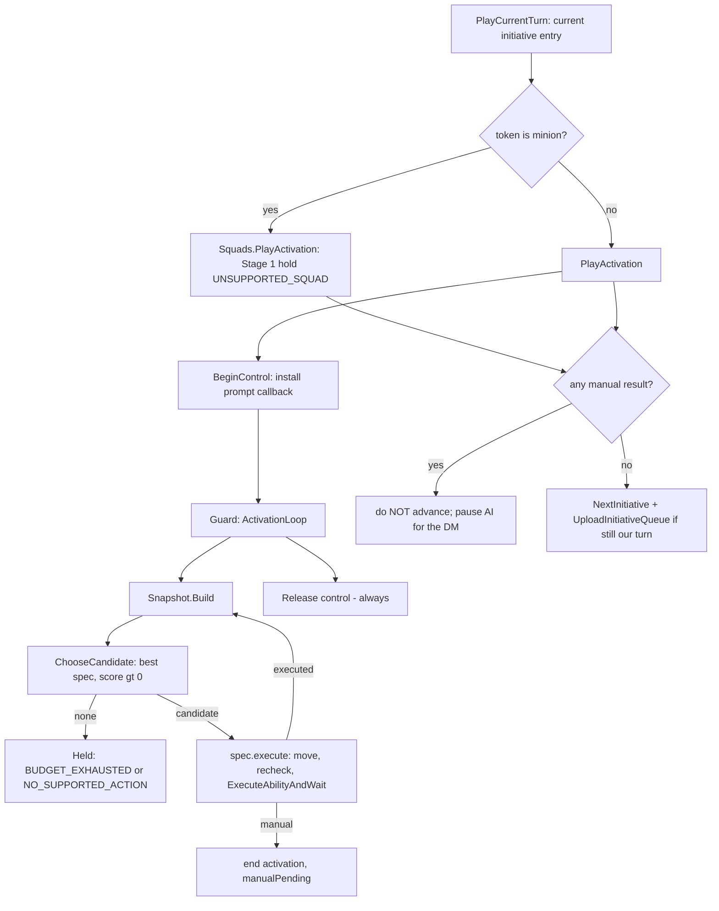

`WarmindSpecs.lua`. `StandardStrikeScore(baseScore)` finds the best strike position
via `Scoring.FindBestStrikePosition` and returns `{ score = baseScore, loc }`;
`StandardStrikeExecute()` moves to the chosen tile, re-derives targets from the
actual landing tile with `FindValidStrikeTargets`, runs `RecheckStrikeTargets`
(downgrading to `NO_LEGAL_TARGET` or `EXECUTION_RECHECK_FAILED` when empty), then
`ExecuteAbilityAndWait`. The two registered specs, both `category = "main"` and
both score 0.2 so everything added later outranks them:
`melee_free_strike` (ability "Melee Free Strike", charges when possible) and
`ranged_free_strike` (ability "Ranged Free Strike").

`WarmindPanel.lua`. The polling thread is the only place that polls. Thread state:
`g_thread`, `g_terminate`, `g_status`, and `g_starting` (the double-start guard).
`WarmindThread` loops: exit on `mod.unloaded`/`g_terminate`; skip when the queue is
nil or hidden; when a live encounter has `victoryAwarded`, idle with status
"Victory screen" (never act under the victory screen); otherwise
`DispatchOpportunityAttacks` (dispatch triggers whose `text == "Opportunity
Attack"`), and when it is not the players' turn either `SelectNextActivation` (nil
initiative id) or `PlayCurrentTurn`, each inside `Warmind.Guard`. A driver Guard
failure sets `g_terminate` (auto-stop); a `manualPending` summary sets
`g_terminate` to pause for the DM; otherwise `CenterOnPlayers`.
`SelectNextActivation` asks `Warmind.Director.ChooseActivation`, `SelectTurn`s,
`BeginTurn`s each token, and centers the camera. The Start/Stop button checks
`coroutine.status(g_thread)` directly (not a cached flag) plus `g_starting` so two
quick clicks cannot start two threads.

`WarmindSquads.lua`. `CollectSquad(tokens, index)` groups minions sharing a
`MinionSquad()` id within the initiative entry, finds the non-minion captain, and
reports `alreadyProcessed` when an earlier token already covered the squad.
`PlayActivation(squadMembers, captain)` is the Stage 1 fail-closed hold: it returns
`ResultHeld(UNSUPPORTED_SQUAD, ...)` naming the squad, so the DM plays minions
manually (or via the still-loaded old Monster AI) until Stage 2 ports the real flow.

`WarmindDirector.lua`. `ChooseActivation(queue)` picks the unmoved non-player entry
whose tokens are closest to any player-controlled token -- the same heuristic the
old Monster AI used. Stage 4 replaces it with real heuristics.

### Key design decisions and risks

Stage 1 is where the hard-won lessons live. Each is load-bearing; do not
re-litigate them.

| # | Lesson (decision) | Why it is load-bearing / how it holds under the verification model |
|---|---|---|
| 1 | `Warmind.Guard` isolates yielding code, never `pcall` | `pcall` around yields is unsafe in the DMHub runtime; a nested coroutine catches errors portably and forwards yields. Source-verified against `dmhub.canSafelyYield` and the repo-wide no-pcall-around-yield discipline (CLAUDE.md Lesson 1); the EXECUTION_ERROR path is the fail-closed net -- a Guard failure records it and auto-stops [fail-closed] |
| 2 | `ExecuteInvoke` blocks until cast end or cancel | It has internal wait loops that never check our flags, so inline invocation would hang the AI. Warmind runs it in its own `dmhub.Coroutine` and watchdogs from outside; invoke-returned-without-finish -> 2s grace -> manual/TAKEN_OVER_BY_DM (not EXECUTION_TIMEOUT). Source-verified against the Casting row in CLAUDE.md; the watchdog is fail-closed by construction [fail-closed] |
| 3 | Manual outcomes pause the AI and NEVER advance initiative | `PlayCurrentTurn` returns `{ manualPending }`; the panel thread auto-stops on it. Without this the AI advances past a turn the DM was told to finish, or re-activates the same entry in a loop. Code path reviewed; pausing without advancing is fail-closed by design [fail-closed] |
| 4 | Stop button = takeover contract | `RequestStop()` + `g_terminate`, checked between decisions, between tokens, and in cast-wait loops. On stop: release control state, leave initiative untouched. Reviewed at every check point; stop is always a clean release [fail-closed] |
| 5 | Driver errors auto-stop the AI | The panel thread sets `g_terminate` on a Guard failure, so a scaffolding bug can never error-loop the same turn; per-activation errors are contained by Guard and the entry's other tokens still act. Reviewed; a driver error is fail-closed to an auto-stop [fail-closed] |
| 6 | `dmhub.Coroutine` does not start synchronously | The panel guards double-start with `g_starting` in addition to `coroutine.status(g_thread)`. Source-verified against the dmhub.Coroutine-is-not-synchronous fact (CLAUDE.md Lesson 6); the double-start guard is reviewed [static] |
| 7 | Scorefn caching is position-independent | `FindBestStrikePosition` caches scorer results per `token.charid` across candidate tiles, so scorers must depend only on the target, never on attacker position (forwarding edges into the cache made selection nondeterministic in the baseline). Reviewed; any residual nondeterminism is quality-only and observable in the panel trace during play [accepted-risk] |
| 8 | Budget = intent, `CanAfford` = authority | `usedCategories` prevents repeats even for cost-free abilities; engine resources gate the rest; Dazed = one category total per turn (engine does not enforce it). Reviewed; `CanAfford` is the fail-closed authority so an over-spend cannot execute [fail-closed] |
| 9 | Trace never throws; every terminal path appends a DecisionResult | `Warmind.Trace` `tostring`s then `pcall`s the format; falling off the decision cap still emits an explicit result. Static -- the tostring+pcall and the terminal-result invariant are code-level guarantees confirmed by review [static] |
| 10 | ASCII only; `luac -p` clean | DMHub runtime constraint. Verified by `luac -p` and `LC_ALL=C grep -nP '[^\x00-\x7F]'` per file [static] |
| 11 | Cooperate with LiveEncounter; never drive it | When `liveEncounter.victoryAwarded` is true the victory screen owns the table while `queue.hidden` is still false -- the panel idles ("Victory screen") instead of acting; never set `victoryAwarded`, never call `TrackHeroStats`, never `DeployWave`. Source-verified against the LiveEncounter row in CLAUDE.md; idling on `victoryAwarded` is a fail-closed cooperative behavior [fail-closed] |

Additional risks and mitigations:

- Stale `_tmp_aicontrol` after an abnormal exit would leave a monster stuck in AI
  control. Mitigation: idempotent `Release` runs on every `PlayActivation` exit
  path (including Guard failures) and the stop path; reviewed for coverage of all
  exit paths. A stale counter would surface during natural play and route to PD.
- A cast that never resolves would hang the AI. Mitigation: the 30s watchdog plus
  2s post-return grace bounds every cast; there is no unbounded wait.
- Squad complexity is deliberately unsupported in Stage 1 (fail-closed
  `UNSUPPORTED_SQUAD`); Stage 2 owns the real port. This is a scope boundary, not a
  bug.

Flag folded from the stage draft:

- The Stage 0 vs Stage 1 boundary is fuzzy on disk: `WarmindScoring.lua`'s baseline
  ports (`FindBestStrikePosition`, `FindBestBurstPosition`, the tactic-bias edge
  hook) and `WarmindDirector.lua`'s activation chooser all landed with the Stage 1
  spine even though the burst scorer is only consumed by Stage 2 specs. Not a
  contradiction -- these are Stage 1-era foundations -- but the "what shipped in
  which stage" attribution is approximate. Documented as Stage 1 scope above.

### Definition of done

Under the verification model (see the Verification model section), Stage 1's DONE
gate is: code complete; `luac -p` clean and `LC_ALL=C grep -nP '[^\x00-\x7F]'` empty
on every touched file (L0); every newly-used engine API verified against repo source
and folded into `Draw Steel Warmind/CLAUDE.md`'s verified surface (L2); and an
adversarial review-agent audit of the Stage 1 diff against
`Draw Steel Warmind/CLAUDE.md` and this plan, with findings fixed. All MET -- the
code is complete and multi-pass reviewed. Module hot-reload and load-clean were
verified LIVE 2026-07-11 via the bridge (L3); turn behavior has not yet been
exercised in a live encounter (L4 pending -- absorbed by the first stage that runs
one, or by natural play + PD). The fail-closed lessons above -- `Warmind.Guard`, the
cast watchdog, `manualPending`, and the stop contract -- are the safety net that
makes shipping before that full L4 defensible.

### Expected runtime behavior (agent-verified at the stage closure; see Verification model)

What a Stage 1 activation should look like in play. As a DONE stage the block is
reference-only, but every item is now agent-verifiable: load/panel items were probed
live 2026-07-11 ([probe]); the turn-behavior items are exercisable via an L4 live
encounter (tagged [live], pending). Coverage tags: [probe] = read-only bridge probe;
[live] = requires an activation in a live encounter (L4); [fail-closed] = a wrong
outcome degrades to a reason-coded hold or a manual prompt; [accepted-risk] =
quality-only, observable in the panel trace during natural play, tuned later via PD.
(Mirrors the Stage 1 behavior list in `Draw Steel Warmind/CLAUDE.md`.)

- Module loads with no console errors; Warmind panel appears (DM only) [probe] (verified live 2026-07-11)
- Non-minion monster: moves + free-strikes (charge if melee), activation ends, initiative advances [live]
- Ranged monster shoots instead of charging; ranged-adjacent penalty observable in trace [live] [accepted-risk]
- Minion squad: held with UNSUPPORTED_SQUAD in trace, initiative still advances [live] [fail-closed]
- Stop mid-turn: clean TAKEN_OVER_BY_DM, no stale `_tmp_aicontrol` counter left on the token, initiative NOT advanced [live] [fail-closed]
- Cancel an AI-initiated cast: AI pauses within ~2s with "cancelled or did not complete", initiative NOT advanced [live] [fail-closed]
- Force a Lua error in a spec: activation held with EXECUTION_ERROR, other tokens still act, AI keeps running [live] [fail-closed]
- With a live encounter active (started from the encounter UI so `liveEncounter` is a table): press "Award Victory" mid-AI-run -> AI idles with status "Victory screen", no turn advancement; after Proceed/End Combat the queue hides and the AI stays idle [live] [fail-closed]
- Old Monster AI panel untouched and still functional (do not run both at once) [probe] [static]

### Kickoff prompts

No session to run. Stage 1 is DONE at code-complete plus clean review closure; the
former P0 verification debrief is removed under the model. The [live]-tagged items
above are the pending L4 exercise, absorbed by the first stage that runs a live
encounter or by natural play. If a Stage 1 behavior misbehaves during natural play,
run PD -- the on-demand play debrief authored in the Verification model section: it
gathers its own evidence via the bridge (Warmind.trace.entries, console errors,
Player.log), diagnoses against the `Draw Steel Warmind/CLAUDE.md` contracts, fixes
minimally, and corrects `CLAUDE.md` if an engine assumption was wrong. PD subsumes
the old P0 checklist pattern -- the panel trace is the evidence, gathered on demand
rather than on a schedule.

---

## Cross-cutting session -- rebase onto upstream main (PR)

### Status

Runnable any time; not yet run. The branch `tiny-monster-ai` has merge-base
`289c2bc` with upstream `main` (`5f6a04b`, 508 commits ahead). Upstream was fully
audited 2026-07-07 by seven seam auditors: NO Warmind code is broken, and every
verified-surface row was reconciled against the new source (corrections already
folded into `CLAUDE.md`, including MainAttackerForTarget restored upstream and new
Lessons 12 and 13). The branch is NOT yet rebased. `git merge-tree` reports the
only conflict is `.gitignore`; root `CLAUDE.md` auto-merges.

Working-tree caveat (must be handled before the rebase runs): the branch currently
has uncommitted changes to `Draw Steel Warmind/CLAUDE.md` and
`Draw Steel Warmind/WarmindAdapter.lua`, plus untracked new docs
(`ROADMAP.md`, `STAGE2_PLAN.md`). A rebase needs a clean tree,
so these must be committed or stashed first. See the flag folded into the risks
subsection below -- the PR prompt does not call this out.

### Scope

Rebase `tiny-monster-ai` onto upstream `main` (`5f6a04b`). Replay the branch's
Warmind commits onto the audited-current base. Resolve the single expected
conflict in `.gitignore` by keeping upstream's rewritten block PLUS this branch's
`*.DS_Stor*` line. Root `CLAUDE.md` auto-merges (upstream added a Crows/Crowdex
section and a `cond()`-is-not-a-ternary warning that Warmind scoring code should
heed). Any conflict beyond `.gitignore`: stop and show the user before resolving.
Afterwards, `luac -p` and the ASCII check on every `Draw Steel Warmind/` file, and
spot-check that the two load-bearing seams still match `CLAUDE.md`'s rows -- the
`_tmp_aipromptCallback` consult and `ExecuteInvoke` in
`DMHub Game Rules/AbilityInvokeAbility.lua`. Do not push.

### Key design decisions and risks

- Why it is safe: the 2026-07-07 audit verified every Warmind dependency against
  upstream `5f6a04b` and found no breaking change; the only mechanical conflict is
  `.gitignore`, and root `CLAUDE.md` auto-merges.
- Why run it BEFORE Stage 2 implementation starts: Stage 2 code written on the
  current base stays valid after the rebase (the STAGE2_PLAN ASSUMPTIONS say
  exactly this -- only `.gitignore` conflicts). Rebasing first means Stage 2 is
  implemented on the audited-current source, so no second upstream audit is needed
  after Stage 2 lands. Rebasing after Stage 2 would force re-verifying the new
  Stage 2 code against the same 508 commits. This is why the roadmap RECOMMENDS
  running PR before P2.1 (see the Stage 2 Status cross-reference).
- Risk: an unexpected conflict beyond `.gitignore`. Mitigation: the PR prompt halts
  and surfaces anything else conflicting before touching it.
- Risk: the load-bearing seams drift upstream. Mitigation: the post-rebase
  spot-check re-confirms the `_tmp_aipromptCallback` consult and `ExecuteInvoke`
  signatures against `CLAUDE.md`.
- Risk: the dirty working tree blocks the rebase. Mitigation: commit or stash the
  uncommitted Warmind doc/adapter changes first.

Flag folded from the stage draft:

- The PR kickoff prompt (verbatim from the deleted `PROMPTS.md`) does not mention that the
  branch currently has uncommitted changes (`Draw Steel Warmind/CLAUDE.md`,
  `Draw Steel Warmind/WarmindAdapter.lua`) and untracked docs (`ROADMAP.md`,
  `STAGE2_PLAN.md`). A rebase needs a clean working tree, so the
  session must commit or stash these first. Surfaced here rather than editing the
  verbatim prompt; the roadmap Status/Kickoff notes flag it in prose.

### Definition of done

The rebase completes with only `.gitignore` resolved by hand (upstream block plus
`*.DS_Stor*`), root `CLAUDE.md` auto-merged, `luac -p` and the ASCII check passing
on every `Draw Steel Warmind/` file, both seam spot-checks still matching
`CLAUDE.md`, and nothing pushed.

### Source-level done checks (this IS the gate)

The rebase is a git/source operation, so its DONE gate is entirely source-level --
no in-app verification. The session performs these directly:

- `git status` is clean after the rebase; no unresolved conflicts remain
- Only `.gitignore` required manual resolution (upstream block + `*.DS_Stor*`); root `CLAUDE.md` auto-merged
- `luac -p` passes on every `Draw Steel Warmind/*.lua` file
- `LC_ALL=C grep -nP '[^\x00-\x7F]'` returns nothing on every `Draw Steel Warmind/*.lua` file
- The `_tmp_aipromptCallback` consult in `DMHub Game Rules/AbilityInvokeAbility.lua` still matches the `CLAUDE.md` prompt-interception row
- `ActivatedAbilityInvokeAbilityBehavior.ExecuteInvoke` in the same file still matches the `CLAUDE.md` casting row
- Nothing was pushed
- Deployment (not a gate): the rebase is a git operation; if it changes any `Draw Steel Warmind/*.lua` file, deploy those into the mod store and confirm the automatic hot reload (see the Autonomous dev loop in CLAUDE.md), else there is nothing to deploy. Any load issue or later runtime misbehavior routes to PD (see the Verification model section)

### Kickoff prompts

#### PR -- Rebase onto upstream main

Copied verbatim from `PROMPTS.md`. Runnable any time (audited safe); the roadmap
recommends running it before Stage 2 implementation. Ensure the working tree is
committed or stashed first (see Status).

```
Read the rebase notes in "Draw Steel Warmind/CLAUDE.md" (2026-07-07 re-audit: branch base 289c2bc,
upstream main 5f6a04b, no Warmind code broken). Rebase branch tiny-monster-ai onto upstream main.
Expected: the only conflict is .gitignore -- resolve by keeping upstream's rewritten block plus
this branch's *.DS_Stor* line; root CLAUDE.md auto-merges. Anything else conflicting: stop and show
me before resolving. Afterwards: luac -p + ASCII check every "Draw Steel Warmind/" file, and
spot-check that the two load-bearing seams still match CLAUDE.md's rows (the _tmp_aipromptCallback
consult and ExecuteInvoke in "DMHub Game Rules/AbilityInvokeAbility.lua"). Do not push.
```

---

## Stage 2 -- Generic competence (plan complete, implementation not started)

Milestone 1 of the Warmind roadmap: any unscripted monster plays its stat block sensibly with
NO hand-written per-monster behavior. Generic, trait-driven specs cover signature strikes (single
and multi-target, charge subsumed), self-centered area attacks that fire only when they catch
enough enemies, the standard maneuvers (forced movement, grab, aid attack, hide), smart answers to
the common mid-cast prompts, and working minion squads. Everything else fails closed with a stable
reason code. Bespoke per-monster packs are Stage 6; role weight profiles are Stage 3; malice and
villain actions are Stage 4.

The authoritative implementation spec is `Draw Steel Warmind/STAGE2_PLAN.md` (written 2026-07-07
from the 508-commit upstream audit, a function-level port inventory of the legacy `Monster AI/`
module, and an ability-pattern census of all 476 Book Two stat blocks). This roadmap section
summarizes it exhaustively enough to act from, but STAGE2_PLAN.md WINS on any implementation
detail, and `Draw Steel Warmind/CLAUDE.md` WINS on any engine fact.

### Status

Planning complete, zero implementation. STAGE2_PLAN.md exists on disk; none of sessions
P2.1 through P2.5 have been run; no Stage 2 code is written. Stage 1 is DONE (code complete,
statically verified, multi-pass reviewed; module hot-reload + load-clean verified live 2026-07-11
via the bridge, turn behavior not yet exercised -- see the Stage 1 section). Under the Verification
model Stage 2 verifies itself at the P2.5 review closure via L1 harness + L3 deploy-and-probe + L4
live squad turn (or an honest DEFERRED); any misbehavior found later during natural play is handled
on demand by PD (the play debrief authored in the Verification model section), never as a scheduled
gate.

Repo state (verified 2026-07-10):

- Branch `tiny-monster-ai`, base commit `289c2bc`. Upstream main is `5f6a04b` (508 commits ahead,
  fully audited 2026-07-07: no Warmind code broken). The branch is NOT yet rebased; the only
  expected rebase conflict is `.gitignore`. Rebasing is optional and independent of Stage 2 --
  Stage 2 code written on the current base stays valid after the rebase (only `.gitignore`
  conflicts), so the Stage 2 work is rebase-safe either way. The roadmap nonetheless RECOMMENDS
  running session PR before P2.1, so Stage 2 is built on the audited-current upstream base and no
  second upstream audit is needed after Stage 2 lands (matching the Cross-cutting rebase session's
  own recommendation). The recommendation is about ordering only.
- The Warmind module is exactly 12 Lua files in `Draw Steel Warmind/`: WarmindCore, WarmindTraits,
  WarmindSnapshot, WarmindAdapter, WarmindScoring, WarmindSpecs, WarmindPrompts, WarmindSquads,
  WarmindTurn, WarmindDirector, WarmindOverrides, WarmindPanel. They are NOT loaded via the repo
  `main.lua`; they live in a separate DMHub module "Draw Steel Warmind" whose on-disk store is
  `mods/Warmind_be67`. Sessions deploy changed files by writing them into that store, and DMHub's
  file watcher hot-reloads the module automatically (no manual copy step; see the Autonomous dev
  loop in CLAUDE.md).
- Stage 0 (scaffolding) DONE. Stage 1 (robust spine) DONE (code complete, statically verified,
  multi-pass reviewed; module hot-reload + load-clean verified live 2026-07-11 via the bridge,
  turn behavior not yet exercised -- L4 pending, with PD as the recourse during natural play).
- Uncommitted working-tree changes right now: `Draw Steel Warmind/CLAUDE.md` (fold-in of the
  2026-07-07 upstream audit) and `Draw Steel Warmind/WarmindAdapter.lua` (DestroyRays tries
  `ray:Destroy()` first, falling back to `ray:DestroyLineOfSight()`, both pcall-wrapped). Untracked
  new docs in the same directory: ROADMAP.md, STAGE2_PLAN.md (ORIGINAL_PLAN.md and PROMPTS.md
  were deleted 2026-07-11 as superseded).

What already exists on disk and must NOT be rebuilt (from the STAGE2_PLAN "what already exists"
table -- these are Stage 0/1 deliverables the Stage 2 work composes on top of):

| Piece | State | File |
|---|---|---|
| Scoring core: `FindValidStrikeTargets`, `FindBestStrikePosition` (stay-put candidate + per-target scorefn cache), `FindBestBurstPosition` (validity guards), `FindClosestEnemy`, `DistanceFromNearestEnemy` | DONE, faithful baseline ports | WarmindScoring.lua |
| Tactic-bias hook: the edge sum reads `ctx.activeTactics`, populated from the `Warmind.tactics` registry | LIVE but empty (zero tactics registered) | WarmindScoring.lua (edge sum), WarmindCore.lua (`RegisterTactic`) |
| Free-strike specs `melee_free_strike` / `ranged_free_strike`, both score 0.2, via `StandardStrikeScore` / `StandardStrikeExecute` | DONE | WarmindSpecs.lua |
| Prompt plumbing: `Adapter.MakePromptCallback` (qualified-name-wins lookup, `ctx.expectedPrompt` combo support, "skip" honored) | DONE, ZERO handlers registered | WarmindAdapter.lua, WarmindPrompts.lua (empty) |
| Squad detection: `Squads.CollectSquad` (members, captain, alreadyProcessed), wired into `Turn.PlayCurrentTurn`; `Squads.PlayActivation` is a fail-closed hold returning UNSUPPORTED_SQUAD | DONE (hold only) | WarmindSquads.lua |
| Cast execution: `Adapter.ExecuteAbilityAndWait` (watchdog, own coroutine, charge move-in from pair.a lookup, meleeAndRanged variation resolution, DecisionResults) | DONE | WarmindAdapter.lua |
| Traits classifier `Warmind.Traits.Get`: returns name, actionKind, isSignature, isStrike, isMelee, isRanged, isAreaKeyword, isAoe, targetType, villainAction | PARTIAL (missing every Stage 2 trait) | WarmindTraits.lua |
| Reason codes: NO_SUPPORTED_ACTION, NO_LEGAL_TARGET, NO_REACHABLE_POSITION, UNSUPPORTED_COMPLEX_PROMPT, UNSUPPORTED_AREA_GEOMETRY, UNSUPPORTED_SQUAD, EXECUTION_RECHECK_FAILED, EXECUTION_TIMEOUT, EXECUTION_ERROR, BUDGET_EXHAUSTED, TAKEN_OVER_BY_DM, CANNOT_AFFORD | COMPLETE for Stage 2 | WarmindCore.lua (`Warmind.reason`) |

### Scope

Six workstreams (A-F), all inside `Draw Steel Warmind/`. Each workstream touches its own file among
the six listed below, with ONE exception: P2.4 (Workstream F, the squad port) may also add
strictly-required squad glue in a seventh file, WarmindTurn.lua. That is why P2.1 lists WarmindTurn
as out of scope for the foundations session while P2.4 explicitly permits the glue -- the two are
consistent per session, not contradictory. No new Lua files (the DMHub module constraint:
unregistered files do not auto-load). Census
drives the ordering: from the 476 Book Two blocks (~1,130 ordinary abilities), strikes are ~60% of
all abilities (single melee ~30-35%, single ranged ~15-18%, multi-target ~13-15%); areas ~22-25%;
minions are 116 of 476 blocks (~24%) and their signature strikes are "one target per minion" (114
abilities). Riders resolve from the ability's own tier data with no AI work (conditions on ~45-55%
of offensive abilities). Forced movement rides ~35-40% of abilities and grab ~12-15%. The most
frequent mid-cast decisions, ranked: forced-movement destination (~481 tier instances), self-shift
(~150+), area template placement (~100+), target spread (~178 multi-target + 220 "up to N"),
opt-in riders (~125). Consequence: this spec set covers the PRIMARY turn of roughly 60-65% of
Book Two blocks, and the prompt handlers are where most of the play quality lives -- a knockback
that picks a bad square degrades every one of the ~35-40% of abilities carrying forced movement.
The high-value items are the squad port and the forced-movement/shift handlers; the maneuver specs
are cheap ports.

All spec detection is by TRAIT, never by literal ability name -- name matching is precisely what
kept the baseline from generalizing. All scoring constants below are baseline-derived starting
values, tunable in play. Scoring conventions (from CLAUDE.md): 0.2 generic fallback, 0.5-0.8
situational maneuvers, 1.0 signature action, 1.5-2.5 high-impact (reserved for Stage 4/6).

#### Workstream A -- Traits expansion (`WarmindTraits.lua`)

New fields on the table returned by `Warmind.Traits.Get(ability)`. Detection is structured-field
based; where the data is only partially structured the trait degrades to nil (callers fail closed
or fall through) -- never guess from description text. Traits stays PURE: no token reads (raw
`.numTargets` is stored; the live value is resolved later by snapshot/spec). See STAGE2_PLAN
Workstream A for the exact detection expressions.

| New trait | Detection (per STAGE2_PLAN) | Caveat |
|---|---|---|
| `forcedMovementType` | `ability:ForcedMovementType()` -> "push"/"pull"/"slide"/"vertical_*"/nil; presence = behaviors list contains `ActivatedAbilityRelocateCreatureBehavior` or `ability:try_get("forcedMovement")` | Type often lives in tier text, not a clean field. Presence detected but type nil -> set `"unknown"` (the maneuver spec still uses it; destination comes from the Push!/Pull!/Slide! prompt, which names the type). Do NOT use engine `IsForcedMovement` (true only for invoked sub-abilities) |
| `inflictsConditions` | Scan behaviors for ApplyOngoingEffect-style behaviors, `behavior:ConditionID()`, resolve UUID -> name via `dmhub.GetTable("characterOngoingEffects")`; store a set of lowercased names | UUID resolution must be pcall-free (non-yielding plain reads). Cache per ability name within one `Traits.Get` call only |
| `appliesGrabbed` | `inflictsConditions["grabbed"]` | Convenience flag for the grab spec and scorers |
| `isHide` | `inflictsConditions["hidden"]` | No dedicated keyword exists; condition-inflict is the reliable structured signal |
| `isAidAttack` | Any behavior applies ongoing-effect guid `e234f1f4-9953-43bd-894c-d96adbb63f84` | The guid is load-bearing (carried from the baseline); keep it a NAMED constant |
| `aoeRadius` | `ability:GetRadius(casterCreature, {})` when `isAoe` | Only meaningful for self-centered bursts in Stage 2; placed templates stay unsupported |
| `numTargets` | Stores the RAW `.numTargets` field (Traits stays pure); snapshot/spec resolves the live value via `ability:GetNumTargets(token)` | Keep Traits pure (no token reads) |
| `costsMalice` | Static detection: any payment-option resourceid == `CharacterResource.maliceResourceId` in the ability's cost fields | Stage 2 specs must SKIP malice-costing abilities entirely (malice policy is Stage 4). If static detection is unreliable, the spec-level CanAfford+skip still protects us |

#### Workstream B -- Scoring additions (`WarmindScoring.lua`)

1. `Scoring.FindReachableConcealment(ctx, snapshot)` -- port of the baseline `FindReachableConcealment`
   (confirmed in `Monster AI/MonsterAI.lua`): scan `snapshot.paths` for the lowest-cost tile where,
   under `token:ExecuteWithTheoreticalLoc`, `token.properties:IsConcealed()` is true. Returns loc or
   nil. Used by the hide spec.
2. Register the three baseline tactics via `Warmind.RegisterTactic` (this lights up the already-live
   edge hook; each contributes +1 edge when its condition holds). New registry signature:
   `score(tactic, ctx, token, tokenLoc, enemy, ability)`.
   - `flanking`: an ally sits on the exact opposite side of the enemy from tokenLoc (collinear
     opposite deltas, baseline algorithm confirmed in `Monster AI/MonsterAITactics.lua`). Allies
     come from `ctx.snapshot.allies`.
   - `aid_attack`: the enemy carries the aid-attack ongoing effect -- read the per-enemy `aidAttacked`
     flag from Workstream C, NOT a live `ActiveOngoingEffects` scan per edge evaluation.
   - `high_ground`: attacker altitude > target altitude via `game.currentFloor:GetAltitudeAtLoc`.

#### Workstream C -- Snapshot additions (`WarmindSnapshot.lua`)

- Per-enemy `aidAttacked` flag: while building `snapshot.enemies`, scan each enemy creature's
  `ActiveOngoingEffects` for the aid-attack guid `e234f1f4-9953-43bd-894c-d96adbb63f84` (the baseline
  did this once per turn in `PlayTurnCoroutine`; it belongs in the snapshot so specs and tactics
  share one read).
- Nothing else changes. Reminder (CLAUDE.md Lesson 12): `GetActivatedAbilities` returns fresh
  temporary clones every call -- never key or compare ability objects across snapshots; never pass
  `excludeGlobal` (it strips free strikes AND malice abilities together).

#### Workstream D -- Generic spec set (`WarmindSpecs.lua`)

Seven specs via `Warmind.RegisterSpec`. Shared gates on every spec: skip abilities with
`traits.villainAction` (Stage 4 owns those), skip `traits.costsMalice` (Stage 4), and
`ability:CanAfford(token)` remains the execution-time authority. Constants are inline below and
match the confirmed baseline scorefns.

| Spec id | Category | Trait gate | Score (constants inline) | Execute |
|---|---|---|---|---|
| `signature_strike` | main | `isSignature and isStrike` | `FindBestStrikePosition`; candidate score 1.0 when a position with >= 1 target exists. Multi-target abilities use the existing `min(numTargets, #targets)` base plus edges, so 2-target strikes prefer positions hitting 2 | Existing `StandardStrikeExecute`: move, `RecheckStrikeTargets`, `ExecuteAbilityAndWait`. Charge is subsumed (the Charge-keyword path inside `FindValidStrikeTargets` extends reach; `ExecuteAbilityAndWait` performs the move-in) |
| `area_burst_if_n` | main (maneuver variant if `actionKind == "maneuver"`) | `isAoe and targetType == "all"` (self-centered burst ONLY) | `FindBestBurstPosition`, scorefn enemy +1, ally -1, dead/invalid 0. Candidate only when `enemiesHit >= 2` and `net >= 2`. Score `= 0.45 * net` (2 enemies clean = 0.9, just under signature; 3+ = 1.35+, beats it) | Move to burst position, recheck enemies still in radius (`>= 2` or downgrade to `skipped` NO_LEGAL_TARGET), cast with auto-targets (the "all" path in the adapter self-targets bursts) |
| `forced_movement` | maneuver | `forcedMovementType ~= nil` and isStrike-or-targeted | `FindBestStrikePosition` with baseline knockback scorefn: `0.2 - Stability*0.06 + might*0.06`, `+0.06` when our size > target size; `-100` for targets that are Grabbed or have "Cannot Be Force Moved" > 0. `might = GetAttribute("mgt"):Modifier()` | `StandardStrikeExecute`; the destination decision happens in the Push!/Pull!/Slide! handler (Workstream E), which is what makes this spec good |
| `grab` | maneuver | `appliesGrabbed` | `FindBestStrikePosition` with baseline grab scorefn: `0.08 + might*0.08 + (targetSpeed - 6)*0.04`; `-100` if target already Grabbed; self-preservation `-100` when own `CurrentHitpoints < 12`, `-0.04` when `< 20` | `StandardStrikeExecute` |
| `aid_attack` | maneuver | `isAidAttack` | 0.1 when any valid strike-range target lacks the `aidAttacked` flag (snapshot) | Move, filter targets to un-aided, cast |
| `hide` | maneuver | `isHide` | 0.5 when not `HasNamedCondition("Hidden")` and `FindReachableConcealment` returns a loc; nil otherwise | Move to concealment loc, cast the hide ability |
| `reposition` | move | always available (no ability) | 0.1 when no strike-bearing spec produced a candidate this iteration AND the actor is not already adjacent to an enemy: move toward `FindClosestEnemy` (melee) or to max-range standoff (ranged). Deliberately last-resort | `Adapter.MoveTo` only; emits ResultExecuted with `detail.moveOnly = true` |

Explicitly NOT specs in Stage 2 (fail-through or fail-closed, see the deferred table): placed
templates ("N cube within M" -- the `targetType == "all"` gate simply does not match, so the
monster does something else instead of holding), ally heal/buff, zone creation, triggered actions,
multi-turn solos.

#### Workstream E -- Prompt handlers (`WarmindPrompts.lua`)

Handler contract (already enforced by `Adapter.MakePromptCallback`): return `{targets = {{loc=...}}}`
or `{targets = {{token=...}}}` to resolve, `"skip"` to abort the sub-ability, nil to decline (falls
through to a manual prompt + UNSUPPORTED_COMPLEX_PROMPT hold). Handlers must never yield and never
throw (wrap risky reads; a handler error must degrade to nil/manual, not kill the cast -- CLAUDE.md
Lesson 1: pcall only around provably non-yielding calls).

1. **Shift** (`prompts = {"Shift"}`) -- replaces the baseline's literally random tile pick
   (confirmed `math.random()` in `Monster AI/MonsterAIPrompts.lua`). Candidates:
   `token:CalculatePathfindingArea(range*10, {"shift"})`. Score each tile:
   `distanceFromNearestEnemy(tile)` (maximize) minus `cost*0.001` (tiebreak: shorter shift). If the
   actor still has its main action unspent this activation AND is melee-only, INVERT: minimize
   distance to the current best strike target instead (shift INTO reach, not away). Mark a movement
   arrow for ~1s (baseline UX), return the loc. Role-aware shifting is Stage 3.
2. **Push! / Pull! / Slide!** (`prompts = {"Push!", "Pull!", "Slide!"}`) -- the census rank-1
   decision. Replace the baseline's hand-rolled square ring (its own TODO, with `CustomTargetShape`
   left commented out in the baseline) with the ability's real geometry: candidate destination
   squares from `ability:CustomTargetShape(casterToken, range, symbols, targets)` -- the effective
   Draw Steel override in `Draw Steel Core Rules/MCDMActivatedAbility.lua` takes 4 args (it shadows
   the 3-arg base), so pass `{}` for targets, matching that override and the baseline's commented-out
   `CustomTargetShape(casterToken, range, symbols, {})` call. This 4-arg form supersedes
   STAGE2_PLAN.md Workstream E's stale 3-arg `CustomTargetShape(casterToken, range, symbols)` spec
   (confirmed against MCDMActivatedAbility.lua): it is the one place this section's implementation
   detail intentionally overrides the plan, so a reader cross-referencing STAGE2_PLAN.md is not
   misled by the arg-count mismatch. Plus
   `ability:TargetLocPassesFilterPredicate` for legality (the filter predicate is an ACTIVE baseline
   call; CustomTargetShape appears in the baseline only as the commented-out TODO in that 4-arg form).
   Score lower-is-better, baseline constants kept:
   `dist + 2*collideWithAllies - 2*collideWithEnemies - 2*fallDistance`, and `-4` when colliding
   with objects. Type-specific goals (the prompt NAME carries the type, no trait lookup needed):
   - Push!: maximize distance from caster along legal squares; prefer falls/hazards/enemy collisions.
   - Pull!: minimize distance to caster; landing adjacent to the caster is a bonus (sets up grabs).
   - Slide!: free direction -- best-scoring square overall (hazard/fall first, else the square
     farthest from the target's allies).
   Respect the grabbed rule: if the moved creature is Grabbed by someone other than the caster,
   return `"skip"`.
3. **Generic invoked-target picker** (registered for the invoked-sub-ability names squads and combos
   produce; generalizes the baseline Decrepit Skeleton handler): forbidden set = charids in
   `symbols.targetPairs`; candidates = non-friendly, in range, passing `ability:TargetPassesFilter`;
   return the NEAREST candidate (deterministic -- the baseline picked randomly); `"skip"` when none.

#### Workstream F -- Squad port (`WarmindSquads.lua`)

Replace the `Squads.PlayActivation` fail-closed hold with the real flow. Baseline source (confirmed
this session): `ExecuteSquadStrike` + `FindSquadMemberStrikeOptions` in `Monster AI/MonsterAI.lua`.

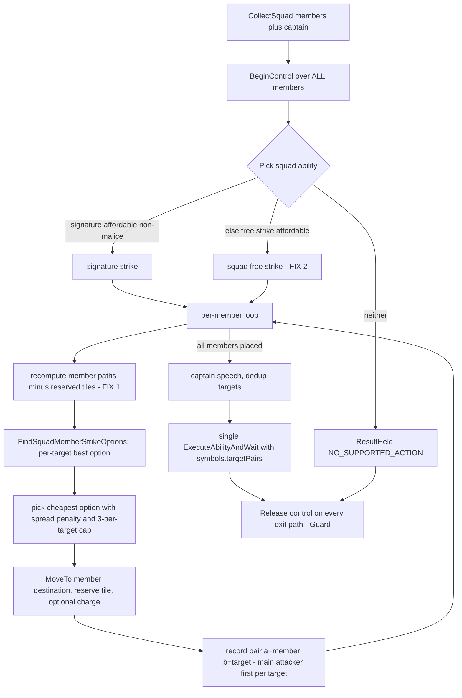

Port details and the constraints the 2026-07 audit added:

- **Ability choice + FIX 2 (no-signature fallback).** Baseline silently returned "Could not find any
  targets" when no affordable signature existed (squads forfeited turns with no trace -- confirmed).
  New order: signature (isSignature, CanAfford, not costsMalice) -> squad free strike (Melee/Ranged
  Free Strike by trait) -> ResultHeld with NO_SUPPORTED_ACTION and prose naming the squad. Never
  silent.
- **FIX 1 (re-path staleness).** Baseline recomputed each member's `CalculatePathfindingArea` at the
  top of its loop iteration while the previous member's `token:Move` was still animating (confirmed),
  so members clumped or pathed through claimed tiles. Fix = tile reservation as the primary
  mechanism: maintain a `reserved` set of chosen destination tiles, exclude reserved tiles from every
  later member's candidate set, and keep the existing pacing Sleep before the next member's
  pathfinding as the settle window. Tile reservation is the primary anti-clumping mechanism
  regardless of `token.loc` settle timing; whether moves settle synchronously (in which case the
  reservation alone would suffice) is a quality-only detail observable in the panel trace during
  play -- [accepted-risk], not a gate.
- **Member filter (audit-mandated).** Build options/pairs ONLY for members that are alive, valid,
  `IsActiveInSquad()`, and not `IsTurnSkipped()` -- otherwise the manual pairs over-declare attackers
  vs the engine's `GetNumTargets` accounting.
- **Target cap (audit-mandated).** At most 3 attackers per target unless the ability carries
  "Ignore Minion Target Limit" -- mirror `CanTargetAdditionalTimes`. Keep the baseline spread penalty
  (`+10000 * alreadyAssignedCount` on an option's cost) so fire spreads before it stacks.
- **Pair ordering (CLAUDE.md Lesson 13).** The FIRST pair listed for a given target charid selects
  the main attacker -- the source of invoked sub-effects (pushes, conditions) and caster-benefit
  behaviors, not just the damage roller. When multiple members hit one target, list the
  best-positioned member's pair first.
- **Option scoring.** Port `FindSquadMemberStrikeOptions` as-is (confirmed): per reachable tile run
  `FindValidStrikeTargets`; option cost `= pathCost - edges*5`; charge-alignment bonus = dot product
  of move vector and charge vector `* 0.5`; keep the cheapest option per target charid.
- **Enumeration.** Prefer `_tmp_minionSquad.{tokens, captain, liveMinions, activeMinions}` over
  re-scanning `dmhub.allTokens` (built in `MCDMCreature.RefreshSquadInfo`); keep `CollectSquad` as the
  initiative-entry-level grouping check.
- **Billing.** Never pay costs manually -- the engine's `ConsumeResources` override bills members,
  and the multi-member action+maneuver fan-out only fires for `HasManeuverOrActionRule()` squads
  (correct either way).
- **Control lifecycle.** `BeginControl` on EVERY member (the baseline installed the prompt callback
  on all members, not just the lead); `Release` on EVERY exit path including errors (Guard) and stop
  requests; manual/cancel outcomes propagate exactly like Stage 1 (manualPending, no initiative
  advance).

#### Deferred (census-measured gaps, recorded so they are chosen, not forgotten)

| Gap | Census weight | Target |
|---|---|---|
| Placed area templates ("N cube within M", lines, walls) -- placement optimizer | ~100+ abilities | Stage 3 (reuse the Push! destination scorer over template footprints) |
| Ally heal / buff / temp-stamina (Leaders, Support) | ~12-15% of abilities, 30 Leader blocks | Stage 3/4 (a support_ally spec; Leaders misplay without it) |
| Debuff target prioritization (daze the caster, slow the runner) | conditions ride on ~45-55% of abilities | Stage 3 (weighting inside the strike target picker, not a new spec) |
| Zone / terrain / hazard creation (Controllers, Hexers) | ~5-8% ordinary + heavy malice share | Stage 3/4 (place_zone spec on top of the template placer) |
| Triggered actions / reactions beyond opportunity attacks | 148 abilities (~12%) | Stage 4+ (needs a reaction evaluator on the trigger path) |
| Solo / Leader multi-action turns, malice spend, villain actions | 22 Solo + 30 Leader blocks | Stage 4 (Director layer) |
| Post-strike self-shift riders ("shifts up to 2 between targets") | ~150+ instances, largely free-text | Partial via the Shift handler when the engine prompts; pure-prose riders are undetectable -- accept the miss, revisit with per-ability annotations in Stage 6 |

#### Implementation order (from STAGE2_PLAN)

1. Traits expansion (A) -- everything else keys off it.
2. Snapshot `aidAttacked` flag (C).
3. Scoring: `FindReachableConcealment` + three tactics (B).
4. Specs (D) -- `signature_strike` first (largest coverage), then `area_burst_if_n`, then the
   maneuvers, then `reposition`. Each spec lands with its intended panel trace output specified in
   the spec (that trace is what a reader observes during natural play; it is not a verification gate).
5. Prompt handlers (E) -- Shift, then Push!/Pull!/Slide!, then the invoked picker.
6. Squad port (F) -- last; it composes everything above.
7. Update `CLAUDE.md`: stage table, new verified engine APIs, new lessons; flip the Stage 2 row to
   DONE at P2.5's clean review closure (the DONE gate under the Verification model -- see Definition
   of done).

Steps 1-3 are mechanical tight-spec ports (delegate to opus subagents with an acceptance check and
an instruction to challenge the spec). Steps 4-6 need design judgment on-session. Every file: ASCII
only, no new files (all six target files already exist and are registered in the DMHub module).

### Key design decisions and risks

Decisions (each with its rationale):

- **Trait-gates, never ability-name matching.** Every spec selects abilities by trait
  (`isSignature and isStrike`, `appliesGrabbed`, `isHide`, ...), never by literal name. Rationale:
  name matching is exactly what kept the baseline from generalizing beyond its ~7 hand-written
  monsters; the whole point of Stage 2 (milestone 1) is that an unscripted monster plays its stat
  block with zero bespoke code. Trait gates are the mechanism that makes that possible.
- **Malice-costing abilities are skipped entirely until Stage 4.** The shared spec gate drops any
  ability whose cost includes `CharacterResource.maliceResourceId`. Rationale: malice is a global,
  cross-monster resource whose spend timing is an encounter-level decision (score margin + pool
  floor + villain-action pacing) that belongs in WarmindDirector (Stage 4), not in a per-actor spec.
  Casting malice greedily from a generic spec would misspend the pool. Defense in depth:
  `ability:CanAfford(token)` at execution time is the backstop if static `costsMalice` detection
  misses an ability.
- **Placed templates fail THROUGH, not closed.** The `area_burst_if_n` gate is `targetType == "all"`
  (self-centered burst only). A placed template ("N cube within M") has a different targetType, so
  the gate simply does not match and the monster proceeds to its next-best spec (another strike, a
  maneuver, or reposition). Rationale: holding the whole activation on an unsupported area geometry
  would waste a turn; failing through keeps the monster acting sensibly while the template case is
  deferred to Stage 3's placement optimizer.
- **Squad control is installed on ALL members and released on EVERY exit path.** BeginControl over
  every member (not just the lead), Release guaranteed through `Warmind.Guard` on success, held,
  manual, error, and stop-request paths. Rationale: a leaked `_tmp_aicontrol` counter on any minion
  silently steals that token's manual prompts from the DM forever after; the baseline installed the
  callback on all members and the audit hardened the release contract.

Risks (each with its mitigation or verification plan):

- **Push!/Pull!/Slide! literal prompt names (STAGE2_PLAN ASSUMPTION).** The handler table keys on the
  exact strings "Push!", "Pull!", "Slide!" (the baseline registered those literals -- confirmed in
  `Monster AI/MonsterAIPrompts.lua`). If the engine renamed them, every forced-movement destination
  falls through to a manual prompt. Re-routing under the Verification model: P2.3 greps the
  forced-movement behaviors under "DMHub Game Rules"/"Draw Steel Core Rules" for the literal strings
  before finalizing; if the repo source is inconclusive, SHIP the literals as the fail-closed
  fallback -- an unmatched name means the handler never fires, the engine shows its manual prompt,
  and the AI records an UNSUPPORTED_COMPLEX_PROMPT hold (a clean degrade, not a crash). Record any
  unconfirmed literal under [accepted-risk] in the session summary; no runtime gate. [fail-closed]
- **`IsConcealed()` behavior (STAGE2_PLAN ASSUMPTION).** `FindReachableConcealment` assumes
  `token.properties:IsConcealed()` under `ExecuteWithTheoreticalLoc` reports concealment at the
  theoretical tile (baseline usage -- confirmed, not re-verified against upstream main). If it does
  not, the hide spec never finds a concealment tile (scores nil) and simply never hides -- a
  fail-safe miss, not a crash. Re-routing under the Verification model: P2.1 (which ports
  `FindReachableConcealment`) source-verifies the `IsConcealed` / `ExecuteWithTheoreticalLoc`
  semantics against repo source and records the result in CLAUDE.md; if source is inconclusive,
  ship the fail-safe (a monster that never hides simply does something else). [fail-closed]
- **`token.loc` settle timing in the squad loop (STAGE2_PLAN Workstream F FIX 1 verification note).**
  Tile reservation is the PRIMARY anti-clumping mechanism precisely because per-member re-pathing may
  read a stale `token.loc` while the previous member's move animates. The reservation set excludes
  claimed tiles regardless of settle timing, and the pacing Sleep is the settle window, so this can
  only ever degrade squad-spread QUALITY (clumping), never correctness. Whether moves settle
  synchronously is observable in the panel trace during play and tuned later via PD. [accepted-risk]
- **Squad port carries the heaviest lifecycle risk.** Beyond control release (above), the pair
  ordering per Lesson 13 is load-bearing: `MainAttackerForTarget` picks the FIRST pair whose `b`
  matches the target, and that minion sources all invoked sub-effects and caster-benefit behaviors
  for that target. A wrong ordering attributes pushes/conditions to the wrong minion. Mitigation:
  list the best-positioned member's pair first per target charid; P2.4's review-agent audit pays
  specific attention to the exit-path release (control lifecycle) and pair ordering (Lesson 13).
  The Guard-on-every-exit contract makes a leaked `_tmp_aicontrol` a [fail-closed] concern; pair
  ordering is caught at the P2.4 review ([static]), and a slip that survives is a quality-only
  mis-attribution ([accepted-risk]) -- the cast still resolves cleanly and reason-coded, observable
  in the panel trace and correctable via PD.

Flags folded from the stage draft:

- **"Three ASSUMPTIONS" labeling.** The earlier draft (and the now-removed PROMPTS.md P2.V debrief)
  grouped "Push!/Pull!/Slide! literal prompt names, IsConcealed behavior, token.loc settle timing" as
  the three STAGE2_PLAN ASSUMPTIONS. In STAGE2_PLAN.md the formal `## ASSUMPTIONS` section lists a
  slightly different trio: (1) Stage 2 code written on the current branch base stays valid after the
  rebase, (2) `IsConcealed()` behaves as the baseline assumed, (3) the engine still names the prompts
  "Push!"/"Pull!"/"Slide!". `token.loc` settle timing is NOT in that section -- it is a verification
  note inside Workstream F FIX 1. Under the Verification model none of the three is gated on a runtime
  check: each is source-verified in its implementing session and shipped fail-closed where source is
  inconclusive (see the Risks above and the Verification model's doctrine on re-routed assumptions).
  The source discrepancy is noted here for accuracy. The rebase-safety assumption (formal
  ASSUMPTION #1) is handled by session PR and is not Stage-2-specific.
- **P0 removed.** An earlier draft carried a P0 session (Stage 1 manual in-app verification) that
  could run before or alongside Stage 2. Under the Verification model that session is removed: Stage
  1 is DONE and there is no MANUAL verification session anywhere in the plan (runtime verification is
  agent-driven at each stage closure via L3/L4). The Stage 2 kickoff prompts are P2.1-P2.5 (P2.5 is
  the DONE gate); play issues on any stage route to PD. the original P0 block was retired with
  PROMPTS.md (deleted 2026-07-11).
- **Baseline `CustomTargetShape` is currently commented out.** In `Monster AI/MonsterAIPrompts.lua`
  the Push!/Pull!/Slide! handler has `CustomTargetShape` left as a TODO comment and ships a
  hand-rolled square ring instead. Workstream E's instruction to use `ability:CustomTargetShape` is
  therefore a NEW call path (an enhancement over the baseline), not a straight port -- P2.3 should
  treat that engine method as newly-exercised and verify its signature against repo source before
  relying on it (it is not in the CLAUDE.md verified-surface table).

### Definition of done

Under the Verification model (see that section), Stage 2 is DONE when:

- Every new decision path emits a `DecisionResult` with a stable UPPER_SNAKE reason code from
  `Warmind.reason` (no path terminates without one -- CLAUDE.md Lesson 9).
- L0: `luac -p` and `LC_ALL=C grep -nP '[^\x00-\x7F]'` pass on every touched Warmind file.
- L1: the logic harness is extended with fixtures for the new pure logic (Traits classification,
  spec scoring, squad targetPairs assembly, budget/category gating) and `lua "Draw Steel
  Warmind/warmind_logic_tests.lua"` is green.
- L2: every newly-used engine API is verified against repo source in its implementing session and
  appended to the CLAUDE.md verified-surface table.
- L3: the changed Warmind files are deployed into the mod store, the automatic hot reload is
  confirmed, and the new subsystems are probed read-only via the bridge (Traits.Get / Snapshot /
  trace).
- The review-agent audit of the full Stage 2 diff against `Draw Steel Warmind/CLAUDE.md` and the
  stage plan is clean, with every confirmed finding fixed.
- L4: a live squad activation is driven in a dev encounter (the deliverable is turn behavior), or
  L4 is marked DEFERRED in one honest line if no live encounter is available.

Session P2.5 IS the Stage 2 DONE gate: at its clean review closure it runs L3 (and L4, or the
honest DEFERRED) and flips the Stage 2 row in CLAUDE.md to DONE. The architecture is fail-closed by
design (Verification model; CLAUDE.md Lessons 1-11), so a wrong assumption degrades to a clean
reason-coded hold or a manual prompt at the table -- never a hang or corrupted state -- which is
what makes a DEFERRED L4 acceptable when a live encounter is not on hand.

Supersession note (extends the DONE-flip reconciliation already recorded against CLAUDE.md):
STAGE2_PLAN.md's "the in-app verification checklist passes" done-criterion AND its
Implementation-order step 7 wording ("row to DONE with the date" only after in-app verification) are
BOTH superseded by the Verification model. There is no user-run in-app checklist gate; P2.5's review
closure -- now running the agent-driven L3/L4 -- is the gate and it flips the row straight to DONE.
This resolves the same code-complete-vs-DONE distinction the CLAUDE.md stage table drew for Stage 1.
The STAGE2_PLAN.md checklist survives below, retitled and re-tagged, as the "Expected runtime
behavior" the closure exercises.

### Expected runtime behavior (agent-verified at the stage closure; see Verification model)

Retained from the STAGE2_PLAN.md checklist, retitled and re-tagged per the Verification model: these
describe how a correct Stage 2 SHOULD behave, and the P2.5 closure actively verifies them via the
agent-driven levels. Each bullet carries a coverage tag: [harness] = asserted by an L1
warmind_logic_tests.lua fixture; [probe] = verified read-only via the L3 bridge probe; [live] =
requires an L4 activation in a live encounter; [fail-closed] = a wrong outcome degrades to a clean
reason-coded hold or a manual prompt, never a hang; [accepted-risk] = quality-only degradation,
visible in the panel trace, tuned later via PD.

STAGE2_PLAN.md's checklist carried a 15th item, "Full Stage 1 checklist re-run (regression)"; it is
intentionally not retained here -- re-running a checklist is a verification action against a
now-removed Stage 1 checklist, not a Stage 2 runtime behavior -- so the list below is 14 items, not
15. (Recorded here too, not only in the P2.5 provenance note, so a reader diffing the two lists in
place sees the 15 -> 14 reduction accounted for locally.)

- Traits: forced-movement, grab, hide, and aid-attack abilities classify correctly on 5+ monsters; a
  placed-cube ability does NOT match area_burst_if_n. [harness] [probe] (Traits.Get over real ability clones)
- Unscripted non-minion melee monster with a signature strike: uses it (score 1.0 beats free strike
  0.2), charges when out of reach, trace shows the decision. [live] (scoring [harness])
- Multi-target signature (e.g. a "two creatures" strike): positions to hit 2 when possible.
  [live]
- Burst monster (e.g. Zombie with Zombie Dust pattern): fires the burst only when >= 2 net enemies
  are caught; skips it (and free-strikes) when enemies are spread. [live] (threshold math [harness])
- Forced-movement monster: pushes a hero off a ledge / into a hazard when available; never targets a
  Grabbed or "Cannot Be Force Moved" hero; pull lands the target adjacent. Grabbed/immune gate
  [harness]; destination handler fires or falls to a manual UNSUPPORTED_COMPLEX_PROMPT hold
  [live] [fail-closed]; destination-square quality [accepted-risk].
- Shift prompt during any cast: shifts away when engaged and done attacking; shifts into reach when
  melee with main action unspent; never the old random-tile behavior. Handler fires or falls to
  manual [live] [fail-closed]; tile-choice quality [accepted-risk].
- Grab spec: skips grabbing when own Stamina < 12; prefers fast ungrabbed targets.
  [harness]
- Hide-capable monster: moves to concealment and hides when the maneuver wins; never re-hides while
  Hidden. IsConcealed semantics source-verified in P2.1; a wrong reading yields a monster that never
  hides (fail-safe miss). [live] [fail-closed]
- Minion squad WITH affordable signature: members spread across targets (max 3 per target), move
  without clumping onto reserved tiles, one cast fires, every active member is billed action+maneuver
  (Maneuver-or-Action squads), damage/conditions attribute to the per-target main attacker. Spread,
  cap, and pair ordering [harness]; live spread + billing [live]; clumping vs settle timing [accepted-risk].
- Minion squad WITHOUT affordable signature (e.g. malice-gated): falls back to squad free strike; if
  that is also impossible, holds with NO_SUPPORTED_ACTION in the trace -- never silent. [live] [fail-closed]
- Squad + stop button mid-flow: all members' `_tmp_aicontrol` released, initiative NOT advanced.
  [live] [fail-closed]
- Malice-costing abilities: never cast by any generic spec (trace shows them skipped).
  [harness] [probe]
- Error injection in one new spec: activation held with EXECUTION_ERROR, other tokens act, AI keeps
  running. [live] [fail-closed]
- LOS ray teardown: no lingering targeting markers after AI attacks (the Destroy/DestroyLineOfSight
  dual-path fix in `WarmindAdapter.lua`, both pcall-wrapped). [probe]

### Kickoff prompts

Session split for Stage 2 (condensed from PROMPTS.md): the plan's own implementation-order section
marks steps 1-3 (Workstreams A, C, B) as mechanical tight-spec ports, so they BUNDLE into one
delegated session (P2.1) -- everything downstream keys off Traits and none of it involves design
judgment. Workstream D is the largest judgment surface (7 specs, each landing with its intended
panel trace defined) and gets its own on-session chat (P2.2). Workstream E depends only on
Workstream A and the existing adapter plumbing, so it is a SEPARATE session (P2.3) that could even
run before or in parallel with P2.2 -- but the plan's order (D then E) is kept because the
`forced_movement` spec only produces a good destination once its prompt handler exists. Workstream F
composes everything above and carries the heaviest lifecycle reasoning (control release on every exit
path, pair ordering, tile reservation), so it goes LAST (P2.4) with full context. P2.5 is the
review + doc-update pass AND the Stage 2 DONE gate under the Verification model: at its clean review
closure it runs the agent-driven L3 deploy-and-probe and L4 live squad turn (or the honest DEFERRED)
and flips the Stage 2 row to DONE. Later misbehavior found during natural play routes on demand to
PD (Verification model section). (Stage 1 is likewise DONE with no separate verification session;
play issues there also route to PD.)

Of the five prompts below, P2.1 and P2.2 are derived from `Draw Steel Warmind/PROMPTS.md` (each
checked against STAGE2_PLAN.md and the Warmind CLAUDE.md this session), with the deploy-and-verify
closing added per the Verification model. P2.3, P2.4, and P2.5 are MODIFIED from their PROMPTS.md
originals -- the manual in-app verification steps are replaced by the agent-driven deploy-and-probe
closing -- and each carries a Prompt provenance note after its block. The former P2.V in-app debrief
is removed (see the pointer after P2.5); the provenance notes are the surviving record of the six
originals (PROMPTS.md deleted 2026-07-11).

One convention note on the non-build session P2.5 (review + doc + the DONE flip), so its block is not
misread as incomplete: it does not carry an explicit "Out of scope:" line -- unlike the build prompts
P2.1-P2.4 -- because its scope is self-limiting from the task prose (review, doc, and the DONE flip
only). It is exempt from the per-prompt out-of-scope convention on that basis. It ends with the
standard deploy-and-verify closing (Section 4 of the Verification model): the session writes the
changed files into the mod store and confirms the automatic hot reload rather than handing the user
a re-copy list.

#### P2.1 -- Stage 2 foundations: Workstreams A + C + B

```
Read "Draw Steel Warmind/CLAUDE.md" fully, then "Draw Steel Warmind/STAGE2_PLAN.md". This session
implements Stage 2 Workstreams A, C, and B only -- the mechanical foundations everything else keys
off, in this order:

1. Workstream A: traits expansion in WarmindTraits.lua. All new trait fields exactly per the plan's
   table (forcedMovementType, inflictsConditions, appliesGrabbed, isHide, isAidAttack, aoeRadius,
   raw numTargets, costsMalice), honoring every caveat: structured-field detection only, degrade to
   nil (never guess from description text), Traits stays pure (no token reads), the aid-attack guid
   stays a named constant, forcedMovementType = "unknown" when presence is detected but type is nil.
2. Workstream C: the per-enemy aidAttacked flag in WarmindSnapshot.lua (single ActiveOngoingEffects
   scan per enemy while building snapshot.enemies).
3. Workstream B: Scoring.FindReachableConcealment (baseline port) plus the three baseline tactics
   (flanking, aid_attack, high_ground) registered via Warmind.RegisterTactic in WarmindScoring.lua.
   The aid_attack tactic reads the snapshot flag from step 2, never a live scan.

These are tight-spec baseline ports -- delegate them to subagents (model: opus) with the plan
tables as the spec plus an acceptance check; tell agents to challenge the spec if they spot an
error; review all subagent output yourself against the plan before integrating. The baseline source
is the "Monster AI/" module (FindReachableConcealment and the tactics live in MonsterAI.lua and
MonsterAITactics.lua).

Out of scope: WarmindSpecs.lua, WarmindPrompts.lua, WarmindSquads.lua, WarmindTurn.lua (later
sessions). Do not create new files; touch nothing outside "Draw Steel Warmind/".

Done when: luac -p and LC_ALL=C grep -nP '[^\x00-\x7F]' pass on every touched file (L0); the L1
logic harness "Draw Steel Warmind/warmind_logic_tests.lua" is extended with fixtures for the new
pure logic (Traits classification, concealment/tactic scoring) and `lua "Draw Steel
Warmind/warmind_logic_tests.lua"` is green; a single review agent has audited the session diff
against CLAUDE.md's contracts and the plan, and findings are fixed; any NEWLY verified engine API is
appended to CLAUDE.md's verified-surface table (L2). Do not commit.

CLOSING - deploy and verify (autonomous loop; mechanics in CLAUDE.md "Autonomous dev loop"):
1. curl http://localhost:19876/health -s -m 5 - if the bridge is down, list the changed
   WarmindXxx.lua files and mark L3 DEFERRED in one honest line; stop here.
2. Deploy each changed WarmindXxx.lua by writing it into
   /Users/droideck/Library/Application Support/MCDM/Codex/mods/Warmind_be67/ (Write/Edit tool).
3. Confirm the automatic hot reload: tail Player.log for the "Local file changed ->
   RefreshLocalFiles -> reload success" chain and check no new errors; POST /reload only if the
   watcher did not fire.
4. Probe the new subsystems read-only via POST /execute (L3): Warmind.Traits.Get over a real
   monster's abilities, the new tactics/concealment scoring against a live snapshot; report results.
5. CLAUDE.md is documentation - never deployed.
```

#### P2.2 -- Stage 2 generic specs: Workstream D

```
Read "Draw Steel Warmind/CLAUDE.md" fully, then "Draw Steel Warmind/STAGE2_PLAN.md". Workstreams A,
B, C are done. This session implements Workstream D only: the generic spec set in WarmindSpecs.lua,
in coverage order -- signature_strike first, then area_burst_if_n, then the maneuvers
(forced_movement, grab, aid_attack, hide), then reposition last.

Follow the plan's spec table exactly: trait gates (never literal ability names), the shared gates
on every spec (skip traits.villainAction, skip traits.costsMalice, ability:CanAfford(token) as
execution-time authority), the scoring constants as written (they are baseline-derived starting
values), and the stated execute paths (StandardStrikeExecute reuse, burst recheck-and-downgrade,
reposition as Adapter.MoveTo only with detail.moveOnly = true). Every decision path emits a
DecisionResult with a stable reason code; placed templates must fail through (the targetType ==
"all" gate simply not matching), never hold.

This workstream needs design judgment -- keep it on-session; delegate at most single-spec
mechanical ports with your own review. Where the plan is ambiguous, decide, and log the decision
under ASSUMPTIONS in your summary.

Out of scope: WarmindPrompts.lua, WarmindSquads.lua. Do not create new files.

Done when: luac -p and the ASCII grep pass on every touched file (L0); the L1 logic harness is
extended with fixtures for the new specs' scoring/gating and `lua "Draw Steel
Warmind/warmind_logic_tests.lua"` is green; a review agent audited the session diff against
CLAUDE.md + the plan and findings are fixed; new engine APIs or lessons are appended to CLAUDE.md
(L2). Do not commit. End with a diff summary and per-spec notes on what trace output to expect.

CLOSING - deploy and verify (autonomous loop; mechanics in CLAUDE.md "Autonomous dev loop"):
1. curl http://localhost:19876/health -s -m 5 - if the bridge is down, list the changed
   WarmindXxx.lua files and mark L3 DEFERRED in one honest line; stop here.
2. Deploy each changed WarmindXxx.lua by writing it into
   /Users/droideck/Library/Application Support/MCDM/Codex/mods/Warmind_be67/ (Write/Edit tool).
3. Confirm the automatic hot reload: tail Player.log for the "Local file changed ->
   RefreshLocalFiles -> reload success" chain and check no new errors; POST /reload only if the
   watcher did not fire.
4. Probe the new specs read-only via POST /execute (L3): enumerate the candidate specs a real
   monster's snapshot produces and their scores; report results.
5. CLAUDE.md is documentation - never deployed.
```

#### P2.3 -- Stage 2 prompt handlers: Workstream E

```
Read "Draw Steel Warmind/CLAUDE.md" fully, then "Draw Steel Warmind/STAGE2_PLAN.md". Workstreams A,
B, C, D are done. This session implements Workstream E only: the three prompt handlers in
WarmindPrompts.lua, in plan order:

1. Shift -- pathfinding-scored tile choice with the melee-with-main-action-unspent inversion (shift
   INTO reach), movement-arrow UX, per the plan.
2. Push! / Pull! / Slide! -- real ability geometry via ability:CustomTargetShape +
   TargetLocPassesFilterPredicate, the baseline lower-is-better scoring constants, the three
   type-specific goals, and the Grabbed-by-other "skip" rule.
3. The generic invoked-target picker -- forbidden set from symbols.targetPairs, nearest valid
   candidate, deterministic, "skip" when none.

Handler contract is non-negotiable (CLAUDE.md + plan): return {targets={{loc=...}}} or
{targets={{token=...}}}, "skip" to abort, nil to decline to manual; handlers never yield and never
throw -- wrap risky reads so an error degrades to nil, not a dead cast. Remember Lesson 1: pcall
only around provably non-yielding calls.

Before finalizing the handler registration table, verify the literal prompt strings ("Shift",
"Push!", "Pull!", "Slide!") against the engine source in this repo (grep the forced-movement and
shift behaviors under "DMHub Game Rules"/"Draw Steel Core Rules"). If the repo source is
inconclusive, keep the plan's literals and SHIP them as the fail-closed fallback: an unmatched
prompt name simply means the handler never fires and the engine shows its own manual prompt, which
the AI records as an UNSUPPORTED_COMPLEX_PROMPT hold (a clean degrade, not a crash). Record any
literal you could not confirm against source under [accepted-risk] in your summary -- do not gate
the session on it.

Out of scope: WarmindSquads.lua, spec changes beyond what a handler strictly requires. Do not
create new files.

Where the repo source is inconclusive on a literal prompt string, you MAY also probe a live monster
via the bridge (POST /execute enumerating its abilities' prompt surfaces) before finalizing the
handler table -- see the CLOSING for how to reach the bridge.

Done when: luac -p and the ASCII grep pass (L0); a review agent audited the session diff against
CLAUDE.md + the plan and findings are fixed; CLAUDE.md updated with any new verified APIs (L2). Do
not commit. End with a diff summary and the expected runtime behavior per handler.

CLOSING - deploy and verify (autonomous loop; mechanics in CLAUDE.md "Autonomous dev loop"):
1. curl http://localhost:19876/health -s -m 5 - if the bridge is down, list the changed
   WarmindXxx.lua files and mark L3 DEFERRED in one honest line; stop here.
2. Deploy each changed WarmindXxx.lua by writing it into
   /Users/droideck/Library/Application Support/MCDM/Codex/mods/Warmind_be67/ (Write/Edit tool).
3. Confirm the automatic hot reload: tail Player.log for the "Local file changed ->
   RefreshLocalFiles -> reload success" chain and check no new errors; POST /reload only if the
   watcher did not fire.
4. Probe read-only via POST /execute (L3): enumerate a live monster's prompt surfaces and confirm
   the handler prompt literals match; report results.
5. CLAUDE.md is documentation - never deployed.
```

Prompt provenance: modified from PROMPTS.md -- manual in-app verification replaced by the
agent-driven deploy-and-probe closing per the roadmap Verification model. Edits: the
inconclusive-source instruction now ships the fail-closed fallback and records unconfirmed literals
under [accepted-risk] (was "flag them as needing in-app confirmation"), adds an optional live bridge
probe of prompt surfaces, and the closing is the standard deploy-and-verify block (was "what to test
in-app per handler"). Everything else follows the deleted PROMPTS.md original.

#### P2.4 -- Stage 2 squad port: Workstream F

```
Read "Draw Steel Warmind/CLAUDE.md" fully, then "Draw Steel Warmind/STAGE2_PLAN.md". Workstreams
A-E are done. This session implements Workstream F only: replace the fail-closed hold in
Squads.PlayActivation (WarmindSquads.lua) with the real squad flow, per the plan's flowchart and
port-details list. Baseline source: ExecuteSquadStrike + FindSquadMemberStrikeOptions in
"Monster AI/MonsterAI.lua".

Non-negotiables from the plan and the 2026-07 audit -- verify each is in the final code before
declaring done:
- FIX 2: ability choice order signature -> squad free strike -> ResultHeld NO_SUPPORTED_ACTION with
  prose naming the squad. Never a silent forfeit.
- FIX 1: tile reservation as the primary anti-clumping mechanism (reserved destination set excluded
  from later members' candidates), keeping the pacing Sleep as the settle window.
- Member filter: options/pairs only for alive, valid, IsActiveInSquad(), not IsTurnSkipped()
  members.
- Target cap: max 3 attackers per target unless "Ignore Minion Target Limit" (mirror
  CanTargetAdditionalTimes); keep the baseline +10000 spread penalty.
- Pair ordering (Lesson 13): best-positioned member's pair FIRST per target -- it becomes the main
  attacker sourcing invoked sub-effects.
- Option scoring: port FindSquadMemberStrikeOptions as-is (pathCost - edges*5, charge-alignment dot
  product * 0.5, cheapest per target charid).
- Enumeration via _tmp_minionSquad.{tokens, captain, liveMinions, activeMinions}; CollectSquad
  stays the initiative-entry grouping check.
- Billing: never pay costs manually; the engine's ConsumeResources override bills members.
- Control lifecycle: BeginControl on ALL members, Release on EVERY exit path (Guard) including
  errors and stop requests; manual/cancel propagates like Stage 1 (manualPending, no initiative
  advance).

This is the highest-judgment session of Stage 2 -- keep it fully on-session, no delegation of the
core flow. Do not create new files; out of scope: everything except WarmindSquads.lua plus any
strictly required glue in WarmindTurn.lua.

Done when: luac -p and the ASCII grep pass (L0); the L1 logic harness is extended with fixtures for
the squad targetPairs assembly (main-attacker-first ordering, the 3-per-target cap, member filters)
and `lua "Draw Steel Warmind/warmind_logic_tests.lua"` is green; a review agent audited the diff
against CLAUDE.md + the plan with specific attention to the control-release exit paths and pair
ordering, findings fixed; CLAUDE.md updated with new verified APIs/lessons (L2). Do not commit. End
with a diff summary and the expected squad runtime behaviors.

CLOSING - deploy and verify (autonomous loop; mechanics in CLAUDE.md "Autonomous dev loop"):
1. curl http://localhost:19876/health -s -m 5 - if the bridge is down, list the changed
   WarmindXxx.lua files and mark L3 (and the L4 squad exercise) DEFERRED in one honest line; stop
   here.
2. Deploy each changed WarmindXxx.lua by writing it into
   /Users/droideck/Library/Application Support/MCDM/Codex/mods/Warmind_be67/ (Write/Edit tool).
3. Confirm the automatic hot reload: tail Player.log for the "Local file changed ->
   RefreshLocalFiles -> reload success" chain and check no new errors; POST /reload only if the
   watcher did not fire.
4. Probe read-only via POST /execute (L3): build a snapshot for a live minion squad and confirm the
   assembled targetPairs (ordering, cap, filters) without casting; report results. Full live squad
   activation (L4) is owed at the P2.5 closure.
5. CLAUDE.md is documentation - never deployed.
```

Prompt provenance: modified from PROMPTS.md -- manual in-app verification replaced by the
agent-driven deploy-and-probe closing per the roadmap Verification model. Edits: an L1 harness
extension for squad assembly is added, and the closing is the standard deploy-and-verify block (was
"the squad checklist items I should exercise in-app"). Everything else follows the deleted
PROMPTS.md original.

#### P2.5 -- Stage 2 review, doc update, and DONE gate

```
Read "Draw Steel Warmind/CLAUDE.md" fully (including "Autonomous dev loop"), then "Draw Steel
Warmind/STAGE2_PLAN.md". All six Stage 2 workstreams are implemented. This session is review +
runtime verification + documentation, and it IS the Stage 2 DONE gate under the roadmap Verification
model:

1. Run a full review of the complete Stage 2 diff (git diff of "Draw Steel Warmind/" for this
   stage's work) audited AGAINST the two documents -- contracts, lessons, reason codes, scoring
   conventions, the plan's spec/handler/squad tables. Use /code-review or a single review agent
   (model: opus); reviews audit the diff against the docs, not re-derive the engine. Fix every
   confirmed finding; reject noise.
2. L0 sweep: luac -p and LC_ALL=C grep -nP '[^\x00-\x7F]' on every Warmind file, not just touched
   ones.
3. L1: run `lua "Draw Steel Warmind/warmind_logic_tests.lua"` from the repo root; all tests green
   (including the fixtures P2.1/P2.2/P2.4 added). Cross-check the plan's "Definition of done": every
   new decision path emits a DecisionResult with a stable reason code -- grep the new code paths and
   list any that terminate without one.
4. L2: confirm every newly-used engine API introduced across P2.1-P2.4 is verified against repo
   source and recorded in the CLAUDE.md verified-surface table. Append any new lessons. Pay
   particular attention to anything left inconclusive against source in an earlier session (the
   Push!/Pull!/Slide! literal prompt names, IsConcealed semantics): re-check the source; if still
   inconclusive, confirm the fail-closed fallback is in place and record the item under
   [accepted-risk].
5. L3: deploy all changed Warmind files into the mod store, confirm the automatic hot reload, and
   probe the new subsystems read-only via the bridge (Traits.Get, spec candidate enumeration, squad
   targetPairs assembly on a live snapshot) -- see the CLOSING. If the bridge/app is down, ask the
   user to launch DMHub; if still unavailable, mark L3 DEFERRED in one honest line.
6. L4: drive one live squad activation in a dev/scratch encounter (Stage 2's deliverable is turn
   behavior). Check preconditions first (dmhub.initiativeQueue present, a minion squad on the
   board); read the panel trace back via the bridge (Warmind.trace.entries) and screenshot if
   useful. If no suitable encounter is available, mark L4 DEFERRED in one honest line and record it
   in the Stage 2 DONE note (a later session or natural play completes it).
7. Set the Stage 2 row in CLAUDE.md to DONE with today's date -- this review closure IS the gate.
   Do this only once the review is clean (findings fixed), L0/L1 pass, every new decision path is
   reason-coded, L2 is folded, and L3 is clean (or DEFERRED honestly with L4).
8. Delete "Draw Steel Warmind/STAGE2_PLAN.md" (doc lifecycle: after steps 1-7 its content is fully
   superseded by the code, the CLAUDE.md updates, and the roadmap Stage 2 section -- which carries
   the Deferred table P3.1 reads; a stale plan doc left behind wastes tokens and can mislead).
9. OFFER to push the accumulated local changes to the DMHub cloud via
   m:CommitChanges("Stage 2: <summary>", engineVersion) and do so ONLY on the user's in-chat yes.

Do not commit to git. End with: the review verdict, the fixes applied, the L1/L3/L4 results (naming
any DEFERRED level), and the Stage 2 "Expected runtime behavior" reference from the roadmap. Point
any future play misbehavior to PD.

CLOSING - deploy and verify (autonomous loop; mechanics in CLAUDE.md "Autonomous dev loop"):
1. curl http://localhost:19876/health -s -m 5 - if the bridge is down, mark L3/L4 DEFERRED in one
   honest line and note the DONE flip is blocked until they run; ask the user to launch DMHub.
2. Deploy each changed WarmindXxx.lua by writing it into
   /Users/droideck/Library/Application Support/MCDM/Codex/mods/Warmind_be67/ (Write/Edit tool).
3. Confirm the automatic hot reload: tail Player.log for the "Local file changed ->
   RefreshLocalFiles -> reload success" chain and check no new errors; POST /reload only if the
   watcher did not fire.
4. Run the L3 probes (step 5) and the L4 exercise (step 6) via POST /execute; report results.
5. CLAUDE.md is documentation - never deployed.
```

Prompt provenance: modified from PROMPTS.md -- manual in-app verification replaced by agent-driven
L1/L3/L4 per the roadmap Verification model. P2.5 is now the DONE gate that itself runs the runtime
verification: step 4 folds in any inconclusive-source assumption corrections (reassigned here from
the deleted P2.V debrief), steps 5-6 add the agent-driven deploy-and-probe and live squad turn,
step 7 flips the Stage 2 row to DONE (was "code complete, awaiting in-app verification ... do NOT
mark it DONE"), step 9 offers the cloud commit, and the closing is the standard deploy-and-verify
block (was "the full Stage 2 in-app verification checklist ... formatted for me to run in DMHub").
Step 8 (delete STAGE2_PLAN.md after folding) was added 2026-07-11 per the doc-lifecycle convention.
Everything else follows the deleted PROMPTS.md original.

#### P2.V (removed)

There is no Stage 2 in-app verification debrief session under the Verification model. Any misbehavior
found during natural play routes to PD (the on-demand play debrief authored in the Verification model
section) -- never a gate, never scheduled. Pre-DONE, source-based assumption corrections fold into
P2.5's review closure (step 4). the original P2.V block was retired with PROMPTS.md (deleted 2026-07-11).

---

## Stage 3 -- Role profiles and deferred Stage 2 gaps (planned)

Stage 3 gives the generic Stage 2 competence a personality. Every monster already
plays its stat block sensibly (Stage 2); Stage 3 makes an artillery gunner hang back
and screen, a brute wade into clusters and flank, a harrier hit-and-run, a defender
shadow its fragile allies, and a hexer aim its debuffs at the targets that hurt most.
It does this by wiring the salvaged DirectorTactics role-weight profiles into the
existing scoring, reposition, and shift machinery -- as biases, never as new engines.
Stage 3 also lands the deferred Stage 2 gaps whose census target is Stage 3 (placed
area templates, ally heal/buff, debuff target prioritization) and formally pushes
zone/terrain creation to Stage 4.

Stage 3 is a *planned* stage. It is **blocked on Stage 2 reaching DONE** -- and under
the Verification model (see that section), Stage 2 DONE means its P2.5 review session
closes clean (code complete + static checks + adversarial diff audit), not an in-app
pass. Role weighting has nothing to bias until the generic strike/burst/maneuver specs,
the tactic-edge hook, and the Shift/reposition artifacts it hangs on all exist. The
stage opens with a dedicated planning session (P3.1) that writes
`Draw Steel Warmind/STAGE3_PLAN.md` in the same shape as `STAGE2_PLAN.md`; that plan
defines the implementation session split and supersedes the P3.2 template below.

### Status

Nothing for Stage 3 exists on disk. This is forward planning only.

| Item | State |
|---|---|
| Stage 3 code | NONE. No role profile table, no `ResolveRoleProfile`, no role-aware tactic scaling, no `support_ally` spec, no template placer. |
| `STAGE3_PLAN.md` | NOT WRITTEN. P3.1 produces it. Until then this roadmap section is the only Stage 3 spec. |
| Seed data | PRESENT as reference only: the role-weight table in `Draw Steel Warmind/CLAUDE.md` (section "Stage 3/4 seed data"), salvaged from the dead `DirectorTacticsPolicies.lua`. Reproduced and reconciled below. |
| Blocking dependency | Stage 2 (Generic competence) is planned-complete (`STAGE2_PLAN.md` written 2026-07-07) but NOT implemented -- sessions P2.1 through P2.5 have not run. Stage 1 is DONE (code complete, statically verified, multi-pass reviewed; ZERO runtime exposure to date -- first runtime exposure happens during natural play, with PD as the recourse; see the Verification model section). Stage 3 cannot start until Stage 2 is DONE (= its P2.5 review session closes clean). |
| Host files (already registered in the DMHub module, edited in place -- never created) | `WarmindScoring.lua`, `WarmindTurn.lua`, `WarmindSpecs.lua`, `WarmindPrompts.lua`, `WarmindTraits.lua`. All 12 Warmind files load from the on-disk mod store at `mods/Warmind_be67` (sessions deploy changed files there and the watcher hot-reloads automatically); they are NOT loaded by the repo `main.lua`. |

Stage 3 artifacts it depends on that Stage 2 creates (referenced by their planned
identifiers; they do not exist yet):

- `Scoring.FindBestStrikePosition(ctx, token, ability, scorefn)` and
  `Scoring.FindBestBurstPosition(ctx, token, ability, scorefn)` in `WarmindScoring.lua`
  (these exist today as baseline ports; Stage 2 leaves them intact).
- The tactic-edge hook: `FindValidStrikeTargets` sums `ctx.activeTactics[*].score(...)`
  into each position's `edges`. `ctx.activeTactics` is populated in
  `Turn.PlayActivation` from the `Warmind.tactics` registry. Stage 2 registers the
  `flanking`, `aid_attack`, and `high_ground` tactics here.
- The `reposition` spec (id `reposition`) in `WarmindSpecs.lua` -- last-resort move
  toward `FindClosestEnemy` (melee) or a max-range standoff (ranged).
- The `Shift` prompt handler (`prompts = {"Shift"}`) in `WarmindPrompts.lua`. Stage 2
  ships it with a note in its own plan: "Role-aware shifting is Stage 3."
- The strike specs whose target picker Stage 3 re-weights: `signature_strike`,
  `forced_movement`, `grab`.

### Scope

Stage 3 builds one new data structure (the role profile table + resolver), threads a
resolved profile through the activation context, and teaches the existing scorers,
the reposition spec, and the Shift handler to read it. It then lands three deferred
gaps. Nothing here is a new pipeline or engine; every addition is a bias term or a
narrowly-scoped spec.

#### The role profile seed table (reproduced from CLAUDE.md)

This is the seed table exactly as recorded in `Draw Steel Warmind/CLAUDE.md`
("Stage 3/4 seed data"). `desiredRange` is in tiles; the weights are relative scoring
multipliers. **These are starting values for playtest tuning, not gospel.**

| Role | desiredRange | rangeWeight | flankWeight | avoidAdjacent | Doctrine |
|---|---|---|---|---|---|
| brute | 1 | 0.35 | 1.5 | - | engage clusters, body-block |
| skirmisher | 1 | 0.25 | 1.4 | 0.8 | strike vulnerable targets, reset |
| controller | 4 (5 ranged) | 0.45 | - | 3.5 | early control, objective disruption |
| defender | 1 | 0.3 | 1.1 | - | split threats, protect allies |
| harrier | 1 | 0.25 | 2 | 2 | pressure backline, retreat |
| artillery | 7 | 0.6 | - | 6 | keep range edge, use screens |
| hexer | 5 | 0.45 | - | 4 | debuff high-impact foes |
| support | 4 (5 ranged) | 0.35 | - | 3 | preserve buffs, heal allies |
| leader | 3 | 0.3 | - | - | pace villain actions, enable allies |
| solo | 2 | 0.25 | 1 | - | multi-target pressure, survival |
| minion | 1 | 0.3 | 1.6 | - | squad pressure, space control |

#### Source reconciliation (DirectorTacticsPolicies.lua, DATA only)

The seed table above was distilled by hand into CLAUDE.md and drifted from the actual
`AI:RegisterRoleProfile{...}` rows in the dead `DirectorTacticsPolicies.lua`. The true
source rows (read this session; port the numbers, never the surrounding framework code)
are below. P3.1 must reconcile the two before committing the profile table.

| Profile id | desiredRange | rangedDesiredRange | rangeWeight | flankWeight | avoidAdjacent | protectAllies | doctrine |
|---|---|---|---|---|---|---|---|
| standard (default) | 1 | - | 0.25 | 1.4 | - | - | balanced |
| ambusher | 1 | - | 0.35 | 2.4 | 0.8 | - | strike vulnerable targets and reset |
| harrier | 1 | - | 0.25 | 2 | 2 | - | pressure backline and retreat |
| artillery | 7 | 7 | 0.6 | - | 6 | - | keep range edge and use screens |
| brute | 1 | - | 0.35 | 1.5 | - | - | engage clusters and body-block |
| controller | 4 | 5 | 0.45 | - | 3.5 | - | early control and objective disruption |
| defender | 1 | - | 0.3 | 1.1 | - | 1.6 | split threats and protect allies or zones |
| hexer | 5 | 5 | 0.45 | - | 4 | - | debuff high-impact foes |
| support | 4 | 5 | 0.35 | - | 3 | 1 | preserve buffs and heal allies |
| mount | 1 | - | 0.25 | 1 | 0.5 | - | safe melee mobility fallback |
| leader | 3 | - | 0.3 | - | - | 1 | pace villain and malice actions |
| solo | 2 | - | 0.25 | 1 | - | - | multi-target pressure and survival |
| minion | 1 | - | 0.3 | 1.6 | - | - | squad pressure and space control |

The ambusher `flankWeight` in source is `ConstNumber("Tactic", "AmbusherFlankWeight",
2.4)` -- a tunable constant whose default is `2.4`; port the literal `2.4`.

Divergences the seed table introduced (all resolved by P3.1, and see the flags folded
into the risks subsection):

1. **`skirmisher` is not a Draw Steel role and its key is unreachable.** Book Two uses
   `Ambusher`, never `Skirmisher` (grep of `monster-reference.md` confirms zero
   Skirmisher occurrences; Ambusher is common). `monster:Role()` returns the lowercased
   role word, so it yields `"ambusher"` -- a table keyed `"skirmisher"` never matches.
   The seed row also carries the *wrong* numbers (rangeWeight 0.25/flankWeight 1.4 are
   the `standard` default, not ambusher's 0.35/2.4). Fix: rename the key to `ambusher`
   and adopt source values.
2. **`protectAllies` was dropped.** Source assigns `protectAllies` to defender (1.6),
   support (1), and leader (1); the seed table omits the column. This weight is what
   makes "defender holds near fragile allies" and "support preserves allies" (both
   Definition-of-done behaviors) actually happen. Restore it.
3. **`mount` was omitted.** Mount is a real Draw Steel role (present in
   `monster-reference.md`, e.g. `*Level N Elite Mount*`). Source has a `mount` profile
   (desiredRange 1, rangeWeight 0.25, flankWeight 1, avoidAdjacent 0.5). Add it or mounts
   fall to the generic default.
4. **The generic default was omitted.** Source's `standard` profile (desiredRange 1,
   rangeWeight 0.25, flankWeight 1.4) is exactly the nil-fallback profile Stage 3 needs.
   Adopt it verbatim as the default.
5. **`rangedDesiredRange` was collapsed to prose.** The seed encodes controller/support
   ranged reach as "(5 ranged)". Source has a distinct numeric `rangedDesiredRange`
   field (controller 5, hexer 5, support 5, artillery 7). Represent it as a real field
   so ranged-vs-melee standoff distance is computable, not parsed from a string.

#### Role resolution (the load-bearing detail)

`monster:Role()` (`Draw Steel Core Rules/MCDMMonster.lua`) matches the `role` string
against `^(?<org>[a-zA-Z]+) (?<role>[a-zA-Z]+)$` -- **exactly two words** -- and returns
the second word lowercased, else nil. `monster:Organization()` matches
`^(?<org>[a-zA-Z]+).*$` and returns the first word lowercased, else nil. The `role`
field on a Book Two block is the italic line, e.g. `Minion Harrier`, `Elite Brute`,
`Solo`, `Leader`. Consequences (verified against `monster-reference.md` role-line
shapes this session):

| role string | Role() | Organization() | profile lookup route |
|---|---|---|---|
| `Minion Harrier` | `harrier` | `minion` | Role() -> harrier profile at tier 1; the `minion` org is never consulted |
| `Elite Brute` | `brute` | `elite` | Role() -> brute profile |
| `Platoon Artillery` | `artillery` | `platoon` | Role() -> artillery profile |
| `Solo` | **nil** (one word) | `solo` | Organization() -> solo profile |
| `Leader` | **nil** (one word) | `leader` | Organization() -> leader profile |
| `Siege Engine Artillery` | **nil** (three words) | `siege` | falls to generic default |
| `Harrier Retainer` | `retainer` (no profile) | `harrier` | harrier profile via Organization() at tier 2 -- but never reached; retainers are player-controlled |

This is why the roadmap resolves roles in **two tiers plus a fallback**, matching the
remit's "role via `monster:Role()`, organization bias via `monster:Organization()`":

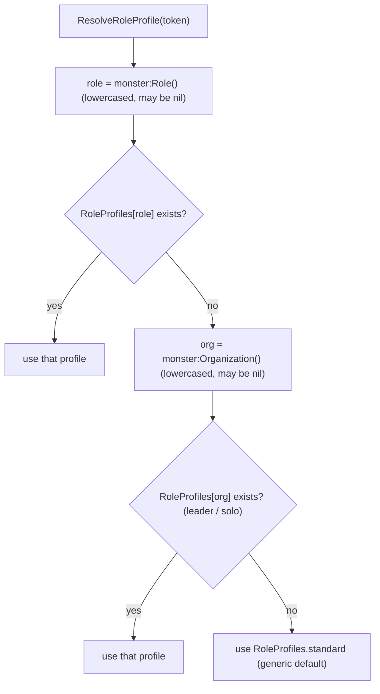

Only `leader` and `solo` are genuinely **organization-keyed** (reached via the second
tier); `brute`, `artillery`, `ambusher`, etc. are role-keyed (first tier). The `minion`
row does NOT resolve via the second tier: every Book Two minion is a two-word `Minion
<CombatRole>` string, so `Role()` returns the combat role (`ambusher`, `brute`,
`harrier`, ...) -- all tier-1 keys -- and the `minion` organization is never consulted.
The `minion` profile row is therefore **dead as written**, and its distinct doctrine
(flankWeight 1.6, "squad pressure and space control") never applies. P3.1 must decide:
drop the `minion` row, or, if a distinct minion doctrine is intended, special-case
minions to resolve `Organization()` (or the minion flag) BEFORE `Role()`.

A single flat `RoleProfiles` table serves both tiers, but the keys are NOT globally
disjoint: retainer organizations (`harrier`, `ambusher`, `hexer`, `defender`,
`controller`, `artillery`, `brute`, `support` -- all attested in `monster-reference.md`)
each collide with a role key. So a `Harrier Retainer` (Role() = `retainer`, no
tier-1 profile) would fall through to `RoleProfiles["harrier"]` at tier 2 and resolve to
the harrier profile, not the generic default. That collision is harmless only because
retainers are player-controlled and excluded from AI control (CLAUDE.md Lesson 11 /
`IsControllableMonster`), so `ResolveRoleProfile` is never called on them. The nil
fallback is always the `standard` profile -- never an error (Lesson: reading unset state
must not throw; use a plain table index with a default, no `try_get` needed on a local
Lua table).

#### Per-file scope

`WarmindScoring.lua`

- **`Scoring.RoleProfiles`** -- a local table literal, one entry per profile id from the
  reconciled source table (`standard`, `ambusher`, `harrier`, `artillery`, `brute`,
  `controller`, `defender`, `hexer`, `support`, `mount`, `leader`, `solo`, `minion`).
  Fields: `desiredRange`, `rangedDesiredRange` (optional), `rangeWeight`, `flankWeight`
  (optional), `avoidAdjacent` (optional), `protectAllies` (optional), `doctrine`
  (string, for trace readability). This is the single home for the seed constants
  (CLAUDE.md's file map already reserves "Role weight profiles land here (Stage 3)").
- **`Scoring.ResolveRoleProfile(token)`** -- the two-tier resolver above. Returns a
  profile table, never nil. Pure read; safe to call once per activation.
- **Role-aware tactic scaling.** The existing tactic-edge loop in
  `FindValidStrikeTargets` sums `tactic.score(tactic, ctx, token, tokenLoc, enemy,
  ability)` into `edges`. Stage 3 makes the tactics read `ctx.roleProfile`:
  - `flanking` tactic: multiply its edge by `profile.flankWeight`. Baseline doctrine
    value was `(profile.flankWeight or 0.8) * (2.5 + count*0.5)` -- the source
    (`DirectorTacticsPolicies.lua`) defaults a missing `flankWeight` to `0.8` for the
    flankWeight-less roles (artillery, controller, hexer, support, leader). Stage 3
    instead proposes treating missing as ~1.0 to preserve the Stage 2 flat baseline (no
    regression). Two candidate absent-defaults (source `0.8` vs proposed `1.0`) for the
    same field -- P3.1 picks one.
  - Ranged-adjacency penalty: Stage 2's hardcoded `-1` "pure ranged attacker within 1 of
    an enemy" term becomes `-adjacentCount * max(3, profile.avoidAdjacent or 0)` (source
    `ranged-safety` rule). Artillery (avoidAdjacent 6) recoils hard from adjacency;
    brute (no avoidAdjacent) is unaffected.
  - `high_ground` tactic: keep the source artillery bonus (`+1.2` for artillery ranged,
    `+0.5` when `profile.avoidAdjacent >= 3`).
- **Debuff target weighting** (deferred gap, see below): a `Scoring.DebuffTargetWeight`
  helper that ranks a target by how much a rider condition would hurt it (e.g. daze a
  high-action caster, slow a fast melee threat). It is a **target-only** function so it
  is legal inside the `FindBestStrikePosition` scorefn (Lesson 7: the scorefn is cached
  per `target.charid` across tiles and must not depend on attacker position -- a
  target-fragility/impact weight satisfies this; a positional preference does not).

`WarmindTurn.lua`

- In `Turn.PlayActivation`, after building `ctx`, set `ctx.roleProfile =
  Scoring.ResolveRoleProfile(token)` (and, if useful for trace, `ctx.organization =
  token.properties:Organization()`). This gives every spec, tactic, and prompt handler
  one shared profile read per activation rather than re-resolving. No change to the
  activation loop shape.

`WarmindSpecs.lua`

- **`reposition` spec** becomes role-aware standoff. Instead of a fixed melee-toward /
  ranged-standoff choice, target the tile nearest `profile.desiredRange` (or
  `rangedDesiredRange` for a ranged actor) from the nearest enemy: artillery seeks ~7
  tiles, hexer ~5, brute/harrier ~1. Still last-resort (only when no strike-bearing spec
  produced a candidate) and still `Adapter.MoveTo` only with `detail.moveOnly = true`.
- **Strike specs' target picker** (`signature_strike`, `forced_movement`, `grab`): feed
  a scorefn that adds `Scoring.DebuffTargetWeight` for abilities that inflict conditions,
  so a hexer/controller prefers the target where the debuff lands hardest (this is the
  "debuff target prioritization" gap -- a weighting, not a new spec).
- **`support_ally` spec (NEW; deferred gap)** -- category `main` (or `maneuver` per the
  ability's actionKind). Trait gate: an ally-beneficial ability (heal / grant temporary
  Stamina / buff). Score by ally need scaled by `profile.protectAllies` (leaders and
  supports weight this; brutes have none so it never fires for them). Execute: pick the
  most-in-need reachable ally, move if needed, cast with the ally as target. Requires a
  new "targets allies / heals / buffs" trait in `WarmindTraits.lua` (below). This spec is
  what stops Leaders and Supports from misplaying (the deferred-table rationale).
- **Placed-template handling (deferred gap)** -- Stage 2 explicitly leaves placed area
  templates ("N cube within M", lines) as fail-through (the `area_burst_if_n` gate
  `targetType == "all"` simply does not match). Stage 3 adds a `place_template` spec that
  reuses the Push!/Pull!/Slide! destination scorer (the same geometry-and-collision
  scoring) over the template footprint to choose where to drop the area, catching the
  most enemies and fewest allies. Whether this is a full spec in Stage 3 or a P3.1
  scope-cut depends on the census (below).

`WarmindPrompts.lua`

- **`Shift` handler** becomes role-aware (the piece Stage 2 explicitly deferred). Today
  the plan for Stage 2 scores shift tiles by `distanceFromNearestEnemy` (maximize) with
  a melee-with-main-action-unspent inversion (shift INTO reach). Stage 3 layers the
  profile on top: bias the shift target toward `profile.desiredRange` from the nearest
  enemy (artillery/hexer open distance to their band, brutes close, harriers retreat
  after attacking), and let `profile.avoidAdjacent` strengthen the away-from-adjacency
  pull for ranged roles. Still returns a `{targets = {{loc=...}}}`; still never yields.

`WarmindTraits.lua`

- New structured traits (structured-field detection only; degrade to nil, never guess
  from description text -- the Stage 2 Workstream-A discipline):
  - An ally-beneficial classifier for the `support_ally` spec: detect heal / temporary
    Stamina / beneficial-condition behaviors and ally targeting (`targetType`/filter
    routing through `IsFriendForTargeting`). P3.1 pins the exact behavior typenames.
  - A placed-template classifier for `place_template`: distinguish a placed area
    (`targetType` naming a placed cube/line "within M") from the self-centered burst
    Stage 2 already handles (`targetType == "all"`).

#### Deferred Stage 2 gap landing decisions

`STAGE2_PLAN.md`'s Deferred table assigns each gap a target stage. The roadmap **frames**
these landing decisions here; **P3.1 finalizes them with census evidence** from
`monster-reference.md`. Recommended landings:

| Deferred gap | Census weight (from STAGE2_PLAN) | Roadmap recommendation | Rationale |
|---|---|---|---|
| Placed area templates ("N cube within M", lines, walls) -- placement optimizer | ~100+ abilities | **Stage 3** | Highest-count deferred gap. The Push!/Pull!/Slide! destination scorer already computes exactly the "best square by enemy/ally collision and hazards" logic a template placer needs -- reuse it over the footprint. Big coverage win for controllers/hexers/artillery. |
| Ally heal / buff / temp-stamina (`support_ally` spec) | ~12-15% of abilities, 30 Leader blocks | **Stage 3** | The remit and the deferred table both say "Leaders misplay without it." Leader/Support role behavior is a Definition-of-done item for this very stage, so the enabling spec must ship here. Depends on `protectAllies` (restored per divergence #2). |
| Debuff target prioritization (daze the caster, slow the runner) | conditions ride on ~45-55% of abilities | **Stage 3** | Not a new spec -- a weighting inside the existing strike target picker (`Scoring.DebuffTargetWeight`). It is target-only, so it is legal in the cached scorefn (Lesson 7). It is the mechanism behind "hexer debuffs high-impact foes." |
| Zone / terrain / hazard creation (`place_zone` spec) | ~5-8% ordinary + heavy malice share | **Stage 4 (split out)** | Lower ordinary-ability count, and its value is dominated by the *malice* share that Stage 4's malice-spend policy owns. It sits naturally on top of the Stage 3 template placer but should not block Stage 3. STAGE2_PLAN already tags it "Stage 3/4"; the roadmap takes the Stage-4 fork (Stage 4 subsection (f) owns it). |

Gaps that stay past Stage 3 (unchanged from STAGE2_PLAN, listed so they are not
silently re-scoped): triggered actions/reactions beyond opportunity attacks -- the
reaction evaluator is deferred PAST Stage 4 to a post-Stage-4 workstream (P4.3 / early
Stage 5), matching the Stage 4 draft's explicit deferral, so Stage 3 does NOT imply the
reaction evaluator lands within Stage 4; solo/leader multi-action + malice + villain
actions (Stage 4 Director layer); post-strike self-shift riders (partial via the Shift
handler; pure-prose riders revisit in Stage 6).

### Key design decisions and risks

**Decision: profiles bias, they never override the scoring conventions.** Warmind's
score bands are fixed (0.2 generic free strike, 0.5-0.8 situational maneuver, 1.0
signature action, 1.5-2.5 high-impact/malice). Role weights only scale the per-position
`edges` sum (small +/-1-scale tactic terms) and the tie-break preferences (which tile,
which target), never the base candidate score of a spec. **Guardrail:** a role can never
make a 0.2 free strike outrank a 1.0 signature, nor make a maneuver outrank an attack it
should not -- the profile shifts *where* and *whom*, not *what action category wins*.
This keeps role behavior legible and prevents a monster from doing something silly
because a multiplier ballooned.

**Decision: port DATA, never code.** The `DirectorTacticsPolicies.lua` numbers were
tuned for a 28k-line framework that is dead on arrival (global registry, phase bus,
candidate mega-normalizer). Only the `RegisterRoleProfile{...}` field values and the
three tactic doctrines (flank weight, ranged-adjacency penalty, high-ground bonus) carry
over. No `AI:...` method, no `tacticRules` object, no profile-registration machinery is
imported -- the profiles are a plain Lua table in `WarmindScoring.lua`.

**Decision: seed values are starting points, not gospel.** Every number lands as a
tunable constant and is expected to move in playtest. Correctness is what a stage gate
buys: the seed-table wiring (which profile a role resolves to, that the numbers reach
the scorers unchanged) is [harness] -- caught by the review closure and asserted by the
L1 logic harness (pure scoring math). Quality -- does artillery actually keep its
band? -- is behavior-observable via an L4 live turn and in the panel trace during
natural play, not numeric-exact, and is tuned on demand via PD (the play debrief defined
in the Verification model section), never behind a gate.

**Risk: `Role()` returns nil on nonstandard role strings.** Confirmed concretely this
session: single-word org strings (`Solo`, `Leader`) and 3+ word strings (`Siege Engine
Artillery`) yield `Role() == nil`; minions return their *combat* role, not `"minion"`.
**Mitigation:** the two-tier `ResolveRoleProfile` (Role() -> Organization() ->
`standard`) covers exactly these cases -- Solo/Leader resolve by organization, unknown
strings fall to the generic default, and minions get their real combat role at tier 1.
(Because every minion role string is two words, `Role()` never misses for a minion, so
the `minion` organization is never reached and the `minion` profile row is dead as
written -- see the role-resolution section and the flags below.) The resolver returns a
profile unconditionally, so a weird role string degrades to generic play, never an error.

**Risk: unreachable / mis-valued seed keys (skirmisher).** Verified: a `"skirmisher"`
key can never be hit and its numbers are wrong. **Mitigation:** P3.1 rebuilds the table
from the reconciled source rows above (key `ambusher`, values 0.35/2.4/0.8), restores
`protectAllies`, adds `mount` and `standard`. Acceptance: every role string that
appears in `monster-reference.md` resolves to a non-default profile except the genuine
edge cases (Siege Engine, Retainer).

**Risk: score-scale inflation when role multipliers stack with tactic edges.** A high
`flankWeight` times a high flanking edge times a multi-target position could, unbounded,
swamp the base score. **Mitigation:** clamp the total tactic-edge contribution to the
established +/-1-per-tactic scale so the sum stays a tie-breaker band, not a score
override (the guardrail above). **Coverage:** the clamp is [static] -- the Stage 3
review closure checks that no tactic-edge path can exceed the band, and the guardrail
invariant (for every role a signature strike still beats a free strike; a role-favored
position wins only when base scores tie) is pure scoring math, asserted by the L1 logic
harness [harness].

**Risk: debuff weighting breaks the scorefn cache contract (Lesson 7).**
`FindBestStrikePosition` caches the scorefn result per `target.charid` across candidate
tiles, so the scorefn must depend only on the target. **Mitigation:**
`Scoring.DebuffTargetWeight(target, ability, ...)` reads target-only properties
(action economy, speed, current conditions) -- no attacker position. Positional role
preferences (desiredRange, avoidAdjacent) go through the per-tile tactic-edge path
instead, which is recomputed per tile and is the correct home for position-dependent
bias. Verification: a review-agent check that no positional term entered the scorefn.

**Risk: placed-template placement is a bigger lift than a bias.** Reusing the
Push!/Pull!/Slide! scorer over a footprint still needs footprint geometry and legality
per candidate origin. **Mitigation:** P3.1 sizes it against the census; if it does not
fit the Stage 3 diff cleanly it is cut to Stage 4 alongside `place_zone`, and Stage 3
ships role profiles + support_ally + debuff weighting (still a full, valuable stage).

Flags folded from the stage draft:

- **Seed table vs source divergence (correctness, high value for P3.1).** The CLAUDE.md
  "Stage 3/4 seed data" role table diverges from the actual `DirectorTacticsPolicies.lua`
  rows in five ways (detailed in "Source reconciliation" above): (1) `skirmisher` is not
  a Draw Steel role and its key is unreachable via `Role()` -- the real role is
  `ambusher`, and the seed also carries wrong numbers; (2) `protectAllies` (defender 1.6,
  support 1, leader 1) was dropped, though it drives two Definition-of-done behaviors;
  (3) the `mount` role was omitted; (4) the `standard` generic default was omitted though
  it is exactly the nil-fallback profile; (5) `rangedDesiredRange` was collapsed into the
  `desiredRange` prose. The seed table is reproduced above from CLAUDE.md, but these are
  load-bearing errors -- P3.1 (the plan) proposes the corrected table from the reconciled
  source rows, and the Stage 3 review-closure session (the split's final implementation
  session) lands the corrected seed section into CLAUDE.md.
- **CLAUDE.md `Role()` row is under-specified (doc gap).** The verified-surface Misc row
  says only "`monster:Role()` (lowercased, may return nil on nonstandard role strings)."
  The concrete behavior read this session is materially more useful and should be folded
  into CLAUDE.md at the Stage 3 review closure: `Role()` matches `^<word> <word>$` and returns the
  second word, so `Solo`/`Leader` (one word) and 3+ word strings return nil, and minions
  return their combat role (`Organization()` returns `minion`). This is why role
  resolution must fall back through `Organization()`.
- **Remit role list is missing `mount`.** The remit enumerates the seed roles as
  "brute/skirmisher/controller/defender/harrier/artillery/hexer/support/leader/solo/minion"
  -- inheriting the CLAUDE.md seed table's omission of `mount` (a real role) and its
  inclusion of the non-existent `skirmisher`. Recorded so the omission is a decision, not
  an oversight; P3.1 adds `mount` and drops `skirmisher`.
- **Two-tier resolver has a dead `minion` row and harmless retainer collisions (P3.1
  decision).** Every Book Two minion is `Minion <CombatRole>` (two words), so `Role()`
  returns the combat role at tier 1 and the `minion` organization -- and its distinct
  doctrine (flankWeight 1.6) -- is never reached; the `minion` profile row is dead as
  written. Separately, every retainer's organization word (`harrier`/`ambusher`/`hexer`/
  `defender`/`controller`/`artillery`/`brute`/`support`) collides with a role key, so a
  retainer would resolve to that role's profile at tier 2 -- harmless only because
  retainers are player-controlled and excluded via `IsControllableMonster` (Lesson 11),
  so `ResolveRoleProfile` is never called on them. P3.1 must decide whether to drop the
  `minion` row or special-case minions to resolve `Organization()`/the minion flag before
  `Role()`, and should note the retainer collision in the resolver's comment.

### Definition of done

Stage 3 is code-complete when, for every touched file: `luac -p` parses it and
`LC_ALL=C grep -nP '[^\x00-\x7F]'` returns nothing (L0); the L1 logic harness is extended
with role-profile fixtures (resolution + the guardrail invariant) and `lua "Draw Steel
Warmind/warmind_logic_tests.lua"` is green; a review agent has audited the stage diff
against `CLAUDE.md` and `STAGE3_PLAN.md` (not re-deriving the engine) and findings are
fixed; every new decision path emits a DecisionResult with a stable reason code; and
`CLAUDE.md` is updated with any newly verified engine API (notably the concrete
`Role()`/`Organization()` regex behavior) and lessons (L2). No git commit. The session
deploys the changed files into the mod store and confirms the automatic hot reload
(see the CLOSING), rather than producing a re-copy list.

Stage 3 flips to **DONE at the split's final implementation session's clean review
closure** -- the code-complete criteria above met for every touched file, that session's
adversarial review-agent audit of the stage diff passing with findings fixed, the CLAUDE.md
seed-table corrections (skirmisher -> ambusher, restore `protectAllies`, add `mount` +
`standard`, split out `rangedDesiredRange`) and the concrete `Role()`/`Organization()`
regex behavior landed in CLAUDE.md, and L3 deploy-and-probe clean (L4 recommended -- a live
role-behavior turn -- or an honest DEFERRED line). The architecture is fail-closed by design
(see the Verification model section): a wrong role assumption degrades to a clean
reason-coded hold or a manual prompt at the table, never a hang or corrupted state, so a
DEFERRED L4 is safe and PD (the on-demand play debrief) is the recourse during natural play.

The stage delivers these role behaviors -- each observable in the Warmind panel trace
during an L4 live turn and natural play (coverage tags in the Expected runtime behavior
block below):

- Artillery keeps its range edge and recoils from adjacency (never fires point-blank
  when a standoff tile exists).
- Brute closes into clusters and prefers flanking positions.
- Harrier strikes, then repositions/retreats toward its band.
- Defender stays near its fragile allies and interposes.
- Hexer/controller aims debuffs at the highest-impact foe (caster/runner), not the
  nearest body.
- Support preserves allies (heals/buffs the most in-need reachable ally when that beats
  attacking), and never fires the support spec for a role with no `protectAllies`.
- Placed-area monsters drop their template on the best footprint (max enemies, min
  allies) instead of failing through.

### Expected runtime behavior (agent-verified at the stage closure; see Verification model)

The Stage 3 review closure actively verifies these via the agent-driven levels; the rest
is observable in the Warmind panel trace during natural play. This expands the
ORIGINAL_PLAN Stage 3 checklist with the deferred-gap items chosen for this stage. Each
item carries a coverage tag (see the Verification model for meanings): [harness] =
asserted by an L1 fixture; [probe] = verified read-only via the L3 bridge probe; [live] =
requires an L4 live turn; [static] = caught by review/source; [fail-closed] = a wrong
outcome degrades to a clean reason-coded hold or manual prompt; [accepted-risk] =
quality-only degradation, observed in the trace and tuned later via PD.

- Role resolution: a `Minion Harrier` resolves to the harrier profile, an `Elite Brute`
  to brute, a `Solo` to the solo profile via Organization(), a `Leader` to the leader
  profile via Organization(), and an unusual string (e.g. `Siege Engine Artillery`)
  falls to the generic default without error. [harness] (`ResolveRoleProfile` is pure
  logic, asserted against a fixture of role strings) [fail-closed] (an unknown
  string resolves to the `standard` profile, never an error).
- Artillery monster: opens to roughly its desiredRange band, screens behind
  allies/terrain, and the ranged-adjacency penalty applies when a hero closes. [live]
  (band-keeping observed in an L4 turn) [accepted-risk] (positioning quality); the penalty
  term itself is [harness] scoring math.
- Brute monster: moves into a cluster and picks a flanking tile when one exists. [live]
  [accepted-risk] (positioning quality); the flanking edge scaled by flankWeight is
  [harness] scoring math.
- Harrier monster: takes its strike, then the reposition/Shift moves it away toward its
  band (hit-and-run), not toward the enemy. [live] [accepted-risk] (positioning quality).
- Defender monster: positions adjacent to / between its fragile allies. [live]
  [accepted-risk] (positioning quality); `protectAllies` entering the score is [harness] scoring math.
- Hexer/controller monster: a condition-inflicting strike targets the highest-impact foe
  (e.g. the caster) over a nearer low-impact one. [live] [accepted-risk] (target-choice
  quality); the `Scoring.DebuffTargetWeight` ranking is [harness] target-only math.
- Support/Leader monster with a heal or buff: fires `support_ally` on the most in-need
  reachable ally when that beats a strike; a brute with no `protectAllies` never fires
  it. [harness] + [fail-closed] for the gate (a role with no `protectAllies` cannot
  reach the spec); [live] [accepted-risk] for the "when that beats a strike" tuning.
- Placed-template monster (a "N cube within M" ability): drops the template on a
  footprint catching the most enemies / fewest allies. [live] [accepted-risk] (placement
  quality; the footprint scorer reuses the Push!/Pull!/Slide! geometry math, [harness]);
  [fail-closed] (if the placed-template classifier does not match, the ability fails
  through to the manual prompt / UNSUPPORTED hold instead of a bad drop).
- Role-aware Shift: during a mid-cast Shift prompt, the actor shifts toward its
  desiredRange band (artillery away, brute in), superseding the Stage 2 behavior. [live]
  [accepted-risk] (band-seeking quality); [fail-closed] (if the literal `"Shift"`
  prompt name does not match, the handler never fires and the engine shows the manual
  prompt -> UNSUPPORTED_COMPLEX_PROMPT hold -- verified against source in the implementing
  session, fallback shipped either way).
- Guardrail: for every role, a signature strike (1.0) still beats a free strike (0.2); a
  role bias only decides ties, never flips an action category. [harness] (pure scoring
  math -- the review closure checks the tactic-edge clamp, asserted directly).
- Regression: role weighting introduces no regression in the generic specs, squads, or
  prompt handlers. [harness] (the L1 logic harness covers the pure decision logic) [static]
  (the Stage 3 review closure's diff audit against the Stage 2 contracts).

### Kickoff prompts

Two prompts, both derived from `Draw Steel Warmind/PROMPTS.md`; each has its verification
parts modified per the roadmap Verification model (provenance noted under each). The
session flow is: **P3.1** runs first and writes `STAGE3_PLAN.md`; that plan defines the
real **P3.2+** implementation session split (which supersedes the P3.2 template below), and
the split's FINAL session closes with the adversarial review plus the agent-driven L3
(and recommended L4) that flips Stage 3 to DONE. So the named nodes in the Stage 3 session
flow are P3.1 -> P3.2(+), the last P3.2 session embedding the DONE-gate review -- matching
the Session map and every other stage's DONE gate under the Verification model. There is no
P3.V node; the runtime verification is done by the agent at the review closure, plus PD on
demand.

STAGE3_PLAN.md's session split must therefore end with a review-closure session (its DONE
gate), and the "in-app verification checklist" section STAGE3_PLAN.md would formerly have
authored becomes instead an **expected-runtime-behavior block** (agent-verified at the stage
closure) with the coverage tags described above -- mirroring this section's own reframing.
No paste-results debrief node is authored; the closure exercises the behaviors itself via
the bridge, and any later misbehavior in natural play files through PD.

#### P3.1 -- Write the Stage 3 plan

Prompt provenance: modified from the deleted PROMPTS.md P3.1 -- the "in-app verification
checklist" deliverable is replaced with an expected-runtime-behavior reference per the
roadmap Verification model, and the conventions pointer now targets this roadmap's Prompt
conventions section (PROMPTS.md deleted 2026-07-11). The Deferred-table read points at this
roadmap's Stage 2 section, since STAGE2_PLAN.md is deleted at P2.5 per the doc-lifecycle
convention. Everything else is verbatim.

```
Read "Draw Steel Warmind/CLAUDE.md" fully, then the Stage 3 section and the Stage 2 "Deferred
(census-measured gaps)" table of "Draw Steel Warmind/ROADMAP.md" (targeted reads of those sections
only; STAGE2_PLAN.md was deleted at P2.5 per the doc lifecycle). Stage 2 is DONE. Write
"Draw Steel Warmind/STAGE3_PLAN.md" with this structure and rigor
(what-exists table, census-driven priorities, per-workstream tables with detection/constants,
implementation order with delegation notes, an expected-runtime-behavior block (agent-verified at
the stage closure) with coverage tags per the roadmap Verification model, an L1-harness-fixtures
note for the new pure logic, ASSUMPTIONS, FLAGS).

Scope to decide and justify with census weight from monster-reference.md:
- Core (roadmap): role weight profiles -- the seed table in CLAUDE.md (salvaged from
  DirectorTacticsPolicies.lua) wired into scoring, the reposition spec, and the Shift handler
  (role-aware shifting was explicitly deferred from Stage 2). Decide where profiles live
  (CLAUDE.md says WarmindScoring.lua) and how roles resolve (monster:Role() may return nil).
- Deferred Stage 2 gaps -- decide which land in Stage 3 vs push to Stage 4, per the plan's own
  targets: placed area templates (reuse the Push! destination scorer over template footprints),
  support_ally heal/buff spec (Leaders misplay without it), debuff target prioritization (weighting
  inside the strike target picker, not a new spec), zone/terrain creation.
- End the plan with a session split (which workstreams per fresh chat) and the kickoff prompt for
  each, following the "Prompt conventions" section of "Draw Steel Warmind/ROADMAP.md".

Plan only -- no Lua changes this session. Doc style: exhaustive LLM reference, stable identifiers
(file/function/constant names, no line numbers), actual constant values inline, Mermaid + tables,
pure ASCII.
```

#### P3.2 -- Implement Stage 3 (template; the plan's own session split supersedes this)

Prompt provenance: modified from PROMPTS.md P3.2 -- adds the "review closure runs L3/L4 and
flips the stage DONE" clause and the L1 harness extension per the roadmap Verification model,
and swaps the re-copy list for the standard deploy-and-verify closing; the done-criteria are
otherwise verbatim.

```
Read "Draw Steel Warmind/CLAUDE.md" fully (including "Autonomous dev loop"), then "Draw Steel
Warmind/STAGE3_PLAN.md". Implement [workstream(s) per the plan's session split] exactly as specced;
everything else in the plan is out of scope this session. Same discipline as Stage 2:
trait/structured-field detection only, every decision path emits a DecisionResult, no new files,
luac -p + ASCII check per touched file (L0), extend the L1 harness "Draw Steel
Warmind/warmind_logic_tests.lua" with fixtures for any new pure logic (role resolution, scoring)
and run it green, review-agent audit of the session diff against the two docs, CLAUDE.md updated
with new verified APIs/lessons (L2). Do not commit. End with a diff summary. If this is the FINAL
session of the plan's split, its clean review closure flips Stage 3 to DONE: run L3 (deploy +
probe; L4 live role-behavior turn recommended, or an honest DEFERRED line), set the CLAUDE.md
Stage 3 row to DONE, and land the seed-table corrections (skirmisher -> ambusher, restore
protectAllies, add mount + standard, split out rangedDesiredRange) and the concrete Role()/
Organization() regex behavior into CLAUDE.md in the same session; OFFER the cloud commit
(m:CommitChanges) on the user's yes.

CLOSING - deploy and verify (autonomous loop; mechanics in CLAUDE.md "Autonomous dev loop"):
1. curl http://localhost:19876/health -s -m 5 - if the bridge is down, list the changed
   WarmindXxx.lua files and mark L3 (and L4 if this is the closure) DEFERRED in one honest line;
   stop here.
2. Deploy each changed WarmindXxx.lua by writing it into
   /Users/droideck/Library/Application Support/MCDM/Codex/mods/Warmind_be67/ (Write/Edit tool).
3. Confirm the automatic hot reload: tail Player.log for the "Local file changed ->
   RefreshLocalFiles -> reload success" chain and check no new errors; POST /reload only if the
   watcher did not fire.
4. Probe the changed subsystems read-only via POST /execute (L3) and report results.
5. CLAUDE.md is documentation - never deployed.
```

---

## Stage 4 -- Director layer (planned)

The Director layer is where Warmind stops thinking one monster at a time and starts
running the encounter: which group activates and in what order, when a stat-block
malice ability is worth its cost, and when a Leader or Solo spends the round's villain
action. It stays deliberately thin -- a handful of small functions in
`WarmindDirector.lua`, never a framework. The 2,200-line `DirectorTacticsResourceLedger`
and the flow-based `DirectorTacticsPipeline` -- part of a 15-file, ~28k-line framework --
are the explicit anti-pattern this stage refuses to recreate (design rule 1, "utility
selector, not a framework": no phase bus, no pipeline flows, no resource ledger).

### Status

Planned. Not started. Blocked on Stage 3 (role weight profiles) reaching DONE via its
review-closure gate (code complete + static checks clean + a review-agent audit of the
stage diff with findings fixed; see the Verification model section for the stage DONE
gate). Stage 4 begins with session P4.1 writing `STAGE4_PLAN.md`; no Stage 4 code is
written until that plan lands.

What exists on disk today (branch `tiny-monster-ai`, base commit 289c2bc) is the Stage 0/1 spine.
Stage 4's malice/villain policy ALSO depends on Stage 2 deliverables that are NOT yet on disk (Stage 2
is NEXT and unimplemented -- sessions P2.1 through P2.5 not yet run; P2.5, the stage review session, is
the Stage 2 DONE gate under the Verification model). The two are separated below so
the "on disk today" claim stays literally true; the Stage 2 rows are downstream dependencies that will
exist by the time Stage 4 actually runs, not current reality.

On disk today (Stage 0/1 spine that Stage 4 rewrites):

| Piece | State | Anchor |
|---|---|---|
| `Warmind.Director.ChooseActivation(queue)` | Stage 1 placeholder: picks the unmoved non-player entry whose tokens are closest to any player-controlled token; returns an initiativeid or nil | `WarmindDirector.lua` |
| Director call site | `SelectNextActivation(queue)` calls `Warmind.Director.ChooseActivation`, `queue:SelectTurn(choice)`, `dmhub:UploadInitiativeQueue()`, then `BeginTurn` + camera on the chosen entry | `WarmindPanel.lua` |
| Activation loop | `Turn.PlayActivation(token)` builds ctx (usedCategories, activeTactics, expectedPrompt), installs the prompt callback, runs `Turn.ActivationLoop` under `Warmind.Guard`; `Turn.PlayCurrentTurn` iterates the entry's tokens (squads via `Squads.PlayActivation`), honors `manualPending`, advances initiative via `GameHud.instance:NextInitiative` | `WarmindTurn.lua` |
| `villainAction` trait | ALREADY present (Stage 1): `Warmind.Traits.Get` sets `villainAction = ability:try_get("villainAction")` ("Villain Action 1\|2\|3"). The trait exists today; the spec-level SKIP that consumes it is a Stage 2 deliverable (below) | `WarmindTraits.lua` |
| Opportunity-attack dispatch | The panel thread already auto-dispatches only `trigger.text == "Opportunity Attack"` triggers between activations; no general reaction evaluator exists | `WarmindPanel.lua` |
| Reason codes | The Stage 0/1 scaffolding reason-code set (12 codes) is present in `Warmind.reason` (`UNSUPPORTED_SQUAD` is a live reason code the Stage 1 squad hold already emits via `Warmind.ResultHeld` in `WarmindSquads.lua`; its doc comment merely notes full squad behavior arrives in Stage 2); Stage 4 adds at most one or two (`MALICE_WITHHELD`, `VILLAIN_ACTION_HELD`, see Scope) | `WarmindCore.lua` |

Inherited from Stage 2 by the time Stage 4 starts -- NOT on disk at base commit 289c2bc (Stage 2 is
NEXT, unimplemented; per `STAGE2_PLAN.md`). `WarmindSpecs.lua` today ships only the two Stage 1
free-strike specs (`melee_free_strike`, `ranged_free_strike`) and has NO shared gates. Stage 4's
malice policy edits these Stage 2 gates; it does not create them:

| Piece | Stage 2 deliverable (not present today) | Anchor |
|---|---|---|
| `costsMalice` trait | Stage 2 adds a `costsMalice` trait to `Warmind.Traits.Get`, set by static payment-option detection (`resourceid == CharacterResource.maliceResourceId`). No `costsMalice` appears in any Warmind Lua file today -- only in the plan docs | `WarmindTraits.lua` (Stage 2) |
| Malice skip gate | Stage 2 generic specs SKIP any ability whose traits carry `costsMalice`, via a shared spec gate | `WarmindSpecs.lua` shared gates (Stage 2) |
| Villain skip gate | Stage 2 generic specs SKIP any ability whose traits carry `villainAction`, via the same shared spec gate (the `villainAction` trait itself already exists today -- see the Stage 0/1 table above) | `WarmindSpecs.lua` shared gates (Stage 2) |

Engine seams Stage 4 depends on -- re-verified against repo source THIS planning session
(cite these, do not re-derive in P4.2):

| Seam | Verified fact | Source |
|---|---|---|
| Malice pool (read) | `CharacterResource.GetMalice()` returns the global malice resource. `SetMalice(amount, message)` writes it (and carries a stray `print("SetMalice::", amount)` debug line -- harmless) | `Draw Steel Core Rules/DSResources.lua` |
| Villain-action per-encounter state | `VillainActionState.HasUsed(tokenid, villainActionKey)` -> bool; `MarkUsed(tokenid, villainActionKey)`; `ClearForToken(tokenid)` (clears ALL keys for a token); `ResetAll()`. Shared doc `dsVillainActions`, checkpoint-backed. Keys: tokenid = charid of the Leader/Solo, villainActionKey = the ability's `villainAction` field value | `Draw Steel Core Rules/DSResources.lua` |
| Villain-action per-round budget | `CharacterResource.GetVillainActions()` / `SetVillainActions(amount, note)`. The engine sets the budget to exactly 1 at `InitiativeQueue.NextRound` (alongside the malice gain), and the initiative bar enables the VA strip only while `GetVillainActions() > 0` | `Draw Steel Core Rules/DSResources.lua`, `MCDMInitiativeQueue.lua`, `MCDMInitiativeBar.lua` |
| Engine does VA bookkeeping | On a `villainAction` ability running to completion (not aborted), the cast coroutine itself calls `VillainActionState.MarkUsed(caster.charid, villainAction)` AND, if `GetVillainActions() > 0`, `SetVillainActions(0, "Villain Action used")`. This fires for ANY invocation path including AI casts | `DMHub Game Rules/ActivatedAbility.lua` (CastCoroutine, "Villain Action consumption") |
| Encounter reset | `VillainActionState.ResetAll()` is called from `InitiativeQueue.Create` (via `MCDMInitiativeQueue.lua`); `queue.round` is a live integer, `+1` each `NextRound` | `Draw Steel Core Rules/MCDMInitiativeQueue.lua` |
| LiveEncounter | `dmhub.initiativeQueue:try_get("liveEncounter")` -> `false` \| `nil` \| LiveEncounter table; read fields directly. Director-relevant reads listed in the LiveEncounter row of the CLAUDE.md verified surface: `CountLiveCombatants()`, `GetDefeatProgress()`, `IsSoloExhausted()`, `CountPendingReinforcements(numHeroes, org?)`, `GetAvailableWaves(round)` | `Draw Steel Core Rules/MCDMEncounter.lua` (per CLAUDE.md) |

### Scope

Stage 4 rewrites the Director layer and adds three small consult hooks in the turn
driver. No new Lua files (all targets exist and are registered in the DMHub module).
Stage 4 also owns one deferred Stage-2/3 gap -- the `place_zone` zone/terrain spec
(subsection (f)) -- which lands in `WarmindSpecs.lua` (with a zone classifier in
`WarmindTraits.lua`), reusing Stage 3's placed-template placement scorer. Every new
decision path emits a `DecisionResult` or a trace line with a stable reason code, per
the fail-closed rule.

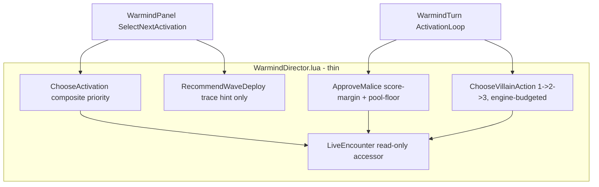

#### (a) Activation chooser -- `WarmindDirector.lua`

Replace the closest-to-player heuristic in `Warmind.Director.ChooseActivation(queue)`
with a composite priority over the unmoved non-player entries. Factor the scoring into a
helper, `Warmind.Director.ScoreEntry(queue, initiativeid)`, so it is testable and traceable.
Priority = weighted sum of the terms below; highest wins; keep a mild proximity term as
the final tiebreak so behavior stays sensible when the other terms are flat.

| Term | Meaning | How it reads | Seed weight |
|---|---|---|---|
| captainLeads | An entry that contains a squad captain (a non-minion whose squad has dependent minion entries) activates BEFORE those minion entries, so its orders/auras land before the squad strikes | `token.properties.minion == false` and the entry's tokens include a captain; cross-reference minion entries' `MinionSquad()` | W_CAPTAIN_LEAD = 2.0 |
| endangerment | Groups about to die act early (before they are removed). Endangered = low aggregate stamina fraction OR many adjacent player tokens | per-token stamina fraction < ENDANGER_STAMINA_FRAC = 0.35, or count of adjacent player tokens >= ENDANGER_ADJ_HEROES = 2 | W_ENDANGER = 1.5 |
| leaderHold | Hold a Leader/Solo entry for a high-impact window rather than leading with it (unless it is itself endangered). Applies a negative bias early in a round | entry token has a `villainAction` ability, or `monster:Organization()` in {"leader","solo"} | W_LEADER_HOLD = 1.0 (subtracted) |
| proximity | Tiebreak: closer-to-any-player entries edge out equals (preserves the old feel) | min token distance to any player-controlled token, negated | W_PROXIMITY = 0.05 |

An encounter-wide aggression scalar derived from LiveEncounter (see (d)) scales
`W_ENDANGER` up and `W_LEADER_HOLD` down when the monster side is behind: when losing,
press with endangered groups sooner and stop hoarding the Leader. When LiveEncounter is
absent (`false`/`nil`), aggression is neutral (scalar 1.0) and the chooser runs on the
board-state terms alone. All weights and thresholds are seeds, tuned in play exactly like
the Stage 3 role numbers.

#### (b) Malice spend policy -- `WarmindDirector.lua` + a shared-gate change in `WarmindSpecs.lua`

Unlock the `costsMalice` abilities that Stage 2 specs skip, gated so malice is spent only
when it clearly earns its cost and the pool keeps a floor. Two coordinated edits.

FORWARD DEPENDENCY: both edits presuppose Stage 2 has already added the `costsMalice` trait
(`WarmindTraits.lua`) and the shared spec skip-gate (`WarmindSpecs.lua`) -- neither exists at base
commit 289c2bc (see the Stage 2 inheritance table above). Stage 4 MODIFIES that Stage 2 gate; it does
not create it. If Stage 2 has not landed when Stage 4 begins, this whole subsection is blocked.

1. `WarmindSpecs.lua` shared gate: STOP unconditionally skipping `traits.costsMalice`.
   Malice-costing abilities now score into the normal candidate pool with their real
   score. KEEP skipping `traits.villainAction` (villain abilities are owned solely by the
   villain scheduler in (c), never by the free activation loop).
2. `WarmindTurn.lua` `ActivationLoop`: after ranking candidates, if the top candidate is
   malice-costing, consult `Warmind.Director.ApproveMalice(ctx, maliceCandidate, bestFreeCandidate, snapshot)`
   before executing. If approved, execute the malice candidate; if not, drop it and
   execute `bestFreeCandidate` (the best non-malice candidate). `bestFreeCandidate` is
   already available from the ranked list.

`ApproveMalice` is a few lines, no state, no ledger object:

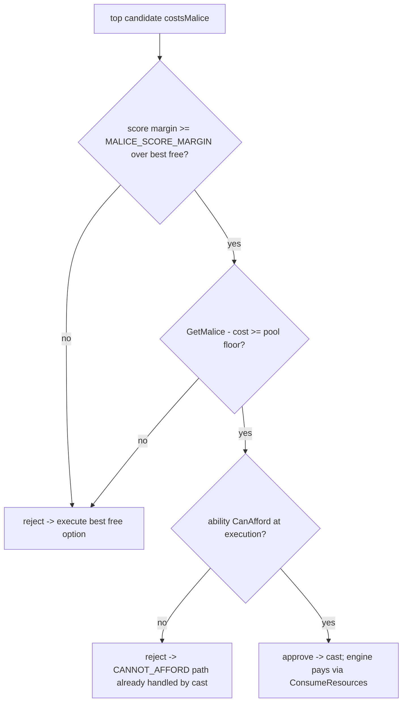

| Constant | Seed | Rationale |
|---|---|---|
| MALICE_SCORE_MARGIN | 0.5 | Malice must beat the best free option by a clear margin, not a rounding error. 0.5 is roughly the gap between a strong maneuver (0.5-0.8) and a signature (1.0) |
| MALICE_POOL_FLOOR | 2 | Never drain the pool dry on a single activation; keep reserve for villain actions and later rounds. P4.1 may scale the floor to encounter size (e.g. ceil(heroesAlive/2)) |
| AGGRO_DESPERATE_MARGIN | 0.3 | When LiveEncounter shows the monster side losing, loosen the margin (spend sooner) toward this value |

The cost of a malice candidate is read from the ability's cost payment option whose
`resourceid == CharacterResource.maliceResourceId` (the same static detection that sets
the `costsMalice` trait). The gate expresses INTENT only. `ability:CanAfford(token)`
remains the sole authority at execution time; if the two ever disagree, the cast path's
existing CanAfford check wins and the candidate is dropped with the standard reason code.
Malice reads go through `CharacterResource.GetMalice()`; Warmind never calls `SetMalice`
(the engine debits malice itself inside `ConsumeResources` when the ability casts).

Malice-gate seam name -- reconciled with Stage 6 (P4.1 unifies). Stage 6's override packs
consult ONE Director malice gate, `Warmind.Director.MayCommitMalice(ctx, ability,
candidate)`, the CANONICAL malice-policy seam. WHO CREATES it depends on stage order (the
Session map orders Stage 4 / P4.2 BEFORE Stage 6 / P6.1): in the roadmap default order
Stage 4 CREATES `MayCommitMalice` in `WarmindDirector.lua` with its full score-margin +
pool-floor body (above), and P6.1 finds it already present and registers no stub. ONLY when
Stage 6 is run ahead of Stage 4 via its Stage-2 min-dependency does P6.1 create the stub
(returning true) and **Stage 4 later fill that stub's body in place**. Either way, after
Stage 4 lands every override malice spec is governed by the same policy without touching the
packs -- override malice specs consult `MayCommitMalice` regardless of which stage created it.
`ApproveMalice(ctx, maliceCandidate, bestFreeCandidate, snapshot)` above is the loop-level
arbitration that only `WarmindTurn` can run (it needs the full ranked candidate set to
compare the malice candidate against the best free option). **P4.1 DECIDES** the exact
relationship and commits to ONE name across the Stage 4 malice section and the Stage 6
pack contract: whether the loop-level `ApproveMalice` IS `MayCommitMalice` (rename it),
DELEGATES to it (the per-spec gate stays a thin check the loop also calls after building
`bestFreeCandidate`), or SUBSUMES the per-spec gate (so, in the Stage-6-first order, the P6.1
stub becomes a thin wrapper / no-op that forwards to the loop-level gate after Stage 4). The
name `MayCommitMalice` is the one both stages commit to; do not ship two differently-named
malice gates.

#### (c) Villain scheduler -- `WarmindDirector.lua` + a consult in `WarmindTurn.lua`

When a Leader/Solo entry activates, decide whether it fires its next villain action.
`Warmind.Director.ChooseVillainAction(token, snapshot)` returns the ability to fire, or
nil. The two gates are already tracked by the engine; Warmind only READS them:

- Order + once-each-per-encounter: pick the LOWEST-index villain action the token has not
  yet used. For each candidate ability with `ability:try_get("villainAction")` in
  {"Villain Action 1","Villain Action 2","Villain Action 3"}, eligible only if
  `VillainActionState.HasUsed(token.charid, key) == false`. Iterate in ascending index so
  1 fires before 2 before 3.
- Max one per round across the whole encounter: eligible only if
  `CharacterResource.GetVillainActions() > 0`. The engine grants exactly 1 at
  `NextRound` and zeroes it when any villain action completes, so this single read
  enforces the per-round cap for the entire Director side. There is NO Warmind-maintained
  round counter.
- Affordability + timing: the chosen ability must pass `ability:CanAfford(token)`, and the
  moment must be high-impact. High-impact heuristic (seed): fire when
  round == 1 on the first Director activation (engagement), OR the ability can hit
  >= VA_MIN_IMPACT_TARGETS = 2 heroes from a reachable position, OR LiveEncounter reports
  desperation (see (d)). Otherwise return nil this activation and let the budget carry.

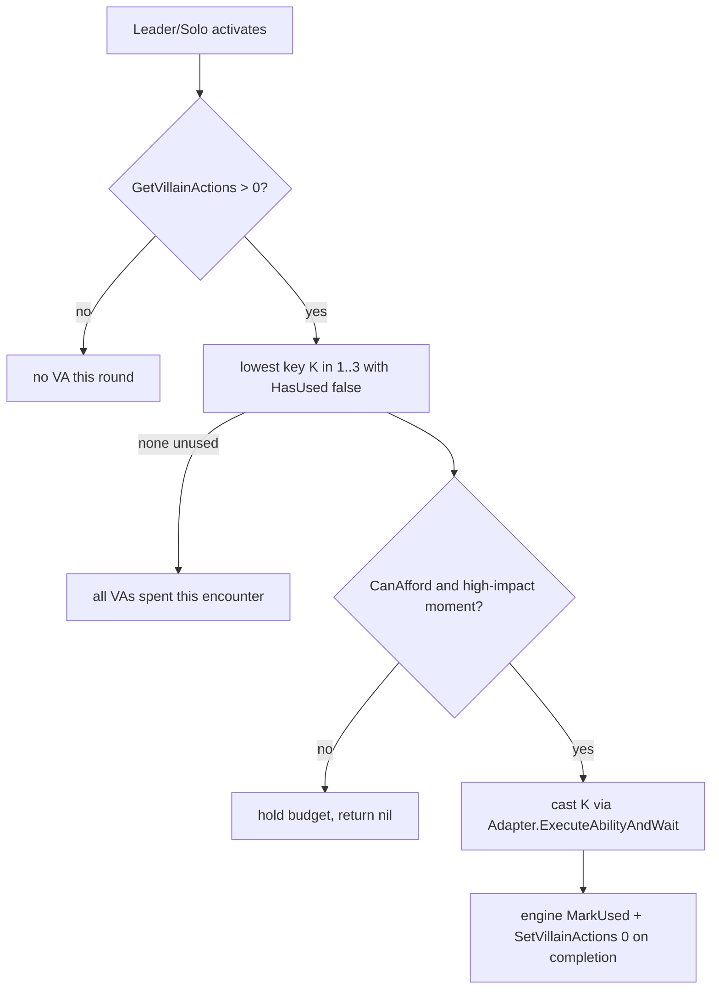

CRITICAL: Warmind NEVER calls `VillainActionState.MarkUsed` and NEVER calls
`SetVillainActions`. The engine's cast coroutine performs both on completion. Warmind
firing the ability through the normal cast path (`Adapter.ExecuteAbilityAndWait`) is
sufficient; maintaining a parallel copy of villain-action state is the exact
"never maintain a parallel copy" anti-pattern and would double-mark. The scheduler is a
read-only chooser plus one cast, wired into `WarmindTurn` alongside the malice consult so
a villain's activation can open with (or include) its villain action.

#### (d) LiveEncounter inputs -- read-only per Lesson 11

Add `Warmind.Director.LiveEncounter()` returning the table from
`dmhub.initiativeQueue:try_get("liveEncounter")` or nil when it is `false`/`nil`. Every
consumer degrades gracefully to neutral behavior when it is absent (encounters started
outside the LiveEncounter UI still play).

| Read | API | Feeds |
|---|---|---|
| Combatant counts | `le:CountLiveCombatants()` -> heroesAlive, monstersAlive | aggression scalar (a); wave-hint thinness test |
| Defeat progress | `le:GetDefeatProgress()` -> defeated, needed | aggression/desperation scalar (a, b, c) |
| Solo exhaustion | `le:IsSoloExhausted()` | flips a Solo to self-preservation posture (e) |
| Reinforcements | `le:CountPendingReinforcements(heroesAlive)` | wave-hint gate |
| Waves | `le:GetAvailableWaves(queue.round)` | wave-hint gate |

Aggression scalar (seed): derived from `GetDefeatProgress` and `CountLiveCombatants` --
when the monster side is behind (a high `defeated/needed` fraction against the monsters,
or `monstersAlive <= heroesAlive`), aggression rises toward "desperate", which raises
`W_ENDANGER`, lowers `W_LEADER_HOLD`, loosens the malice margin toward
`AGGRO_DESPERATE_MARGIN`, and satisfies the villain-action "desperation" timing branch.

Wave-deploy hint -- `Warmind.Director.RecommendWaveDeploy(queue)`: emit a TRACE HINT ONLY
when `CountPendingReinforcements(heroesAlive) > 0` AND `#GetAvailableWaves(queue.round) > 0`
AND the board is thin (`monstersAlive <= heroesAlive`). Trace text like
`[WAVE_HINT] N reinforcements available; consider DeployWave`. It returns nil and changes
nothing. Warmind NEVER calls `DeployWave` (director-only), NEVER sets `victoryAwarded`,
NEVER calls `TrackHeroStats` (engine callbacks track AI turns for free -- Lesson 11).

#### (e) Solo / Leader multi-action turns; reaction evaluator decision

- Multi-action: a Solo or Leader that the engine grants multiple initiative entries per
  round is naturally activated once per entry by the existing `Turn.PlayCurrentTurn`
  loop; the budget layer (`usedCategories` + `CanAfford`) already permits its full
  action economy per activation. No new loop is needed for the ordinary case.
- Solo self-preservation: when `le:IsSoloExhausted()` is true, the Solo's activation
  biases toward survival -- prefer reposition/standoff and defensive maneuvers over
  pressing melee. Implemented as a scoring bias fed from the snapshot (mirrors the Stage 3
  role-bias mechanism), not a new engine.
- Dazed-solo malice-relief extra action: the legacy ledger let a dazed solo reopen one
  action for malice >= 5. This is NOT implemented on faith -- it is a P4.1 verification
  task (see risks). Implement only if confirmed against the actual Draw Steel rules text.
- Reaction evaluator: RECOMMENDATION -- DEFER out of Stage 4. Rationale: (1) reactions
  live on a different seam (the trigger path: `creature:GetAvailableTriggers()` /
  `DispatchAvailableTrigger`, with their own `triggerResourceId` and heroic/epic cost
  gating), not the activation loop, so folding them in bloats the Director diff without
  sharing code; (2) the 148 triggered-action abilities (~12% census, per STAGE2_PLAN's
  deferred table) are their own self-contained workstream; (3) Stage 4's judgment surface
  (activation order + malice + villain actions + LiveEncounter + solo posture) is already
  large. Stage 4 keeps the current behavior: the panel thread auto-dispatches Opportunity
  Attacks only. The general reaction evaluator becomes its own follow-on workstream after
  Stage 4 (a natural P4.3 / early-Stage-5 item); STAGE4_PLAN.md should record the deferral
  explicitly so it is chosen, not forgotten. (Stage 3's "gaps that stay past Stage 3"
  phrasing matches this: the reaction evaluator is deferred PAST Stage 4, not into it.)

#### (f) Zone / terrain creation (place_zone) -- deferred-gap owner

STAGE2_PLAN tags zone/terrain/hazard creation "Stage 3/4"; the Stage 3 draft explicitly
FORKS it here, so Stage 4 OWNS it (a deferred gap must land in exactly one stage). Add a
`place_zone` spec as a P4.1-scoped workstream: it drops a persistent zone/terrain/hazard
template on the best footprint, catching the most enemies and fewest allies. Its BASE is
the Stage 3 placed-template (`place_template`) placement scorer -- the same
Push!/Pull!/Slide! geometry-and-collision logic evaluated over a footprint -- so
`place_zone` builds directly on top of it. Because a large share of zone value is the
MALICE cost that Stage 4's malice policy already owns, the zone spec sits here rather than
in Stage 3. Dependency note: if P3.1 CUTS placed templates from Stage 3 (a documented P3.1
scope-cut), that placed-template work ALSO lands in Stage 4 as `place_zone`'s base -- so
neither deferred gap is orphaned. P4.1 scopes `place_zone` (and, if cut from Stage 3,
`place_template`) together. This spec edits `WarmindSpecs.lua` (the spec) and
`WarmindTraits.lua` (a zone/terrain classifier), both existing files.

New reason code(s) to add in `WarmindCore.lua` if the plan needs them (P4.1 decides):
a `MALICE_WITHHELD` skipped-reason for traceability when the malice gate rejects, and a
`VILLAIN_ACTION_HELD` for when the scheduler holds the budget. Both optional -- the trace
line alone may suffice.

### Key design decisions and risks

| Decision | Rationale |
|---|---|
| Director stays a set of small functions, no ledger/pipeline | Design rule 1. The 2,200-line `DirectorTacticsResourceLedger` and the flow-based `DirectorTacticsPipeline` (a 15-file, ~28k-line framework) are the named anti-pattern; Stage 4's entire surface is `ChooseActivation`, `ScoreEntry`, the malice gate (`ApproveMalice`/`MayCommitMalice`, unified by P4.1), `ChooseVillainAction`, `RecommendWaveDeploy`, `LiveEncounter` |
| Malice gate is INTENT; `CanAfford` is AUTHORITY | Lesson 8 (budget = intent, CanAfford = authority). The gate only decides whether spending is worthwhile; the cast path's CanAfford still decides whether it is possible |
| Malice candidates re-enter the normal candidate pool; only the free-loop `costsMalice` skip is removed | Keeps one scoring path. "Beats the best free option" is a comparison across the full ranked candidate set, which only the activation loop has -- so the arbitration lives in `WarmindTurn`, not per-spec |
| One malice-gate seam name, canonical `MayCommitMalice` | Stage 6's packs consult `Warmind.Director.MayCommitMalice`. In the roadmap default order (Stage 4 before Stage 6, per the Session map) Stage 4 CREATES it with its real body and P6.1 finds it present; only if Stage 6 runs first (its Stage-2 min-dependency) does P6.1 add a stub that Stage 4 later fills in place. P4.1 unifies the loop-level `ApproveMalice` with it so there is exactly one malice policy, not two differently-named gates (see subsection (b)) |
| Villain scheduler is read-only; the engine marks/decrements on cast | Verified this session: `ActivatedAbility` CastCoroutine calls `MarkUsed` + `SetVillainActions(0)` on completion. Warmind reads `HasUsed` and `GetVillainActions`, fires the ability, and lets the engine do the bookkeeping -- no parallel copy of `dsVillainActions` |
| "Max 1 per round" reads `GetVillainActions()`, not a Warmind counter | Verified this session: `NextRound` sets the VA budget to 1 and casts zero it. The per-round cap is already engine-enforced; a Warmind round counter would be a redundant, drift-prone parallel copy. `VillainActionState` provides only the per-encounter once-each dimension |
| LiveEncounter is strictly read-only | Lesson 11. Never `DeployWave`, never `victoryAwarded`, never `TrackHeroStats`. Wave shortage surfaces as a trace hint the DM acts on |
| Reaction evaluator deferred | Different seam, self-contained scope, Stage 4 already large (see (e)) |

| Risk | Mitigation / verification plan |
|---|---|
| Dazed-solo malice-relief rule may not exist in Draw Steel | P4.1 TASK: verify against the actual Draw Steel rules text (and `monster-reference.md` / the engine's dazed handling) before planning it in. The CLAUDE.md seed explicitly flags it as unverified. Do NOT implement unless confirmed; if unconfirmed, drop it and note the omission |
| Malice gate and `CanAfford` disagree -> double-spend or a dropped-but-charged cast | `CanAfford` stays the execution authority; the gate never pays. If the gate approves but `CanAfford` fails at execution, the cast is not initiated and the loop falls to the best free option. The gate reads cost from the same static payment-option detection as the `costsMalice` trait, so the two stay consistent |
| Double-marking a villain action | Warmind must not call `MarkUsed`/`SetVillainActions`. Enforce by review: the only villain-action writes in the codebase remain the engine's CastCoroutine. Warmind's scheduler calls only `HasUsed` and `GetVillainActions` (reads) |
| `dsVillainActions` staleness across encounters | Reset is engine-owned (`ResetAll` from `InitiativeQueue.Create`). Warmind reads a fresh snapshot each decision; never caches the doc |
| CLAUDE.md villain row lists `ClearUsed(tokenid, key)` "single-key un-mark" that does not exist | Verified this session: DSResources has `ClearForToken(tokenid)` (clears ALL keys) and no single-key un-mark. Stage 4 needs neither. See the flags below; the correction is pre-applied in the plan doc by P4.1 (fence carries it) and folded into CLAUDE.md at the final P4.2 session's review closure (P4.1 is plan-only and touches no engine docs) |
| Activation chooser thrash (weights fight, order oscillates) | All terms are deterministic reads of current board state within one selection; the proximity tiebreak guarantees a total order. Seeds are tuned in natural play (via PD, the on-demand play debrief), not guessed at runtime; activation-order quality is an [accepted-risk] observable, not a gate |
| LiveEncounter absent (non-LiveEncounter combats) | Every consumer degrades to neutral (`try_get` -> nil -> aggression 1.0, no solo-exhaust bias, no wave hint). Verified nil-safe accessor pattern |

Flags folded from the stage draft:

- CLAUDE.md verified-surface villain-actions row lists `VillainActionState.ClearUsed(tokenid, key)`
  "(2026-07: single-key un-mark)". The actual `Draw Steel Core Rules/DSResources.lua` has NO
  `ClearUsed`; it has `ClearForToken(tokenid)`, which clears ALL keys for a token, plus `ResetAll()`.
  There is no single-key un-mark. Stage 4 needs neither, but the row is inaccurate -- the P4.1 fence
  carries the explicit instruction to correct it in the plan doc, and the final P4.2 session's review
  closure folds the correction into CLAUDE.md (P4.1 is plan-only and edits no engine docs).
- Neither the remit nor the CLAUDE.md villain row states that the ENGINE already performs
  `VillainActionState.MarkUsed` + `SetVillainActions(0)` on villain-action cast completion
  (verified this session in `DMHub Game Rules/ActivatedAbility.lua` CastCoroutine). This is
  load-bearing: Warmind's scheduler must be read-only. Recorded above; the final P4.2 session's review
  closure folds this into CLAUDE.md's villain row.
- The remit's (c) frames "max 1 per round across the encounter via
  VillainActionState.HasUsed/MarkUsed". VillainActionState has NO round dimension (it is per-token,
  per-key, per-encounter). The per-round cap is a separate engine mechanism: `NextRound` sets
  `CharacterResource.SetVillainActions(1)` and casts zero it, so "max 1/round" is read via
  `GetVillainActions()`, not via `VillainActionState`. The plan above uses the correct seams; P4.1
  should not try to derive the round cap from `VillainActionState`.
- `CharacterResource.SetMalice` carries a stray `print("SetMalice::", amount)` debug line (also
  noted in STAGE2_PLAN FLAGS). Harmless and upstream-owned; Warmind should read `GetMalice()` and
  never call `SetMalice` regardless (the engine debits malice via `ConsumeResources`).

### Definition of done

- `STAGE4_PLAN.md` exists (from P4.1) with the same structure and rigor as `STAGE2_PLAN.md`.
- `Warmind.Director.ChooseActivation` runs the composite priority (captain-before-squad,
  endangered-first, leader timing) and no longer uses closest-to-player alone.
- Malice-costing abilities are eligible again and fire only through the malice gate
  (`ApproveMalice`/`MayCommitMalice`, unified per P4.1: score margin + pool floor); they
  never overdraw and never leave the pool below the floor; `CanAfford` remains
  authoritative. The canonical `Warmind.Director.MayCommitMalice` seam carries this policy --
  created here (Stage 4) in the roadmap default order, or filling a P6.1 returns-true stub in
  place if Stage 6 ran ahead of Stage 4 -- so override malice specs inherit the same policy.
- The villain scheduler fires villain actions in 1 -> 2 -> 3 order, once each per encounter,
  at most one per round across the whole Director side, at high-impact moments; it reads
  state only and never marks/decrements.
- A Solo under `IsSoloExhausted()` plays self-preservation.
- A wave-deploy recommendation appears in the trace when reinforcements are available and
  the board is thin; nothing auto-deploys.
- The `place_zone` spec (zone/terrain/hazard creation) lands in Stage 4, reusing the
  Stage 3 placed-template placement scorer; if Stage 3 cut placed templates, that
  `place_template` base lands here too (subsection (f)).
- The reaction-evaluator deferral is recorded in `STAGE4_PLAN.md`.
- Every new decision path emits a `DecisionResult` or a stable-reason trace line.
- `luac -p` and `LC_ALL=C grep -nP '[^\x00-\x7F]'` pass on every touched file (L0); the L1
  logic harness is extended with fixtures for the new pure logic (malice score-margin /
  pool-floor gate, activation-score factorization, reason codes) and `lua "Draw Steel
  Warmind/warmind_logic_tests.lua"` is green; a review agent has audited the Stage 4 diff
  against CLAUDE.md and `STAGE4_PLAN.md`, with findings fixed; newly-used engine APIs are
  verified against repo source in-session (L2); CLAUDE.md is updated with any newly verified
  APIs/lessons AND the two villain-action corrections (the `ClearUsed` -> `ClearForToken`
  row fix, and the engine-does-VA-bookkeeping fold). No git commit.
- The Stage 4 row flips to DONE at the final P4.2 session's clean review closure (code
  complete + L0 + L1 + L2 above + the review-agent audit with findings fixed + L3 deploy-and-
  probe clean + L4 live villain-action turn, or an honest DEFERRED line), per the stage DONE
  gate in the Verification model section. The closure itself runs the agent-driven L3/L4;
  because the architecture is fail-closed (a wrong assumption degrades to a reason-coded hold
  or a manual prompt, never a hang or corrupted state), a DEFERRED L4 is safe. Runtime issues
  that surface during natural play are handled on demand by PD (the on-demand play debrief in
  the Verification model section) -- never a gate, never scheduled.

### Expected runtime behavior (agent-verified at the stage closure; see Verification model)

This is what Stage 4 should look like at the table, and the final P4.2 review closure
actively verifies it via the agent-driven levels. The bullets carry coverage tags (meanings
defined once in the Verification model section): `[harness]` = asserted by an L1
warmind_logic_tests.lua fixture; `[probe]` = verified read-only via the L3 bridge probe;
`[live]` = requires an L4 activation in a live encounter; `[static]` = caught by the
review-agent audit or source verification; `[fail-closed]` = a wrong outcome degrades to a
clean reason-coded hold or a manual prompt at the table; `[accepted-risk]` = quality-only
degradation, observable in the panel trace during natural play and tuned later via PD.
Reason-code terminal paths and the pure malice score-margin / pool-floor comparison are prime
L1 fixtures. Villain-action ordering/gating reads live engine state
(`VillainActionState.HasUsed`, `CharacterResource.GetVillainActions`, `GetMalice`), so it is
verified by an L3 probe / L4 live turn against real state rather than a faked engine.
If any of this misbehaves in later play, run PD -- do not add a gate.

- Multi-group encounter (a captain + its minion squad + a separate melee group):
  activation order is deliberate -- the captain's entry acts before its squad; the
  trace shows `ScoreEntry` terms per entry. [live] [accepted-risk] (ordering is a
  scoring-quality observable; the `ScoreEntry` factorization is [harness])
- A near-dead group (aggregate stamina below the endangered threshold or swarmed by
  players) activates earlier than a healthy group. [live] [accepted-risk]
- A Leader/Solo entry is held for impact early in a round (does not lead) unless it is
  itself endangered. [live] [accepted-risk]
- Malice ability with a clearly-better score fires; the trace shows the margin over
  the best free option and the pool before/after; the post-spend pool never drops
  below MALICE_POOL_FLOOR. [harness] (the pure score-margin + pool-floor comparison) [live]
  (the actual spend in a turn); `CanAfford` is the execution authority
- Malice ability that only marginally beats the free option is WITHHELD; the free
  option executes instead (trace shows the rejection). [harness] (same gating comparison)
  [live] (observed via the panel trace of a live turn)
- Malice never overdraws: even at a low pool, no cast is attempted when `GetMalice()`
  cannot cover it; the `CanAfford` gate is visible in the trace. [live] [fail-closed]
  (`CanAfford` is the sole spend authority; the gate only expresses intent)
- Villain action 1 fires before 2 before 3 across a multi-round encounter; each fires
  at most once per encounter; the VA strip / Character Inspector shows the same state
  Warmind acted on (no parallel-copy drift). [live] [probe] [fail-closed] (read-only
  scheduler over `VillainActionState.HasUsed`; the engine does the `MarkUsed` bookkeeping --
  a wrong read at worst holds the budget with `VILLAIN_ACTION_HELD`)
- At most one villain action per round across the whole Director side, even with
  multiple Leaders/Solos present (the shared `GetVillainActions()` budget enforces it).
  [live] [fail-closed] (single engine-owned per-round budget read; no Warmind round counter)
- Villain action fires at a high-impact moment (round-1 engagement, a >= 2-hero
  cluster, or a desperation swing), not on the first trivial activation. [live]
  [accepted-risk] ("sensible moment" is a timing-quality heuristic; holding is always safe)
- Solo with `IsSoloExhausted()` true: plays self-preservation (repositions/stands off)
  instead of charging in. [live] [accepted-risk]
- `place_zone`: a zone/terrain/hazard-creating monster drops its zone on the footprint
  catching the most enemies / fewest allies (reusing the Stage 3 template placer). [live]
  [accepted-risk] (footprint quality); the malice gate governs it when the zone costs malice. [harness]
- Wave-deploy hint appears in the trace when reinforcements are pending and the board
  is thin; NO wave auto-deploys, no victory auto-awards. [probe] (Lesson 11 review point:
  `RecommendWaveDeploy` returns nil and mutates nothing; the review audit confirms no
  `DeployWave` / `victoryAwarded` / `TrackHeroStats` call)
- Non-LiveEncounter combat (started outside the LiveEncounter UI): Director still
  chooses activations and spends malice/villain actions on board state alone, no errors.
  [probe] [fail-closed] (nil-safe `try_get` accessor -> neutral aggression, no solo-exhaust
  bias, no wave hint)
- Opportunity attacks still auto-dispatch; no general reaction firing (confirms the
  deferral). [static] (unchanged panel-thread behavior; the review audit confirms no new
  reaction evaluator was added)
- Stop mid-Director-turn: clean TAKEN_OVER_BY_DM, initiative not advanced, no stray
  `_tmp_aicontrol`, no half-marked villain action. [live] [fail-closed] (stop is always
  clean per Lessons 3-5; the engine, not Warmind, owns villain-action marking)
- Prior-stage behavior (Stages 1-3) still holds under the Stage 4 changes (regression).
  [harness] (the L1 harness covers the pure decision logic) [static] (the review-agent audit
  checks the Stage 4 diff for regressions against the earlier stages' contracts)

### Kickoff prompts

#### P4.1 -- Write the Stage 4 plan (Director layer)

Run this only after Stage 3 has reached DONE at its review-closure gate and its CLAUDE.md stage row
reads DONE (matching the Status section above). The prompt's opening "Stage 3 is DONE" states that
precondition for the session that runs it; it is not a claim about the current repo, where Stage 2 is
still NEXT.

```
Read "Draw Steel Warmind/CLAUDE.md" fully -- especially the Stage 3/4 seed data section (malice
timing heuristics, villain-action pacing) and the LiveEncounter row of the verified engine surface --
then "Draw Steel Warmind/STAGE2_PLAN.md" as the structural template you must match.
Stage 3 is DONE. Write "Draw Steel Warmind/STAGE4_PLAN.md" with the same structure and rigor as
STAGE2_PLAN.md. Scope per the roadmap:
- Activation chooser heuristics in WarmindDirector.lua: captain-before-squad, endangered-first,
  leader timing (replacing the Stage 1 closest-to-player chooser).
- Malice spend policy: score-margin + pool-floor gate per the seed heuristics -- a few lines in
  WarmindDirector, never a ledger object. Unlock the costsMalice abilities that Stage 2 specs skip.
- Villain scheduler: order 1 -> 2 -> 3, once each per encounter via VillainActionState, max 1 per
  round, aimed at high-impact moments. Verify the dazed-solo malice-relief rule against the actual
  Draw Steel rules text before planning it in (this is book/rules-text verification, not an in-app
  check). Apply the villain-action correction NOW while specing this (it also lands in CLAUDE.md at
  the final P4.2 review closure): the real API is `VillainActionState.ClearForToken(tokenid)`
  which clears ALL keys for a token -- CLAUDE.md's `ClearUsed(tokenid, key)` single-key un-mark is
  stale -- and the ENGINE itself calls `MarkUsed` + `SetVillainActions(0)` on villain-action cast
  completion, so the scheduler must stay READ-ONLY (never mark or spend, only read HasUsed /
  GetVillainActions).
- LiveEncounter inputs: CountLiveCombatants / GetDefeatProgress for aggression and activation
  order, IsSoloExhausted for solo self-preservation, CountPendingReinforcements + GetAvailableWaves
  for a "recommend wave deploy" trace hint only -- Lesson 11: cooperate with LiveEncounter, never
  drive it, never auto-deploy.
- Solo/Leader multi-action turns, and decide whether triggered actions/reactions (the deferred
  reaction evaluator) enter Stage 4 or wait.
End the plan with a session split and per-session kickoff prompts (each closing with the standard
deploy-and-verify block per the roadmap Prompt conventions). The Stage 4 DONE gate is the final
implementation session's clean review closure -- code complete + L0 (luac -p + LC_ALL=C
grep -nP '[^\x00-\x7F]') + L1 (the extended logic harness green) + L2 (source-verified APIs folded)
+ a review-agent audit of the diff against CLAUDE.md and STAGE4_PLAN.md (findings fixed) + CLAUDE.md
updated with the villain-action corrections above + L3 deploy-and-probe + L4 live villain-action turn
(or an honest DEFERRED line). Include an "Expected runtime behavior (agent-verified at the stage
closure; see Verification model)" section that tags each behavior [harness] / [probe] / [live] /
[fail-closed] / [accepted-risk] (mirror the same-named section in the roadmap Stage 4 section), an
L1-harness-fixtures note for the new pure logic, and state that later runtime issues in natural play
are handled on demand by PD, not by any gate. Plan only -- no Lua changes. Do not commit. Doc style:
exhaustive LLM reference, stable identifiers, constants inline, Mermaid + tables, pure ASCII.
```

Prompt provenance: modified from PROMPTS.md's P4.1 -- manual in-app verification replaced by
agent-driven L1/L3/L4 per the roadmap Verification model. Beyond that, this roadmap TIGHTENED the
prompt: it adds `STAGE2_PLAN.md` to the read list (the structural template the plan must match) and
an explicit "Do not commit". The Verification-model change REPLACES the former "emit a P4.V
verification-debrief prompt with a [paste checklist results] slot" requirement with the review-closure
DONE gate that itself runs L3/L4, plus an "Expected runtime behavior (agent-verified at the stage
closure)" section and a PD pointer. Use this version, not the PROMPTS.md original, which is superseded
here; PROMPTS.md was deleted 2026-07-11; this block is canonical.

#### P4.2 -- Implement Stage 4 (template; the plan's session split supersedes this)

```
Read "Draw Steel Warmind/CLAUDE.md" fully (including "Autonomous dev loop"), then "Draw Steel
Warmind/STAGE4_PLAN.md". Implement [workstream(s) per the plan's session split] exactly as specced;
everything else is out of scope. Same discipline as prior stages: DecisionResults everywhere, no new
files, luac -p and LC_ALL=C grep -nP '[^\x00-\x7F]' on every touched file (L0), extend the L1 harness
"Draw Steel Warmind/warmind_logic_tests.lua" with fixtures for any new pure logic (malice gate math,
activation scoring, reason codes) and run it green, verify any newly-used engine API against repo
source in this session (L2), and run a review-agent audit of this session's diff against the docs
(never re-deriving the engine) with findings fixed, then update CLAUDE.md with any newly verified
APIs/lessons. Do not commit. End with a diff summary.

On the FINAL Stage 4 implementation session only, once the review audit is clean: fold the two
villain-action corrections into CLAUDE.md's verified engine surface -- correct the
`VillainActionState.ClearUsed(tokenid, key)` row to the real `ClearForToken(tokenid)` (clears ALL
keys for a token; there is no single-key un-mark), and add that the ENGINE performs
`VillainActionState.MarkUsed` + `SetVillainActions(0)` on villain-action cast completion (so the
scheduler must stay read-only); run L3 (deploy + probe) and L4 (a live villain-action turn, or an
honest DEFERRED line); set the Stage 4 row in CLAUDE.md to DONE with today's date; and OFFER the
cloud commit (m:CommitChanges) on the user's yes. This clean review closure IS the Stage 4 DONE gate;
the closure itself runs the runtime verification. Earlier (non-final) sessions do not flip the row.
Later runtime issues in natural play are handled on demand by PD.

CLOSING - deploy and verify (autonomous loop; mechanics in CLAUDE.md "Autonomous dev loop"):
1. curl http://localhost:19876/health -s -m 5 - if the bridge is down, list the changed
   WarmindXxx.lua files and mark L3 (and L4 on the final session) DEFERRED in one honest line; stop
   here.
2. Deploy each changed WarmindXxx.lua by writing it into
   /Users/droideck/Library/Application Support/MCDM/Codex/mods/Warmind_be67/ (Write/Edit tool).
3. Confirm the automatic hot reload: tail Player.log for the "Local file changed ->
   RefreshLocalFiles -> reload success" chain and check no new errors; POST /reload only if the
   watcher did not fire.
4. Probe the changed subsystems read-only via POST /execute (L3) and report results.
5. CLAUDE.md is documentation - never deployed.
```

Prompt provenance: modified from PROMPTS.md's P4.2, which is a bare template carrying no in-app
content. This version expands it with the source-verification + review-agent-audit discipline and,
in the second paragraph, ABSORBS the final-session Stage 4 DONE-flip and the two villain-action
CLAUDE.md folds that the removed P4.V formerly owned -- reassigned here per the roadmap Verification
model (a stage's DONE gate and its CLAUDE.md corrections move to the final implementation session's
clean review closure; item 11 of the model). That reassignment is also stated in the P4.V-removed
note below. the deleted PROMPTS.md original survives only via this provenance note.

Supersession note: P4.2 is a TEMPLATE. When P4.1 produces `STAGE4_PLAN.md` with its own session
split and per-session kickoff prompts (following the prompt conventions, which under the
Verification model gate DONE on the final session's review closure, never on an in-app debrief),
those per-session prompts supersede this block -- run them instead, one fresh chat each. Use P4.2
verbatim only if the plan turns out to fit a single implementation session.

#### P4.V -- removed (was: Stage 4 in-app verification debrief)

REMOVED per the Verification model (user decision 2026-07-11: no manual in-app verification). There
is no P4.V session and no in-app verification debrief. The Stage 4 DONE gate is the final P4.2
session's clean review closure (see Definition of done and the P4.2 prompt above), which also folds
the two villain-action corrections into CLAUDE.md that P4.V formerly owned. The engine-truth
mechanism is source verification plus the adversarial review-agent audit, not a runtime checklist --
viable because the architecture is fail-closed (a wrong assumption degrades to a reason-coded hold or
a manual prompt, never a hang or corrupted state). If Stage 4 behavior misbehaves during natural
play, run PD (the on-demand play debrief authored in the Verification model section) -- it is never a
gate and never scheduled.

---

## Stage 5 -- Panel v2 (planned)

Stage 5 turns the DM-facing Warmind panel from a Stage 1 skeleton (status label,
one Start/Stop toggle, a flat 25-line trace label) into a control surface: step
mode (pause after each activation, resume with one click), a takeover button
(clean stop that honors the Lesson 4 contract), per-spec enable/disable toggles
that persist across DMHub restarts, and a proper decision-trace viewer over the
existing `Warmind.trace` buffer. The camera plumbing this stage nominally "adds"
(`dmhub.CenterOnToken` / `dmhub.SyncCamera`) already ships in the Stage 1 panel;
Stage 5's camera delta is a persisted "follow the AI" toggle that gates those
calls, not a new port.

**Ordering.** Stage 5 sits after Stage 4 in the roadmap order, but it depends on
nothing Stage 3 or Stage 4 build -- it is a pure panel/observability layer over
the Stage 1 thread contracts and the Stage 2 spec registry, so it is runnable any
time after Stage 2. The tradeoff:

- **Build it early (right after Stage 2).** Step mode + the trace viewer make
  every later diagnosis dramatically faster -- natural-play PD debriefs (the
  on-demand play debrief in the Verification model section) and Stage 3/4 tuning:
  you can single-step a Director turn and read the per-decision scores instead of
  watching a real-time blur. Per-spec toggles let you isolate a misbehaving spec
  during Stage 3/4 tuning.
- **Build it late (its roadmap slot, after Stage 4).** Keeps Stage 3/4 sessions
  focused on scoring and the Director layer; the panel is then built once against
  the final spec set (fewer spec ids churning in the toggle list).

The P5 kickoff prompt is written to be self-contained either way. Recommendation:
if observing Stage 2 behavior during natural play proves painful, pull Stage 5
forward; otherwise leave it in slot.

### Status

Everything below is **planned**. Nothing Stage-5-specific exists on disk beyond
the Stage 1 skeleton and a set of session-local (non-persisted) core hooks.

What exists today, by file:

| File | Present state relevant to Stage 5 |
|---|---|
| `WarmindPanel.lua` | Stage 1 skeleton. Module-locals `g_thread`, `g_terminate`, `g_status`, `g_starting`. `WarmindThread` polling loop (yield 0.1) with: `DispatchOpportunityAttacks`, `SelectNextActivation` (Director choice + `CenterOnToken`/`SyncCamera` + `Warmind.Sleep(1)`), `PlayCurrentTurn`, `CenterOnPlayers`, victory-screen idle (`g_status = "Victory screen"`), and `manualPending` auto-stop (sets `g_terminate`). UI: one status `gui.Label` (thinkTime 0.1), one Start/Stop toggle `gui.Button`, a "Decision trace" header label, and a flat `gui.Label` that polls `Warmind.trace.serial` (thinkTime 0.25) and shows the last 25 entries via `table.concat`. Registered through `DockablePanel.Register{ name = "Warmind", minHeight = 60, dmonly = true }`. |
| `WarmindCore.lua` | Already carries **session-local, non-persisted** per-monster spec disable machinery: `spec.disabledForMonsters` (a `monsterType -> true` set), `Warmind.SpecMatchesMonster(token, spec, includeDisabled)` (consults `disabledForMonsters` unless `includeDisabled`), `Warmind.IsSpecEnabledForMonster(monsterType, specId)`, `Warmind.SetSpecEnabledForMonster(monsterType, specId, enabled)`. The in-file comment reads "Persisted settings come with the Stage 5 panel work." Also present and reused by Stage 5: `Warmind.trace` (`entries`, `serial`, `maxEntries = 300`), `Warmind.Trace`, `Warmind.ClearTrace`, `Warmind.stopRequested` / `Warmind.RequestStop` / `Warmind.ClearStop`, `Warmind.Pace`, `Warmind.Sleep`, the `warmindpacing` setting (default 1), `Warmind.specList`, `Warmind.reason.NO_SUPPORTED_ACTION`, `Warmind.reason.TAKEN_OVER_BY_DM`. |
| `WarmindTurn.lua` | `Turn.ChooseCandidate` already gates each spec through `Warmind.SpecMatchesMonster(token, spec)` (no `includeDisabled`), so any disable that `SpecMatchesMonster` reports is automatically honored in candidate enumeration. `Turn.ActivationLoop` already emits `ResultHeld(NO_SUPPORTED_ACTION, ...)` when nothing applied -- the fail-open landing zone for "all specs disabled." `Turn.PlayCurrentTurn` returns `{ manualPending }` and does not advance initiative when stopped/manual. None of this needs restructuring. |

**Not built:** step mode (no step flag, no Continue button), any persisted
setting for toggles or step mode, any per-spec toggle UI, a distinct takeover
button, a scrollable/structured trace viewer, and a follow-camera toggle.

Dependency status: Stage 4 is **planned** (not done); Stage 2 is planning-complete
with implementation not started. Stage 5 can begin as soon as Stage 2 code exists
(P5 only needs the thread contracts, the trace buffer, and a registered spec set).

### Scope

Stage 5 is primarily `WarmindPanel.lua`. The P5 prompt authorizes extending the
`WarmindCore`/`WarmindTurn` contracts ("do not restructure them, extend them"), so
the enforcement of a **global** (all-monster) persisted spec toggle rides on a
minimal `WarmindCore` extension rather than a new gate inside the candidate loop.
No new files (DMHub-registered module constraint).

#### Per-file changes

| File | Change | Detail |
|---|---|---|
| `WarmindCore.lua` | Declare Stage 5 settings | `setting{ id = "warmindstepmode", description = "Warmind: pause after each activation (step mode)", storage = "preference", default = false, editor = "check" }`. `setting{ id = "warminddisabledspecs", description = "Warmind: spec ids the AI must not use", storage = "preference", default = {} }` (a `specId -> true` set). `setting{ id = "warmindfollowcamera", description = "Warmind: pan the camera to follow AI activations", storage = "preference", default = true, editor = "check" }`. |
| `WarmindCore.lua` | Global spec-disable helpers | `Warmind.IsSpecGloballyDisabled(specId)` -- **defensive** read of `warminddisabledspecs`: `pcall(dmhub.GetSettingValue, "warminddisabledspecs")`; if not a table, treat as empty (fail open = enabled). `Warmind.SetSpecGloballyDisabled(specId, disabled)` -- read-modify-write the set and persist via `dmhub.SetSettingValue("warminddisabledspecs", set)`. `Warmind.StepModeEnabled()` -- `dmhub.GetSettingValue("warmindstepmode") == true`, defaulting false on any non-boolean. |
| `WarmindCore.lua` | Extend `SpecMatchesMonster` | Add, before the existing `disabledForMonsters` check and only when `not includeDisabled`: `if Warmind.IsSpecGloballyDisabled(spec.id) then return false end`. This is why `Turn.ChooseCandidate` needs no edit -- it already calls `SpecMatchesMonster(token, spec)`. All-disabled therefore collapses to `ChooseCandidate` returning nil, which `ActivationLoop` already turns into `ResultHeld(NO_SUPPORTED_ACTION)`. |
| `WarmindPanel.lua` | Step-mode thread gate | New module-local `g_stepArmed = false`. Wrap the existing "not a player's turn" monster-activation block (`SelectNextActivation` / `PlayCurrentTurn`) so it runs only when `(not Warmind.StepModeEnabled()) or g_stepArmed`. Clear `g_stepArmed = false` immediately after a `PlayCurrentTurn` returns (one Continue authorizes exactly one initiative entry; the preceding `SelectNextActivation`, if needed, runs under the same authorization). When step mode is on and not armed, set `g_status = "Paused (step); press Continue"`. |
| `WarmindPanel.lua` | Continue button | New `gui.Button{ text = "Continue" }` that sets `g_stepArmed = true`. Enabled/visible only while the thread is alive, step mode is on, not armed, and `not g_terminate` (a `refreshai`/`think` handler toggles a `disabled`/`collapsed` class). It never starts a thread (that is Start's job) and never touches `g_starting`. |
| `WarmindPanel.lua` | Takeover button | New `gui.Button{ text = "Takeover" }`, visible while the thread is alive, that calls `Warmind.RequestStop()` and sets `g_terminate = true` -- byte-for-byte the same path the running-state Start/Stop button already takes. It is the DM-facing "I will finish this by hand" affordance and works from a step pause (the thread is suspended-but-alive during a pause, so it observes `g_terminate` on its next loop). |
| `WarmindPanel.lua` | Step-mode toggle | `gui.Check{ text = "Step mode", value = <warmindstepmode> }`; `change` calls `dmhub.SetSettingValue("warmindstepmode", element:GetValue())`. Reflect external changes with `monitor = "warmindstepmode"` + `events.monitor` (UI_BEST_PRACTICES "Monitoring Data Changes": `monitor = id` watches settings). |
| `WarmindPanel.lua` | Per-spec toggle list | One row per spec in `Warmind.specList` (registration order): a `gui.Check` labeled `spec.name`, `value = not Warmind.IsSpecGloballyDisabled(spec.id)`, `change` -> `Warmind.SetSpecGloballyDisabled(spec.id, not element:GetValue())`. Build the rows once (do not rebuild per frame -- UI_BEST_PRACTICES "Avoid Recreating Panels"); refresh checkbox values via `monitor = "warminddisabledspecs"` + `events.monitor`. Optionally group under a collapsible section (`gui.ExpandoArrow`) since the spec list holds ~9 specs after Stage 2 (2 free-strike specs today + 7 added by Stage 2). |
| `WarmindPanel.lua` | Trace viewer | Replace the flat trace `gui.Label` with a `vscroll = true` container of per-entry rows (or a taller multi-line label) reading `Warmind.trace.entries`. Keep the existing polling pattern: a `think` handler at `thinkTime = 0.25` that early-returns unless `Warmind.trace.serial` changed (UI_BEST_PRACTICES "Periodic Work with thinkTime"). `Warmind.trace` is an in-memory buffer, **not** a shared document, so `monitorGame`/`refreshGame` do not apply -- serial-polling is correct. Scores and reason codes are already inside each `entry.text` (e.g. `"  considered signature_strike: score 1.00"`, and, when the DM takes over mid-run, `"[TAKEN_OVER_BY_DM] Turn interrupted; not advancing initiative."`), so no new structured trace fields are required. (Not every reason code reaches the trace buffer: `Turn.ActivationLoop`'s `choice == nil` branch appends `ResultHeld(NO_SUPPORTED_ACTION)` to `ctx.results` but does not `Warmind.Trace` it -- codes that DO surface come from `Warmind.DescribeResult` in the per-spec line, the decision-cap `BUDGET_EXHAUSTED`, `EXECUTION_ERROR`, `TAKEN_OVER_BY_DM`, and the Stage 5 "specs disabled" line below.) Add a "Clear" `gui.Button` calling `Warmind.ClearTrace()`. Auto-scroll to the newest entry when the serial advances. |
| `WarmindPanel.lua` | Disabled-spec trace line | So the DoD's "trace shows it skipped" is literally satisfiable, emit one `Warmind.Trace("specs disabled: %s", ...)` line when an activation begins and at least one spec is globally disabled. Simplest locus that avoids restructuring: the panel's `SelectNextActivation` (already the per-activation entry point) after the Director picks a group. This keeps the line inside `WarmindPanel.lua`, honoring the P5 boundary that forbids touching `WarmindTurn.lua`. |
| `WarmindPanel.lua` | Follow-camera gate | Guard the existing `CenterOnToken`/`SyncCamera` calls in `SelectNextActivation` and `CenterOnPlayers` with `if dmhub.GetSettingValue("warmindfollowcamera") ~= false then ...`, and expose the `warmindfollowcamera` toggle as a `gui.Check`. Default true preserves current behavior. |
| `WarmindPanel.lua` | Panel chrome | Bump `DockablePanel.Register` `minHeight` from 60 to accommodate the new controls. Set `borderBox = true` on every panel/row that uses `hpad`/`vpad`/`pad` (repo CLAUDE.md + UI_BEST_PRACTICES "Spacing"). Forward-declare any self-referencing panel local (repo CLAUDE.md): the toggle-list container, the trace scroll region, and any button whose handler references a sibling. |

#### Constants and identifiers introduced

- Settings: `"warmindstepmode"` (default `false`), `"warminddisabledspecs"`
  (default `{}`, a `specId -> true` set), `"warmindfollowcamera"` (default `true`).
  All `storage = "preference"`.
- Core functions: `Warmind.IsSpecGloballyDisabled(specId)`,
  `Warmind.SetSpecGloballyDisabled(specId, disabled)`, `Warmind.StepModeEnabled()`.
- Panel module-local: `g_stepArmed` (boolean, one-shot Continue permission).
- Reused existing: `g_thread`, `g_terminate`, `g_status`, `g_starting`,
  `Warmind.RequestStop`, `Warmind.ClearStop`, `Warmind.stopRequested`,
  `Warmind.ClearTrace`, `Warmind.trace.serial`, `Warmind.trace.entries`,
  `Warmind.trace.maxEntries` (300), `Warmind.specList`,
  `Warmind.reason.NO_SUPPORTED_ACTION`, `Warmind.reason.TAKEN_OVER_BY_DM`,
  `dmhub.GetSettingValue`, `dmhub.SetSettingValue(settingid, val, lockValue)`
  (Definitions/dmhub.lua), `dmhub.CenterOnToken(charid, {smooth = true})`,
  `dmhub.SyncCamera{ speed = 1 }`, `DockablePanel.Register`, `gui.Check`
  (`value`, `GetValue()`, `SetValue(val, firechange)`, `change`), `gui.Button`,
  `vscroll = true`, `thinkTime`, `monitor` + `events.monitor`.

#### Extended thread loop (step gate)

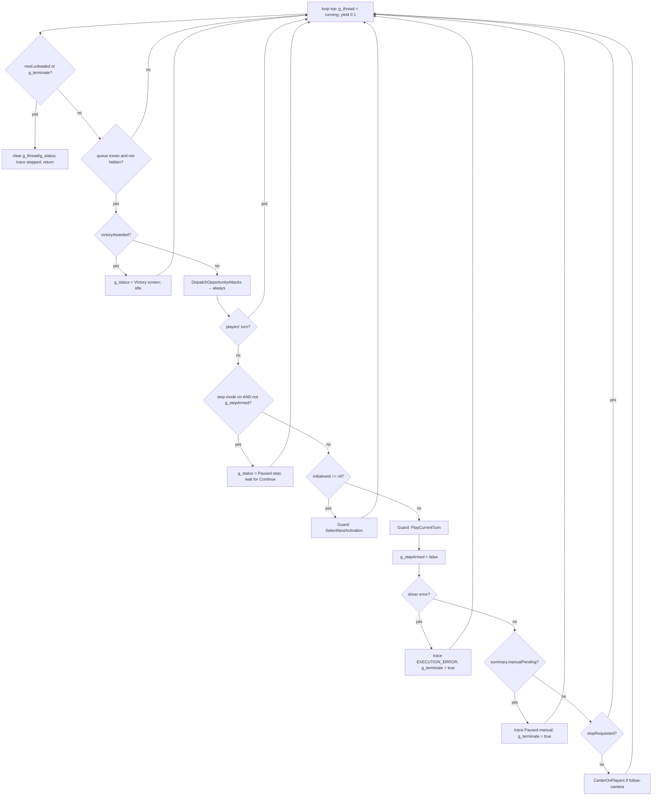

The only new node is `H` (the step gate), inserted **after** opportunity-attack
dispatch and the players'-turn check, and **before** the select/play block. Every
pre-existing exit (`B`, `D`, `N`, `P`, `R`) keeps its position and precedence.

#### Panel state model

| Control | Visible / enabled when | Action |
|---|---|---|
| Start / Stop AI (existing) | always | not running -> Start (`g_starting = true`, `g_terminate = false`, `Warmind.ClearStop()`, `dmhub.Coroutine(WarmindThread)`); running -> Stop (`g_terminate = true`, `Warmind.RequestStop()`). |
| Takeover (new) | thread alive | `Warmind.RequestStop()` + `g_terminate = true` (same contract as Stop). |
| Continue (new) | thread alive AND step mode on AND not `g_stepArmed` AND not `g_terminate` | `g_stepArmed = true`. |
| Step mode (new, `gui.Check`) | always | persist `warmindstepmode`. |
| Follow camera (new, `gui.Check`) | always | persist `warmindfollowcamera`. |
| Per-spec checks (new) | always | persist `warminddisabledspecs` per spec id. |
| Clear trace (new, `gui.Button`) | always | `Warmind.ClearTrace()`. |
| Trace viewer (upgraded) | always | polls `Warmind.trace.serial`; renders `Warmind.trace.entries`. |

### Key design decisions and risks

**Decision -- step granularity is one initiative entry, not one token.** One
"step" = one `PlayCurrentTurn` (which plays every token in the current initiative
entry: a lone monster or a whole squad). This matches "step through a full
Director turn one activation at a time" and, crucially, requires **zero**
restructuring of `Turn.PlayActivation`/`PlayCurrentTurn` -- the pause lives
entirely in the thread loop between entries. Finer per-token stepping inside a
multi-token entry is deliberately out of scope: it would require splitting the
turn driver, which the P5 prompt forbids ("do not restructure them, extend them").

**Decision -- `g_stepArmed` is a one-shot consumed only on play.** The arm covers
`SelectNextActivation` + the single following `PlayCurrentTurn`, then clears. It
is cleared in the play branch (regardless of `manualPending`) so a single Continue
never runs a second entry. Risk: if the arm were cleared on selection instead, the
play iteration would re-block and the entry would never resolve; if it were never
cleared, step mode would silently run continuously. Coverage: the one-shot arm/clear
is pure loop logic, audited by the P5 review agent against this plan; a wrong
arm/clear degrades to a clean stop or a stuck-but-safe pause the DM can Takeover out
of, never a corrupted turn ([fail-closed]). The Expected runtime behavior
reference below records the single-entry-per-Continue behavior for natural play.

**Decision -- global spec disable is enforced by extending `SpecMatchesMonster`,
not by a new gate in the candidate loop.** `Turn.ChooseCandidate` already calls
`SpecMatchesMonster(token, spec)`, so adding one line there (return false when
`Warmind.IsSpecGloballyDisabled(spec.id)`) makes disabled specs invisible to
enumeration with no `WarmindTurn` edit and no risk of double-tracing per iteration.
It also composes cleanly with the pre-existing session-local `disabledForMonsters`
mechanism, which is left intact as an orthogonal, finer-grained (per-monster-type,
non-persisted) control.

**Risk -- fail open. A malformed persisted setting must never brick the turn
loop.** `Warmind.IsSpecGloballyDisabled` reads through
`pcall(dmhub.GetSettingValue, ...)` (a non-yielding read, so pcall is allowed per
Lesson 1) and treats nil / non-table / read error as "empty set = everything
enabled." Consequences that must hold (audited by the P5 review agent; a wrong
outcome degrades to a clean reason-coded hold, [fail-closed]):
- If **every** spec is disabled, `ChooseCandidate` returns nil and
  `ActivationLoop` emits `ResultHeld(NO_SUPPORTED_ACTION)` -- a clean hold, never a
  Lua error. (If the `reposition` move-spec is left enabled, the monster
  repositions instead; also clean.)
- A corrupt `warminddisabledspecs` value must not raise inside the activation's
  `Warmind.Guard`; the defensive read guarantees it degrades to "all enabled."

**Risk -- does a table value round-trip through `storage = "preference"`?** The
only setting the module persists today (`warmindpacing`, default 1) stores a
scalar. `dmhub.SetSettingValue(settingid, val, lockValue)` types `val` as `any`,
but a `specId -> true` table has not been round-trip-verified for preference
storage. Resolution under the Verification model: in P5, verify against repo SOURCE
how `storage = "preference"` serializes a setting value (an L3 bridge probe can also
confirm the chosen shape round-trips at runtime) (the
`setting{}` / preference plumbing in the DMHub Core files) -- does it round-trip a
table, or only scalars/strings? If source proves table round-trip, keep the table
shape. If source is inconclusive or shows scalar/string-only, SHIP THE FAIL-CLOSED
FALLBACK: store a delimited **string** of disabled spec ids (spec ids are lowercase
identifiers with no delimiter, e.g. `"signature_strike|grab"`) parsed on read -- the
`IsSpecGloballyDisabled`/`SetSpecGloballyDisabled` helpers absorb the shape change and
nothing else moves. Either way the read stays defensive (a malformed stored value
degrades to "all enabled"). Record the chosen shape and the source finding in
CLAUDE.md's verified surface at the P5 review closure. This item is [accepted-risk]:
a wrong persistence shape re-enables specs after a restart (quality only), never a
Lua error.

**Risk -- the panel thread contracts must be EXTENDED, never restructured.** The
load-bearing contracts and the invariant each Stage 5 addition must preserve:

| Contract | What it does today | Stage 5 extension | Invariant that must not break |
|---|---|---|---|
| `g_terminate` (panel-local) | Checked at loop top; set on unload, driver error, `manualPending`, and Stop/Takeover click | Step gate (`H`) sits after the `g_terminate` check; Continue never clears `g_terminate` | Stop/unload always wins over a step pause -- the pause loop is just the normal `yield 0.1` loop, which re-checks `g_terminate` every pass. Do not add a blocking wait that skips the top-of-loop check. |
| `g_starting` (panel-local) | Guards against `dmhub.Coroutine`'s async start so two quick clicks cannot start two threads | Continue and Takeover must not start a thread and must not touch `g_starting`; only Start does | Exactly one live `WarmindThread`. Continue operates on the already-running thread. |
| `Warmind.stopRequested` / `RequestStop` / `ClearStop` (Lesson 4) | Takeover contract: checked between decisions, between tokens, in cast-wait loops; on stop release control + leave initiative untouched | Takeover button routes through `RequestStop()`; `ClearStop()` still runs only on a fresh Start | A step pause must still honor a stop request -- because the pause is the normal poll loop, `g_terminate` (set alongside `RequestStop`) breaks it. No new "resume" path may bypass `stopRequested`. |
| `manualPending` auto-pause (Lesson 3) | `PlayCurrentTurn` returns `{ manualPending }`; the thread sets `g_terminate` so the DM finishes by hand and initiative is not advanced | Ordered BEFORE the step gate's re-arm: a `manualPending` turn ends the run (`g_terminate`), it does NOT become a step pause | A manual outcome never silently re-arms or advances initiative; step mode does not swallow it. |
| Victory-screen idle (Lesson 11) | While `liveEncounter.victoryAwarded`, `g_status = "Victory screen"`, no acting | Step gate lives inside the `not victoryAwarded` branch; the victory idle path is untouched | Never act (select/play) under the victory screen, step mode or not. |

**Risk -- UI discipline (repo CLAUDE.md + UI_BEST_PRACTICES.md + DefaultStyles.md;
theme-engine-discipline skill).** Concretely for this panel:
- `borderBox = true` on every panel/row that sets `hpad`/`vpad`/`pad`
  (UI_BEST_PRACTICES "Spacing"; repo CLAUDE.md).
- Theme tokens/classes only -- no hardcoded colors (DefaultStyles). Muted text via
  `fgMuted` or the `{fgDisabled}` class for a disabled row; status coloring via the
  ready-made `{success}`/`{danger}`/`{bgInfo}` classes if the trace viewer color-
  codes executed vs held lines. Dock chrome uses the Section 6 dockable-panel
  cascade; do not add component-specific selectors to `DefaultStyles.lua`.
- `monitor = <settingId>` + `events.monitor` to reflect external setting changes on
  the checkboxes; `thinkTime` serial-polling (not `monitorGame`) for the in-memory
  trace buffer (UI_BEST_PRACTICES "Monitoring Data Changes", "Periodic Work with
  thinkTime").
- Forward-declare self-referencing panel locals (repo CLAUDE.md) -- the trace scroll
  container, the toggle-list container, and any button whose handler references a
  sibling panel.
- Build the per-spec rows once; update values in place (UI_BEST_PRACTICES "Avoid
  Recreating Panels").
- Use `gui.Button` (not deprecated button variants) and `gui.Check` for toggles
  (UI_BEST_PRACTICES "Button Controls" / "Selection Controls").

**Risk -- camera work is already done.** `dmhub.CenterOnToken`/`dmhub.SyncCamera`
are wired in the Stage 1 panel. Stage 5 must not re-port them; it only adds the
`warmindfollowcamera` gate. (See the flags below: the ORIGINAL_PLAN wording "port
CenterOnToken/SyncCamera behavior" is stale.)

**Risk -- keep step mode from stranding opportunity attacks.** The step gate sits
after `DispatchOpportunityAttacks`, so opportunity attacks keep firing while the
DM is paused between activations. This is a structural guarantee [static]: node
`F` (dispatch) precedes node `H` (the step gate) in the loop flowchart, so a player
moving past a paused monster still triggers the OA path unchanged.

Flags folded from the stage draft:

- **P5's missing out-of-scope list -- RESOLVED 2026-07-11.** The original PROMPTS.md P5
  prompt lacked the conventions' required explicit out-of-scope list; while PROMPTS.md was the
  read-only verbatim source, a paste-alongside supplement covered the gap. PROMPTS.md is deleted
  and this roadmap owns the prompt, so the boundary and the two must-know items are folded
  directly INTO the P5 fence below -- one self-contained block.
- **ORIGINAL_PLAN Stage 5 says to "port CenterOnToken/SyncCamera behavior."** That
  is stale: both are already wired in the Stage 1 `WarmindPanel.lua`
  (`SelectNextActivation`, `CenterOnPlayers`). Stage 5's only camera work is the
  persisted `warmindfollowcamera` gate, not a port. CLAUDE.md (which wins) lists both
  under the verified Misc row, consistent with them already being in use.
- **"Camera handling (dmhub.CenterOnToken / dmhub.SyncCamera)" in the Stage 5 remit
  overlaps the same already-implemented calls.** Documented as already-present in
  Status/Scope so the P5 session does not duplicate it.
- **Two disable mechanisms will coexist.** `WarmindCore` already ships session-local
  per-monster-type disables (`disabledForMonsters`, `IsSpecEnabledForMonster`,
  `SetSpecEnabledForMonster`); Stage 5 adds a persisted GLOBAL per-spec disable.
  They are orthogonal by design (global wins first in `SpecMatchesMonster`), but the
  P5 session should confirm the intended relationship with the user -- the roadmap
  remit and DoD describe only the global toggle, so the per-monster hooks may be left
  dormant UI-wise until a later stage.
- **Table-in-preference persistence is unverified.** `warminddisabledspecs` stores a
  table; only scalar settings (`warmindpacing`) have been exercised so far. Under the
  Verification model the P5 session resolves this against repo SOURCE (an L3 probe can
  confirm the runtime round-trip): if source does not confirm table round-trip, ship
  the delimited-string fallback
  (specced above). It does not gate DONE -- persistence shape is [accepted-risk]
  (a wrong shape re-enables specs after a restart, quality only, never an error).
- **Takeover and Stop are functionally identical.** Both route through
  `Warmind.RequestStop()` + `g_terminate` (the Lesson 4 clean-stop contract), so the
  two buttons do the same thing. This is the intended design: Takeover is the
  DM-facing "I will finish this by hand" label for the same clean-stop path, and it
  stays visible during a step pause so the DM can bail without hunting for the
  toggle's Stop state. Before building two separate controls, the P5 session should
  confirm with the user whether Takeover should instead DIFFER from Stop -- e.g.
  Takeover = finish the current initiative entry then stop, vs Stop = immediate halt
  -- rather than assume redundancy; absent that confirmation, identical behavior is
  what the state model above specifies.

### Definition of done

Done = code complete + L0 static checks + review-agent audit + L3 deploy-and-probe + L4
live step-mode exercise (or an honest DEFERRED line), all closed in the P5 session itself
(P5 ends with a review-agent audit and the agent-driven runtime verification -- there is
no separate verification session and no manual gate; see the Verification model section).
The behaviors below are the design contract the P5 review audits against and the closure
exercises via the bridge; a DEFERRED L4 is safe because the design is fail-closed.

- Step mode single-steps a full Director turn: with step mode on, the AI plays
  exactly one initiative entry per Continue and then re-pauses (`g_status`
  = "Paused (step); press Continue").
- Takeover from mid-run (including from a step pause) stops cleanly: no stale
  `_tmp_aicontrol` on any controlled token (Character Inspector shows 0), and
  initiative is not advanced (Lesson 4).
- Per-spec toggles persist: disabling a spec, then restarting DMHub, leaves it
  disabled, and a disabled spec never appears as a considered candidate; the trace
  records that specs were disabled for the activation.
- Fail open: disabling every spec produces a `NO_SUPPORTED_ACTION` hold (or a clean
  reposition if `reposition` stays enabled), never a Lua error or a hang; a
  corrupted `warminddisabledspecs` value degrades to "all enabled."
- Trace viewer shows per-decision scores and reason codes, scrolls, auto-follows
  new entries, and Clear empties it.
- Follow-camera toggle gates the AI camera pan: with it off the camera does not pan
  to AI activations, with it on it does, and the setting persists across a DMHub
  restart.
- `luac -p` and `LC_ALL=C grep -nP '[^\x00-\x7F]'` pass on every touched file
  (`WarmindPanel.lua`, `WarmindCore.lua`). A review agent has audited the diff
  against the docs. CLAUDE.md stage row and lessons updated (including the table-
  vs-string persistence finding). No commit.
- Stage status flips to DONE at the P5 session's clean review-agent closure (code
  complete, `luac -p` + ASCII grep clean, review findings fixed, L3 deploy-and-probe
  clean, L4 live step-mode exercise done or DEFERRED honestly, CLAUDE.md stage row set
  to DONE with the persistence finding folded in). If a Stage 5 behavior later
  misbehaves during natural play, the recourse is PD (the on-demand play debrief in the
  Verification model section), never a reopened verification gate.

### Expected runtime behavior (agent-verified at the stage closure; see Verification model)

These are the runtime behaviors the Stage 5 code is designed to produce, and the P5
closure exercises them via the agent-driven levels. Tag legend (full definitions in the
Verification model section): [probe] = verified read-only via the L3 bridge probe; [live]
= requires an L4 activation in a live step-mode run; [static] = caught by review /
source-verification; [fail-closed] = a wrong outcome degrades to a clean reason-coded
hold or a manual prompt, not a hang or corrupted state; [accepted-risk] = quality-only
degradation, observable in the panel trace during natural play, tuned later via PD.
(Stage 5's surface -- settings persistence, the thread loop, the UI panel -- is
engine-seam, explicitly outside the L1 logic harness; its coverage rests on the L3/L4
live exercise, review, source-verification, and the fail-closed design, with PD as the
natural-play recourse.)

- Module loads with no console errors; the Warmind panel shows the new controls
  (Start/Stop, Takeover, Continue, Step-mode check, per-spec checks, trace viewer,
  Clear) DM-only. [probe] (panel registration and `dmonly` are reviewable and probeable;
  a load error surfaces immediately on the hot reload).
- Step mode ON, press Start: the AI selects and plays exactly one initiative entry,
  then status reads "Paused (step); press Continue" and it does not advance. [live]
  [fail-closed] (step semantics sit on the `g_terminate`/stop loop contract; a
  wrong gate holds or stops cleanly).
- Press Continue: exactly one more entry resolves, then it re-pauses. Repeat through
  a full Director turn; a multi-token squad entry counts as one step. [live]
  [fail-closed] (the `g_stepArmed` one-shot is pure loop logic audited by review; a wrong
  arm/clear degrades to a stop or a safe pause the DM can Takeover out of).
- Step mode OFF mid-run (uncheck while paused, press Continue): the AI resumes
  continuous play. [live] [fail-closed].
- Takeover while continuously running: clean stop, `_tmp_aicontrol` released on every
  controlled token (Character Inspector), initiative NOT advanced. [live] [fail-closed]
  (Takeover routes through the Lesson 4 `RequestStop` + `g_terminate` contract).
- Takeover while in a step pause: same clean stop; the still-alive paused thread
  observes `g_terminate` and returns. [live] [fail-closed].
- Disable one spec (e.g. `grab`); the trace no longer shows it as a considered
  candidate and the monster uses a different action. [static] (the
  `SpecMatchesMonster` global-disable gate makes it invisible to enumeration --
  reviewable). Restart DMHub; the spec is still disabled. [accepted-risk]/[static]
  (`setting{}` `storage = "preference"` is the documented persistence mechanism
  [static], but the table-vs-string shape is source-decided at code time; a wrong
  shape re-enables the spec after restart, quality only).
- Re-enable the spec; it returns to the candidate list [static] and persists
  across a second restart [accepted-risk].
- Disable ALL specs: a controllable monster's activation holds with
  `NO_SUPPORTED_ACTION` (or repositions if `reposition` is left enabled) and
  initiative still advances -- no error, no hang. [fail-closed] (the designed
  fail-open landing zone: `ChooseCandidate` returns nil ->
  `ResultHeld(NO_SUPPORTED_ACTION)`).
- Corrupt or clear `warminddisabledspecs` (or a fresh profile): the loop runs with
  all specs enabled, no error. [fail-closed] (the defensive `pcall` read treats
  nil / non-table / read error as "empty set = all enabled").
- Manual outcome (force an ability cancel/timeout) while step mode is ON: the run
  ends with the manual-pending pause (Start AI to resume), it does NOT turn into a
  step pause and does NOT advance initiative. [fail-closed] (Lesson 3
  `manualPending`, ordered before the step re-arm).
- Victory screen while step mode is ON: status "Victory screen", no acting, no
  stepping; Continue does nothing until the director proceeds. [static] (the step
  gate lives inside the not-`victoryAwarded` branch -- structural; Lesson 11).
- Trace viewer: scores (e.g. "score 1.00") and reason codes that reach the buffer
  (e.g. "[TAKEN_OVER_BY_DM]" after a Takeover, or a per-spec "held [<REASON>] ...")
  are visible per decision; the view scrolls and auto-follows the newest entry; Clear
  empties it. [accepted-risk] (the data is already inside `entry.text` [static];
  rendering / scroll / auto-follow quality is tuned by eye during natural play).
- Disabled-spec trace line appears once at activation start when at least one spec is
  disabled. [static] (the `Warmind.Trace` call is in `WarmindPanel`'s
  `SelectNextActivation` -- reviewable).
- Follow-camera toggle OFF: the camera no longer pans to AI activations; toggle ON
  restores panning. [static] (the guard around `CenterOnToken`/`SyncCamera` is
  reviewable). Setting persists across restart. [accepted-risk] (scalar boolean
  preference; a wrong persist reverts to default true, quality only).
- Opportunity attack still fires during a step pause when a player moves past a
  monster. [static] (the step gate sits after `DispatchOpportunityAttacks` -- node
  `F` precedes node `H` -- so OA dispatch is structurally unaffected by the pause).
- Regression: Stage 1 behavior still holds (clean stop, no stale `_tmp_`, manual
  auto-pause, victory idle, old Monster AI panel untouched). [static]/[fail-closed]
  (Stage 5 extends, never restructures, the thread contracts -- the P5 review audits
  the diff for this; the contracts are otherwise unchanged).

### Kickoff prompts

#### P5 -- Panel v2

```
Read "Draw Steel Warmind/CLAUDE.md" fully, then the Stage 5 section of
"Draw Steel Warmind/ROADMAP.md" (targeted read -- that section only) for the full worked design:
panel layout, state model, per-file changes, risks, and the definition of done. Implement Stage 5
in WarmindPanel.lua: step mode (pause after each activation, resume button), a takeover button
(clean stop honoring the Lesson 4 stop contract: release control, leave initiative untouched),
per-spec enable/disable toggles persisted via the setting{} constructor, and a proper trace viewer
for the decision trace buffer. Start with a short written plan of the panel layout and state model
for my approval before coding. UI rules: follow UI_BEST_PRACTICES.md and DefaultStyles.md (use the
theme-engine-discipline skill), borderBox = true wherever padding is used, monitor/refresh patterns
per the repo CLAUDE.md. The panel thread contracts in WarmindCore/WarmindTurn (g_terminate,
g_starting, manualPending auto-pause, victory screen idle) must keep working -- do not restructure
them, extend them.

Out of scope: everything except WarmindPanel.lua and the minimal WarmindCore extensions -- the
three settings (warmindstepmode, warminddisabledspecs, warmindfollowcamera),
Warmind.IsSpecGloballyDisabled / SetSpecGloballyDisabled / StepModeEnabled, and the one-line
SpecMatchesMonster gate. Do not touch WarmindTurn.lua.

Two must-know items the design hinges on, neither of which is in CLAUDE.md:
1. Persistence is unverified. warminddisabledspecs stores a specId -> true TABLE under
   storage = "preference", but only scalar settings (warmindpacing) have been round-trip-verified.
   Verify against repo SOURCE how storage = "preference" serializes a setting value (the setting{}
   / preference plumbing in the DMHub Core files): does it round-trip a table, or only
   scalars/strings? If source is inconclusive or shows scalar/string-only, ship the fail-closed
   fallback -- a delimited STRING of disabled spec ids (e.g. "signature_strike|grab") parsed on
   read -- the IsSpecGloballyDisabled / SetSpecGloballyDisabled helpers absorb the shape change and
   nothing else moves. Keep the read defensive either way (a malformed value degrades to "all
   enabled"). Record the chosen shape and the source finding in CLAUDE.md.
2. Follow-camera is a real deliverable, not optional. Add setting warmindfollowcamera
   (storage = "preference", default true) plus a gui.Check, and guard the existing
   dmhub.CenterOnToken / dmhub.SyncCamera calls in SelectNextActivation and CenterOnPlayers with:
   if dmhub.GetSettingValue("warmindfollowcamera") ~= false then... Default true preserves today's
   behavior. The Expected runtime behavior reference covers this gate, so it must be built.

No new files; luac -p + ASCII per touched file (L0); review-agent audit of the diff against
CLAUDE.md and the roadmap Stage 5 section -- this review closure IS the Stage 5 DONE gate, and it
runs the agent-driven L3 deploy-and-probe plus an L4 live step-mode exercise (or an honest DEFERRED
line); CLAUDE.md stage row + lessons updated. Do not commit. End with a diff summary and the
expected-runtime-behavior reference for the new panel features. Read CLAUDE.md "Autonomous dev loop"
for the bridge/deploy mechanics.

CLOSING - deploy and verify (autonomous loop; mechanics in CLAUDE.md "Autonomous dev loop"):
1. curl http://localhost:19876/health -s -m 5 - if the bridge is down, list the changed
   WarmindXxx.lua files and mark L3/L4 DEFERRED in one honest line; ask me to launch DMHub.
2. Deploy each changed WarmindXxx.lua by writing it into
   /Users/droideck/Library/Application Support/MCDM/Codex/mods/Warmind_be67/ (Write/Edit tool).
3. Confirm the automatic hot reload: tail Player.log for the "Local file changed ->
   RefreshLocalFiles -> reload success" chain and check no new errors; POST /reload only if the
   watcher did not fire.
4. Probe the new panel/settings read-only via POST /execute (L3) and drive a live step-mode run
   (L4); report results. Then OFFER the cloud commit (m:CommitChanges) on my yes.
5. CLAUDE.md is documentation - never deployed.
```

Prompt provenance: derived from the deleted PROMPTS.md P5 (deleted 2026-07-11). Changes: (a) "an
in-app checklist for the new panel features" became "the expected-runtime-behavior reference" plus
the agent-driven L3/L4 closing per the Verification model; (b) the previously separate paste-alongside
supplement (the explicit out-of-scope boundary, the two must-know items, and the read-the-Stage-5-section
pointer) is folded INTO the fence, closing the self-containedness gap the conventions require -- one
copy-pasteable block, nothing to paste alongside; (c) the review-audit line now names the roadmap
Stage 5 section
and states that this review closure is the Stage 5 DONE gate.

#### No Stage 5 verification session

There is no P5.V (or any Stage-5-specific verification debrief) under the Verification
model. P5 is its own DONE gate: the P5 session ends with a review-agent audit of the diff
against CLAUDE.md and this plan, and the Stage 5 row flips to DONE at that clean review
closure (see the Definition of done). The CLAUDE.md updates that the old P5.V debrief would
have folded in -- the stage-row DONE flip, the table-vs-string persistence finding, and any
new lessons -- now land at P5's review closure. If a Stage 5 behavior misbehaves during
natural play, the recourse is PD -- the single on-demand play debrief authored in the
Verification model section -- not a reopened gate.

---

## Stage 6 -- Override packs (planned)

Bespoke per-monster behavior layered on top of the generic Stage 2 competence. An
override pack is a small group of registrations, scoped to one monster type, that gives a
named monster its signature play (malice abilities, multi-ability combos, tactic biases)
that the generic trait-driven specs cannot infer from a stat block. This stage ports the
seven bespoke monsters that the legacy `Monster AI/` module hand-scripted, re-expressed as
optional packs on the Warmind registries.

The load-bearing property of this stage is that the override layer is OPTIONAL. Removing
a pack (commenting out its registrations) must leave the monster playing a sensible turn
through the generic Stage 2 specs. That is both the design constraint and the acceptance
test.

### Status

Planned. Nothing bespoke is implemented yet.

- `WarmindOverrides.lua` is a Stage 6 STUB: a header comment that sketches the pack shape
  (a `ghoul_leap_and_claw` spec example and a `Ghoul:Invoked Ability` qualified-prompt example,
  both referencing `Warmind.Adapter.SetExpectedPrompt`) and names the seven monsters to port.
  It registers nothing.
- Every registry and seam Stage 6 needs ALREADY EXISTS, shipped in Stage 0/1 and already
  exercised by Stage 1's specs (Stage 2 will exercise the fuller set once implemented). Stage 6
  adds NO new DMHub engine surface -- it composes on the existing engine API. It introduces
  exactly ONE small new Warmind-internal function, `Warmind.Director.MayCommitMalice`, in
  `WarmindDirector.lua` (an existing file -- not a new file; it loads BEFORE `WarmindOverrides.lua`,
  so override packs can call it). WHO creates it depends on stage order: in the roadmap default
  order (Stage 4 before Stage 6, per the Session map) Stage 4 has already created
  `MayCommitMalice` with its real score-margin + pool-floor body, so P6.1 consults the existing
  gate and creates no stub; ONLY if Stage 6 runs ahead of Stage 4 via its Stage-2 min-dependency
  does P6.1 CREATE it as a stub returning true, which Stage 4 later replaces in place (same file;
  see Key design decisions). The composition uses:
  - `Warmind.RegisterSpec{ monsters = {"Monster Type"}, ... }` -- per-monster spec scoping.
    `Warmind.SpecMatchesMonster` reads `token.properties:try_get("monster_type", "")` and a
    spec with a `monsters` array only matches those types (omitted = generic).
  - `Warmind.RegisterPrompt{ prompts = {"Monster Type:Ability"} }` -- qualified prompt
    handlers. `Adapter.MakePromptCallback` looks up
    `Warmind.prompts[monsterType..":"..abilityName]` FIRST, falling back to the plain
    ability name, so a qualified handler wins over a generic one.
  - `Warmind.RegisterTactic{ id, score, monsters? }` -- passive edge biases; `monsters`
    scoping applies the same way as specs.
  - `Warmind.Adapter.SetExpectedPrompt(ctx, casterToken, targets, {sleep=?})` sets
    `ctx.expectedPrompt = { casterid, targets, sleep }`. The NEXT prompt raised by that
    caster is auto-answered from the preset (consumed once, matched on `invokerToken.charid`
    in `MakePromptCallback` before any registered handler runs). This is the combo
    pre-targeting mechanism.
- Dependency: needs Stage 2 DONE (the generic layer the packs override and fall back to).
  Per `PROMPTS.md` (P6.1), Stage 6 may run after Stage 2 even if Stages 3-5 are unfinished;
  the roadmap keeps it after Stage 5 for ordering. It does NOT require Stage 4, which
  creates a malice-timing wrinkle (see Key design decisions and risks -- five of the seven
  packs hinge on malice abilities that Stage 4 owns policy for).
- Port source: `Monster AI/MonsterAIMonsters.lua` (the 15 monster-scoped `MonsterAI:RegisterMove`
  blocks across the seven bespoke monsters, plus the `SetTargetsForExpectedPrompt` combo idiom
  in the Leap-and-Claw execute) and `Monster AI/MonsterAIPrompts.lua` (the
  `Decrepit Skeleton:Invoked Ability` handler pattern).
- Data-availability gap (verified 2026-07-10 against `monster-reference.md` and the
  repo tree): five of the seven monsters have current Book Two stat blocks; TWO do not.
  `Ryll` and `Goblin Pirate Assassin` are absent from `monster-reference.md`, and there is
  NO `compendium/bestiary/` directory in this branch at all (only `compendium/reference/`),
  so there is no fallback YAML for them either. `Ryll`, `Two Shot`, and `Goblin Pirate
  Assassin` appear in the repo ONLY as string references in the legacy `Monster AI/` source
  (and planning docs) -- no stat block or ability definition exists for any of them anywhere.
  See the inventory table and the flags folded into the risks subsection.

### Scope

Two deliverables: (1) the override-pack pattern, realized in `WarmindOverrides.lua`; and
(2) the port of the seven legacy bespoke monsters (minus the pieces already subsumed by
generic Stage 2 and minus the monster with no stat block). Plus one supporting edit OUTSIDE
`WarmindOverrides.lua`, only when Stage 6 runs ahead of Stage 4: in that order P6.1 adds the
one-line `Warmind.Director.MayCommitMalice` stub (returns true) to `WarmindDirector.lua` (see
Key design decisions), and both `WarmindOverrides.lua` and `WarmindDirector.lua` go in the
closing DMHub copy-list. In the roadmap default order (Stage 4 before Stage 6) Stage 4 has
already created the gate with its real body, so P6.1 touches only `WarmindOverrides.lua` and
copies in only that file. No other file is touched either way.

#### The override-pack pattern

A pack is a cluster of registrations in `WarmindOverrides.lua`, all scoped to one
`monster_type`, using exactly four composition mechanisms -- all on the existing DMHub engine
API, no new engine surface (the sole new Warmind-internal addition is the `MayCommitMalice`
malice gate, covered under Key design decisions):

| Mechanism | API | What it adds |
|---|---|---|
| Per-monster spec | `Warmind.RegisterSpec{ monsters = {"Type"}, abilities = {...}, category, score, execute }` | A bespoke action for that monster (e.g. a malice strike scored above the generic signature). Competes in `Turn.ChooseCandidate` by score, so it outranks generic specs only when its `score` is higher. |
| Qualified prompt handler | `Warmind.RegisterPrompt{ prompts = {"Type:Ability"}, handler }` | Monster-specific answer to a mid-cast prompt, winning over the generic Stage 2 handler for that one ability. |
| Tactic bias | `Warmind.RegisterTactic{ id, score, monsters = {"Type"} }` | Per-monster edge bias in target/position scoring (e.g. an ambusher preferring isolated targets). Optional; most packs need none. |
| Combo pre-targeting | `Warmind.Adapter.SetExpectedPrompt(ctx, caster, targets, {sleep})` inside an `execute` | Cast ability A, auto-answer the prompt A raises from the preset, then cast ability B in the same `execute`. The multi-ability combo idiom. |

How a pack composes on the existing decision loop (nothing here is new to Stage 6; the
diagram shows where override registrations plug in):

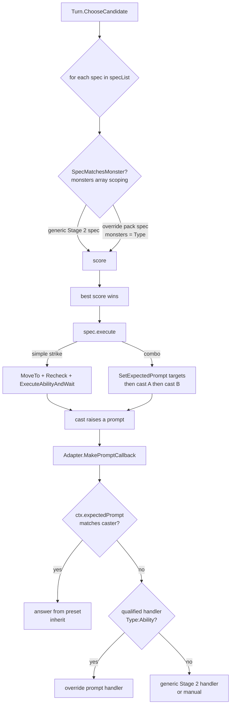

The spec contract (`WarmindSpecs.lua` header, `Warmind.RegisterSpec` in `WarmindCore.lua`)
is unchanged: `score(spec, ctx, snapshot, abilities) -> candidate|nil`,
`execute(spec, ctx, candidate, abilities) -> DecisionResult|nil` (nil = executed). The
`abilities` argument is the live, affordable ability objects resolved from `spec.abilities`
IN ORDER (`Turn.ChooseCandidate` resolves each via `Warmind.Snapshot.FindAbility` and gates
on `ability:CanAfford(token)`); a spec is skipped entirely if any listed ability is missing
or unaffordable. For a combo, `abilities[1]` and `abilities[2]` are ability A and B in the
`spec.abilities` order -- this ordering is load-bearing for the Ghoul pack.

Scoring conventions inherited from `WarmindSpecs.lua`: 0.2 generic fallback, 0.5-0.8
situational maneuver, 1.0 standard signature, 1.5-2.5 high-impact / malice-charged. Override
packs live at the top of that range for their headline plays so they beat the generic
signature (which scores 1.0).

Reusable execute helpers a pack draws on (all existing): `Warmind.Adapter.MoveTo`,
`Warmind.Scoring.FindValidStrikeTargets`, `Warmind.Scoring.FindBestStrikePosition`,
`Warmind.Scoring.FindBestBurstPosition`, `Warmind.Adapter.RecheckStrikeTargets`,
`Warmind.Adapter.ExecuteAbilityAndWait`, `Warmind.Adapter.Speech`. Charge is handled inside
`ExecuteAbilityAndWait` (a target carrying a `.charge` Loc triggers a move-in before the
strike); `meleeAndRanged` variation resolution and burst auto-targeting (`targetType ==
"all"`) are also internal to the adapter.

#### Per-monster port inventory

Built from `Monster AI/MonsterAIMonsters.lua`, cross-checked against `monster-reference.md`
(Book Two: Monsters). "Ref" = present in `monster-reference.md`. "Generic covers" = the
Stage 2 generic spec that already plays this ability with no override. "Override value" =
the behavior a pack adds that generic CANNOT infer.

| Monster (`monster_type`) | Ref | Legacy moves (scores) | Combo / prompt | Generic Stage 2 covers | Override value (non-redundant) |
|---|---|---|---|---|---|
| Goblin Warrior | yes (L1 Horde Harrier) | Spear Charge (1); Bury the Point (2, malice) | none | Spear Charge = Signature -> `signature_strike` (1.0) | Bury the Point: 2 Malice strike, prefer over Spear Charge when target reachable and malice affordable. |
| Goblin Assassin | yes (L1 Horde Ambusher). `Goblin Pirate Assassin` ABSENT | Sword Stab (1); Shadow Chains (score*0.4, malice); Hide in Concealment (0.5) | none | Sword Stab = Signature -> `signature_strike`; Hide -> generic `hide` spec (0.5) | Shadow Chains: 3 Malice, Ranged 10, Three creatures -- prefer when it hits 3 targets. Slip Away: the Assassin hides even while observed (generic `hide` needs reachable concealment; the pack can relax that). |
| Bugbear Channeler | yes (L2 Elite Controller) | Shadow Drag (min(#t,2)); Twist Shape (2.5, malice); Blistering Element (burst*0.9) | none | Shadow Drag = Signature -> `signature_strike` + Pull! handler; Blistering Element = self-centered Area burst -> `area_burst_if_n` | Twist Shape: 5 Malice, Ranged 5, shapechange -- prefer when affordable. Priority tuning, realized as a `monsters = {"Bugbear Channeler"}` OVERRIDE SPEC on Blistering Element (NOT a tactic): raise its candidate score at 3+ enemies so it outranks the ~2.0 Shadow Drag signature in `Turn.ChooseCandidate`. Generic `area_burst_if_n` scores 0.45*net, so alone it only wins at ~5 enemies -- the override spec lowers the crossover to 3. A `RegisterTactic` bias only adds to per-enemy strike edge counts inside `FindBestStrikePosition`, so it CANNOT shift which spec wins candidate selection. |
| Ryll | NO -- absent from `monster-reference.md` and no bestiary YAML | Two Shot (1) -- only a legacy string reference, no ability definition | none | unknown (no stat block) | CANNOT PORT: no stat block or ability definition in the repo (only legacy `Monster AI/` string references). Defer or source a stat block. See the flags below. |
| Ghoul | yes (L1 Horde Harrier) | Razor Claws (1); Leap and Claw combo | Leap raises a prompt; legacy used `SetTargetsForExpectedPrompt` | Razor Claws = Signature (Charge, Melee) -> `signature_strike` | Leap and Claw combo: Leap (maneuver, up to 3 squares) onto a size-1 enemy to knock it prone, then Razor Claws. The flagship `SetExpectedPrompt` combo port. |
| Zombie | yes (L1 Horde Brute) | Clobber and Clutch (1); Zombie Dust (burst, >=3 enemies -> 0.8) | none | Clobber and Clutch = Signature -> `signature_strike` | Zombie Dust: 3 Malice, 2 burst maneuver, zombie falls prone -- fire after the main strike, at >=3 enemies. |
| Skeleton | yes (L1 Horde Artillery) | Bone Shards (1); Bone Spur (burst, >=2 enemies -> 0.8) | none | Bone Shards = Signature (melee-or-ranged) -> `signature_strike` | Bone Spur: 2 Malice, 1 burst maneuver, banes each target's next strike -- at >=2 enemies. |

Central finding from the cross-check: the legacy "Main Actions" that were signature strikes
(Spear Charge, Sword Stab, Shadow Drag, Razor Claws, Clobber and Clutch, Bone Shards) are
now FULLY covered by the Stage 2 generic `signature_strike` spec. Do NOT re-register them
as overrides -- that would duplicate behavior and clutter the trace. The genuinely bespoke,
non-redundant override value is concentrated in three buckets: MALICE plays (Bury the Point,
Shadow Chains, Twist Shape, Zombie Dust, Bone Spur); the Ghoul Leap-and-Claw COMBO (plus the
Assassin's Slip Away hide relaxation); and one priority-tuning OVERRIDE SPEC (the Bugbear's
`monsters = {"Bugbear Channeler"}` Blistering Element spec that outscores Shadow Drag at 3+
enemies, a spec-vs-spec crossover generic scoring alone defers to ~5 -- realized as a scored
spec in `Turn.ChooseCandidate`, never a tactic edge-bias). A pack should register only these;
the signature strikes flow through generic Stage 2.

#### Malice-cost corrections (port INTENT, not stale numbers)

The legacy scores predate the current Book Two malice costs. Two abilities the legacy
treated as FREE maneuvers are now malice-gated in `monster-reference.md`. Porting the
legacy numbers verbatim would let a monster fire them for free:

| Ability | Legacy treatment | Current Book Two (`monster-reference.md`) | Port correction |
|---|---|---|---|
| Zombie Dust (Zombie) | free maneuver burst, fire at >=3 enemies (0.8) | 3 Malice, Area 2 burst, Maneuver | Now a malice play. Generic `area_burst_if_n` SKIPS it (costsMalice trait gate). The pack must spend malice, so it becomes a malice-gated override, not a free maneuver. |
| Bone Spur (Skeleton) | free maneuver burst, fire at >=2 enemies (0.8) | 2 Malice, Area 1 burst, Maneuver | Same: now malice-gated. Generic burst skips it; the pack drives it as a malice play. |
| Bury the Point (Goblin Warrior) | malice (score 2) | 2 Malice, Melee strike, Main action | Already malice in legacy; number confirmed. Prefer over Spear Charge. |
| Shadow Chains (Goblin Assassin) | malice (score*0.4) | 3 Malice, Ranged 10, Three creatures | Already malice; targeting confirmed. Prefer at 3 targets. |
| Twist Shape (Bugbear Channeler) | malice (score 2.5) | 5 Malice, Ranged 5, One creature | Already malice; cost confirmed (5, expensive on a 16-EV Elite). |

Consequence: FIVE of the seven packs are malice plays. This forces a coordination decision
with the Stage 4 Director malice policy (below).

#### The Ghoul Leap-and-Claw combo (the pattern's showcase)

Current Book Two Ghoul (`monster-reference.md`): `Razor Claws` is the Signature (Charge,
Melee, Strike, Main action, Melee 1). `Leap` is a Maneuver: "The ghoul jumps up to 3
squares. If they land on a size 1 enemy, that enemy is knocked prone and the ghoul can make
a free strike against them." The legacy combo:

1. `score`: clone Razor Claws, add the `Charge` keyword, set `chargeDistanceOverride = 3`
   (matches "jump up to 3 squares"; verified surface lists `:try_get("chargeDistanceOverride",
   default)`), then `FindBestMoveToUseStrike(token, leapAbility, filter)` where the target
   filter returns a high score for size-1 targets (`tileSize <= 1`) and rejects larger ones.
   This finds a landing that reaches a size-1 enemy.
2. `execute`: pick the single best target, split off its `charge` Loc as the Leap
   destination, call `SetTargetsForExpectedPrompt{ casterid, targets, sleep = 0.5 }` to
   pre-answer the prompt Leap raises (the knock-prone / free-strike target selection), cast
   Leap onto the destination, then cast Razor Claws on the target.

Warmind port: a single `monsters = {"Ghoul"}` spec with `abilities = {"Leap", "Razor Claws"}`
so `abilities[1]` is Leap and `abilities[2]` is Razor Claws. The `execute` calls
`Warmind.Adapter.SetExpectedPrompt(ctx, ctx.token, targets, {sleep = 0.5})` before casting
Leap, then `Warmind.Adapter.ExecuteAbilityAndWait` for Leap and again for Razor Claws. The
size-1 filter and `chargeDistanceOverride = 3` are ported as intent. The exact prompt Leap
raises (and whether the current Book Two Leap grants its OWN free strike separately from the
Razor Claws main action) is VERIFIED AGAINST REPO SOURCE in the implementing session -- the
`Leap` ability definition and the prompt-name string the engine actually raises -- not gated on
a runtime check. Where source is inconclusive the port SHIPS THE FAIL-CLOSED FALLBACK: a
`SetExpectedPrompt` preset whose caster/targets do not match the real prompt is simply never
consumed, and an unmatched qualified handler name (`Ghoul:<wrong>`) never fires, so the engine
raises the manual prompt and the activation ends `UNSUPPORTED_COMPLEX_PROMPT` (a clean hold --
the DM finishes the cast) or the combo declines to the generic Razor Claws signature. The
mid-cast prompt name is therefore an [accepted-risk] item -- a mis-named preset costs the combo,
never correctness -- carried in the Expected runtime behavior section below, NEVER a live gate.

### Key design decisions and risks

Decision -- The override layer is OPTIONAL and generic-backed (the acceptance test).
Rationale: design rule #2 ("bespoke monsters are an optional override layer"). Because every
ported monster's signature strike is already covered by the generic `signature_strike` spec,
removing a pack degrades gracefully: the monster still moves and strikes with its signature,
just without the malice play or combo. Acceptance is STRUCTURAL, not a runtime check [static]:
the Warmind registries are additive and a spec/tactic/prompt carrying a `monsters` scope
competes ONLY for that `monster_type` (`Warmind.SpecMatchesMonster`), so deleting a pack's
registrations cannot change which generic spec any monster -- including that one -- selects;
the review confirms it by inspection. The residual runtime component -- that the surviving
generic turn is actually sensible -- is an [accepted-risk] quality item, observable in the
panel trace during natural play (and cheap precisely because we do NOT re-register signatures
as overrides).

Decision -- Register only the non-redundant behavior; never re-register generic signatures.
Rationale: duplicating `signature_strike` as a per-monster spec adds a same-score competitor
that never fires. `Turn.ChooseCandidate` iterates `Warmind.specList` in registration order and
keeps a candidate only on a strict `candidate.score > best.candidate.score`; because
`WarmindSpecs.lua` (generic) loads before `WarmindOverrides.lua` (Stage 6), a same-score
override registered later deterministically LOSES the tie and never fires -- pure dead weight
that doubles the trace with no behavior gain. Risk if ignored: trace noise and confusing "why
did it pick the override vs generic" questions. Mitigation: the inventory table's "Generic
covers" column is the checklist of what to leave to Stage 2.

Decision -- Route override malice plays through a single Director malice gate, not raw
CanAfford. Rationale: Stage 6 can land before Stage 4 (PROMPTS.md P6.1 depends only on Stage
2). If an override malice spec gates purely on `ability:CanAfford(token)` (which for a malice
ability succeeds whenever the shared malice pool holds the cost), it will spend malice the
instant it is affordable -- there is no pool floor, no "beat the best free option by a
margin", none of the Stage 4 policy. Five of seven packs are malice plays, so this is the
dominant behavior of the stage. Mitigation: have every override malice spec consult one thin
hook -- `Warmind.Director.MayCommitMalice(ctx, ability, candidate)` -- governed by the
score-margin + pool-floor rule from the CLAUDE.md Stage 4 seed heuristics once Stage 4 lands.
Which stage creates the hook depends on order: in the roadmap default order (Stage 4 before
Stage 6, per the Session map) Stage 4 has already created `MayCommitMalice` with its real body,
so P6.1 just consults it and adds no stub; ONLY if Stage 6 runs first (its Stage-2
min-dependency) does P6.1 CREATE the hook as a stub returning true in `WarmindDirector.lua`
(an existing file -- not a new file; it loads before `WarmindOverrides.lua` so packs can call
it), add `WarmindDirector.lua` to the copy-list, and leave Stage 4 to replace the stub body in
place. Either way the packs stay untouched when Stage 4 lands (design rule: no ledger object;
one gate, a few lines). Alternative (in <=3 lines): let Stage 6
spend malice directly via CanAfford and refactor at Stage 4 -- rejected because it bakes
un-budgeted malice spend into every pack and Stage 4 would have to unpick it. Risk: if Stage
6 runs standalone for playtest before Stage 4, malice will be spent greedily; call that out
in the pack's trace so a playtester sees it. Note this is a roadmap ordering question -- the
gate hook is the low-regret choice either way.

Forward note -- name/signature unification with Stage 4. `Warmind.Director.MayCommitMalice`'s
name AND signature MUST match the malice gate Stage 4 implements. Stage 4 currently DRAFTS its
loop-level gate as `ApproveMalice(ctx, maliceCandidate, bestFreeCandidate, snapshot)`; P4.1
unifies the two, and `MayCommitMalice(ctx, ability, candidate)` is the canonical name BOTH
stages commit to. In the roadmap default order (Stage 4 before Stage 6, per the Session map)
Stage 4 CREATES it with its real body and P6.1 finds it present; ONLY if Stage 6 runs first does
P6.1 add the stub that Stage 4 later fills in place. Either way Stage 4 does not introduce a
second, differently-named gate. Register every override malice spec against `MayCommitMalice`,
never against a Stage-4-only name, so the packs are untouched when Stage 4 lands. See the Stage 4
malice section (subsection (b)) for the loop-level-vs-per-spec reconciliation P4.1 owns.

Decision -- Two-category combos: the engine resource consumption is the gate, NOT
`usedCategories`. Rationale: `Turn.ActivationLoop` rebuilds the snapshot every iteration
(`Warmind.Snapshot.Build(token)`), and `BuildBudget` (`WarmindSnapshot.lua`) reads LIVE engine
usage each time -- `actionUsed = creatureProps:GetResourceUsage(CharacterResource.actionResourceId,
"turn")` and `maneuverUsed = GetResourceUsage(maneuverResourceId, "turn")` -- setting
`hasMainAction = actionUsed < 1` and `hasManeuver = maneuverUsed < 1`. `Turn.CategoryAllowed`
then gates a category on BOTH `budget.has*` AND `not ctx.usedCategories.*`. The Ghoul
Leap-and-Claw combo casts Leap (a Maneuver -> consumes `maneuverResourceId`) and Razor Claws
(a Main action -> consumes `actionResourceId`); the engine pays both costs inside Cast via
`ConsumeResources` (Lesson 8: "Budget = intent layer, CanAfford = authority"). So once the
combo `execute` returns, the NEXT iteration's rebuilt budget already has `hasManeuver = false`
AND `hasMainAction = false`, which blocks any further main OR maneuver spec regardless of which
single category the combo's spec declared (`ActivationLoop` sets only
`ctx.usedCategories[choice.spec.category] = true`). No double-dip is possible for the Ghoul, and
no explicit second-category mark is required. Belt-and-suspenders: set
`ctx.usedCategories.maneuver = true` inside execute ONLY for a combo whose maneuver is cost-free
(a free maneuver via `freeManeuverResourceId`, which `BuildBudget`'s `maneuverResourceId` usage
read would not catch) -- there `usedCategories` is the sole gate (Lesson 8: it prevents repeats
even for cost-free abilities). The Ghoul's Leap costs the maneuver resource, so even that mark is
redundant for THIS pack; it matters only for a hypothetical free-maneuver combo. There is NO
"return a DecisionResult that names both consumed categories" path -- `ActivationLoop` never
inspects the returned result for a category list, so such a field would be dead code. The
engine-resource gate is a SOURCE-VERIFIED guarantee [static], not a runtime check: `BuildBudget`
reads `GetResourceUsage(actionResourceId, "turn")` and `GetResourceUsage(maneuverResourceId,
"turn")` live on every rebuilt snapshot, so once Cast's `ConsumeResources` has paid both of
Leap-and-Claw's costs the next iteration's budget already reports `hasManeuver = false` AND
`hasMainAction = false` -- the reasoning above IS the proof, and the implementing session
re-confirms it against `WarmindSnapshot.lua` rather than at the table. If the guarantee were ever
wrong the failure is fail-closed: the worst case is the Ghoul declines a further spec it could
legally have taken, never a double-dip.

Risk -- `SetExpectedPrompt` combos must respect the prompt-handler contract: never yield,
never throw. Mitigation: the preset itself is inert data (`ctx.expectedPrompt`); the risk is
in the `execute` that assembles the targets. Wrap any risky reads (target still valid, loc
still legal) so a failure degrades to declining the combo (fall through to generic), not a
dead cast. `Warmind.Guard` already contains per-activation errors; keep the combo's target
assembly defensive so a mis-set preset answers a LATER unrelated prompt harmlessly (it is
matched on `casterid` and consumed once, so a stale preset is scoped, but do not leave one
set across a cast that was cancelled).

Risk -- Ryll and Goblin Pirate Assassin have no current stat block in this repo. Mitigation:
these are named/adventure monsters, not Book Two: Monsters entries. Ryll's `Two Shot` and the
`Goblin Pirate Assassin` type exist ONLY in the legacy `Monster AI/` source. There is no
`compendium/bestiary/` in this branch to fall back to. Two options, decided at P6.2 time:
(a) drop Ryll and the Pirate Assassin scoping from Stage 6, porting only the six monsters
with verifiable stat blocks (Goblin Warrior, Goblin Assassin, Bugbear Channeler, Ghoul,
Zombie, Skeleton); or (b) if Ryll's stat block is imported into the repo (adventure content),
port it then. The Goblin Assassin pack keeps `monsters = {"Goblin Assassin"}` only -- drop
`"Goblin Pirate Assassin"` from the legacy scoping since that type does not exist here.

Risk -- Slip Away (Goblin Assassin) vs the generic `hide` spec. The generic Stage 2 `hide`
spec requires `FindReachableConcealment` to return a loc; the Assassin's Slip Away trait lets
it hide even while observed (no concealment needed). Mitigation: the Assassin pack may
register a `monsters = {"Goblin Assassin"}` hide spec that relaxes the concealment
requirement. First confirm generic `hide` does NOT already handle this (it does not, per the
Stage 2 plan -- concealment-gated; this is a source/plan check, not a runtime one). The exact
`IsConcealed` / observed-vs-hidden semantics the relaxed spec must key on are verified against
repo source in the implementing session; where source is inconclusive, ship the fail-closed
fallback -- the pack keeps the generic concealment gate, so the Assassin merely under-hides
(quality degradation), never mis-hides. Whether the override is worth building at all is an
[accepted-risk] quality call: observe in the panel trace during natural play whether the
Assassin visibly under-hides, and add the relaxed spec only if it does.

Risk -- Elite / single-model economics (Bugbear Channeler). A 16-EV Elite with 60 Stamina
spends 5 Malice on Twist Shape; that is a large fraction of an early pool. Without Stage 4's
pool floor the pack could dump it turn one. Mitigation: this is the same malice-gate decision
above; the gate hook is the lever. Until Stage 4, keep Twist Shape's override score high
(2.5) but gated on affordability so it only fires when malice genuinely exists.

Flags folded from the stage draft:

- Ryll and `Goblin Pirate Assassin` cannot be ported: both are absent from
  `monster-reference.md`, Ryll's `Two Shot` ability has no definition anywhere in the repo (it
  survives only as a string reference in the legacy `Monster AI/` source), and this branch has
  no `compendium/bestiary/` directory (only `compendium/reference/`) to source them from. The
  remit lists "Ryll" as one of the seven monsters and P6.2 names it verbatim; the honest port
  count is SIX. Recommend the roadmap and CLAUDE.md record Ryll as deferred-pending-stat-block,
  and the Goblin Assassin pack drop the `"Goblin Pirate Assassin"` scoping.
- CLAUDE.md and STAGE2_PLAN.md repeatedly reference `compendium/bestiary/` YAML as the
  fallback stat source, but that directory does not exist in this branch/worktree. Any Stage
  6 (or Stage 2/3) instruction to "check the bestiary YAML" resolves only to
  `monster-reference.md` here. Worth reconciling in CLAUDE.md so future sessions do not chase
  a missing directory.
- Six of the seven legacy "Main Action" moves are now redundant with the Stage 2 generic
  `signature_strike` spec (all six ported signatures are the monster's Signature Ability).
  The non-redundant override value is almost entirely malice plays plus the Ghoul combo. The
  ORIGINAL_PLAN.md framing of Stage 6 ("extra specs + weight tweaks + prompt handlers")
  slightly oversells what needs porting; the real Stage 6 surface is small. Not an error --
  just noting the scope is thinner than the legacy file's line count suggests.
- Malice-timing ordering: Stage 6 depends only on Stage 2, but five of seven packs are
  malice plays whose policy properly belongs to Stage 4. If Stage 6 is implemented before
  Stage 4 (allowed by PROMPTS.md), the malice-gate hook (`Warmind.Director.MayCommitMalice`)
  is a stub returning true, i.e. greedy malice spend. This is a deliberate ordering trade-off,
  not a bug, but the roadmap states it so a playtester is not surprised.
- Two legacy scores encode stale (pre-malice-cost) Book Two data: Zombie Dust (now 3 Malice)
  and Bone Spur (now 2 Malice) were scored as FREE maneuvers in the legacy source. Porting
  the numbers verbatim would let those monsters fire malice abilities for free -- the port
  MUST re-gate them as malice plays. This is the concrete instance of the CLAUDE.md
  "port intent, not stale numbers" rule for this stage.

### Definition of done

Stage 6 DONE gate (agent-verified at the P6.2 closure -- see the roadmap Verification model
section): code complete + L0 static checks clean (`luac -p`; `LC_ALL=C grep -nP '[^\x00-\x7F]'`)
+ L1 harness green (the pure-logic slices: Blistering Element crossover math, malice-cost
classification, reason codes) + P6.2's adversarial review-agent audit of the full Stage 6 diff
against `CLAUDE.md`, this roadmap, the legacy source, and the stat blocks with findings fixed +
L3 deploy-and-probe clean + L4 live override-monster turn (or an honest DEFERRED line). Newly-used
engine APIs (none expected here -- Stage 6 adds no engine surface -- but the `Leap` prompt name and
`IsConcealed` semantics count) are verified against repo source in-session (L2). Review closure at
P6.2 runs the agent-driven L3/L4 and flips the Stage 6 row to DONE; the same closure owns the
CLAUDE.md folds previously routed to the removed P6.V debrief (bestiary-path reconciliation, the
Ryll deferral note, and the override-pack contract recording if P6.1 did not already do it). The
stage is fail-closed by design (every override path emits a reason-coded DecisionResult; unmatched
prompts/combos degrade to a clean hold or the generic signature), which is why a DEFERRED L4 is
safe.

- The override-pack pattern is realized in `WarmindOverrides.lua` and RECORDED as a contract
  in `Draw Steel Warmind/CLAUDE.md` (how to write a pack: `monsters` scoping, qualified
  prompt names, `SetExpectedPrompt` combos, the malice gate, the two-category combo rule,
  the "never re-register a generic signature" rule).
- The `Warmind.Director.MayCommitMalice(ctx, ability, candidate)` gate exists in
  `WarmindDirector.lua` (created with its real body by Stage 4 in the roadmap default order, or
  as a P6.1 returns-true stub only if Stage 6 ran ahead of Stage 4), is consulted by every
  override malice spec instead of raw `CanAfford`, and is recorded in `CLAUDE.md` as the Stage 4
  malice-policy seam.
- Each ported monster with a current stat block has a pack REGISTERED AND REVIEWED against its
  stat block -- the malice play / combo / priority-tuning spec present with the correct cost,
  targeting, and score [static]: Goblin Warrior's Bury the Point scored above Spear Charge and
  malice-gated; Goblin Assassin's Shadow Chains (3 Malice, three targets) plus the optional Slip
  Away hide relaxation; Bugbear Channeler's Twist Shape (5 Malice) and the `monsters =
  {"Bugbear Channeler"}` Blistering Element override spec whose score outranks Shadow Drag at 3+
  enemies (generic scoring alone would defer that crossover to ~5); Ghoul's Leap + Razor Claws
  combo spec with `abilities = {"Leap", "Razor Claws"}`; Zombie's Zombie Dust (3 Malice, >=3
  enemies, fired after the main strike); Skeleton's Bone Spur (2 Malice, >=2 enemies). The
  RUNTIME reproduction of these behaviors is [accepted-risk] quality, catalogued in the Expected
  runtime behavior section and observable in the panel trace during natural play (not a gate).
- The optional-layer property holds STRUCTURALLY [static]: the registries are additive and
  `monsters`-scoped specs compete only for their own type, so removing a pack cannot change the
  generic selection for any monster; review confirms this by inspection, and an L3 probe can
  enumerate the candidate specs for a live override monster to confirm scoping.
- Every override decision path emits a DecisionResult with a stable reason code (as with all
  Warmind specs); no path terminates silently.
- `luac -p` and `LC_ALL=C grep -nP '[^\x00-\x7F]'` pass on every touched file (L0); the L1 harness
  covers the pure-logic slices and is green.
- A review agent has audited the full Stage 6 diff AGAINST `CLAUDE.md` + this roadmap and the
  legacy source + the stat blocks; findings fixed. This audit plus the L3/L4 runtime verification
  IS the Stage 6 DONE gate.
- `CLAUDE.md` stage row flipped to DONE with today's date at P6.2's clean review closure (no
  intermediate "awaiting verification" state).
- The Ryll / Goblin Pirate Assassin gap is documented in `CLAUDE.md` with the chosen
  resolution (dropped, or deferred pending a stat block).
- No git commit; the session deploys the changed files into the mod store and confirms the
  automatic hot reload (see the CLOSING), and OFFERS the cloud commit on the user's yes.

### Expected runtime behavior (agent-verified at the stage closure; see Verification model)

This catalogues the behavior each pack is meant to produce, and the P6.2 review closure verifies
it via the agent-driven levels (the DONE gate is that closure -- see Definition of done). Each
bullet carries a coverage tag: [harness] = the pure-logic slices (the Blistering Element crossover
math, the malice-cost classification, scoring constants) asserted by the L1 logic harness; [probe]
= verified read-only via the L3 bridge probe (pack scoping, candidate enumeration); [live] =
requires an L4 live override-monster turn; [static] = pinned by review / source-verification;
[fail-closed] = a wrong outcome degrades to a clean reason-coded hold or the generic handler, never
a hang or corruption; [accepted-risk] = quality-only degradation, observable in the panel trace
during natural play and tuned later. If any pack misbehaves later during natural play, run PD (the
on-demand play debrief in the Verification model section).

- Goblin Warrior with malice available: fires Bury the Point (trace shows it outranking Spear
  Charge). With malice empty: falls back to Spear Charge via generic `signature_strike`. --
  [static] Bury the Point registered as a 2-Malice spec scored above Spear Charge and gated on
  `MayCommitMalice` (registration/scoring pinned by review); [accepted-risk] the actual runtime
  preference; [fail-closed] malice-empty declines the gate/`CanAfford` and drops to the generic
  signature.
- Goblin Warrior pack removed (registrations commented out): still charges and strikes with
  Spear Charge via generic specs; no error. -- [static] registries are additive so removal
  cannot touch generic selection; [accepted-risk] the surviving generic turn's quality.
- Goblin Assassin with 3 in-range targets and malice: fires Shadow Chains (restrains 3). With
  <3 targets or no malice: uses Sword Stab via generic signature. Hides via Slip Away even
  while observed (no concealment tile needed). -- [static] Shadow Chains registration/targeting
  and the generic Sword Stab path; [accepted-risk] the Slip Away hide-while-observed relaxation
  (source-verify `IsConcealed`; fail-closed fallback keeps the generic concealment gate, so at
  worst the Assassin under-hides).
- Goblin Assassin pack removed: still strikes with Sword Stab; still hides IF concealment is
  reachable (generic `hide`); Slip Away specialization is gone (expected). -- [static]
  structural; [accepted-risk] generic-turn quality.
- `Goblin Pirate Assassin` scoping is NOT registered (type absent from this repo) -- no
  reference to it in the source. -- [static] structural: the type is simply never registered;
  confirmed by review / source grep.
- Bugbear Channeler with malice: fires Twist Shape (score 2.5) when affordable; via the pack's
  `monsters = {"Bugbear Channeler"}` Blistering Element override spec, prefers Blistering
  Element over Shadow Drag once it catches 3+ enemies; otherwise Shadow Drag via generic
  signature + Pull! handler pulling to maximize collision. -- [static]/harness-coverable the
  crossover math (override spec score vs the generic `0.45*net`) and Twist Shape registration;
  [accepted-risk] the runtime preference; [fail-closed] the Pull! handler (a missed Pull! prompt
  name degrades to the generic prompt handler or manual).
- Bugbear Channeler pack removed: still uses Shadow Drag (generic signature) and Blistering
  Element (generic `area_burst_if_n`, which only outscores Shadow Drag at ~5+ enemies -- the 3+
  crossover is gone); Twist Shape unused (expected, malice play lives in the pack). -- [static]
  structural; [accepted-risk] generic-turn quality.
- Ghoul: with a size-1 enemy in Leap range, executes Leap-and-Claw -- Leap lands on the target
  (knocked prone), then Razor Claws resolves. The pre-set prompt answer resolves without a
  manual prompt (trace: "answered from expected-prompt preset"). After the combo the Ghoul does
  NOT take a further separate maneuver+main (Leap and Razor Claws each consumed their engine
  maneuver/action resource, so the rebuilt budget blocks both -- no `usedCategories` double-mark
  needed). -- [fail-closed] the combo itself (a missed `SetExpectedPrompt` match or wrong prompt
  name degrades to the generic prompt handler or manual -> `UNSUPPORTED_COMPLEX_PROMPT`);
  [static] the no-double-dip guarantee is source-verified via `BuildBudget`'s live resource read.
- Ghoul with only size-2+ enemies: the Leap filter rejects them; falls back to Razor Claws via
  generic signature (Charge). -- [static] the size-1 filter; [fail-closed] the fallback to the
  generic signature.
- Ghoul pack removed: still strikes with Razor Claws (generic signature, Charge); Leap combo
  gone (expected). -- [static] structural; [accepted-risk] generic-turn quality.
- Zombie: fires Zombie Dust ONLY at 3+ enemies and ONLY with 3 Malice available; fires it after
  the main Clobber and Clutch strike (zombie falls prone last). At <3 enemies or no malice:
  just Clobber and Clutch via generic signature. -- [static] review point / harness-coverable:
  Zombie Dust MUST be re-gated as a 3-Malice play (the malice-cost correction), never shipped as
  the legacy free maneuver; [accepted-risk] the after-the-main-strike timing.
- Zombie pack removed: still strikes with Clobber and Clutch; Zombie Dust unused (expected). --
  [static] structural; [accepted-risk] generic-turn quality.
- Skeleton: fires Bone Spur at 2+ enemies with 2 Malice available; otherwise Bone Shards
  (melee-or-ranged) via generic signature. -- [static] review point / harness-coverable: Bone
  Spur MUST be re-gated as a 2-Malice play (the malice-cost correction), never a free maneuver;
  [accepted-risk] the runtime firing threshold.
- Skeleton pack removed: still strikes with Bone Shards; Bone Spur unused (expected). --
  [static] structural; [accepted-risk] generic-turn quality.
- Malice accounting: no pack spends malice it cannot afford; the malice gate hook
  (`Warmind.Director.MayCommitMalice`) is consulted by every override malice spec (trace shows
  the gate decision). Before Stage 4 the gate passes freely; the trace notes that greedy malice
  spend is expected until Stage 4. -- [static] every malice spec routes through `MayCommitMalice`
  rather than raw `CanAfford` (the gate consultation is structural, review-verified, and
  reason-code/gate-presence is harness-coverable); [accepted-risk] the greedy pre-Stage-4 spend.
- Stop button mid-combo (during Ghoul Leap-and-Claw): clean TAKEN_OVER_BY_DM, control released
  on the Ghoul, no stale `ctx.expectedPrompt` leaking into a later cast, initiative NOT
  advanced. -- [fail-closed] stop is always clean (Guard + `g_terminate`); [static] the
  stale-preset scoping (`ctx.expectedPrompt` consumed once, matched on `casterid`) is
  source/review-verified.
- Error injection in one override spec: activation held with EXECUTION_ERROR, other tokens act,
  AI keeps running (Guard containment, as in earlier stages). -- [fail-closed] Guard containment.
- Ryll: NOT ported (no stat block); the roadmap/CLAUDE.md note records the decision. -- [static]
  documentation / review point.

### Kickoff prompts

Two sessions: P6.1 designs the pattern and ports the first monster (Goblin Warrior) on-session
so the pattern is proven before scaling; P6.2 fans the remaining monsters out to one Opus
subagent each, using the Goblin Warrior pack as the reference, and its clean review-agent audit
IS the Stage 6 DONE gate (that closure flips the CLAUDE.md stage row to DONE and owns the
CLAUDE.md folds -- bestiary-path reconciliation, the Ryll deferral note, and the override-pack
contract recording if P6.1 did not already do it). There is NO P6.V in-app verification debrief:
that per-stage verification gate is REMOVED under the roadmap Verification model. If a Stage 6
pack misbehaves during natural play, run PD (the reusable on-demand play debrief authored in the
Verification model section) -- it is never scheduled and never a gate. P6.1 and P6.2 are MODIFIED
from `PROMPTS.md`: only their closing in-app-verification deliverables are removed/replaced per
the Verification model (see the Prompt provenance notes after each fence); every other line of
the fences is byte-identical.

Important -- REQUIRED Stage 6 prerequisite (do this BEFORE dispatching P6.1): fold this
section's five load-bearing decisions into `Draw Steel Warmind/CLAUDE.md`. P6.1 and P6.2 predate
this roadmap; their fences open only with "Read Draw Steel Warmind/CLAUDE.md" and name only the
legacy source and `monster-reference.md`, NOT this roadmap. The fences are modified from
`PROMPTS.md` ONLY to strip the in-app-verification deliverables (per the Verification model); the
"Read CLAUDE.md fully" opener and the sources they name are UNCHANGED, so the only way to make
that opener carry the Stage 6 context is still to put the decisions where the fence already
points. The five to fold in:
(1) the `Warmind.Director.MayCommitMalice` malice-gate hook -- that every override malice spec
must consult it instead of raw `CanAfford`, that its name/signature must match the Stage 4 gate
P4.1 unifies (Stage 4 currently drafts it as `ApproveMalice`), and that P6.1 creates it as a stub
returning true in `WarmindDirector.lua` ONLY when Stage 6 runs ahead of Stage 4 (in the roadmap
default order Stage 4 has already created it with its real body); (2) the two-category combo rule (engine resource
consumption is the gate, per Key design decisions -- no `usedCategories` double-mark needed for
cost-bearing combos); (3) the per-monster port inventory + malice-cost corrections; (4) the "never
re-register a generic signature" rule; and (5) the Ryll resolution -- Ryll and `Goblin Pirate
Assassin` have NO stat block anywhere in this repo, so EXCLUDE them and port six monsters. This
fold is exactly what the P6.1 fence's own "CLAUDE.md updated (record the override pattern as a
contract)" clause anticipates, done up front rather than at the end. Fallback if the fold is
skipped: the executing session for EITHER prompt MUST ALSO read this Stage 6 roadmap section (and
the provenance notes after each fence) before working. The fold is the prescribed path; the
read-the-roadmap fallback is the safety net.

#### P6.1 -- Override packs: pattern + first monster (Goblin Warrior)

```
Read "Draw Steel Warmind/CLAUDE.md" fully. Implement the Stage 6 override-pack pattern in
WarmindOverrides.lua plus ONE complete port: Goblin Warrior, from
"Monster AI/MonsterAIMonsters.lua". First design the override shape (a pack registers per-monster
specs/prompt handlers/tactic biases through the existing Warmind registries -- monsters = {"..."}
scoping on RegisterSpec, qualified "Monster Type:Ability" prompt names, SetExpectedPrompt for
combos) and show me the design before porting. The override layer must stay optional: removing a
pack must leave the monster playing via the generic Stage 2 specs. Check each legacy behavior
against the current stat block in monster-reference.md -- port intent, not stale numbers. No new
files; luac -p + ASCII; review audit of the diff; CLAUDE.md updated (record the override pattern as
a contract). Do not commit. End with a diff summary and the expected-runtime-behavior notes for
Goblin Warrior (when Bury the Point outranks Spear Charge, the malice-gate fallback, the
removed-pack degradation). Read CLAUDE.md "Autonomous dev loop" for the bridge/deploy mechanics.

CLOSING - deploy and verify (autonomous loop; mechanics in CLAUDE.md "Autonomous dev loop"):
1. curl http://localhost:19876/health -s -m 5 - if the bridge is down, list the changed
   WarmindXxx.lua files and mark L3 DEFERRED in one honest line; stop here.
2. Deploy each changed WarmindXxx.lua by writing it into
   /Users/droideck/Library/Application Support/MCDM/Codex/mods/Warmind_be67/ (Write/Edit tool).
3. Confirm the automatic hot reload: tail Player.log for the "Local file changed ->
   RefreshLocalFiles -> reload success" chain and check no new errors; POST /reload only if the
   watcher did not fire.
4. Probe read-only via POST /execute (L3): enumerate the Goblin Warrior candidate specs and their
   scores to confirm Bury the Point outranks Spear Charge; report results.
5. CLAUDE.md is documentation - never deployed.
```

Prompt provenance (P6.1): MODIFIED from `PROMPTS.md` -- in-app verification removed per the roadmap
Verification model. The single change is the closing deliverable: the original "an in-app test
script for Goblin Warrior" is replaced by "the expected-runtime-behavior notes for Goblin Warrior
(reference, not a checklist)". Everything else in the fence is byte-identical -- notably the "show me
the design before porting" clause STAYS (it is design approval, not verification). Its fenced text
names only `CLAUDE.md`, `Monster AI/MonsterAIMonsters.lua`, and `monster-reference.md`. If the
REQUIRED prerequisite fold above was done, all five decisions are already in `CLAUDE.md` and the
fence's "Read CLAUDE.md fully" suffices; if not, the executing session MUST ALSO read this Stage 6
roadmap section before designing the pattern. The load-bearing decisions for this session: the
`Warmind.Director.MayCommitMalice` malice-gate hook, which Goblin Warrior -- a malice monster via
Bury the Point -- must consult instead of raw `CanAfford` (its name/signature is the one Stage 4
commits to; see subsection (b)). If Stage 6 runs ahead of Stage 4, P6.1 CREATES this hook as a
stub returning true in `WarmindDirector.lua` (an existing file, not a new file); in the roadmap
default order (Stage 4 before Stage 6) Stage 4 has already created it with its real body, so P6.1
only consults the existing gate. Also load-bearing: the two-category combo rule (Goblin Warrior
has no combo, so it does not bite here, but the pattern contract records it: engine resource
consumption is the gate, per Key design decisions); the per-monster port inventory with the
malice-cost corrections; and the "never re-register a generic signature" rule. In scope for P6.1:
`WarmindOverrides.lua` (the pattern + the Goblin Warrior pack), plus -- only if Stage 6 runs ahead
of Stage 4 -- the one-line `Warmind.Director.MayCommitMalice` stub in `WarmindDirector.lua`. Out of
scope: the other six monsters, and any change to `WarmindSpecs.lua` / `WarmindPrompts.lua` /
`WarmindSquads.lua` / `WarmindTurn.lua` or files outside "Draw Steel Warmind/". The files the
closing deploys into the mod store are `WarmindOverrides.lua`, plus `WarmindDirector.lua` only in
the Stage-6-before-Stage-4 order.
This note lives outside the fenced text; the fence itself is modified only in its closing deliverable
(in-app test script -> expected-runtime-behavior reference + the agent-driven deploy-and-verify
closing), everything else byte-identical.

#### P6.2 -- Override packs: remaining monsters

```
Read "Draw Steel Warmind/CLAUDE.md" fully, including the override-pack contract recorded by the
previous session, and the Goblin Warrior pack in WarmindOverrides.lua as the reference
implementation. Port the remaining Stage 6 packs from "Monster AI/MonsterAIMonsters.lua": Goblin
Assassin, Bugbear Channeler, Ryll, Ghoul, Zombie, Skeleton -- including the combo behavior via
SetExpectedPrompt where the baseline used it. These are pattern-following ports: delegate one
subagent per monster (model: opus) with the Goblin Warrior pack + the monster's baseline code + its
monster-reference.md stat block as the spec; tell agents to challenge the spec on mismatch; review
every port yourself against the stat block before integrating. No new files; luac -p + ASCII per
file; extend the L1 harness with fixtures for the pure-logic slices (malice-cost classification,
Blistering Element crossover) and run it green; review-agent audit of the full diff -- that clean
review closure plus the agent-driven L3 deploy-and-probe and an L4 live override-monster turn (or an
honest DEFERRED line) IS the DONE gate, so flip the CLAUDE.md Stage 6 row to DONE with today's date
at closure (no "awaiting verification" state). Do not commit to git; OFFER the cloud commit
(m:CommitChanges) on my yes. End with a per-monster expected-behavior reference (what each pack
should do in play). Read CLAUDE.md "Autonomous dev loop" for the bridge/deploy mechanics.

CLOSING - deploy and verify (autonomous loop; mechanics in CLAUDE.md "Autonomous dev loop"):
1. curl http://localhost:19876/health -s -m 5 - if the bridge is down, list the changed
   WarmindXxx.lua files and mark L3/L4 DEFERRED in one honest line; ask me to launch DMHub.
2. Deploy each changed WarmindXxx.lua by writing it into
   /Users/droideck/Library/Application Support/MCDM/Codex/mods/Warmind_be67/ (Write/Edit tool).
3. Confirm the automatic hot reload: tail Player.log for the "Local file changed ->
   RefreshLocalFiles -> reload success" chain and check no new errors; POST /reload only if the
   watcher did not fire.
4. Probe pack scoping read-only via POST /execute (L3) and drive a live override-monster turn (L4);
   report results.
5. CLAUDE.md is documentation - never deployed.
```

Prompt provenance (P6.2): MODIFIED from `PROMPTS.md` -- in-app verification removed per the roadmap
Verification model. Two changes, both in the closing lines: the CLAUDE.md status instruction "code
complete, awaiting in-app verification" becomes "flip the Stage 6 row to DONE at the clean review
closure" (the review-agent audit is the DONE gate, not an in-app checklist); and the closing "a
per-monster in-app test list" becomes "a per-monster expected-behavior reference". Everything else in
the fence -- the delegation model, the challenge-the-spec instruction, the sources named -- is
byte-identical. That review closure also owns the CLAUDE.md folds previously routed to the removed
P6.V (bestiary-path reconciliation, the Ryll deferral note, and the override-pack contract recording
if P6.1 did not already do it). If the required prerequisite fold above was done, the five
decisions are in `CLAUDE.md`; otherwise the executing session MUST ALSO read this Stage 6 roadmap
section for the `Warmind.Director.MayCommitMalice`
malice-gate hook (which already exists in `WarmindDirector.lua` -- created by Stage 4 in the
roadmap default order, or by P6.1 if Stage 6 ran ahead of Stage 4 -- so P6.2's override malice
specs consult it, they do NOT re-create it), the two-category combo rule (this one DOES bite here
via the Ghoul Leap-and-Claw combo: engine resource consumption is the gate, per Key design
decisions), the port inventory + malice-cost corrections, the "never re-register a generic
signature" rule, and the Ryll resolution. Out of scope for P6.2: Goblin Warrior (already ported in
P6.1), Ryll (no stat block), and any file other than `WarmindOverrides.lua` (the
`WarmindDirector.lua` gate belongs to an earlier stage -- Stage 4 in the default order, or the
P6.1 stub if Stage 6 ran first; P6.2 does not touch it). The prompt also contains a known defect
the executing session must handle: it instructs a subagent to port Ryll "with ... its
monster-reference.md stat block as the spec," yet Ryll (and its `Two Shot` ability, and the
`Goblin Pirate Assassin` type) is ABSENT from `monster-reference.md`, with no stat block or
ability definition anywhere in the repo -- only legacy `Monster AI/` string references, and
there is no `compendium/bestiary/`. The session running P6.2 must follow the "tell agents to
challenge the spec on mismatch" clause and the CLAUDE.md port-intent rule: the Ryll subagent
will find no stat block and must report back rather than invent one. Per the risk above, drop
Ryll (port six monsters) or defer it until a stat block is imported. These provenance notes live
outside the fenced text; the fences are modified only in their in-app-verification deliverables (per
the Verification model), and the caveats above are not silently swallowed.

#### P6.V removed -- no in-app verification debrief

The former P6.V in-app verification debrief is GONE under the roadmap Verification model: there is
no per-stage in-app checklist to run and no fix-and-flip debrief session for Stage 6. Stage 6
reaches DONE at P6.2's clean review-agent audit closure (see Definition of done). The recourse when
a Stage 6 pack misbehaves during natural play is PD -- the reusable on-demand play debrief authored
once in the roadmap Verification model section, run ONLY when something actually misbehaves (never
scheduled, never a gate): the session gathers its own evidence via the bridge (Warmind.trace.entries,
console errors, Player.log) and only asks the user to paste if the bridge is down, then diagnoses
against the CLAUDE.md contracts this stage leans on (the optional-layer property, the malice gate,
the two-category combo rule, the "never re-register a generic signature" rule), fixes minimally, and
corrects CLAUDE.md if an engine assumption was wrong. The Stage-6-specific assumptions PD would most
plausibly disprove -- the Leap mid-cast prompt name, the two-category budget consumption, the Slip
Away hide relaxation -- are exactly the ones the implementing session already source-verifies and
ships fail-closed (see the Ghoul combo and Slip Away risks); PD is the natural-play backstop, not a
substitute for that source verification. PD itself is NOT authored here (it lives once in the
Verification model section); this stage only points to it.

---

## Stage 7 -- Cutover (planned)

### Status

Planned. Blocked on ALL prior stages being DONE under the 2026-07-11 Verification model
(code complete + static checks clean + a clean review-agent audit each; see the
Verification model section). There is NO real-play soak requirement. Stage 7 is the
terminal build stage; it deletes the two legacy AIs and ships the community architecture
doc.

Actual repo state today (2026-07-10, branch `tiny-monster-ai`, base commit 289c2bc):

| Predecessor | Status blocking Stage 7 |
|---|---|
| Stage 0 (scaffolding) | DONE |
| Stage 1 (spine) | DONE (code complete, statically verified, multi-pass reviewed; ZERO runtime exposure to date -- first runtime exposure happens during natural play, with PD as the recourse) |
| Stage 2 (generic competence) | Planning complete (STAGE2_PLAN.md, 2026-07-07); implementation NOT started (sessions P2.1..P2.5 unrun) |
| Stage 3 (role profiles) | planned only |
| Stage 4 (Director layer) | planned only |
| Stage 5 (Panel v2) | planned only |
| Stage 6 (override packs) | planned only |

So Stage 7 is several stages downstream. Nothing in Stage 7 may begin until every row
above reads DONE via its stage DONE gate (code complete + static checks clean + a clean
review-agent audit of the stage diff, findings fixed; see the Verification model section).
No soak precondition exists under this model.

What exists on disk today that Stage 7 will remove or touch (all verified this session):

- `main.lua` holds exactly 5 contiguous legacy requires (the `Monster_AI_d7b4` block),
  bracketed by unrelated modules (`Great_Library_Macros_a4ba.GreatLibraryMacros` above,
  `Dice_Studio_b4cd.DiceStudio` below). Nothing else in `main.lua` touches them.
- `Monster AI/` is a tracked directory of 6 files: 5 Lua (`MonsterAI.lua`,
  `MonsterAIPanel.lua`, `MonsterAIMonsters.lua`, `MonsterAIPrompts.lua`,
  `MonsterAITactics.lua`) plus its own `Monster AI/CLAUDE.md`. This code is
  upstream-SHARED (byte-identical on upstream main 5f6a04b) and still required by
  upstream `main.lua`.
- 15 root `DirectorTactics*.lua` files exist, are NOT loaded by `main.lua`, and are dead
  reference only (their sole salvaged assets -- the role-profile table and malice
  heuristics -- already live in the Warmind `CLAUDE.md`).
- The 12 Warmind Lua files in `Draw Steel Warmind/` are NOT loaded by repo `main.lua`;
  the user maintains them as a SEPARATE DMHub module ("Draw Steel Warmind") registered
  in-app, and re-copies changed files after every session.
- No root `README.md` exists. `AGENTS.md` is a pointer file. No community-facing user
  doc exists yet, so the Stage 7 architecture doc is genuinely new. `docs/ai/` was
  already deleted (2026-06-10); do NOT recreate it.

The cross-reference grep sweep is ALREADY functionally clean today (only `main.lua`
requires the legacy). The exact sweep and its results are recorded under Scope so the
Stage 7 session can diff against a known-good baseline.

### Scope

Stage 7 is three parts: (1) an inventory-and-delete pass, (2) upstream coordination for
the shared removal, (3) the final community-facing architecture doc.

#### Part 1 -- Inventory pass

Remove from `main.lua` exactly these 5 requires (contiguous block; delete the block, no
other edit):

```
require('Monster_AI_d7b4.MonsterAI')
require('Monster_AI_d7b4.MonsterAIPanel')
require('Monster_AI_d7b4.MonsterAIMonsters')
require('Monster_AI_d7b4.MonsterAIPrompts')
require('Monster_AI_d7b4.MonsterAITactics')
```

Delete the `Monster AI/` directory in full -- all 6 tracked files (the 5 Lua files above
plus `Monster AI/CLAUDE.md`). Deleting the directory is one action; the deletion count is
6 files, not 5.

Delete the 15 root `DirectorTactics*.lua` files:

```
DirectorTacticsAI.lua           DirectorTacticsOrchestrator.lua
DirectorTacticsAbilities.lua    DirectorTacticsPanel.lua
DirectorTacticsAutomation.lua   DirectorTacticsPipeline.lua
DirectorTacticsCandidates.lua   DirectorTacticsPolicies.lua
DirectorTacticsConstants.lua    DirectorTacticsPromptResolution.lua
DirectorTacticsEncounter.lua    DirectorTacticsResourceLedger.lua
DirectorTacticsExecution.lua    DirectorTacticsScoring.lua
DirectorTacticsGoals.lua
```

Grep sweep -- the exact commands and what they returned TODAY (2026-07-10). Stage 7 must
re-run these and reconcile any drift; the results below are the known-good baseline:

```
# 1. Every reference to the legacy module id, code and docs:
rg -n "Monster_AI_d7b4" .
# 2. MonsterAI symbol/path refs outside the module's own directory:
rg -ln "MonsterAI" --glob '!Monster AI/*' .
# 3. DirectorTactics refs outside the DirectorTactics* files:
rg -ln "DirectorTactics" --glob '!DirectorTactics*' .
# 4. Functional (non-doc) refs to either, excluding both own dirs:
rg -n "MonsterAI|DirectorTactics" --glob '!Monster AI/*' --glob '!DirectorTactics*' --glob '!*.md' .
# 5. With-space "Monster AI" prose in Warmind Lua -- the provenance/rationale comments
#    the space-less patterns (2-4) miss; P7 step 4's natural-language "no Warmind file
#    references the deleted modules" check is this broad:
rg -n "Monster AI" --glob '!Monster AI/*' --glob '!*.md' "Draw Steel Warmind"
```

What sweeps 4 and 5 found today, every hit enumerated so the count is not under-stated
(the space-less patterns 2-4 catch only the first three rows plus the DirectorTactics row;
the remaining rows surface ONLY under the with-space sweep 5):

| Hit | Kind | Action for Stage 7 |
|---|---|---|
| `main.lua` (5 `Monster_AI_d7b4` requires) | live requires | the deletion target above |
| `WarmindSquads.lua` -- comment "FindSquadMemberStrikeOptions in Monster AI/MonsterAI.lua" | path-naming provenance comment (names a now-deleted file path) | rewrite to drop the deleted path |
| `WarmindOverrides.lua` -- comment "(Monster AI/MonsterAIMonsters.lua): Goblin Warrior, ..." | path-naming provenance comment | rewrite to drop the deleted path |
| `WarmindSquads.lua` -- LIVE `string.format` "...play this squad manually (or via the old Monster AI panel)." | runtime user-facing message (NOT a comment) -- points DMs at the legacy panel | this is the Stage 1 fail-closed placeholder; Stage 2's squad port (P2.4) replaces `Squads.PlayActivation` and almost certainly removes it. If this string OR any successor runtime message still names the legacy panel at Stage 7, UPDATE it so it does not misdirect DMs to a panel that no longer exists |
| `WarmindSquads.lua` -- comment "The old Monster AI module remains loaded and can still" | status/provenance comment (names the module, not a deleted path) | Stage 1 status note; likely rewritten by Stage 2's squad port. Retain-or-reword; not a dangling path |
| `WarmindScoring.lua` -- comment "ported from the proven Monster AI baseline" | attribution comment | INTENTIONALLY RETAINED as provenance (names the baseline, not a deleted path) |
| `WarmindSnapshot.lua` -- comment "Mirrors the proven Monster AI baseline" | attribution comment | INTENTIONALLY RETAINED as provenance |
| `WarmindDirector.lua` -- comment "the old Monster AI used: act with the group closest to a player token" | attribution/rationale comment | INTENTIONALLY RETAINED (names the concept, not a path) |
| `WarmindTraits.lua` -- comment "the complexity sinks that killed DirectorTactics." | design-rationale comment (names the concept, not a path) | INTENTIONALLY RETAINED as historical rationale |

Conclusion: NO Lua code outside `main.lua` requires or calls either legacy module -- the
only functional reference is the five requires being deleted. After deletion the remaining
Warmind-Lua hits split into two buckets:

- References to a now-deleted file PATH or the deleted PANEL -- these must not dangle: the
  two path-naming comments (`WarmindSquads.lua`, `WarmindOverrides.lua`) get rewritten to
  drop the deleted path, and the live `WarmindSquads.lua` runtime string (if it or any
  successor still names the legacy panel by Stage 7) gets updated. Stage 2's squad port is
  expected to remove the Squads placeholder string and its status comment first; Stage 7
  re-runs the sweep and reconciles whatever actually survives.
- Pure provenance / design-rationale comments naming the ported-from baseline or the
  DirectorTactics concept as attribution (`WarmindSquads.lua` status note,
  `WarmindScoring.lua`, `WarmindSnapshot.lua`, `WarmindDirector.lua`, `WarmindTraits.lua`)
  -- these are INTENTIONALLY RETAINED. They document where the code came from and carry no
  code dependency.

Because that second bucket stays, a literal grep for "Monster AI" or "DirectorTactics"
WILL still surface Warmind Lua lines after Stage 7. So "clean" for Stage 7 means "no
functional / require / live-code reference to either removed module remains," NOT "every
literal token is gone." P7 step 4's natural-language "verify no Warmind file references
the deleted modules" must be read against that definition, or it trips on retained
attribution text.

Doc-level references the sweep also surfaces (expected, not deletion blockers, but list
them so the sweep is not misread as dirty): `Draw Steel Warmind/CLAUDE.md`,
`Draw Steel Warmind/ROADMAP.md` (this file names the legacy modules throughout),
`Draw Steel Warmind/STAGE2_PLAN.md` if it still exists, and root `AGENTS.md`. Of these, `AGENTS.md` carries
a live "Legacy systems, for reference only" section that names both `Monster AI/` and
root-level `DirectorTactics*.lua`; after deletion those bullets dangle. Stage 7 must trim
that section so the pointer file stays accurate. The doc references inside
`Draw Steel Warmind/*.md` are historical plan records and stay.

#### Part 2 -- Upstream coordination

`Monster AI/` is upstream-SHARED: byte-identical on upstream main 5f6a04b and still
required by upstream `main.lua`. Removing it is therefore an upstream-visible change that
must land in TWO places -- this branch AND upstream -- or it will simply reappear on the
next rebase. Sequencing:

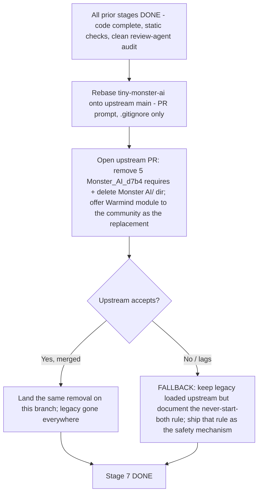

Fallback detail (upstream declines or lags). Do NOT remove the requires on this branch in
a way that will conflict every rebase. Instead ship the single-AI rule as the guarantee:
both the legacy Monster AI panel and the Warmind panel are manual-start, so they never
fight unless a DM starts both. The hazard if both are started is that they contend for
the SAME `token.properties._tmp_aicontrol` counter (the prompt-interception seam,
`Creature.lua`, class default 0; consulted in `AbilityInvokeAbility.lua`) -- two AIs each
incrementing/decrementing it corrupts each other's control lifecycle. The fallback ships:
(a) the legacy left loaded but never started, and (b) a prominently documented
"start exactly one monster AI at a time" rule in the community docs and the panel.

Divergence from the canonical directive (flagged, not hidden). CLAUDE.md's process note
(the "must stop loading the legacy module" line) states unconditionally that "the Warmind
rollout must stop loading the legacy module to avoid two AIs fighting over the same
`_tmp_aicontrol` counter." The fallback does NOT meet that literal "stop loading"
directive -- it leaves the legacy loaded and substitutes a runtime never-start-both rule.
It is justified on functional-equivalence grounds: an un-started module never runs, so it
never touches the shared `_tmp_aicontrol` counter, which means the fallback achieves the
directive's GOAL (no counter contention) without its literal mechanism (unloading), and
CLAUDE.md itself already blesses never-start-both as the pre-Stage-7 coexistence rule.
Because the fallback diverges from a canonical "must," taking this path REQUIRES first
reconciling the canonical doc: update the CLAUDE.md process note to admit the
upstream-declines contingency (the never-start-both rule is the shipped guarantee when the
removal cannot land upstream), rather than leaving the doc asserting an unconditional "must
stop loading" the fallback does not satisfy. With that reconciliation recorded, the
fallback is the coexistence design made explicit and shippable and stands in for a merged
removal at the upstream-coordination gate. Do NOT claim the fallback satisfies the gate
without that reconciliation, because on its face it does not meet the doc's literal wording.

#### Part 3 -- Final community-facing architecture doc

A new markdown, community-facing (distinct from the dev-internal `Draw Steel Warmind/
CLAUDE.md` and the `AGENTS.md` pointer). Recommended location:
`Draw Steel Warmind/ARCHITECTURE.md` (colocated with the module it documents); the repo
root is the acceptable alternative the P7 prompt allows. Do NOT resurrect `docs/ai/` --
it was deleted 2026-06-10 and ORIGINAL_PLAN's "replace docs/ai/architecture.md"
instruction is superseded by CLAUDE.md.

The doc is authored from the SHIPPED code after Stages 2-6 land, so every contract value
it states is copied from the then-current `Draw Steel Warmind/CLAUDE.md`, never invented.
Required sections and their source of truth:

| Doc section | Content | Sourced from (at Stage 7) |
|---|---|---|
| Design rules | The 5 non-negotiables: utility selector not framework; generic competence from traits; fail closed loudly; all mutation through the Adapter; never pcall yielding code | CLAUDE.md "Design rules" |
| File map | The 12 files and their responsibilities, load order | CLAUDE.md "File map" |
| Decision flow | Director -> Turn loop -> Snapshot -> Specs/Scoring -> Adapter -> initiative advance (Mermaid) | CLAUDE.md file responsibilities + WarmindTurn |
| Spec contract | `Warmind.RegisterSpec{ id, name, category, description, abilities, monsters, score, execute }` (`description` is required -- WarmindCore AssertFields it); candidate shape; scoring conventions (0.2 generic, 0.5-0.8 maneuver, 1.0 signature, 1.5-2.5 high-impact) | CLAUDE.md "Core contracts" |
| Prompt contract | `Warmind.RegisterPrompt{ prompts, handler }`; return `{targets=...}` / `"skip"` / `nil`; handlers never yield, never throw | CLAUDE.md "Core contracts" + WarmindPrompts |
| Override contract | how an override pack registers per-monster specs/prompts/tactic biases; the "removing a pack leaves the monster playing via generic specs" invariant | the Stage 6 CLAUDE.md addition (recorded by P6.1) |
| Reason codes | the full `Warmind.reason` vocabulary and what each means at the table | WarmindCore `Warmind.reason` |
| How to write an override pack | worked example following the Stage 6 pattern | WarmindOverrides + Stage 6 CLAUDE.md contract |

Decision-flow diagram the doc should carry (architecture, not an engine claim):

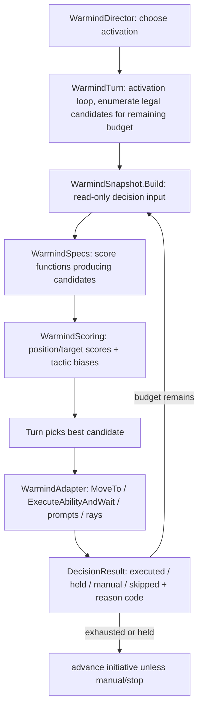

Reason-code vocabulary the doc lists (verbatim from `Warmind.reason`, complete as of
Stage 2): `NO_SUPPORTED_ACTION`, `NO_LEGAL_TARGET`, `NO_REACHABLE_POSITION`,
`UNSUPPORTED_COMPLEX_PROMPT`, `UNSUPPORTED_AREA_GEOMETRY`, `UNSUPPORTED_SQUAD`,
`EXECUTION_RECHECK_FAILED`, `EXECUTION_TIMEOUT`, `EXECUTION_ERROR`, `BUDGET_EXHAUSTED`,
`TAKEN_OVER_BY_DM`, `CANNOT_AFFORD`. Any code added in Stages 3-6 is appended at authoring
time from the then-current WarmindCore.

Doc style: exhaustive LLM reference, stable identifiers (file/function/constant names,
never line numbers), constant values inline, Mermaid + tables, pure ASCII.

### Key design decisions and risks

| Decision | Rationale |
|---|---|
| Delete the legacy only after every stage is DONE (code complete + static checks + clean review-agent audit), never at partial completion | Until all stages are DONE, Warmind is not yet the shipped replacement. Deleting the working baseline before that leaves the table with no monster AI if a regression surfaces during natural play (which, under the Verification model, is where first runtime exposure happens -- with PD as the recourse). |
| Remove requires as a contiguous block, no reflow of `main.lua` | The 5 requires are adjacent and self-contained; a minimal delete keeps the diff reviewable and the upstream PR trivially auditable. |
| Delete the whole `Monster AI/` directory (6 files incl. its CLAUDE.md), not just the 5 requires | Leaving orphaned Lua on disk invites accidental re-registration; the module's own CLAUDE.md is legacy-internal and goes with it. |
| Architecture doc at `Draw Steel Warmind/ARCHITECTURE.md`, not `docs/ai/` | `docs/ai/` was removed 2026-06-10; CLAUDE.md supersedes ORIGINAL_PLAN's docs/ai instruction. Colocation keeps the community doc next to the module. |
| Rewrite the two path-naming comments and any runtime string that names the legacy panel; RETAIN the pure provenance/rationale comments | The path-naming comments and the `WarmindSquads.lua` runtime message reference a deleted path/panel and would dangle, so they are rewritten; the attribution comments (naming the "Monster AI baseline" / DirectorTactics concept) carry no code dependency and are kept as provenance. P7 step 4's "no Warmind file references the deleted modules" is therefore read as "no functional/live-code reference remains," not "no literal token remains." |
| Fallback = document the never-start-both rule, not a fragile local-only removal | If upstream declines, a local-only require removal conflicts on every rebase; the manual-start + `_tmp_aicontrol` contention reality means an un-started legacy is inert, so a documented rule is the durable guarantee. |

| Risk | Mitigation / coverage |
|---|---|
| Removing requires does not take effect in the user's live DMHub install | The repo change (requires + deletes) is the code half. The Warmind side is agent-deployed: the rewritten Warmind files go into the mod store and the watcher hot-reloads them (L3 probe confirms a clean load). The legacy removal lives in the repo `main.lua` that loads `Monster AI/` (a different loading path from the Warmind mod store); whether editing repo `main.lua` propagates into a running DMHub session depends on the user's repo->DMHub sync and is not fully verifiable from this repo (unverified). Because Warmind's own code is unchanged by the cutover (only requires + dead files removed), no new load path is introduced; a `Monster_AI_d7b4` console error, if any, surfaces on that sync and is diagnosed via PD, not a scheduled gate [static]/[probe]. |
| Two AIs contend for `_tmp_aicontrol` if both run | Both panels are manual-start; ship + document the single-AI rule. In the fallback path this is the primary guarantee. |
| Upstream rejects or delays the shared removal | Fallback path (never-start-both, documented) stands in at the gate ONCE CLAUDE.md's "must stop loading" note is reconciled to admit the upstream-declines contingency (see Part 2 -- the fallback meets the directive's GOAL, no `_tmp_aicontrol` contention from an un-started module, not its literal "stop loading" mechanism); the branch does not carry a rebase-conflicting local-only removal. |
| Rebase drift by release time (upstream keeps moving) | Re-run the PR rebase prompt at release; audit note says the only expected conflict is `.gitignore` (keep upstream's rewritten block plus the branch's `*.DS_Stor*` line). |
| `AGENTS.md` legacy section goes stale after deletion | Stage 7 trims the "Legacy systems, for reference only" bullets that name the now-deleted modules. |
| Victory-screen / manual / stop contracts silently regress after the legacy is gone | These contracts live in Warmind code the cutover does not touch -- the deletions remove only requires + dead files, not any Warmind decision path -- so they are covered by the stage DONE gates that shipped them (Lesson 3 no-advance-on-manual, Lesson 4 stop=takeover, Lesson 11 victory-screen idle) and re-listed in the expected-runtime-behavior reference [static]. If one regressed it would show in the panel trace during natural play -> PD. |

Flags folded from the stage draft:

- P7 step 4 tension (recorded, not silently worked around): the prompt says "verify no
  Warmind file references the deleted modules," but a literal with-space grep for "Monster
  AI" returns SEVEN hits across FIVE Warmind Lua files today, not two -- the two path-naming
  comments (`WarmindSquads.lua`, `WarmindOverrides.lua`), a LIVE `string.format` runtime
  message in `WarmindSquads.lua` that tells DMs to use "the old Monster AI panel" (NOT a
  comment; misdirects to a deleted panel after cutover), and pure attribution comments in
  `WarmindSquads.lua` / `WarmindScoring.lua` / `WarmindSnapshot.lua` / `WarmindDirector.lua`
  -- plus the DirectorTactics rationale in `WarmindTraits.lua`. The space-less sweep commands
  (2-4) miss the with-space hits; sweep 5 catches them. Stage 7 rewrites the two path-naming
  comments and updates the runtime string, and INTENTIONALLY RETAINS the provenance/rationale
  comments -- so the check is read as "no functional / live-code reference," not "no literal
  token." Caveat: Stage 2's squad port (P2.4) likely rewrites the `WarmindSquads.lua`
  placeholder string and status comment before Stage 7 runs; the baseline here is the
  2026-07-10 state that Stage 7 re-runs and reconciles. Handled in Scope Part 1. Note: the
  P7 prompt IS modified under the Verification model (step 4's in-app regression checklist is
  replaced; the "soaked in real play" preamble is dropped -- see the P7 prompt provenance
  note), but its grep clause "verify no Warmind file references the deleted modules" is
  unchanged, so this functional-not-literal reading of "clean" is surfaced here as an
  execution note.
- Deletion count nuance: deleting `Monster AI/` removes 6 tracked files (5 Lua + its own
  `Monster AI/CLAUDE.md`), not the 5 Lua files the requires imply. Confirmed via
  `git ls-files "Monster AI/"`.
- `AGENTS.md` (the pointer file) has a live "Legacy systems, for reference only" section
  naming both `Monster AI/` and root `DirectorTactics*.lua`; P7 does not mention updating
  it, but those bullets dangle after deletion. Added to Stage 7 Scope/DoD.
- P7's done-criteria are lighter than the standard convention set: the PROMPTS.md text omits
  ALL THREE of the standard extras -- an explicit out-of-scope list, a review-agent audit of
  the session diff, and the standard deploy-and-verify closing. Under the Verification model the
  review-agent audit is not merely an extra: it plus the L3 post-cutover load probe IS the
  Stage 7 DONE gate (there is no manual gate to fall back on), and it is exactly what catches an
  over-broad deletion or a botched contiguous-block edit on `main.lua` (upstream-SHARED code; the
  session also deletes 21 tracked files). The execution notes below (a) supply the out-of-scope
  list, (b) mandate the review-agent audit of the deletion + `main.lua` diff plus the L3 load
  probe as the DONE gate, run before any destructive step and again on the final diff, and (c)
  require the standard deploy-and-verify closing (the rewritten Warmind files into the mod store,
  the hot reload confirmed).
- DONE-timing (terminal stage, resolved under the Verification model): P7 step 4 sets the
  CLAUDE.md Stage 7 row to DONE and THEN compiles the expected-runtime-behavior reference. That
  ordering is fine now, because the reference is documentation, not a gate -- the Stage 7 DONE
  gate is the review-agent audit of the deletion + `main.lua` diff coming back clean (see the
  Missing-conventions note above and the DONE-timing execution note below). There is NO paired
  P*.V in-app debrief; P7.V is removed under the Verification model. Set the row to DONE at
  P7's own closure, once that audit is clean and findings are fixed, never before the audit.
- ORIGINAL_PLAN Stage 7 vs current truth (resolved, CLAUDE.md wins): ORIGINAL_PLAN says
  "delete AGENTS.md" and "replace docs/ai/architecture.md." Both are stale -- the old
  AGENTS.md and `docs/ai/` were already removed 2026-06-10; the current AGENTS.md is the
  pointer file (keep it, trim its legacy section), and the architecture doc lands at
  `Draw Steel Warmind/ARCHITECTURE.md` (or root), not `docs/ai/` (conflict-resolution row 7).
- Loading-model asymmetry (verified, flagged as a partial unknown): the legacy is loaded by
  repo `main.lua`; Warmind is a separate user-registered DMHub module the user re-copies by
  hand. Whether editing repo `main.lua` propagates the legacy removal into a running DMHub
  session depends on the user's repo->DMHub sync step, which is not fully verifiable from
  this repo (tagged unverified). Coverage under the Verification model: the cutover changes
  no Warmind code path, so the clean-load expectation is [static] (grep sweep + the
  code-unchanged reasoning); a load failure, if any, surfaces immediately on the user's next
  DMHub copy-in as a `Monster_AI_d7b4` console error and is diagnosed via PD -- there is no
  scheduled in-app gate.

### Definition of done

- All of Stages 0-6 read DONE under the Verification model (code complete + static checks
  clean + a clean review-agent audit each; see the Verification model section). No soak
  precondition.
- The 5 `Monster_AI_d7b4` requires removed from `main.lua`; `Monster AI/` directory
  (6 files) deleted; 15 root `DirectorTactics*.lua` deleted.
- The two path-naming comments rewritten; the `WarmindSquads.lua` runtime string updated if
  it (or any successor) still names the legacy panel; `AGENTS.md` legacy section trimmed. The
  pure provenance/design-rationale comments (naming the Monster AI baseline / DirectorTactics
  concept) are intentionally retained.
- Grep sweep (the 5 commands above, including the with-space sweep 5) shows no functional /
  require / live-code reference to either removed module anywhere in the tree. The only
  remaining mentions are historical plan-doc text plus the intentionally-retained
  provenance/design-rationale comments enumerated in Part 1 -- so "clean" here means "no
  functional reference," not "no literal token."
- Clean-load reasoning holds [static]/[probe]: Warmind's own code is unchanged by the cutover
  (only requires + dead files removed), so no new load path is introduced, and the grep sweep
  confirms nothing outside `main.lua` required the legacy. The closure deploys the rewritten
  Warmind files into the mod store and probes the post-cutover load via the bridge (L3):
  module loads clean, no `Monster_AI_d7b4` console error. A load failure, if any, surfaces
  immediately on the hot reload -> PD. There is no full-encounter-playtest gate under the
  Verification model (the former playtest items live in the expected-runtime-behavior block
  below).
- `Draw Steel Warmind/ARCHITECTURE.md` exists, is pure ASCII (verified via
  `LC_ALL=C grep -nP '[^\x00-\x7F]'`), renders, and covers every required section.
- Upstream coordination resolved: the upstream require-removal PR is merged, OR the
  never-start-both fallback is shipped and documented in its place AND CLAUDE.md's
  "must stop loading" process note is reconciled to record that the fallback (functionally
  equivalent -- an un-started module never touches `_tmp_aicontrol`) stands in when the
  removal cannot land upstream.
- The review-agent audit of the deletion + `main.lua` diff (against CLAUDE.md and this Stage 7
  plan) comes back clean with findings fixed, and the L3 post-cutover load probe is clean (or
  DEFERRED honestly) -- together the Stage 7 DONE gate.
- `Draw Steel Warmind/CLAUDE.md` Stage 7 row set to DONE with the date at P7's own closure,
  once that review-agent audit is clean and L3 is clean (never before the audit; there is no
  separate confirmation session -- P7.V is removed under the Verification model). Final lessons
  folded in. No git commit or push without the user's explicit go-ahead; OFFER the cloud commit
  (m:CommitChanges) on the user's yes.

### Expected runtime behavior (agent-verified at the stage closure; see Verification model)

This is what the post-cutover module should look like at the table, and the P7 closure
confirms the load half via the agent-driven L3 probe (the Stage 7 DONE gate is the
review-agent audit of the deletion + `main.lua` diff plus that clean L3 load probe -- see
Definition of done). Each item carries a coverage tag (meanings defined once in the
Verification model section): `[probe]` = confirmed read-only via the L3 bridge probe (the
post-cutover load); `[static]` = caught by the review-agent audit, source verification, the
grep sweep, or the code-unchanged-by-cutover reasoning; `[live]` = requires an L4 live turn;
`[fail-closed]` = a wrong outcome degrades to a clean reason-coded hold or a manual prompt at
the table; `[accepted-risk]` = quality-only degradation, observable in the panel trace during
natural play and tuned later via PD. The behavioral items below are almost all [static] under
this stage because the cutover changes no Warmind decision path -- it removes only requires +
dead files -- so each behavior is owned by the stage that shipped it and merely re-confirmed
here (a live re-run is [live], recommended not required). If any of this misbehaves in play,
run PD -- do not add a gate.

- After the rewritten Warmind files are deployed and the legacy removed: module loads, zero
  console errors, no error mentioning `Monster_AI_d7b4` or any `MonsterAI*` file. [probe]
  (the L3 post-cutover load probe; a load failure surfaces on the hot reload -> PD)
- Warmind DM panel appears; the legacy Monster AI panel is gone (not merely un-started).
  [probe] (the requires and the `Monster AI/` directory are deleted, so the legacy panel
  can no longer register)
- Full encounter -- non-minion monster: moves, strikes (charge when melee out of reach),
  activation ends, initiative advances. [static] (Warmind code unchanged by the cutover;
  owned by the Stage 1/2 DONE gates)
- Full encounter -- minion squad: members spread (max 3 per target), one cast fires, every
  active member billed, no clumping onto reserved tiles. [accepted-risk] (spread/clumping is
  scoring quality, tuned via PD; the `UNSUPPORTED_SQUAD` hold path and per-member billing are
  [static], owned by the Stage 2 squad port)
- Full encounter -- solo with villain actions: villain actions fire in order 1 -> 2 -> 3, at
  most one per round, once each per encounter; malice abilities never overdraw. [static]
  (villain-action ordering owned by the Stage 4 DONE gate over `VillainActionState`; malice
  overdraw is barred by the `CanAfford` authority)
- Victory-screen idle: press "Award Victory" mid-run -> AI idles with status "Victory
  screen", no turn advancement (Lesson 11); after Proceed/End Combat the queue hides and the
  AI stays idle. [static] (Lesson 11 never-drive-LiveEncounter; the review audit confirms no
  `victoryAwarded` / `TrackHeroStats` / `DeployWave` call)
- Stop mid-turn -> clean `TAKEN_OVER_BY_DM`, no stale `_tmp_aicontrol` (Character
  Inspector), initiative NOT advanced (Lesson 4). [static]+[fail-closed] (Lesson 4 stop
  contract; stop is always clean)
- Manual/held outcome -> AI pauses, initiative NOT advanced, correct reason code in the
  trace (Lesson 3). [fail-closed] (this IS the fail-closed contract -- unsupported
  complexity holds cleanly and never advances)
- Grep sweep clean: the 5 commands above (including with-space sweep 5) show no functional /
  require / live-code reference to the removed modules; the remaining mentions are historical
  plan-doc text plus the intentionally-retained provenance/rationale comments enumerated in
  Part 1 (not "no literal token"). [static]
- `AGENTS.md` legacy section trimmed; no dangling references to deleted files. [static]
- `Draw Steel Warmind/ARCHITECTURE.md` renders and passes the ASCII check. [static]

### Kickoff prompts

#### P7 -- Cutover

The fenced prompt below now carries a concise scope, out-of-scope, and deploy-and-verify closing
inline, so it stands alone for a zero-context chat. Still apply the execution notes that follow it:
they add depth the fence only summarizes -- most importantly that the review-agent audit of the
deletion + `main.lua` diff must run BEFORE any destructive step as well as on the final diff (that
audit plus the L3 post-cutover load probe is the Stage 7 DONE gate), plus the fuller out-of-scope
boundary. The prompt is MODIFIED from PROMPTS.md (its soak preamble and in-app-regression clause
removed per the Verification model, and the re-copy list replaced by the deploy-and-verify closing).

```
Read "Draw Steel Warmind/CLAUDE.md" fully, especially the process note that "Monster AI/" is
upstream-SHARED (still required by upstream main.lua) -- this deletion is upstream-visible and the
require removal must land upstream too. All prior stages are DONE (each: code complete + static
checks + a clean review-agent audit; no soak requirement under the roadmap Verification model).
Execute Stage 7 in this order, showing me the plan before each destructive step:
1. Inventory: list the exact main.lua requires for Monster_AI_d7b4 and the 15 root
   DirectorTactics*.lua files; confirm nothing else in the repo references either (grep for module
   names, globals, and file references).
2. Remove the Monster_AI_d7b4 requires from main.lua; delete "Monster AI/"; delete the root
   DirectorTactics*.lua files. Confirm with me immediately before the deletions, and note the
   upstream coordination needed for the main.lua change.
3. Write the final community-facing architecture doc for Warmind (new markdown at the repo root or
   in "Draw Steel Warmind/") covering: design rules, file map, decision flow, spec/prompt/override
   contracts, reason codes, how to write an override pack. Doc style: exhaustive LLM reference,
   stable identifiers, Mermaid + tables, pure ASCII.
4. Update CLAUDE.md: set Stage 7 DONE only after the review-agent audit of the deletion + main.lua
   diff comes back clean AND the L3 post-cutover load probe is clean (that audit plus the probe is
   the Stage 7 DONE gate), plus final lessons; verify no Warmind file references the deleted modules;
   luac -p + ASCII sweep over all Warmind files; compile the expected-runtime-behavior reference for
   the post-cutover module (documentation for the release notes, not a gate).
Out of scope: any Warmind Lua change beyond rewriting the two path-naming comments and the one
legacy-panel runtime string, any behavior change, and anything outside the deletions plus the new
architecture doc.
Do not commit or push to git without my explicit go-ahead; OFFER the cloud commit (m:CommitChanges)
on my yes.

CLOSING - deploy and verify (autonomous loop; mechanics in CLAUDE.md "Autonomous dev loop"):
1. curl http://localhost:19876/health -s -m 5 - if the bridge is down, list the rewritten
   WarmindXxx.lua files and mark L3 DEFERRED in one honest line; stop here. (ARCHITECTURE.md is
   documentation and is never deployed; the deletions remove legacy files, not mod-store files.)
2. Deploy each rewritten WarmindXxx.lua by writing it into
   /Users/droideck/Library/Application Support/MCDM/Codex/mods/Warmind_be67/ (Write/Edit tool).
3. Confirm the automatic hot reload: tail Player.log for the "Local file changed ->
   RefreshLocalFiles -> reload success" chain and check no new errors; POST /reload only if the
   watcher did not fire.
4. Probe the post-cutover load read-only via POST /execute (L3): module loads clean, no
   `Monster_AI_d7b4` console error; report results.
5. CLAUDE.md is documentation - never deployed.
```

Prompt provenance: MODIFIED from `Draw Steel Warmind/PROMPTS.md` section "P7 -- Cutover"
-- in-app verification removed per the roadmap Verification model. Two changes: (a) the
preamble's "All stages are DONE and Warmind has soaked in real play" becomes "All prior
stages are DONE (each: code complete + static checks + a clean review-agent audit; no soak
requirement)"; (b) step 4's "full in-app regression checklist for me" becomes "compile the
expected-runtime-behavior reference for the post-cutover module" (documentation, not a gate),
and step 4 now gates the DONE flip on the review-agent audit. the deleted PROMPTS.md original survives only via this provenance note. Operational and execution notes for the executing session:

- Step 1's "confirm nothing else in the repo references either" is already true for
  functional code today (only `main.lua`). The with-space sweep 5 additionally surfaces
  provenance/rationale comments across FIVE Warmind Lua files (`WarmindSquads.lua`,
  `WarmindOverrides.lua`, `WarmindScoring.lua`, `WarmindSnapshot.lua`, `WarmindDirector.lua`),
  the DirectorTactics rationale in `WarmindTraits.lua`, a LIVE `string.format` runtime
  message in `WarmindSquads.lua`, and doc mentions in the plan files and `AGENTS.md` -- all
  expected, enumerated and dispositioned per Part 1 of the Scope.
- Step 4's "verify no Warmind file references the deleted modules" requires first rewriting
  the two path-naming comments (`WarmindSquads.lua`, `WarmindOverrides.lua`) AND updating
  the `WarmindSquads.lua` runtime string if it still names the legacy panel (Part 1). The
  pure provenance/rationale comments are intentionally retained, so read "clean" as "no
  functional / live-code reference," not "no literal token."
- DONE-timing (Stage 7 DONE gate = the review-agent audit; P7.V removed under the
  Verification model): the Stage 7 DONE gate is the review-agent audit of the deletion +
  `main.lua` diff coming back clean (see Missing-conventions below). Run that audit, fix every
  finding, and only THEN, at session closure, set the CLAUDE.md Stage 7 row to DONE with the
  date. There is NO separate in-app confirmation session -- the review audit is the gate. Step
  4 lists "set DONE" before "compile the expected-runtime-behavior reference" only because
  that reference is documentation, not a gate; compiling it does not gate DONE. Do NOT set the
  row DONE before the audit is clean.
- Missing conventions (P7 omits three of the standard done-criteria -- an explicit
  out-of-scope list, a review-agent audit of the session diff, and a closing deploy step):
  under the Verification model the review-agent audit is not just an extra -- it plus the L3
  post-cutover load probe IS the Stage 7 DONE gate, since there is no manual gate behind it.
  Because this session edits `main.lua` (upstream-SHARED code) and deletes 21 tracked files,
  run the review-agent audit of the deletion + `main.lua` diff (against CLAUDE.md and this
  Stage 7 plan) BEFORE any destructive step and again on the final diff -- that gate is exactly
  what catches an over-broad deletion or a botched contiguous-block edit, so it is not low risk
  despite the change being mostly mechanical. Treat as out of scope: any Warmind Lua change
  beyond the Part 1 comment/string rewrites, any behavior change, and anything outside the
  deletions plus the new architecture doc. The deploy step is short (only the rewritten Warmind
  Lua files go into the mod store; ARCHITECTURE.md is documentation and is never deployed), but
  run it via the standard deploy-and-verify closing at session end.

P7.V removed. The former "P7.V -- Stage 7 in-app regression confirm" session and its DONE
gate are removed under the 2026-07-11 Verification model (no manual in-app verification).
Stage 7's DONE gate is now the review-agent audit of the deletion + `main.lua` diff inside
the P7 build session (see the DONE-timing and Missing-conventions execution notes above);
the row flips to DONE at P7's own closure once that audit is clean. If the post-cutover
module misbehaves during natural play, PD (the on-demand play debrief in the Verification
model section) is the recourse -- never a scheduled gate.

---

## v1.0 -- Release definition and criteria

### Status

Not started. v1.0 is the terminal release milestone, gated on Stage 7 cutover being DONE
plus the community release criteria below. Today the branch sits at Stage 1 (DONE -- code
complete, statically verified, multi-pass reviewed; module hot-reload + load-clean verified
live 2026-07-11 via the bridge, turn behavior not yet exercised -- L4 pending, with PD as the
recourse when natural play surfaces anything) with Stage 2 planned; v1.0 is far downstream and
listed here so the release bar is fixed now rather than negotiated at the end.

v1.0 is defined EXPLICITLY as: Stage 7 cutover complete (legacy removed or the documented
fallback shipped, architecture doc landed, Stage 7 DONE via its review-agent audit + L3 load
probe) PLUS every release criterion in Scope below satisfied. Under the Verification model the
release evidence is: all stages DONE (code complete + static checks + L1 harness + L3
deploy-and-probe + L4 live turn exercise per stage + clean review-agent audits) + PV1's
source-only audit + an honest one-line real-table-exposure statement embedded in the release
notes. There is NO scripted soak and NO `SOAK_LOG.md` obligation.

### Scope

#### What ships

The 12-file Warmind DMHub module:

```
WarmindCore.lua      WarmindTraits.lua    WarmindSnapshot.lua   WarmindAdapter.lua
WarmindScoring.lua   WarmindSpecs.lua     WarmindPrompts.lua    WarmindSquads.lua
WarmindTurn.lua      WarmindDirector.lua  WarmindOverrides.lua  WarmindPanel.lua
```

Distribution happens through DMHub's module publishing. Local cloud commits are
agent-drivable at each stage's review closure via `m:CommitChanges("Stage N: <summary>",
engineVersion)` on the user's in-chat approval (their mod, their version history), so version
history can accumulate without a manual step. The final community publish/share flow -- how a
module is packaged, versioned, and made discoverable to the community -- remains user-driven
in the DMHub app, is NOT verifiable from this repo, and is tagged unverified; the release step
defers to whatever the DMHub module UI provides and this doc does not invent a flow.

#### What docs ship

| Doc | Audience | Content |
|---|---|---|
| `Draw Steel Warmind/ARCHITECTURE.md` (Stage 7 deliverable) | contributors / LLM sessions | exhaustive reference: design rules, file map, decision flow, spec/prompt/override contracts, reason codes, how to write an override pack |
| Warmind quickstart (new, user-facing) | DMs at the table | install the module, open the panel, start/stop/step/takeover semantics, and what each fail-closed reason code means in play (e.g. `UNSUPPORTED_SQUAD` = "finish this squad by hand", `TAKEN_OVER_BY_DM` = "you stopped it", `NO_LEGAL_TARGET` = "nothing to hit, turn ended") |
| Override-pack how-to (community monster authors) | content authors | how to add a per-monster pack via the existing registries; the "remove the pack and the monster still plays via generic specs" invariant. May live as a section of ARCHITECTURE.md (cross-referenced) or as its own file |

The quickstart is a NEW user-facing doc beyond the architecture reference (the
architecture doc is contributor-grade; DMs need a shorter "what the buttons do and what
the reason codes mean" page). The override how-to is the architecture doc's
"how to write an override pack" section surfaced for authors.

#### Real-table exposure statement (replaces the soak bar)

There is NO scripted soak requirement and NO `SOAK_LOG.md` obligation under the Verification
model. Agent-driven runtime evidence is embedded per stage via L3 deploy-and-probe and L4 live
turn exercise (the stage DONE notes carry it); PV1 lists that separately. Why relying on it is
safe rather than reckless: the architecture is fail-closed by design (see the Verification
model section) -- every decision emits a `DecisionResult` with a stable reason code,
unsupported complexity holds or hands to the DM cleanly, driver errors auto-stop the AI, manual
outcomes pause without advancing initiative, and stop is always clean. A wrong assumption
degrades to a clean reason-coded hold or a manual prompt at the table, never a hang or corrupted
state (Lessons 1-11). That safety net is what a soak regime would otherwise buy.

In place of a soak bar, the release notes carry ONE honest line from the user stating how
much REAL-TABLE play the module has actually seen (distinct from the agent-driven L3/L4
evidence). If that exposure is minimal or none, the release is labeled beta and the release
notes say so plainly -- community expectations are set by documentation, not by a checklist
regime. PV1 asks the user for that statement and embeds it in the release-notes text it
produces; PV1 verifies no log file.

Recommended (not required) natural play: if the user does exercise the module before release,
the three highest-judgment control surfaces -- where natural play is most informative -- are:

1. A minion-squad fight (exercises the Stage 2 squad lifecycle: spread, tile reservation,
   per-target main-attacker ordering, control release on every exit path).
2. A solo-with-villain-actions fight (exercises the Stage 4 Director: villain scheduler
   1 -> 2 -> 3 once each per encounter, malice spend policy, multi-action turns).
3. A multi-group Director fight (exercises activation-chooser heuristics and cross-group
   ordering).

This list is a suggestion for where play is most informative, not a gate; whatever exposure
results is what the real-table-exposure statement reports honestly. If any of these misbehaves
in play, run PD (the on-demand play debrief in the Verification model section) -- never a
scheduled gate.

#### Upstream coordination status required for v1.0

One of the two must be true:

- The upstream PR removing the 5 `Monster_AI_d7b4` requires and deleting `Monster AI/` is
  merged; OR
- The documented never-start-both fallback shipped in its place (legacy left loaded
  upstream but never started; the single-AI rule documented in the quickstart and the
  panel, grounded in the shared `_tmp_aicontrol` contention hazard).

#### Versioning / branch note

`tiny-monster-ai` is rebased onto upstream main before release (run the PR prompt from the
"Cross-cutting session" section of this roadmap; audited safe, the only expected conflict is `.gitignore`
-- keep upstream's rewritten block plus this branch's `*.DS_Stor*` line; root CLAUDE.md
auto-merges). Re-run at release time because upstream keeps moving.

#### Post-v1.0 deferrals (carried from the plans)

Explicitly out of scope for v1.0; each fails closed with a stable reason code so the next
override pack is obvious. Carried from ORIGINAL_PLAN "Out of scope for v1" and the
STAGE2_PLAN "Deferred" table:

- Summon placement.
- Mount / rider compound turns.
- Nontrivial nested prompt chains.
- Unusual area geometry.
- Scenario-objective play beyond hints (objective hints as scoring nudges may come; full
  objective play does not).
- Pure-prose shift riders ("shifts up to 2 between targets" free-text; undetectable
  without per-ability annotation -- accepted miss, revisit as Stage 6 annotations).

These are documented as known limitations in the user-facing quickstart so players know
what the AI hands back rather than improvising.

### Key design decisions and risks

| Decision | Rationale |
|---|---|
| v1.0 = Stage 7 DONE + a fixed release bar, set now | Prevents scope drift at the finish line; the doc/upstream/exposure-statement criteria are agreed before the last stage lands. |
| No scripted soak bar; runtime exposure stated honestly in the release notes | The architecture is fail-closed by design (Verification model section), so systematic soak testing is not the mechanism that buys safety -- review + source verification + fail-closed degradation are. Where natural play is most informative (squad, solo+villain, multi-group) is a recommendation, not a gate; PD handles whatever play surfaces, and the release notes state exposure honestly (labeling the release beta if minimal). |
| Do NOT invent DMHub publish mechanics | The publish flow is in-app and user-driven; fabricating steps would mislead. Tagged unverified; defer to the DMHub module UI. |
| Ship a separate DM-facing quickstart, not just the contributor doc | DMs need button semantics and reason-code meanings at the table; the exhaustive architecture reference is the wrong altitude for that. |
| Upstream removal OR documented fallback both satisfy the gate | The community value (a working, documented Warmind) does not depend on upstream accepting the deletion; the fallback keeps both AIs safely coexisting. |

| Risk | Mitigation / coverage |
|---|---|
| Publish mechanics differ from any assumption | Tagged unverified; PV1 confirms docs exist but does not assert a publish flow. Release step follows the live DMHub UI. |
| Upstream declines the removal | Fallback (never-start-both, documented) ships instead; PV1 checks that the fallback doc exists if the PR is not merged. |
| Runtime exposure is not systematically measured | Accepted by design (fail-closed architecture, Verification model section). PD handles whatever natural play surfaces; the release notes state exposure honestly and label the release beta if minimal. No soak log is kept or verified. |
| Rebase conflicts beyond `.gitignore` appear as upstream moves | PV1 re-checks the rebase precondition; anything beyond `.gitignore` stops for human review (per the PR prompt). |
| Post-v1.0 gaps surprise players | Documented as known limitations in the quickstart; each already fails closed with a reason code. |

### Definition of done

- Stage 7 DONE via its review-agent audit + L3 load probe: legacy removed or fallback shipped,
  architecture doc landed, grep sweep clean, post-cutover load probed clean [probe].
- All of Stages 0-6 DONE under the Verification model (code complete + L0 static checks + L1
  harness + L2 source folds + L3 deploy-and-probe + L4 live turn per stage 2/4/5/6 + clean
  review-agent audits).
- Real-table-exposure statement present in the release notes: one honest line on how much
  real-table play the module has seen (distinct from the agent-driven L3/L4 evidence); the
  release is labeled beta if that exposure is minimal. No soak log.
- Upstream coordination resolved: PR merged, OR never-start-both fallback shipped and
  documented.
- `tiny-monster-ai` rebased onto upstream main at release.
- Doc set present and ASCII-clean: `ARCHITECTURE.md`, the DM quickstart, the override
  how-to.
- Post-v1.0 deferrals documented as known limitations in the user-facing docs.
- The 12-file module is the shipped artifact; distribution via the DMHub module UI
  (user-driven; publish mechanics unverified from this repo).

### Release-evidence reference (not a gate)

This is the source-verifiable release evidence PV1 audits, plus a note on natural play. It is
NOT a verification checklist and NOT a DONE gate -- the release bar is the Definition of done
above. Each item carries a coverage tag (tag meanings are defined once in the Verification
model section). If anything misbehaves during natural play, run PD -- do not add a gate.

- Agent-driven runtime evidence: each stage DONE note carries its L3 deploy-and-probe result
  and (for Stages 2/4/5/6) its L4 live turn result (or an honest DEFERRED line); PV1 lists
  these separately from the user's real-table statement. [probe] [live]
- Stage 7 post-cutover regression: covered by the Stage 7 "Expected runtime behavior
  (agent-verified at the stage closure)" list above -- the cutover changes no Warmind decision
  path, so those behaviors are [static]/[probe] (owned by the stage that shipped each) with the
  fail-closed contracts (stop=takeover, manual=no-advance) [fail-closed]. Not re-run as a gate.
- Grep sweep (the 5 Stage 7 commands) shows no functional / live-code reference to the
  removed modules (retained provenance/rationale comments excepted, per Part 1). [static]
- `ARCHITECTURE.md`, the DM quickstart, and the override how-to all exist, render, and pass
  `LC_ALL=C grep -nP '[^\x00-\x7F]'`. [static]
- Upstream state confirmed: PR merged OR the never-start-both fallback doc is present.
  [static]
- Branch rebased onto upstream main (only `.gitignore` resolved; nothing else conflicted).
  [static]
- The DM quickstart lists the post-v1.0 known limitations. [static]
- Real-table-exposure statement embedded in the release notes; release labeled beta if
  real-table exposure is minimal. [static] (PV1 confirms the line is present; it does not run DMHub)

Recommended (not required) natural play: see the Runtime exposure statement -- a minion-squad
fight, a solo-with-villain-actions fight, and a multi-group Director fight are the most
informative surfaces to exercise if the user plays, but none is a gate; PD handles what play
surfaces.

### Kickoff prompts

#### PV0 -- Author the DM-facing quickstart (run before PV1)

PV1 only AUDITS that the DM quickstart exists (it creates no files), and P7 authors only
`ARCHITECTURE.md`; nothing else in the roadmap writes the quickstart, yet the v1.0 doc set,
Definition of done, and release-evidence reference all require it. This session produces it, so PV1
can pass. Run it after Stage 7 is DONE and before PV1. The fenced prompt has no in-app or soak
content and is authored here, following this roadmap's Prompt conventions section:

```
Read "Draw Steel Warmind/CLAUDE.md" fully, then "Draw Steel Warmind/ARCHITECTURE.md" for the reason
codes and the panel/stop contracts you will summarize. Write ONE new user-facing doc,
"Draw Steel Warmind/QUICKSTART.md", for DMs at the table -- short and task-oriented, NOT the
exhaustive contributor reference (cross-reference ARCHITECTURE.md for depth). Cover exactly:
- Install: register / copy the 12-file Warmind module through the DMHub module UI.
- Open the panel, and what the start / stop / step / takeover controls do (stop = clean takeover
  honoring the Lesson 4 contract, leaves initiative untouched; step = pause after each activation,
  resume with one click; takeover = you drive this turn by hand).
- What each fail-closed reason code means in play, in plain language -- at minimum
  UNSUPPORTED_SQUAD ("finish this squad by hand"), TAKEN_OVER_BY_DM ("you stopped it"),
  NO_LEGAL_TARGET ("nothing to hit, turn ended"); give the full shipped reason-code set from
  CLAUDE.md a one-line player-facing gloss each (a small table is fine).
- If the never-start-both fallback shipped instead of the upstream removal: the single-AI rule --
  never run legacy Monster AI and Warmind at the same time (shared _tmp_aicontrol contention).
- Post-v1.0 known limitations (from the roadmap's Post-v1.0 deferrals): summon placement,
  mount / rider compound turns, nested prompt chains, unusual area geometry, scenario-objective play
  beyond hints, pure-prose shift riders -- framed as "what the AI hands back to you, and why."
Doc style: user-facing quickstart prose with tables where they help, pure ASCII
(LC_ALL=C grep -nP '[^\x00-\x7F]' clean). Make no Lua changes. Do not commit. End by listing the new
file for me to review.
```

Prompt provenance / convention carve-out: PV0 is authored here (no `PROMPTS.md` entry). As a
pure doc-authoring session that writes one Markdown file -- no Lua, no deployed artifact --
the standard done-criteria `luac -p`, the review-agent audit of the session diff, and the
closing deploy-and-verify step do not apply: there is nothing to parse-check, no code diff to
audit, and nothing to deploy (docs are never deployed). The `LC_ALL=C grep -nP '[^\x00-\x7F]'`
ASCII check plus the user's review of the new file are the bar. This mirrors PV1's own carve-out
below.

#### PV1 -- v1.0 release readiness audit

```
Read "Draw Steel Warmind/CLAUDE.md" fully. This is a v1.0 release-readiness AUDIT session:
documentation and verification only. Make NO Lua changes, create NO files, do not commit, do not
push. The upstream PR description below is produced as in-message text only, never written to a file.

Preconditions to assume already true (this session confirms them, it does not perform them): every
stage 0-6 is DONE, and Stage 7 cutover has been executed (legacy removed or the never-start-both
fallback shipped, and "Draw Steel Warmind/ARCHITECTURE.md" written).

Do exactly this:
1. Compile the expected-runtime-behavior blocks from every stage into ONE reference appendix for
   the release notes: the Stage 1 behavior list (bottom of CLAUDE.md) and each stage section's
   "Expected runtime behavior (agent-verified at the stage closure; see Verification model)" list in
   "Draw Steel Warmind/ROADMAP.md" (including Stage 7's). Note beside each stage which L3/L4 the
   closure ran (or DEFERRED). Mark the appendix as reference documentation: it records what play
   should look like, how each item is covered ([harness] / [probe] / [live] / [fail-closed] /
   [accepted-risk]), and the agent-driven runtime evidence per stage; this session itself neither
   runs DMHub nor asserts new pass/fail results.
2. Do NOT look for or require a soak log -- none is kept under the Verification model. The
   agent-driven L3/L4 evidence lives in the stage DONE notes (list it separately). Then ask me for
   the one-line REAL-TABLE-exposure statement (how much real-table play the module has actually seen)
   and embed it verbatim in the release-notes text you produce. If that exposure is minimal or none,
   label the release beta in the notes and say so plainly.
3. Confirm the release doc set exists and is pure ASCII (run LC_ALL=C grep -nP '[^\x00-\x7F]' on
   each): "Draw Steel Warmind/ARCHITECTURE.md", the DM-facing quickstart, and the override-pack
   how-to. For each, list any required section that is missing (design rules, file map, decision
   flow, spec/prompt/override contracts, reason codes, override-pack authoring; and for the
   quickstart: install, open panel, start/stop/step/takeover semantics, reason-code meanings, and the
   post-v1.0 known-limitations list).
4. Confirm upstream coordination is resolved: either the upstream PR removing the 5 Monster_AI_d7b4
   requires and deleting "Monster AI/" is merged, OR the never-start-both fallback is documented in
   its place. Then PRODUCE (as text in your final message, do NOT commit it) the upstream PR
   description for the require removal: what it removes (the 5 Monster_AI_d7b4 requires from main.lua
   and the "Monster AI/" directory), why (superseded by the community Warmind module), the shared-code
   note, and the single-AI / _tmp_aicontrol-contention rationale.
5. Confirm the branch tiny-monster-ai is rebased onto upstream main (only .gitignore expected to
   conflict); if not, state that the PR rebase prompt (in the "Cross-cutting session -- rebase onto
   upstream main" section of "Draw Steel Warmind/ROADMAP.md") must run first.

Out of scope: any Lua change, any deletion, any commit or push, re-deriving the engine. This session
only audits, compiles the release-notes reference appendix, embeds my real-table-exposure statement,
and produces the PR-description text. End with a single go / no-go verdict for v1.0 -- measured
against the v1.0 Definition of done (no soak gate; evidence = all stages DONE with their agent-driven
L3/L4 evidence + this audit + the real-table-exposure statement) -- and, if no-go, the exact
remaining items.
```

Prompt provenance: PV1 is a NEW prompt written for this roadmap (no v1.0 audit prompt
exists in PROMPTS.md), then revised under the roadmap Verification model (no manual
verification; agent-driven L3/L4 per stage). Two revisions: step 1 now compiles the per-stage
expected-runtime-behavior blocks (with their agent-driven L3/L4 evidence) into a single
release-notes appendix marked reference documentation (formerly it formatted in-app regression
checklists for the user to run in DMHub); step 2 now lists the agent-driven L3/L4 evidence and
asks the user for the one-line real-table-exposure statement, embedding it in the release notes
(formerly it verified a committed `SOAK_LOG.md`, which no longer exists), and the go/no-go
verdict is measured against the rewritten v1.0 Definition of done. It follows every convention in this
roadmap's Prompt conventions section: opens by reading `Draw Steel Warmind/CLAUDE.md` fully; single
self-contained workstream (release audit) with an explicit out-of-scope list; no new Lua files
and no commits; `LC_ALL=C grep -nP '[^\x00-\x7F]'` run on each touched doc. `luac -p` is
intentionally omitted because this session makes no Lua changes (nothing to parse-check); this
is a documentation/verification session, which the conventions permit. It produces the
upstream PR-description text and the release-notes text as in-message artifacts only, never
committed.

---

## Conflict resolutions (original plan vs current truth)

Default resolution principle: ROADMAP.md adopts current truth (CLAUDE.md / verified
repo facts); CLAUDE.md wins over ORIGINAL_PLAN. Rows tagged `[SRC]` are the exception
(CLAUDE.md is stale vs re-verified source; source wins; the CLAUDE.md correction is
folded at the stage's review-closure session -- the session that flips the stage to
DONE and folds engine-fact corrections into CLAUDE.md's verified surface. Under the
2026-07-11 verification model (see the Verification model section) there is no separate
in-app verification session: every former P*.V debrief is removed, so [SRC] folds land
at the review closure (P2.5 for Stage 2; P3.2's review closure for Stage 3; P4.2's
review closure for Stage 4; the analogous review closure for Stages 5/6/7), never at a
P*.V).

### A. ORIGINAL_PLAN.md vs current truth

| # | Topic | Original plan said | Current truth | Resolution in this roadmap |
|---|---|---|---|---|
| 1 | Villain-action ability field | `ability.maliceAction` (Villain Actions row + Traits) | Field is `ability.villainAction` ("Villain Action 1\|2\|3"); `Traits.Get` sets `villainAction = ability:try_get("villainAction")` | Adopt `villainAction` everywhere (traits, specs, Director scheduler). CLAUDE.md wins. |
| 2 | Prompt-interception seam location | Consulted in `AbilityInvokeAbility.lua` at a location ORIGINAL_PLAN cited that is now stale; `ExecuteInvoke` unlisted | Consult logic byte-identical but relocated within `AbilityInvokeAbility.lua` (re-verified 2026-07-07); `ExecuteInvoke` is the direct-invocation entry point | Refer to the seam by name -- the prompt-interception consult logic in `AbilityInvokeAbility.lua` and `ExecuteInvoke`; semantics unchanged. Stages that touch the seam (P2.3, PR spot-check) verify against CLAUDE.md's rows, never a line number. CLAUDE.md wins. |
| 3 | Prompt-callback return values | callback returns `"inherit"` \| `"prompt"` | Returns `"inherit"` \| `"prompt"` \| `"skip"` (skip aborts the sub-ability); `MakePromptCallback` honors all three | Adopt the 3-value contract; handlers may return `"skip"`. CLAUDE.md wins. |
| 4 | LOS ray teardown | Ray has `:DestroyLineOfSight()` (baseline usage) | Stub-documented teardown is `:Destroy()`; `WarmindAdapter.DestroyRays` tries `Destroy()` first, falls back to `DestroyLineOfSight()`, both pcall-wrapped (uncommitted working-tree change already lands this) | Keep the dual-path teardown (pcall-wrapped, static-checked by review [static]). Absence of lingering targeting markers is expected runtime behavior (reference, not a gate) -- a stray marker is a quality-only visual artifact observable in play [accepted-risk], never a DONE blocker. CLAUDE.md wins. |
| 5 | Per-turn budget reading | OPEN "verify at Stage 1" item: is `GetResourceUsage(resourceId, "turn")` right; fallback = self-track | RESOLVED: `creature:GetResourceUsage(resourceId, "turn")` with the `"turn"` refresh key is correct; the engine itself uses `"turn"` for action/maneuver | Treat as settled; `BuildBudget` reads action/maneuver usage with `"turn"`, usage `< 1` = available. No fallback path. CLAUDE.md wins. |
| 6 | Error isolation for yielding code | "Everything pcall-wrapped; errors return DecisionResult" (Adapter) | Lesson 1: pcall + yield is UNSAFE; yielding code is isolated by `Warmind.Guard` (nested coroutine); pcall ONLY around provably non-yielding calls (string.format, doc reads, ray create/destroy, GetStandardAbility) | Adopt Guard for all yielding isolation; forbid pcall around casts/moves/waits. Enforced by review every stage. CLAUDE.md wins. |
| 7 | Stage 7 doc deletions | "delete AGENTS.md" + "replace docs/ai/architecture.md" | `docs/ai/` and the old AGENTS.md already removed 2026-06-10; current AGENTS.md is a POINTER (keep, trim its legacy section); community doc lands at `Draw Steel Warmind/ARCHITECTURE.md` (root allowed) | Do NOT recreate `docs/ai/`; keep+trim AGENTS.md; author ARCHITECTURE.md. Stage 7 draft adopts this. CLAUDE.md wins. |
| 8 | Stage status | Plan structure treats Stages 0-7 as all to-build | Stage 0 DONE; Stage 1 DONE (code complete, statically verified, multi-pass reviewed; ZERO runtime exposure to date); Stage 2 planning complete (STAGE2_PLAN.md), implementation not started; Stages 3-7 planned only | Roadmap records actual status per stage under the 2026-07-11 model (DONE = code complete + static checks + review closure, no in-app gate). Stage 0/1 sections are retrospective; Stage 1's first runtime exposure happens during natural play, with PD (on-demand play debrief) as the recourse -- stated honestly, not hidden. Stage 2 is "plan complete, impl not started." git wins on repo facts; CLAUDE.md's status wording ("AWAITING in-app verification") is realigned to this model by the orchestrator. |
| 9 | `Monster AI/` ownership | Implied branch-local baseline ("currently loaded", ~2k lines) | Upstream-SHARED: byte-identical on upstream main 5f6a04b, still required by upstream main.lua; the Stage 7 removal is upstream-visible | Stage 7 adds an upstream-coordination part (PR upstream + fallback never-start-both rule). CLAUDE.md wins. |
| 10 | `MainAttackerForTarget` | (Not in ORIGINAL_PLAN; 2026-06-10 audit note had recorded it DELETED upstream) | RESTORED upstream in `ActivatedAbilityCast.lua`; the editor-driven Cast path sources invoked sub-abilities + caster-benefit behaviors per target from the FIRST matching targetPairs entry | Adopt "restored"; Warmind's direct ExecuteInvoke is unaffected, but targetPairs ordering is load-bearing (row 12 / Lesson 13). CLAUDE.md wins. |
| 11 | `GetActivatedAbilities` clone semantics | Not addressed; plan compared abilities loosely | Lesson 12: every result is a fresh `MakeTemporaryClone`; ability objects are NOT identity-stable across snapshots -- compare by NAME only; within one iteration identity is fine; never pass `excludeGlobal` (strips free strikes AND malice together) | All specs/snapshot code key abilities by name; `Snapshot.FindAbility(snapshot, name)` is the lookup. No `excludeGlobal`. CLAUDE.md wins. |
| 12 | `targetPairs` ordering | `targetPairs = {{a=minion, b=target}}` with no ordering note | Lesson 13: the FIRST pair whose `b` matches a target selects that target's main attacker (source of invoked pushes/conditions + caster-benefit behaviors) | Squad port (P2.4) lists the best-positioned member's pair FIRST per target charid; the P2.5 diff review verifies the ordering against Lesson 13 [static]. Correct main-attacker attribution is expected runtime behavior (reference, not a gate) -- a misordered pair sources the invoked push/condition from the wrong minion [accepted-risk], observable in the panel trace, never a hang. CLAUDE.md wins. |
| 13 | DecisionResult shape | `{ status, reasonCode, reason, trace = {...} }` | Shipped: `{ status, reasonCode, reason, detail = {...} }`; constructors `ResultExecuted/Held/Manual/Skipped`, `DescribeResult` | Field is `detail`, not `trace`. Reposition move uses `detail.moveOnly = true`. CLAUDE.md wins. |
| 14 | Spec contract signature | `{ id, name, category, appliesTo(snapshot)->bool, score(snapshot)->candidate, execute(adapter, snapshot, candidate)->DecisionResult }` | Shipped `Warmind.RegisterSpec{ id, name, category, description(required), abilities?, monsters?, score = fn(spec, ctx, snapshot, abilities)->candidate\|nil, execute = fn(spec, ctx, candidate, abilities)->DecisionResult\|nil (nil=executed) }`. No `appliesTo`; applicability comes from `category`+`SpecMatchesMonster`+`abilities`/`monsters` gating in `ChooseCandidate` | Adopt the shipped 4-arg score/execute arity and the (spec, ctx, ...) receiver; there is no `appliesTo` hook; `description` is AssertField-required. CLAUDE.md wins. |
| 15 | Traits accessor | `Warmind.GetTraits(ability, creature)` (takes a creature; reads `maliceAction`) | `Warmind.Traits.Get(ability)` -- PURE, no token/creature reads (raw `.numTargets` stored; live value resolved by snapshot/spec); reads `villainAction` | Traits stays pure and single-arg; live token reads live in Snapshot/Specs. CLAUDE.md wins. |
| 16 | Snapshot builder name | Unnamed "builds the per-activation Snapshot" | `Warmind.Snapshot.Build(token)` + `Warmind.Snapshot.FindAbility(snapshot, name)`; rebuilt every decision iteration | Use `Snapshot.Build`; per-iteration rebuild is load-bearing (movement/casts change reachability). CLAUDE.md wins. |
| 17 | Scoring function names | `FindBestStrikePosition`, `FindBestAreaPosition` | Shipped: `FindValidStrikeTargets`, `FindBestStrikePosition`, `FindBestBurstPosition` (area renamed to burst), `FindClosestEnemy`, `DistanceFromNearestEnemy` | Use `FindBestBurstPosition` for self-centered bursts; Stage 3 place_template reuses the Push! scorer, not FindBestAreaPosition. CLAUDE.md wins. |
| 18 | Aid-attack detection | "replace the hardcoded aid-attack GUID with a name-based ongoing-effect lookup" | Current keeps the GUID `e234f1f4-9953-43bd-894c-d96adbb63f84` as a load-bearing NAMED constant (structured, reliable signal; no clean name-based path) | Keep the GUID constant (Traits `isAidAttack`, Snapshot `aidAttacked` flag, `aid_attack` tactic). Do NOT switch to a name lookup. STAGE2_PLAN/CLAUDE.md win. |
| 19 | Budget shape | `{ mainAction = n, maneuver = n, moveBudgetTiles = n }` | `budget = { hasMainAction, hasManeuver, dazed }` (booleans from usage `< 1`); `moveRemaining` is a separate snapshot field (`CurrentMovementSpeed - DistanceMovedThisTurn`, floored 0) | Adopt boolean budget + separate moveRemaining; `CategoryAllowed` gates on `hasMainAction`/`hasManeuver`/dazed. CLAUDE.md wins. |
| 20 | Candidate shape | `{ score, loc, targets, abilities, notes }` | `{ score = number, loc = Loc\|nil, ... }` -- arbitrary extra data flows to execute (no fixed `targets`/`notes` keys) | Adopt the open candidate shape; specs attach whatever execute needs. CLAUDE.md wins. |
| 21 | Reason-code vocabulary | Trimmed 10: NO_SUPPORTED_ACTION, NO_LEGAL_TARGET, NO_REACHABLE_POSITION, UNSUPPORTED_COMPLEX_PROMPT, UNSUPPORTED_AREA_GEOMETRY, EXECUTION_RECHECK_FAILED, EXECUTION_TIMEOUT, EXECUTION_ERROR, BUDGET_EXHAUSTED, TAKEN_OVER_BY_DM | Shipped 12: the above PLUS `UNSUPPORTED_SQUAD` (Stage 1 hold) and `CANNOT_AFFORD` (execution-time). NO_REACHABLE_POSITION + UNSUPPORTED_AREA_GEOMETRY declared but unused until Stage 2 | Adopt the 12-code table; Stage 4 may add optional MALICE_WITHHELD / VILLAIN_ACTION_HELD (P4.1 decides). ARCHITECTURE.md lists the then-current set. CLAUDE.md wins. |
| 22 | Stage 0 registration | "Stage 0: add requires to `main.lua`" | Warmind is a SEPARATE DMHub module loaded from the on-disk mod store at `mods/Warmind_be67`; the 12 files are NOT in repo main.lua | No main.lua requires for Warmind; sessions deploy changed files into the mod store and the watcher hot-reloads them (the manual re-copy convention this row once carried is superseded by row 39's autonomous loop). CLAUDE.md wins. |
| 23 | Module size target | "~4-6k lines" | Current 12-file total ~2,257 lines (Stages 2-6 unwritten) | Not a contradiction, a scale note; the line target is not a gate. Roadmap tracks stages, not line count. |
| 24 | Stage 5 camera | "port CenterOnToken/SyncCamera behavior" | Both already wired in the Stage 1 `WarmindPanel.lua` (`SelectNextActivation`, `CenterOnPlayers`) | Stage 5's only camera work is the persisted `warmindfollowcamera` gate over the existing calls; no port. CLAUDE.md wins. |
| 25 | Stage 6 scope framing | "extra specs + weight tweaks + prompt handlers" (per bespoke monster) | Six of seven legacy Main Actions are the monster's Signature and are FULLY covered by generic `signature_strike`; real Stage 6 surface = malice plays + the Ghoul Leap-and-Claw combo + one priority-tuning override spec (Bugbear Blistering Element) | Register ONLY non-redundant behavior; never re-register a generic signature (dead-weight, loses the score tie). Stage 6 draft adopts this. |
| 26 | Stage 7 deletion list | delete `Monster AI/`, 15 DirectorTactics, `AGENTS.md`, `docs/ai/` | Deletions = 5 `Monster_AI_d7b4` requires + `Monster AI/` dir (6 tracked files incl. its CLAUDE.md) + 15 root DirectorTactics*.lua. `docs/ai/`+old AGENTS.md already gone; current AGENTS.md kept+trimmed; provenance comments in Warmind Lua intentionally retained | Adopt the shrunk list; "clean" = no functional/live-code reference, not "no literal token." Stage 7 draft adopts this. CLAUDE.md wins. |
| 27 | Villain "max 1 per round" mechanism | Framed via `VillainActionState.HasUsed/MarkUsed` (per-encounter once-each) | `[SRC]` Re-verified in Stage 4 planning: the per-round cap is `CharacterResource.GetVillainActions()` (engine sets it to 1 at NextRound, casts zero it). `VillainActionState` carries ONLY the per-encounter once-each dimension | Scheduler reads `GetVillainActions() > 0` for the round cap and `VillainActionState.HasUsed` for order/once-each; NO Warmind round counter. Source wins; P4.1 must not derive the round cap from VillainActionState. |
| 28 | Engine villain-action bookkeeping | Not stated | `[SRC]` The engine CastCoroutine calls `VillainActionState.MarkUsed(caster.charid, key)` AND `SetVillainActions(0)` on completion of any villain-action cast (incl. AI casts) | Warmind's scheduler stays READ-ONLY (never MarkUsed, never SetVillainActions); firing via `ExecuteAbilityAndWait` is sufficient. Source wins; the CLAUDE.md villain-row fold lands at Stage 4's review closure (P4.2's review closure), not a removed P4.V. |

### B. STAGE2_PLAN.md / PROMPTS.md / CLAUDE.md-internal staleness (source beats the stale doc)

| # | Topic | Stale doc says | Current truth | Resolution in this roadmap |
|---|---|---|---|---|
| 29 | Forced-movement geometry API | STAGE2_PLAN Workstream E: `ability:CustomTargetShape(casterToken, range, symbols)` (3-arg) | `[SRC]` The effective Draw Steel override in `MCDMActivatedAbility.lua` takes 4 args and shadows the 3-arg base; baseline's commented-out call is `CustomTargetShape(casterToken, range, symbols, {})` | P2.3 uses the 4-arg form (pass `{}` for targets); the Stage 2 roadmap section already records this override of the STAGE2_PLAN 3-arg spec. Source wins. |
| 30 | Stage 2 DONE flip | STAGE2_PLAN impl-order step 7: set the Stage 2 row "to DONE with the date" | SUPERSEDED TWICE. The interim (pre-2026-07-11) convention gated DONE on an in-app checklist debrief (a P*.V): P2.5 set "code complete, awaiting in-app verification", P2.V flipped DONE. The 2026-07-11 verification model removes all in-app gates: DONE = code complete + static checks (luac -p, ASCII grep) + the P2.5 adversarial diff review closing clean | Adopt the 2026-07-11 model: Stage 2 flips DONE at P2.5's clean review closure. There is no P2.V and no in-app gate; the interim "code complete, awaiting in-app verification" limbo state is gone, and step 7's literal "DONE with the date" wording stands the moment P2.5 closes. See the Verification model section. |
| 31 | Role seed table (skirmisher) | CLAUDE.md "Stage 3/4 seed data" has a `skirmisher` row (rangeWeight 0.25 / flankWeight 1.4) | `[SRC]` `skirmisher` is not a Draw Steel role and is unreachable via `monster:Role()` (which returns `"ambusher"`); the numbers are the `standard` default, not ambusher's 0.35/2.4. (ORIGINAL_PLAN's own role list correctly says `ambusher`, not skirmisher.) | P3.1 rebuilds the table from `DirectorTacticsPolicies.lua` source in STAGE3_PLAN.md: key `ambusher` (0.35/2.4/0.8); the CLAUDE.md seed-section fold lands at Stage 3's review closure (P3.2's review closure; P3.1 is plan-only). Source wins. |
| 32 | Role seed table (dropped/omitted fields) | CLAUDE.md seed drops `protectAllies`, omits `mount` and the `standard` default, and collapses `rangedDesiredRange` into prose "(5 ranged)" | `[SRC]` Source has `protectAllies` (defender 1.6, support 1, leader 1 -- drives two DoD behaviors), a real `mount` profile, a `standard` generic default (the nil-fallback), and a numeric `rangedDesiredRange` (controller/hexer/support 5, artillery 7) | P3.1 restores `protectAllies`, adds `mount` + `standard`, makes `rangedDesiredRange` a real field in STAGE3_PLAN.md. Source wins; the CLAUDE.md seed fold lands at Stage 3's review closure (P3.2). |
| 33 | `monster:Role()` behavior | CLAUDE.md Misc row: only "may return nil on nonstandard role strings" | `[SRC]` `Role()` matches `^<word> <word>$` and returns the 2nd word lowercased; `Solo`/`Leader` (1 word) and 3+-word strings return nil; minions return their COMBAT role. `Organization()` returns the 1st word | Stage 3 resolves roles in two tiers (`Role()` -> `Organization()` -> `standard`); the concrete regex behavior is folded into CLAUDE.md at Stage 3's review closure (P3.2). Source wins. |
| 34 | `VillainActionState.ClearUsed` | CLAUDE.md villain row lists `ClearUsed(tokenid, key)` "(2026-07: single-key un-mark)" | `[SRC]` `DSResources.lua` has NO `ClearUsed`; it has `ClearForToken(tokenid)` (clears ALL keys) + `ResetAll()`. No single-key un-mark exists | Stage 4 needs neither; the CLAUDE.md-row correction to `ClearForToken` lands at Stage 4's review closure (P4.2's review closure), not a removed P4.V. Source wins. |
| 35 | `compendium/bestiary/` fallback | CLAUDE.md + STAGE2_PLAN reference `compendium/bestiary/` YAML as the stat fallback | `[SRC]` No `compendium/bestiary/` exists in this branch (only `compendium/reference/`); `monster-reference.md` is the sole stat source | Any "check the bestiary YAML" instruction resolves to `monster-reference.md`; Stage 6 records this and CLAUDE.md is reconciled at Stage 6's review closure (P6.2). Source wins. |
| 36 | Stage 6 monster count | ORIGINAL_PLAN + PROMPTS P6.2 name 7 monsters incl. `Ryll` (and legacy `Goblin Pirate Assassin` scoping) | `[SRC]` `Ryll`, its `Two Shot`, and `Goblin Pirate Assassin` have NO stat block anywhere in the repo (only legacy `Monster AI/` string refs); no bestiary to source them | Port SIX monsters (Goblin Warrior, Goblin Assassin, Bugbear Channeler, Ghoul, Zombie, Skeleton); drop Ryll + the `Goblin Pirate Assassin` scoping; record the deferral in CLAUDE.md at Stage 6's review closure (P6.2). Source wins; the P6.2 subagent must challenge-and-report, not invent a block. |
| 37 | SetMalice debug print | (not in plan) | STAGE2_PLAN + Stage 4 FLAGS: `CharacterResource.SetMalice` carries a stray `print("SetMalice::", amount)`; harmless, upstream-owned | Warmind reads `GetMalice()` and never calls `SetMalice` (engine debits via `ConsumeResources`); the print is left as an upstream FLAG, not fixed by Warmind. |
| 38 | In-app verification gates (all prior docs) | Every stage gates DONE on a user-run DMHub checklist (the P*.V debriefs; the CLAUDE.md "DONE only after in-app verification" convention) | User decision 2026-07-11: no manual in-app verification. The user's only recurring manual step is copying changed files into DMHub, which is deployment, not verification | DONE = code complete + static checks (luac -p; `LC_ALL=C grep -nP '[^\x00-\x7F]'`) + an adversarial review-agent audit of the stage diff at the stage's review closure, findings fixed. Every former "In-app verification checklist" is retained but retitled "Expected runtime behavior (reference, not a gate)" with per-item coverage tags ([static] / [fail-closed] / [accepted-risk]). Misbehavior during natural play is handled by PD (on-demand play debrief), never a scheduled gate; an optional user-approved PH pure-logic harness covers decision math off-module. The CLAUDE.md convention is realigned to match by the orchestrator (separately). See the Verification model section. |
| 39 | Verification/deployment model (supersedes row 38's) | Row 38's model: static-only DONE gates; the user manually copies files into DMHub; runtime verification off the plan; an optional user-approved PH pure-logic harness | A live session on 2026-07-11 (same day) PROVED the autonomous loop: a DMHub MCP bridge (http://localhost:19876), the on-disk mod store at `mods/Warmind_be67` with an automatic file-watcher hot reload, and a CLI logic harness. Agent-driven deployment AND agent-driven runtime verification are now cheap | Verification model rewritten to LEVELS L0-L4 (L0 static, L1 standing logic harness `warmind_logic_tests.lua`, L2 source folds, L3 agent-driven deploy-and-probe, L4 live turn exercise for Stages 2/4/5/6). Stage DONE = code complete + L0 + L1 (when pure logic touched) + L2 + L3 clean + adversarial review + L4 (or an honest DEFERRED). The user's manual verification remains ZERO, and manual deployment is REMOVED too -- sessions deploy through the mod store and confirm the hot reload themselves. PH is retired as a session; the harness now EXISTS in the repo (created 2026-07-11 with user approval) as standing dev-only infrastructure. Every "Expected runtime behavior" block is retitled "(agent-verified at the stage closure)" with tags [harness]/[probe]/[live] added. This EXTENDS row 38 (the user still never verifies by hand), it does not reverse it. See the Verification model section. |

---

## Prompt conventions

Any NEW kickoff prompt written for a future Warmind session must follow the conventions
below. The first three bullets are carried byte-intact from the deleted PROMPTS.md; the
done-criteria and DONE-gate bullets are superseded by the 2026-07-11 verification model
(now L0-L4, agent-driven deploy/verify); the last four bullets (bridge/deploy discipline,
token discipline, review output contract, doc lifecycle) were added 2026-07-11:

- Always open with reading `Draw Steel Warmind/CLAUDE.md`; Stage-N sessions also read STAGEN_PLAN.md.
- One workstream cluster per fresh chat; explicit out-of-scope list; never create new Lua files
  (the dev-only `warmind_logic_tests.lua` harness is the sole sanctioned exception, and it already
  exists -- sessions extend it, never create module files).
- Mechanical tight-spec ports get delegated to subagents with model opus + an acceptance check and
  an instruction to challenge the spec; design-judgment work stays on-session.
- Done-criteria are constant: L0 (luac -p, LC_ALL=C grep -nP '[^\x00-\x7F]'); L1 harness green if
  pure logic was touched (`lua "Draw Steel Warmind/warmind_logic_tests.lua"`, extended with the
  session's new fixtures); review-agent audit of the session diff AGAINST the docs (never
  re-deriving the engine); CLAUDE.md updated with newly verified APIs and lessons (L2); no git
  commit; and the standard deploy-and-verify CLOSING (Section 4 of the Verification model) -- the
  session deploys the changed files into the mod store and confirms the automatic hot reload plus an
  L3 read-only probe (or marks L3/L4 DEFERRED honestly if the bridge is down), rather than handing
  the user a re-copy list.
- Stage status flips to DONE when the stage diff passes L0 + L1 (when pure logic touched) + L2 +
  L3 clean (deploy + hot reload + probes) + the adversarial review audit with findings fixed +
  L4 for Stages 2/4/5/6 (or an explicit DEFERRED line, re-run at the review closure). There are no
  manual verification gates; the closure runs the agent-driven L3/L4 itself, and later runtime
  misbehavior during natural play is handled on demand via the PD prompt (see Verification model).
- Bridge/deploy discipline: curl to the bridge is written URL-first
  (`curl http://localhost:19876/...`) so it matches the Claude Code permission allowlist rule
  (prefix-matched on the bridge URL); deploy writes into the mod store use the Write/Edit tool
  (allowlisted for that path), NOT Bash `cp` (which can trip the permission classifier).
- Token discipline (the root repo CLAUDE.md Working Rules bind every session): targeted reads only
  (rg -n, sed -n ranges; never cat whole files; never read ROADMAP.md end to end -- read the one
  stage section the prompt names); stop gathering evidence once the conclusion is clear; if a
  session must pause on a human, write HANDOFF.md (goal, state done/remaining, decisions + why,
  ASSUMPTIONS, exact next step) so a fresh session resumes from it alone.
- Review-closure output contract (token-bounded): line 1 verdict SHIP / SHIP AFTER FIXES / BLOCK;
  findings as [P0-P3] file:identifier -- issue -- impact -- fix direction, one line each; then
  FLAGS / ASSUMPTIONS / unverified items; at most 800 words total. The stage DONE flip requires
  SHIP, or SHIP AFTER FIXES with the fixes applied and re-checked.
- Doc lifecycle (token hygiene): the live doc set is CLAUDE.md (engine truth, read fully), this
  roadmap (targeted reads only), and the active STAGEN_PLAN.md. When a stage flips DONE, its plan
  doc is deleted in that same review-closure session after its lessons and verified APIs are folded
  into CLAUDE.md (STAGE2_PLAN.md is deleted at P2.5). Superseded planning docs are deleted, not
  archived: ORIGINAL_PLAN.md and PROMPTS.md were deleted 2026-07-11; the Conflict resolutions
  section is their record.
