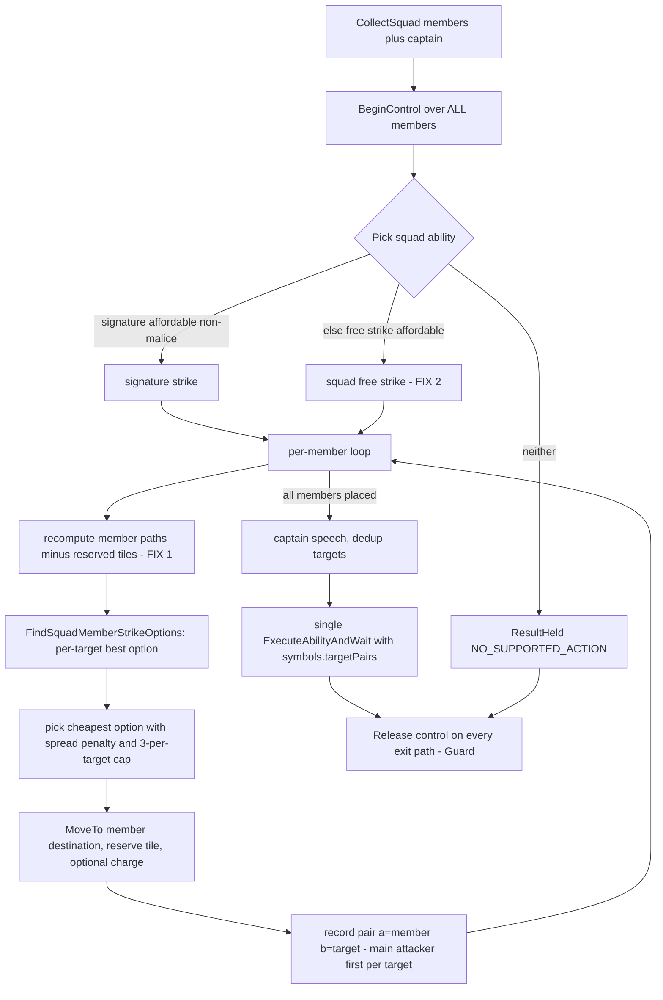

# Warmind Stage 2 Plan: Generic Competence

Written 2026-07-07. Inputs: the 508-commit upstream audit (base 289c2bc -> main 5f6a04b, recorded in
`CLAUDE.md`), a function-level port inventory of the baseline `Monster AI/` module, and an ability-pattern
census of all 476 Book Two stat blocks in `monster-reference.md`. Read `CLAUDE.md` in this directory FIRST;
this plan assumes its contracts, lessons, and design rules without restating them.

**Goal.** Any unscripted monster plays its stat block sensibly: signature strikes (single and multi-target,
with charge), self-centered area attacks when they catch enough enemies, the standard maneuvers (forced
movement, grab, aid attack, hide), smart answers to the common mid-cast prompts, and working minion squads.
No hand-written per-monster behavior (that is Stage 6). Fail closed on everything else.

**Definition of done.** Stage 2 is DONE per the ROADMAP "Verification model" gate: code complete + L0 clean
(`luac -p` + ASCII grep on every touched file) + L1 green (the logic harness, since this stage adds pure
decision logic) + L2 folded into `CLAUDE.md` (verified-surface table + stage table + lessons) + L3 clean
(deploy via the mod store, automatic hot reload confirmed, the changed subsystems probed read-only through
the bridge) + adversarial review of the stage diff with findings fixed + L4 (a live squad/strike activation
in a scratch encounter, or an explicit DEFERRED line). Every new decision path emits a DecisionResult with a
stable reason code. The runtime verification checklist at the bottom is the L3/L4 script, run via the
autonomous loop at the P2.5 review closure -- not a manual user task.

## What already exists (do not rebuild)

| Piece | State | Anchor |
|---|---|---|
| Scoring core | DONE - faithful baseline ports: `FindValidStrikeTargets`, `FindBestStrikePosition` (with stay-put candidate + per-target scorefn cache), `FindBestBurstPosition` (with validity guards), `FindClosestEnemy`, `DistanceFromNearestEnemy` | `WarmindScoring.lua` |
| Tactic-bias hook | LIVE but empty - the edge sum reads `ctx.activeTactics`, which is populated from the `Warmind.tactics` registry; zero tactics registered today | `WarmindScoring.lua` (edge sum), `WarmindCore.lua` (`RegisterTactic`) |
| Free-strike specs | DONE - `melee_free_strike` / `ranged_free_strike`, both score 0.2, via local `StandardStrikeScore` / `StandardStrikeExecute` helpers | `WarmindSpecs.lua` |
| Prompt plumbing | DONE - `Adapter.MakePromptCallback` (qualified-name-wins lookup, `ctx.expectedPrompt` combo support, "skip" honored); ZERO handlers registered | `WarmindAdapter.lua`, `WarmindPrompts.lua` (empty) |
| Squad detection | DONE - `Squads.CollectSquad` (members, captain, alreadyProcessed), wired into `Turn.PlayCurrentTurn`; `Squads.PlayActivation` is a fail-closed hold returning UNSUPPORTED_SQUAD | `WarmindSquads.lua` |
| Cast execution | DONE - `Adapter.ExecuteAbilityAndWait` (watchdog, own coroutine, charge move-in from pair.a lookup, meleeAndRanged variation resolution, DecisionResults) | `WarmindAdapter.lua` |
| Traits classifier | PARTIAL - `Warmind.Traits.Get` returns name, actionKind, isSignature, isStrike, isMelee, isRanged, isAreaKeyword, isAoe, targetType, villainAction. Missing every Stage 2 trait below | `WarmindTraits.lua` |
| Reason codes | COMPLETE for Stage 2 - NO_SUPPORTED_ACTION, NO_LEGAL_TARGET, NO_REACHABLE_POSITION, UNSUPPORTED_COMPLEX_PROMPT, UNSUPPORTED_AREA_GEOMETRY, UNSUPPORTED_SQUAD, EXECUTION_RECHECK_FAILED, EXECUTION_TIMEOUT, EXECUTION_ERROR, BUDGET_EXHAUSTED, TAKEN_OVER_BY_DM, CANNOT_AFFORD | `WarmindCore.lua` (`Warmind.reason`) |

## Census-driven priorities (why this scope, in this order)

From the Book Two census (476 blocks, ~1,130 ordinary abilities): strikes are ~60% of all abilities
(single melee ~30-35%, single ranged ~15-18%, multi-target ~13-15%), areas ~22-25%. Riders dominate:
conditions on ~45-55% of offensive abilities (they resolve from the ability's own tier data - no AI work),
forced movement on ~35-40%, grab ~12-15%. Minions are 116 of 476 blocks (~24%), and their signature
strikes are "one target per minion" (114 abilities). The most frequent mid-cast decisions, ranked:
forced-movement destination (~481 tier instances), self-shift (~150+), area template placement (~100+),
target spread (~178 multi-target + 220 "up to N"), opt-in riders (~125).

Consequence: the spec set below covers the PRIMARY turn of roughly 60-65% of Book Two blocks, and the
prompt handlers are where most of the play quality lives - a knockback that picks a bad square degrades
every one of the ~35-40% of abilities carrying forced movement. Invest accordingly: squads and the
forced-movement/shift handlers are the high-value items, the maneuver specs are cheap ports.

## Workstream A: Traits expansion (`WarmindTraits.lua`)

New fields on the table returned by `Warmind.Traits.Get(ability)`. All detection is structured-field
based; where the data is only partially structured the trait must degrade to nil (callers fail closed
or fall through), never guess from description text.

| New trait | Detection | Caveat |
|---|---|---|
| `forcedMovementType` | `ability:ForcedMovementType()` -> "push"\|"pull"\|"slide"\|"vertical_*"\|nil; presence check = behaviors list contains typeName `ActivatedAbilityRelocateCreatureBehavior` or `ability:try_get("forcedMovement")` | The TYPE often lives in the power-roll rule/tier text, not a clean field. When presence is detected but type is nil, set `forcedMovementType = "unknown"` - the maneuver spec may still use it (destination choice comes from the Push!/Pull!/Slide! prompt, which names the type itself). Do NOT use engine `IsForcedMovement` (true only for the invoked sub-abilities) |
| `inflictsConditions` | Scan behaviors for ApplyOngoingEffect-style behaviors, call `behavior:ConditionID()`, resolve UUID -> name via `dmhub.GetTable("characterOngoingEffects")`; store a set of lowercased names | UUID resolution table lookup must be pcall-free (non-yielding, plain reads). Cache per ability name within one Traits.Get call only |
| `appliesGrabbed` | `inflictsConditions["grabbed"]` | Convenience flag for the grab spec and scorers |
| `isHide` | `inflictsConditions["hidden"]` | No dedicated keyword exists; condition-inflict is the reliable structured signal |
| `isAidAttack` | Any behavior applies ongoing-effect guid `e234f1f4-9953-43bd-894c-d96adbb63f84` | The guid is load-bearing, carried over from the baseline; keep it a named constant |
| `aoeRadius` | `ability:GetRadius(casterCreature, {})` when `isAoe` | Only meaningful for self-centered bursts in Stage 2; placed templates stay unsupported |
| `numTargets` | `ability:GetNumTargets(token)` needs a token, so Traits stores the RAW `.numTargets` field; snapshot/spec resolves the live value | Keep Traits pure (no token reads) |
| `costsMalice` | `ability:GetCost(token)`... same purity problem; instead detect statically: any payment option resourceid == `CharacterResource.maliceResourceId` via the ability's cost fields | Stage 2 specs must SKIP malice-costing abilities entirely (malice policy is Stage 4). If static detection is unreliable for some ability, the spec-level CanAfford+skip still protects us |

## Workstream B: Scoring additions (`WarmindScoring.lua`)

1. `Scoring.FindReachableConcealment(ctx, snapshot)` - port of baseline `FindReachableConcealment`:
   scan `snapshot.paths` for the lowest-cost tile where, under `token:ExecuteWithTheoreticalLoc`,
   `token.properties:IsConcealed()` is true. Returns loc or nil. Used by the hide spec.
2. Register the three baseline tactics via `Warmind.RegisterTactic` (this lights up the already-live
   edge hook; each contributes +1 edge when its condition holds):
   - `flanking`: an ally sits on the exact opposite side of the enemy from tokenLoc (collinear
     opposite deltas, baseline algorithm from `MonsterAITactics.lua`). Allies come from
     `ctx.snapshot.allies`.
   - `aid_attack`: the enemy carries the aid-attack ongoing effect (read the per-enemy flag computed
     in Workstream C, NOT a live ActiveOngoingEffects scan per edge evaluation).
   - `high_ground`: attacker altitude > target altitude via `game.currentFloor:GetAltitudeAtLoc`.
   Signature (already fixed by the registry): `score(tactic, ctx, token, tokenLoc, enemy, ability)`.

## Workstream C: Snapshot additions (`WarmindSnapshot.lua`)

- Per-enemy `aidAttacked` flag: while building `snapshot.enemies`, scan each enemy creature's
  `ActiveOngoingEffects` for the aid-attack guid (baseline did this once per turn in
  `PlayTurnCoroutine`; it belongs in the snapshot so specs and tactics share one read).
- Nothing else changes. Reminder from the 2026-07 audit: `GetActivatedAbilities` now returns fresh
  temporary clones every call - never key or compare ability objects across snapshots (Lesson 12),
  and never pass `excludeGlobal` (it strips free strikes AND malice abilities together).

## Workstream D: Generic spec set (`WarmindSpecs.lua`)

All via `Warmind.RegisterSpec`; every spec selects abilities by TRAIT, never by literal ability name
(the baseline's name matching is what kept it from generalizing). Shared gates for every spec below:
skip abilities with `traits.villainAction` (Stage 4 owns those), skip `traits.costsMalice` (Stage 4),
and `ability:CanAfford(token)` remains the execution-time authority. Scoring conventions stay:
0.2 generic fallback, 0.5-0.8 situational maneuvers, 1.0 signature action, 1.5-2.5 high-impact
(reserved for Stage 4/6). All starting constants below are baseline-derived and tunable in play.

| Spec id | Category | Trait gate | Score | Execute |
|---|---|---|---|---|
| `signature_strike` | main | isSignature and isStrike | `FindBestStrikePosition`; candidate score 1.0 when a position with >= 1 target exists; multi-target abilities use the existing min(numTargets, #targets) base plus edges, so 2-target strikes prefer positions hitting 2 | Existing `StandardStrikeExecute` path: move, recheck (`RecheckStrikeTargets`), `ExecuteAbilityAndWait`. Charge is subsumed: the Charge keyword path inside `FindValidStrikeTargets` already extends reach and `ExecuteAbilityAndWait` performs the move-in |
| `area_burst_if_n` | main (fallback maneuver variant if the ability's actionKind says maneuver) | isAoe and targetType == "all" (self-centered burst ONLY) | `FindBestBurstPosition` with scorefn: enemy +1, ally -1 (dead/invalid 0). Candidate only when enemiesHit >= 2 and net >= 2. Score = 0.45 * net (2 enemies clean = 0.9, just under signature; 3+ = 1.35+, beats it) | Move to burst position, recheck enemies still in radius (>= 2 or downgrade to skipped NO_LEGAL_TARGET), cast with auto-targets (the "all" path in the adapter already self-targets bursts) |
| `forced_movement` | maneuver | forcedMovementType ~= nil and isStrike-or-targeted | `FindBestStrikePosition` with baseline knockback scorefn: 0.2 - Stability*0.06 + might*0.06, +0.06 when our size > target size; -100 for targets that are Grabbed or have "Cannot Be Force Moved" > 0. might = `GetAttribute("mgt"):Modifier()` | Standard strike execute; the destination decision happens in the Push!/Pull!/Slide! prompt handler (Workstream E), which is what makes this spec actually good |
| `grab` | maneuver | appliesGrabbed | `FindBestStrikePosition` with baseline grab scorefn: 0.08 + might*0.08 + (targetSpeed - 6)*0.04; -100 if target already Grabbed; self-preservation: -100 when own CurrentHitpoints < 12, -0.04 when < 20 | Standard strike execute |
| `aid_attack` | maneuver | isAidAttack | 0.1 when any valid strike-range target lacks the aidAttacked flag (snapshot) | Move, filter targets to un-aided, cast |
| `hide` | maneuver | isHide | 0.5 when not `HasNamedCondition("Hidden")` and `FindReachableConcealment` returns a loc; nil otherwise | Move to concealment loc, cast the hide ability |
| `reposition` | move | always available (no ability) | 0.1 when no strike-bearing spec produced a candidate this iteration AND the actor is not already adjacent to an enemy: move toward `FindClosestEnemy` (melee) or to max-range standoff (ranged). Deliberately last-resort - positioning during attacks is already handled inside the strike specs | `Adapter.MoveTo` only; emits ResultExecuted with detail.moveOnly = true |

Explicitly NOT specs in Stage 2 (fail-through or fail-closed, see Deferred): placed templates
("N cube within M" - the spec gate `targetType == "all"` simply does not match, so the monster does
something else instead of holding), ally heal/buff, zone creation, triggered actions, multi-turn solos.

## Workstream E: Prompt handlers (`WarmindPrompts.lua`)

Handler contract (already enforced by `Adapter.MakePromptCallback`): return `{targets = {{loc=...}}}`
or `{targets = {{token=...}}}` to resolve, `"skip"` to abort the sub-ability, nil to decline (falls
through to a manual prompt + UNSUPPORTED_COMPLEX_PROMPT hold). Handlers must never yield and never
throw (wrap risky reads; a handler error must degrade to nil/manual, not kill the cast).

1. **Shift** (`prompts = {"Shift"}`) - replaces the baseline's literally random tile pick.
   Candidates: `token:CalculatePathfindingArea(range*10, {"shift"})`. Score each tile:
   `distanceFromNearestEnemy(tile)` (maximize) minus `cost*0.001` (tiebreak: shorter shift). If the
   actor still has its main action unspent this activation and is melee-only, invert the preference:
   minimize distance to the current best strike target instead (shift INTO reach, not away).
   Mark a movement arrow for ~1s (baseline UX), return the loc. Role-aware shifting is Stage 3.
2. **Push! / Pull! / Slide!** (`prompts = {"Push!", "Pull!", "Slide!"}`) - the census rank-1 decision.
   Replace the baseline's hand-rolled square ring (its own TODO) with the ability's real geometry:
   candidate destination squares from `ability:CustomTargetShape(casterToken, range, symbols)` plus
   `TargetLocPassesFilterPredicate` for legality. Score lower-is-better, baseline constants kept:
   `dist + 2*collideWithAllies - 2*collideWithEnemies - 2*fallDistance` and -4 when colliding with
   objects. Type-specific goals (the prompt NAME carries the type, no trait lookup needed):
   - Push!: maximize distance from caster along legal squares; prefer falls/hazards/enemy collisions.
   - Pull!: minimize distance to caster; landing adjacent to the caster is a bonus (sets up grabs).
   - Slide!: free direction - pick the best-scoring square overall (hazard/fall first, else the square
     farthest from the target's allies).
   Respect the grabbed rule: if the moved creature is Grabbed by someone other than the caster,
   return "skip" (engine may not offer the prompt at all, but do not fight it if it does).
3. **Generic invoked-target picker** (registered for the invoked-sub-ability names that squads and
   combos produce; port of the baseline Decrepit Skeleton handler, generalized): forbidden set =
   charids in `symbols.targetPairs`; candidates = non-friendly, in range, passing
   `ability:TargetPassesFilter`; return the NEAREST candidate (deterministic - the baseline picked
   randomly); "skip" when none.

## Workstream F: Squad port (`WarmindSquads.lua`)

Replace the `Squads.PlayActivation` fail-closed hold with the real flow. Baseline source:
`ExecuteSquadStrike` + `FindSquadMemberStrikeOptions` in `Monster AI/MonsterAI.lua`.

Port details and the constraints the 2026-07 audit added:

- **Ability choice + FIX 2 (no-signature fallback).** Baseline silently returned when no affordable
  signature existed (squads forfeited turns with no trace). New order: signature (isSignature,
  CanAfford, not costsMalice) -> squad free strike (Melee/Ranged Free Strike by trait) -> ResultHeld
  with NO_SUPPORTED_ACTION and prose naming the squad. Never silent.
- **FIX 1 (re-path staleness).** Baseline recomputed each member's `CalculatePathfindingArea` at the
  top of its loop iteration while the previous member's `token:Move` was still animating, so members
  clumped or pathed through claimed tiles. Fix = tile reservation as the primary mechanism: maintain
  a `reserved` set of chosen destination tiles, exclude reserved tiles from every later member's
  candidate set, and keep the existing pacing Sleep before the next member's pathfinding as the
  settle window. The P2.4/P2.5 closure confirms `token.loc` visibility timing via an L4 squad
  activation (or a bridge-probed move settle -- read `token.loc` through execute_lua after a member
  Move); if moves settle synchronously the reservation alone is sufficient.
- **Member filter (audit-mandated).** Build options/pairs ONLY for members that are alive, valid,
  `IsActiveInSquad()` and not `IsTurnSkipped()` - otherwise the manual pairs over-declare attackers
  vs the engine's `GetNumTargets` accounting.
- **Target cap (audit-mandated).** At most 3 attackers per target unless the ability carries
  "Ignore Minion Target Limit" - mirror `CanTargetAdditionalTimes`. Keep the baseline spread penalty
  (+10000 * alreadyAssignedCount on an option's cost) so fire spreads before it stacks.
- **Pair ordering (Lesson 13).** The FIRST pair listed for a given target charid selects the main
  attacker - the source of invoked sub-effects (pushes, conditions) and caster-benefit behaviors.
  When multiple members hit one target, list the best-positioned member's pair first.
- **Option scoring.** Port `FindSquadMemberStrikeOptions` as-is: per reachable tile run
  `FindValidStrikeTargets`; option cost = `pathCost - edges*5`, charge-alignment bonus = dot product
  of move vector and charge vector * 0.5; keep the cheapest option per target charid.
- **Enumeration.** Prefer `_tmp_minionSquad.{tokens, captain, liveMinions, activeMinions}` over
  re-scanning `dmhub.allTokens` (audit: built in `MCDMCreature.RefreshSquadInfo`); keep
  `CollectSquad` as the initiative-entry-level grouping check.
- **Billing.** Never pay costs manually - the engine's `ConsumeResources` override bills members,
  and the multi-member fan-out only fires for `HasManeuverOrActionRule()` squads (fine either way).
- **Control lifecycle.** `BeginControl` on every member (baseline installed the prompt callback on
  all members, not just the lead); `Release` on every exit path including errors (Guard) and stop
  requests; manual/cancel outcomes propagate exactly like Stage 1 (manualPending, no initiative
  advance).

## Deferred (census-measured gaps, recorded so they are chosen, not forgotten)

| Gap | Census weight | Target |
|---|---|---|
| Placed area templates ("N cube within M", lines, walls) - placement optimizer | ~100+ abilities | Stage 3 (reuse the Push! destination scorer over template footprints) |
| Ally heal / buff / temp-stamina (Leaders, Support) | ~12-15% of abilities, 30 Leader blocks | Stage 3/4 (a support_ally spec; Leaders misplay without it) |
| Debuff target prioritization (daze the caster, slow the runner) | conditions ride on ~45-55% of abilities | Stage 3 (weighting inside the strike target picker, not a new spec) |
| Zone / terrain / hazard creation (Controllers, Hexers) | ~5-8% ordinary + heavy malice share | Stage 3/4 (place_zone spec on top of the template placer) |
| Triggered actions / reactions beyond opportunity attacks | 148 abilities (~12%) | Stage 4+ (needs a reaction evaluator on the trigger path) |
| Solo / Leader multi-action turns, malice spend, villain actions | 22 Solo + 30 Leader blocks | Stage 4 (Director layer, per roadmap) |
| Post-strike self-shift riders ("shifts up to 2 between targets") | ~150+ instances, largely free-text | Partial via the Shift handler when the engine prompts; pure-prose riders are undetectable - accept the miss, revisit with per-ability annotations in Stage 6 |

## Implementation order

1. Traits expansion (A) - everything else keys off it. luac + ASCII after each file.
2. Snapshot aidAttacked flag (C).
3. Scoring: FindReachableConcealment + three tactics (B).
4. Specs (D) - signature_strike first (largest coverage), then area_burst_if_n, then the maneuvers,
   then reposition. Each spec's trace output is read back via execute_lua (`Warmind.trace.entries`)
   after an L3/L4 exercise.
5. Prompt handlers (E) - Shift, then Push!/Pull!/Slide!, then the invoked picker.
6. Squad port (F) - last; it composes everything above.
7. Update `CLAUDE.md`: stage table, any new verified engine APIs, new lessons. Update the Stage 2
   row to DONE with the date.

Steps 1-3 are mechanical ports with tight specs - good candidates for delegation per the core rules;
steps 4-6 need design judgment on-session. Every file: ASCII only, no new files (all six target files
exist and are registered in the DMHub module).

## Runtime verification checklist (Stage 2 - run via the autonomous loop at P2.5)

Run at the P2.5 review closure via the autonomous loop (see `ROADMAP.md` "Verification model"), not by the
user. Tags: [harness] asserted by `warmind_logic_tests.lua` fixtures (L1); [probe] verified read-only through
the bridge (L3); [live] needs an actual activation in a live encounter (L4). [live] items require a scratch
encounter with monsters on the board; if the app or a suitable encounter is unavailable the closure marks
those items DEFERRED with one honest line and completes them in a later session (or absorbs them into natural
play + PD).

- [ ] [harness][probe] Traits: probe `Warmind.Traits.Get` on 5+ real monsters - forced-movement, grab,
      hide, aid-attack abilities classify correctly; a placed-cube ability does NOT match area_burst_if_n
- [ ] [live] Unscripted non-minion melee monster with a signature strike: uses it (score 1.0 beats free
      strike 0.2), charges when out of reach, trace shows the decision
- [ ] [live] Multi-target signature (e.g. a "two creatures" strike): positions to hit 2 when possible
- [ ] [harness][live] Burst monster (e.g. Zombie with Zombie Dust pattern): fires the burst only when >= 2
      net enemies are caught; skips it (and free-strikes) when enemies are spread
- [ ] [harness][live] Forced-movement monster: pushes a hero off a ledge / into a hazard when available;
      never targets a Grabbed or "Cannot Be Force Moved" hero; pull lands the target adjacent
- [ ] [harness][live] Shift prompt during any cast: shifts away when engaged and done attacking; shifts
      into reach when melee with main action unspent; never the old random-tile behavior
- [ ] [harness][live] Grab spec: skips grabbing when own Stamina < 12; prefers fast ungrabbed targets
- [ ] [harness][live] Hide-capable monster: moves to concealment and hides when the maneuver wins; never
      re-hides while Hidden
- [ ] [harness][live] Minion squad WITH affordable signature: members spread across targets (max 3 per
      target), move without clumping onto reserved tiles, one cast fires, every active member is billed
      action+maneuver (Maneuver-or-Action squads), damage/conditions attribute to the per-target main
      attacker
- [ ] [harness][live] Minion squad WITHOUT affordable signature (e.g. malice-gated): falls back to squad
      free strike; if that is also impossible, holds with NO_SUPPORTED_ACTION in the trace - never silent
- [ ] [live][probe] Squad + stop button mid-flow: all members' `_tmp_aicontrol` released (read via
      execute_lua), initiative NOT advanced
- [ ] [harness][probe] Malice-costing abilities: never cast by any generic spec (trace shows them skipped)
- [ ] [live] Error injection in one new spec: activation held with EXECUTION_ERROR, other tokens act,
      AI keeps running
- [ ] [live][probe] LOS ray teardown: no lingering targeting markers after AI attacks (validates the
      Destroy/DestroyLineOfSight dual-path fix in `WarmindAdapter.lua`)
- [ ] [live][probe] Full Stage 1 runtime checklist re-run (regression)

## ASSUMPTIONS

- Stage 2 continues on the current branch base; the upstream audit found no breaking changes, so
  Stage 2 code written now stays valid after the rebase (only .gitignore conflicts).
- `IsConcealed()` on creature properties behaves as the baseline assumed (used by
  FindReachableConcealment); verified in baseline usage, not re-verified against main.
- The engine still names the forced-movement prompts exactly "Push!", "Pull!", "Slide!" (baseline
  registered those literals); probe the live prompt surface before finalizing the handler table --
  enumerate a forced-movement monster's ability names and prompt strings via execute_lua through the
  bridge (L3).

## FLAGS (out of scope, surfaced during the 2026-07 audit)

- Upstream `DSResources.lua` SetMalice carries a stray debug print - harmless, worth an upstream fix.
- Upstream filename/require typo `AbiltyConferCondition` (sic) is real; do not "fix" it in passing.
- The old plan file `~/.claude/plans/i-have-a-very-nifty-planet.md` (post-rebase audit, 2026-06-10)
  is fully landed and historical; this file supersedes it as the active plan.
